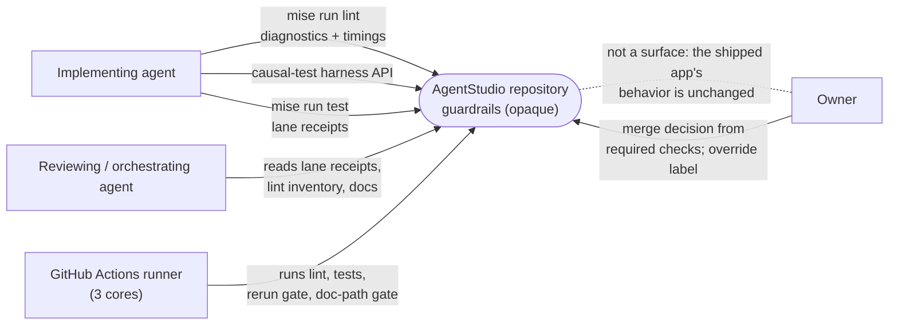
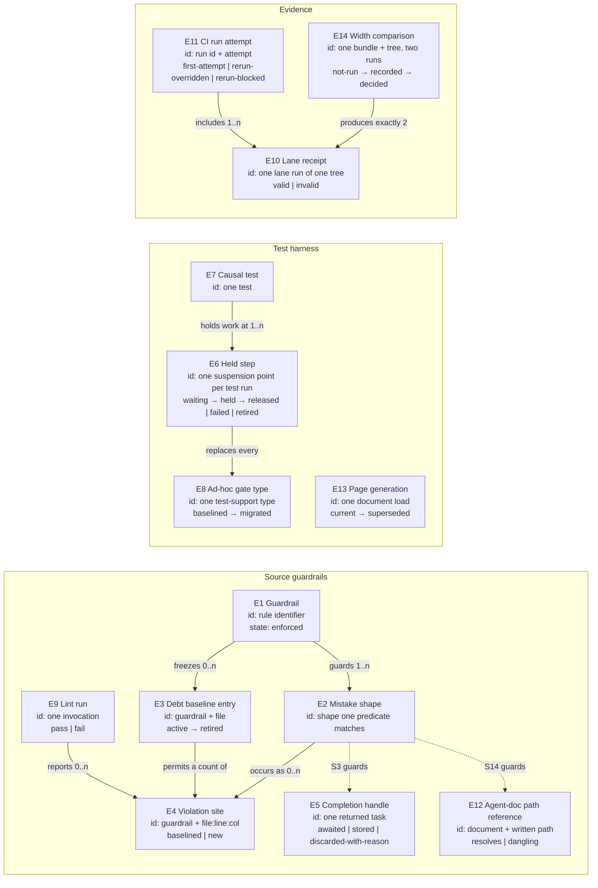

# CI and MainActor Guardrails — Specification

What must be observably true. Why it is needed lives in the
[Requirements](2026-09-23-ci-guardrails-requirements.md); how it is built lives in the
[Program Design](2026-09-23-ci-guardrails-program-design.md).

```text
Requirements  ->  Specification (this file)  ->  Program Design
```

## Summary

Every mistake shape from the Sep 17–22 CI history, and every named MainActor misuse shape, must meet a check
that fails before merge. Checks that can see the shape in source are lint rules. Checks that need the program
running are harness-based tests. Checks on evidence are the test runner's receipt and a CI gate. Existing
violations are frozen by count, per file, and may only go down. Lint stays under a stated time target.

## Who uses which surface



## Domain entities

The entity table is the normative home. The map below shows relationships only.

| ID | Term | Identity rule | Relationships | Invariants | Observable states | Canonicalizes | Basis |
| --- | --- | --- | --- | --- | --- | --- | --- |
| E1 | Guardrail | Its stable rule identifier; two checks with the same identifier are the same guardrail | Guards one or more mistake shapes (E2); has zero or more debt baseline entries (E3), at most one per file | Every guardrail fails the build or the merge when it fires; none is report-only | `enforced` only. The four report-only rules move from `report-only` to `enforced` once, in this change | "lint", "rule", "gate" | U1–U4, U9 |
| E2 | Mistake shape | A named syntactic or runtime pattern, e.g. "discarded completion handle", "hop per stream element"; two occurrences are the same shape when one guardrail's predicate matches both | Belongs to exactly one guardrail; has zero or more violation sites (E4) | A shape has a written predicate and at least one matching and one non-matching example | — | "pattern", "anti-pattern", "misuse" | U1, U4 |
| E3 | Debt baseline entry | Guardrail identifier plus repository-relative file path | Belongs to one guardrail; covers the violation sites of that guardrail in that file by count | Permitted count ≥ 1; a count never increases and no entry is added after this change. Known limit accepted by the owner ("change the baselines from `[path]` to `[path: count]`"): replacing one site with another in the same file keeps the count and passes | `active` (count ≥ 1) → `retired` (entry removed) | "baseline", "known debt", "allowlist" (for debt only; ownership allowlists are not debt) | U1, U2, non-goal on paydown |
| E4 | Violation site | One occurrence of a mistake shape at one source location; two reports at the same file, line and column for the same guardrail are the same site | Belongs to one file and one guardrail; counted against at most one baseline entry | — | `baselined` (inside a permitted count) or `new` (fails) | "finding", "diagnostic" | U1 |
| E5 | Completion handle | A task an operation returns after its synchronous admission step, whose awaited value is the operation's outcome | Returned by one operation; consumed by the caller that started it | A caller can never drop it without writing so; its outcome exists only by awaiting it | `awaited`, `stored`, or `discarded-with-reason` at each call site | "task", "Task handle", "submission" | U12 |
| E6 | Held step | One test-controlled suspension point, for one test run, that the work under test reaches | Belongs to one causal test (E7); reached by one or more arrivals | Resumes only by an explicit test action; never by elapsed time | `waiting` → `held` (first arrival) → `released` \| `failed` \| `retired` | "gate", "latch", "barrier", "hold" | U7, U8 |
| E7 | Causal test | One test that proves a reply is reported only after its effect commits | Uses one or more held steps | Proves outcome dependence: with the step failed, the reply reports that failure; with the step released, the reply succeeds and the effect is committed | — | "ordering test", "held-gate test" | U7 |
| E8 | Ad-hoc gate type | A test-support type, outside the shared harness, whose job is to suspend work until a test releases it or to count arrivals | Counted by the S4 debt baseline | No new one is added; the count only falls | `baselined` → `migrated` (replaced by held steps) | the hand-written `*Gate`, `*Latch`, `*Barrier` types | U8 |
| E9 | Lint run | One invocation of the Swift lint aggregate, full or scoped to named files | Produces zero or more violation sites; produces one timing report | — | `pass` or `fail` | "mise run lint" | U5, U6 |
| E10 | Lane receipt | The report one Swift test lane prints for one run | Belongs to one lane run of one candidate tree and one test bundle | States which tree and bundle it tested, whether the bundle was built fresh, and every in-runner retry | `valid` or `invalid` | "lane report", "test receipt" | U1, U14 |
| E11 | CI run attempt | A GitHub workflow run identifier plus attempt number | Belongs to one commit | — | `first-attempt`, `rerun-overridden` (override label present), `rerun-blocked` | "rerun", "re-run failed jobs" | U11 |
| E12 | Agent-doc path reference | One repository location written in an agent instruction document — a Markdown link target (path and optional heading anchor) or a backticked token written in repository-path form — identified by document plus written target | Belongs to one agent document | — | `resolves` or `dangling` | "doc link", "referenced file" | U9, U10 |
| E13 | Page generation | One document instance in a BridgeWeb browser or E2E journey; a reload or other document replacement starts a new generation, and a same-document (history or hash) navigation does not | A journey has one or more generations; a response waiter belongs to exactly one | A response from one generation never satisfies a waiter of another | `current` → `superseded` (after reload) | "page load", "document", "g1/g2" | U13 |
| E14 | Width comparison | One paired run of the same built test bundle and candidate tree, once with a stated Swift Testing width and once with the width unset | Belongs to one candidate tree; produces two receipts and two event ledgers | Both halves use the same bundle; neither result changes the default by itself | `not-run` → `recorded` → `decided` (owner) | "width experiment", "cap experiment" | U13, Ev11 |



## Mistake shapes this change guards

Each shape names the failure it prevents. "Lint" shapes are decided from source text alone; the others need a
running program.

| Shape | Guardrail kind | Prevents | Basis |
| --- | --- | --- | --- |
| S1 Polling wait in a test (existing) | lint, ratcheted per site | Machine-speed verdicts | U1, Ev2 |
| S2 Blocking wait on the cooperative pool in a test (existing) | lint, ratcheted per site | Pool starvation on 3-core runners | U1, Ev2 |
| S3 Silently discarded completion handle | compiler (warnings are errors) + lint on declarations and explicit discards | Reporting success before commit | U12, Ev3 |
| S4 Ad-hoc gate type outside the harness | lint | Private, unreviewable hold mechanisms | U8, Ev7 |
| S5 Unbounded collection work on MainActor (existing, report-only) | lint, promoted, ratcheted | MainActor stalls | U4, Ev8 |
| S6 Whole-snapshot read in an observation capture (existing, report-only) | lint, promoted, ratcheted | Observation storms | U4, Ev8 |
| S7 Performance constant outside `AppPolicies` (existing, report-only) | lint, promoted, ratcheted | Untracked behavior thresholds | U4, Ev8 |
| S8 Blocking file I/O in `nonisolated async` without `@concurrent` (existing, report-only) | lint, promoted, ratcheted | Actor executor blocking | U4, Ev8 |
| S9 Observation re-arm without a visible re-arm guard | lint, ratcheted | Leaked trackings (~1,400 refreshes/s) | U4, Ev8 |
| S10 Derivation or command validation inside a SwiftUI `body` | lint, ratcheted | Per-render recomputation | U4, Ev8 |
| S11 Atom doing more than assign | lint, ratcheted | I/O, scheduling or derivation inside MainActor atoms | U4, Ev8 |
| S12 MainActor hop per stream element | lint, ratcheted | Equal-outcome publication storms | U4, Ev8 |
| S13 Performance probe reporting through MainActor | lint, ratcheted | Blind stall probes | U4, Ev8 |
| S14 Dangling agent-doc path | lint and required CI check | Instructions that describe nothing | U9, Ev9 |
| S15 Reply before commit at a named async boundary | causal test | Early success replies | U7, Ev3 |
| S16 Wait that asserts on a different read than the one it matched | harness contract | Transient-state races | U7, U13 |
| S17 Evidence from a stale or dirty tree | lane receipt | False green | U1, Ev6 |
| S18 CI rerun | CI gate | Hidden failures | U11, Ev5 |
| S19 React `act()` warning in a BridgeWeb test | test failure | Unsettled UI updates | U13, Ev4 |
| S20 Timed wait in a BridgeWeb browser, integration or E2E journey | check | Machine-speed verdicts | U13 |
| S21 Response waiter satisfied by the wrong page generation | E2E harness contract | Reload joins that match stale responses | U13, Ev4 |

## Normative requirements

Each requirement is written over the entities above. Proof obligations are in the next section.

### Lint enforcement and debt

- **R1** (E1, E4) Every guardrail in the shape table that is marked "lint" MUST fail the lint run when it reports a
  violation site that no debt baseline entry permits. U1, U3, U4.
- **R2** (E3, E4) For a ratcheted guardrail, the lint run MUST fail when a file's violation-site count for that
  guardrail exceeds its baseline entry's permitted count, including when the file already has an entry. U1.
- **R3** (E3) When a file's violation-site count falls below its permitted count, the lint run MUST fail and name the
  lower count to record; when it falls to zero, the lint run MUST fail and name the entry to remove. U1.
- **R4** (E3) A pull request MUST fail a required check if any baseline entry's permitted count is higher than in the
  merge base, or if an entry is added that the merge base does not have. The initial baselines created by this
  change are the only exception. U1, U2.
- **R5** (E1) The four report-only performance rules (S5–S8) MUST be enforced with debt baselines frozen at their
  counts on the merge base of this change. No guardrail may remain report-only. U4, Ev8.
- **R6** (E2) Every lint guardrail MUST have a written predicate and at least one example the predicate matches and
  one it must not match, checked by the lint tool's own test suite. U2.

### Completion handles

- **R7** (E5) A function that returns a completion handle MUST NOT be declared so that callers may ignore its result
  without writing anything, and a call that silently ignores one MUST fail compilation of the repository's own
  targets. U12.
- **R8** (E5) A caller that neither awaits nor stores a completion handle MUST discard it explicitly and state the
  reason; the lint run MUST fail on an explicit discard of a completion handle without a reason, including one
  obtained by awaiting a call across an actor. Every function that returns a completion handle has a name no
  non-handle function shares, so the discard check is exact. U12.

### MainActor shapes

- **R9** (E2) S9–S13 MUST each be a guardrail with the predicate below, enforced and ratcheted per R1–R4:
  - S9: code that re-arms observation tracking from its change callback shows, in the same type, a guard that stops a
    second live tracking: a generation fence (the callback compares the current generation with the one it captured)
    or an arm latch (arming is refused while a tracking is live and the callback clears the latch). One-shot trackings
    that never re-arm are outside the shape;
  - S10: inside a SwiftUI `body`, including helpers it calls in the same file and members known to perform command
    validation, no command-validation call and no collection-wide sort, filter, reduce, grouping or fuzzy scoring;
  - S11: an atom type (a type named as an atom in an atoms folder) contains no file, process, network or database
    access, no timer or dispatch-queue scheduling, no new task, no observation tracking and no collection-wide sort;
  - S12: no hop to MainActor inside the body of a loop over an asynchronous sequence; and a loop over an asynchronous
    sequence that already runs on MainActor compares each element with the last published value before acting,
    except in the named thin adapters the architecture docs prescribe;
  - S13: code in performance-probe and telemetry-recorder paths does not hop to MainActor to report.
  The Program Design fixes each predicate's exact syntax and its named-owner allowlist. U4.
- **R10** (E2) A named-owner allowlist entry MUST name one owner and the reason it is allowed, and MUST be reviewed
  as part of the lint tool's source, not as debt. Debt and ownership MUST NOT share one list. U4.

### Lint speed

- **R11** (E9) On the 16-core development Mac used for Ev10, a full `mise run lint` on the merged tree MUST complete in
  at most 30 s, and its architecture stage in at most 5 s, measured warm (lint tool already built). U6.
- **R12** (E9) Every lint run MUST print the time spent in each stage and in each architecture guardrail. U5.
- **R13** (E9) A lint run scoped to named files MUST report violation sites only in those files, MUST report the
  same sites for those files as a full run, and MUST NOT take longer than a full run. U5.
- **R14** (E9) Lint speed MUST NOT be a failing check. A breach of R11 is reported with the per-guardrail timings and
  treated as a defect to fix, not a gate. U6, repository no-wall-clock rule.

### Causal-test harness

- **R15** (E6) The shared test support MUST provide a named held step with this contract:
  - work that reaches the step suspends until the test releases, fails or retires it;
  - the test can await the first arrival, and that await completes because an arrival happened, never because time
    passed;
  - releasing resumes every current and later arrival; failing makes them throw the given error; retiring resumes
    them as cancelled;
  - cancellation of an arriving task either resumes it as cancelled or, when the test asks for it, keeps it held
    until release, fail or retire while the test can await the cancellation as an event;
  - a synchronous (blocking) arrival made from inside a task is rejected as a test failure naming the step, because
    it would park a cooperative-pool or actor thread;
  - a step that is never reached leaves the test waiting until the runner's hang bound, and the lane's hang evidence
    names the step.
  U7.
- **R16** (E7) The shared test support MUST provide a three-phase helper for boundaries whose held dependency can
  report failure through the boundary's existing contract: for a fresh instance of the work each time, it holds the
  work at a step and then either fails the step and asserts the reply reports that failure, or releases the step and
  asserts the reply succeeds and the effect is committed. A causal test built with it always runs both branches. A
  reply produced before the step completes cannot depend on the step's outcome, so an early reply fails the test
  without any clock or quiescence wait. The helper never invents an error the boundary's contract does not have. U7.
- **R17** (S16) Every wait helper in the shared harness MUST return the observed value that satisfied it. Existing
  test wait helpers that return nothing are frozen by per-file count (a lint guardrail) and converted in the stacked
  follow-up pull requests; no new one may be added. U7, U8, U13.
- **R18** (E8) This change MUST migrate onto held steps the gate types used by the causal tests in R19 and every
  duplicate gate type (same or different name) whose semantics the held-step contract covers; a duplicate that needs
  more is frozen and migrated in the stacked follow-ups. S4 MUST fail the lint run for a new ad-hoc
  gate type and freeze the rest by per-file count; the stacked follow-up pull requests retire the remainder until the
  baseline is empty. U8.
- **R19** (E7) Each async boundary whose defect is in the evidence MUST have a causal test at its real entry point
  that fails if the reply precedes the effect, without changing production behavior:
  - IPC `pane.focus`: through the IPC-facing focus operation, using the outcome-dependence helper;
  - Bridge producer retirement: through retirement, using the helper at the lifecycle acknowledgement;
  - socket listener stop: the normal, fallback and both-timeouts branch tests, with holds on a dedicated thread;
  - Darwin FSEvents fixture barrier: the deterministic setup failure when the final barrier does not cover the
    installed bindings (no hold, because its setup path runs on the cooperative pool).
  U1, U7.

### Evidence integrity

- **R20** (E10) Every Swift lane receipt MUST state the tested tree's commit, whether the tree had uncommitted changes,
  and whether the test bundle was built fresh or reused. U1, Ev6.
- **R21** (E10) A receipt MUST mark itself invalid when the tree had uncommitted changes, or when the bundle was reused
  without a build receipt for the same bundle and the same clean commit. An invalid receipt MUST NOT print a pass
  verdict. U1, U14.
- **R22** (E10) A receipt MUST NOT label a count of announced tests as tests running or started; announced counts are
  labelled as announcements. U1, Ev11.
- **R22a** (E10) The Swift runner MUST NOT retry a suite within a lane; a crashed suite makes the lane fail, and the
  receipt names the suite and its terminating signal. U1, U11, U17.
- **R23** (E10) When a lane reaches its hang bound, the lane MUST retain, and CI MUST upload with the event ledger, a
  concurrency task dump of the test process taken before it is terminated; when the dump tool is unavailable or
  refused, the receipt states that and why. The lane's failed verdict is unchanged either way. U1.
- **R24** (E11) A CI workflow run whose attempt number is greater than 1 MUST fail its first step unless the pull
  request carries the override label at the time of the re-run, and that failure MUST name the label. U11.

### Agent docs

- **R24a** The lint check (including the baseline-increase and doc-path guardrails), the Swift test lanes and the
  BridgeWeb check MUST be required status checks for merges to `main`. U16.
- **R25** (E12) The lint run and a required CI check MUST fail when any agent instruction document contains a
  dangling reference — a link target or backticked repository path that does not exist, or an anchor that
  matches neither a heading in its target nor an explicit anchor ID declared there — naming the document, line and reference. Tokens that are not written in
  repository-path form (type names, placeholders, repository slugs) are not references. U9.
- **R26** (E12) No agent document may claim a hook, task or script, by its repository path, that the repository does
  not contain (enforced by R25's reference check); the removed PostToolUse claim MUST stay removed. Prose that names a
  capability without a path is outside the mechanical check. U10.

### BridgeWeb

- **R27** (S19) A BridgeWeb unit, node-integration, browser-integration or E2E test that emits a React `act()` warning
  MUST fail, naming the component. The browser suite keeps its existing broader console-error guard; the other suites
  gain only the `act()` failure. U13, Ev4.
- **R27a** Every BridgeWeb Vitest configuration MUST declare its test hang bound explicitly, as the testing
  architecture already requires. U13.
- **R28** (S20) The BridgeWeb check MUST fail on a timed wait (`waitForTimeout`, a sleep, or a timer promise used to
  wait, including a zero-delay one) in any file selected by a BridgeWeb test configuration or any test-support or
  harness module such a file imports, directly or transitively; production modules are not traversed. A timer that
  races a condition is allowed only when its delay is the declared shared hang bound. Existing sites are frozen by
  per-file count in the same ledger format as the Swift lint and retired in the stacked follow-ups; new ones fail. U13.
- **R29** (E13) In a BridgeWeb E2E journey, a response waiter MUST be satisfied only by a response to a request issued
  by its own page generation. When a journey fails, its diagnostic MUST name every unresolved waiter with its page
  generation. U13, Ev4.

### Width comparison and delivery

- **R30** (E14) The Swift test runner MUST be able to run a width comparison on one built bundle and keep both
  receipts and both event ledgers, whether each half passes or fails, each labelled with its width and the bundle
  identity. U13.
- **R31** (E14) This change MUST run one width comparison on its own candidate, using width 3 (the CI core count) against
  unset, and record both receipts in the pull request. The default MUST stay unset unless the owner decides
  otherwise. U13.
- **R32** (E10, E11) This change MUST merge only after `mise run test` passes in this worktree with valid receipts on the
  final commit, and CI passes on that exact commit on its first attempt. U14.
- **R33** The testing architecture and lint inventory documents MUST list every guardrail with its enforcement point.
  Documents explain; they are not the enforcement. U2.

## Observable contracts

### Lint run (`mise run lint`, full and scoped)

| Slot | Contract |
| --- | --- |
| Consumers | Implementing agents locally; CI's code-quality job |
| Output | One diagnostic per new violation site, as `path:line:column: error: [guardrail] message`; baseline diagnostics name the entry and the required count |
| Timing | Per-stage and per-guardrail times on every run (R12) |
| Failure | Exit non-zero on any error diagnostic; timing never changes the exit code (R14) |
| Scoped | Diagnostics limited to named files; same result for those files as a full run (R13) |
| Undefined | Output ordering between guardrails; format of the timing table |

### Debt baselines

| Slot | Contract |
| --- | --- |
| Visible state | One entry per guardrail and file with a permitted count |
| Allowed changes | Lower a count; remove an entry at zero |
| Rejected changes | Raise a count; add an entry (R4) |
| Compatibility | The per-file lists for S1 and S2 are replaced, not kept alongside (hard cutover) |

### Causal-test harness API

| Slot | Contract |
| --- | --- |
| Consumers | Test authors in every Swift test target that imports shared test support |
| Normal | arrive → held; release → all arrivals resume; three-phase helper proves the reply depends on the step's outcome (fail branch and release branch) |
| Failure | fail(error) makes arrivals throw it; retire resumes arrivals as cancelled; an unreached step hangs to the runner bound, which names it |
| Negative space | No timeouts, no polling, no turn counts; no production-code `#if DEBUG` hooks |

### Lane receipt

| Slot | Contract |
| --- | --- |
| Fields | commit, uncommitted-changes flag, bundle freshness, validity, announced-test counts (labelled as announced), existing lane-report fields |
| Hang | task dump plus event ledger retained and uploaded by CI |
| Invalid | Never prints a pass verdict |

### CI

| Slot | Contract |
| --- | --- |
| Rerun gate | Attempt > 1 fails first step unless the override label is present; the message names the label |
| Required checks | Lint (including the doc-path guardrail) and the baseline-increase check are required status checks for merge on `main` |

### Examples

- Valid: a file with baseline count 3 for S1 still has 3 polling waits → pass.
- Invalid: that file gains a fourth → fail, "count 4 exceeds 3".
- Invalid: the file drops to 2 → fail, "lower entry to 2".
- Valid: `let focused = await control.submitTargetedPaneFocus(pane).value` → the outcome exists only after completion.
- Valid: `_ = executor.submit(action) // fire-and-forget: gesture has no reply to report` → pass.
- Invalid: `executor.submit(action)` as a bare statement → compile error (unused result, warnings are errors).
- Invalid: `_ = executor.submit(action)` with no reason → lint fails.
- Invalid: an E2E waiter from generation g1 receives a response to a g2 request → the waiter stays unresolved and the
  diagnostic names it with `g1`.

## Cross-cutting obligations

| Quality | Obligation |
| --- | --- |
| Performance | R11–R14 for lint; the harness adds no clocks or polling (R15) |
| Reliability | No guardrail may be satisfied by a rerun, a raised bound or a skipped test (R24, repository rules) |
| Security and privacy | Not applicable: no new data leaves the machine except receipts CI already uploads; task dumps contain stack frames only |
| Compatibility | Hard cutover for baselines and gate types; no product behavior changes |
| Accessibility | Not applicable: no UI changes |
| Operability | Every failing guardrail names what to change (R3, R24, R25) |

## Proof obligations

| Requirement | Evidence class | What distinguishes pass from fail |
| --- | --- | --- |
| R1–R3, R6, R9, R10, R18 | automated behavior (lint tool tests) | Matching and non-matching examples per guardrail; baseline over, equal and under count |
| R4 | automated behavior at the CI boundary | A pull request that raises a count fails the required check; lowering passes |
| R5 | state inspection | Baselines equal the merge-base counts; no rule reports at report severity |
| R7, R8 | compilation + automated behavior + state inspection | Our targets build with warnings as errors; the 14 declarations are not `@discardableResult`; a bare call fails to compile; lint fails on a reasonless discard and on `@discardableResult` over a task |
| R11, R12 | performance measurement | Before/after timings on the reference Mac, printed per stage and guardrail |
| R13 | automated behavior | Scoped and full runs report identical sites for the scoped files |
| R14 | state inspection | No timing threshold in any exit-code path |
| R15–R17 | automated behavior (harness self-tests) | Arrival-before-release, fail, retire, both cancellation policies, blocking arrival rejected inside a task, never-reached names the step |
| R19 | automated behavior | Each named boundary's proof fails against an early-reply or broken-ordering variant at the real boundary (demonstrated during implementation) |
| R20–R23, R22a | runtime evidence | Receipts from a fresh run, a reused-bundle run, a forced hang, and a lane whose suite crashes (red, suite and signal named, no retry) |
| R24a | state inspection | The `main` ruleset lists the required checks; a PR with a red required check cannot merge |
| R24 | runtime evidence at CI | A re-run attempt without the label fails with the label named |
| R25, R26 | automated behavior + CI | A dangling path fails lint and the required check |
| R27–R29, R27a | automated behavior (BridgeWeb) | A test that triggers an `act()` warning fails in each suite; each config declares its bound; a timed wait in an imported module fails the check; a cross-generation response does not satisfy a waiter |
| R30, R31 | runtime evidence | Two receipts and two ledgers from one bundle, recorded in the PR |
| R32 | CI and local runtime evidence | Exact-head first-attempt green; local valid receipts on the final commit |
| R33 | document inspection | Each guardrail appears with its enforcement point |

## Coverage

| U | E | Requirements | Proof |
| --- | --- | --- | --- |
| U1 | E1–E4, E7, E10 | R1–R4, R19–R23, R22a | lint tests, CI check, runtime receipts |
| U2 | E1, E2 | R4, R6, R33 | lint tests, doc inspection |
| U3 | E1 | R1 | lint tests |
| U4 | E1, E2 | R5, R9, R10 | lint tests, baseline inspection |
| U5 | E9 | R12, R13 | measurement, lint tests |
| U6 | E9 | R11, R14 | measurement |
| U7 | E6, E7 | R15–R17, R19 | harness self-tests, causal tests |
| U8 | E6, E8 | R18 | lint tests, state inspection |
| U9 | E12 | R25 | lint tests, CI |
| U10 | E12 | R26 | doc inspection, R25 check |
| U11 | E11 | R24 | CI runtime |
| U12 | E5 | R7, R8 | lint tests, state inspection |
| U13 | E13, E14 | R27–R31, R27a | BridgeWeb tests, runtime receipts |
| U14 | E10, E11 | R32 | CI and local receipts |
| U16 | — | R24a | ruleset inspection |
| U17 | E10 | R22a | runtime receipt |
| U15 | — | (delivery process; satisfied by independent review of this design) | review record on the work thread |
