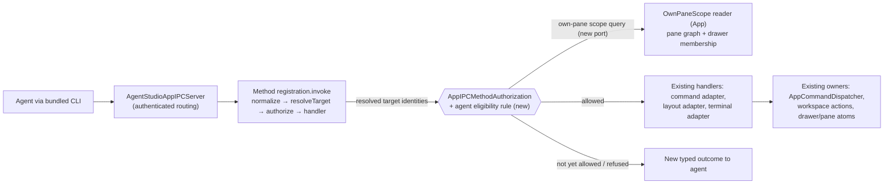
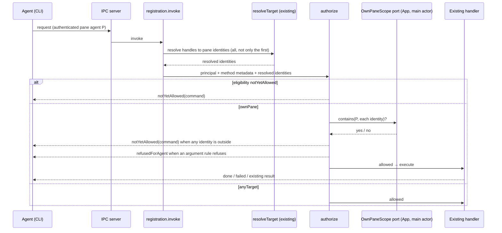

# Workspace IPC Control (A1) — Program Design

[Requirements](./requirements.md) → [Specification](./specification.md) → this
structural design.

A1 changes who may run what, not how commands run. Agent IPC v2 already
resolves every request's target before authorizing it; A1 adds one rule for
pane-bound agents at that point — the command's declared agent eligibility plus
an own-pane check of the resolved target — and gives drawer-child creation a
background variant that returns the new child. Everything else (transport,
principals, catalog execution, drawer and pane owners) stays as it is.



## Current system (main `18cbc3e02`)

- `registration.invoke` runs normalize → `resolveTarget` → `authorize` →
  handler, so the target pane identity is known before authorization
  (`Sources/AgentStudioAppIPC/AppIPCTypedMethodRegistration.swift:140–160`,
  `AgentStudioAppIPCServer.swift:360–368`).
- `command.execute` resolves its target in `prepareCommand`
  (`AppIPCCommandMethodRegistrations.swift:27`,
  `App/IPCComposition/AgentStudioIPCCommandAdapter.swift:87–99`); the permission
  target is only the first resolved pane identity, the drawer parent for drawer
  commands (`AgentStudioIPCCommandTargetResolution.swift:161–169, 256–261`).
- `authorize` lets the debug diagnostic principal through, requires
  `exposure == .allChannels`, then checks each required privilege against the
  pane baseline (`target == .pane(boundPaneId)`) or the grant ledger
  (`AgentStudioIPCRegistryAuthorization.swift:252–345`). Every `command.execute`
  descriptor requires `.appCommandExecute`, which is not in the baseline
  (`App/Commands/AppCommand+IPCProjection.swift:24`), so pane agents cannot run
  any catalog command today; `.layoutMutate` is never grantable
  (`AgentStudioIPCPermissionBroker.swift:106`).
- The registry drops `.debugTesting` methods on other channels
  (`AgentStudioIPCRegistryAuthorization.swift:22`).
- A drawer terminal gets its own principal bound to its own pane ID
  (`WorkspaceSurfaceCoordinator+ViewLifecycle.swift:400`,
  `AgentStudioIPCAuthentication.swift:446–462`).
- `drawer.addPane` dispatches `.addDrawerPane`; creation expands the drawer
  (`WorkspaceTerminalCreationComposition.swift:~170`) and discards the new pane
  (`WorkspaceSurfaceCoordinator+ViewHelpers.swift:80`); the result carries only
  the parent (`IPCQueryContracts.swift:317`). Browser drawer children are created
  only from the management layer (`WorkspaceSurfaceCoordinator+PaneInsertion.swift:185`).
- IPC can only address panes in the pane graph
  (`AgentStudioIPCBridgeAdapter.swift:189`); the full-screen companion Bridge is
  not in the pane graph (`WorkspaceSurfaceCoordinator+ZoomCompanion.swift:194–220`).

**Consequence for scope:** the terminal's Bridge (E-IC-3) is not addressable in
A1. Controlling it through IPC arrives with stack B. B1 does not put the
companion in the pane graph: an agent targets its Bridge through its own
terminal's handle (`self`), which is already inside its own pane, and B1's
Bridge adapter resolves terminal → receiver → current companion controller
(mounted or not). The A1 own-pane rule therefore needs no change for B1; only
the Bridge adapter's target resolution does.

## The structural choice

**Crux:** where does "may this agent run this command on this target?" live
for pane agents?

| Alternative | Gain | Cost | Falsifier |
| --- | --- | --- | --- |
| Widen privileges: add `.appCommandExecute`/`.layoutMutate` to the own-pane baseline | Smallest diff | Privileges are coarser than commands: `.layoutMutate` on the own pane would also allow split, close-self, zoom; drawer children are not the bound pane, so they would still fail | Any own-pane command whose privilege is shared with a refused command |
| **Per-command agent eligibility + own-pane target check (selected)** | Exactly the Specification's table; one declaration per command; A2 widens the same field | One new field on command and method metadata; one new authorization branch; one App port | A command whose effect depends on arguments rather than identity (handled by argument rules below) |
| A separate agent-only method set | Isolated | A second command surface beside the catalog — forbidden by the one-catalog rule | — |

For pane-bound agents, eligibility replaces the privilege/grant check for every
method that declares an eligibility. Other principals (CLI automation, debug
diagnostic) keep today's path unchanged. Established Agent IPC v2 methods keep
their existing admission (see "Method classes and ordering" below). There is no
fallback from a failed eligibility check to the old privilege baseline.

### Method classes and ordering

| Class | Methods | Admission for a pane agent |
| --- | --- | --- |
| Pre-authentication | `auth.login`, `auth.status` | Unchanged; runs before a principal exists |
| Established v2 | `session.report`, `session.message`, `session.event`, `session.query`, `events.subscribe`, `events.unsubscribe` | Unchanged v2 path: bound-pane baseline privileges and target isolation exactly as today (`AppIPCSessionMethodRegistrations.swift:52–145`, `AppIPCBuiltInPresentationAndEventRegistrations.swift:89–124`). They do not declare an eligibility and are not widened to drawer children. |
| A1 eligibility | every other built-in method and every `command.execute` command | Eligibility branch below |

Ordering for a pane agent: authenticate → method recognized? → class. For the
eligibility class: eligibility → own-pane membership of every resolved target →
argument rules → handler. This ordering applies on every channel; see
"Recognized but not allowed" for how channel filtering no longer hides a
disallowed method from a pane agent.

## Components and ownership

| Component | Owns | Change |
| --- | --- | --- |
| `AppCommandIPCSpec` (App) | Per-command IPC metadata | New field `agentEligibility`: `ownPane`, `anyTarget`, `notYetAllowed`. Commands marked `ownPane` or `anyTarget` are exposed on all channels. |
| Built-in method descriptors (`AgentStudioProgrammaticControl/BuiltInDescriptors`) | Per-method metadata | Same field on the method metadata; discovery (`system.capabilities`, `command.list`) reports it. |
| `AppIPCMethodAuthorization` (`AgentStudioAppIPC`) | The authorization decision | New branch for `.spawnedPaneAgent`: eligibility, then own-pane membership of every resolved target identity, then argument rules. Produces the new outcomes. |
| `AppIPCOwnPaneScopePort` (new port, declared in `AgentStudioAppIPC`, implemented in App) | Answering "is pane X inside agent pane P's own pane?" | Reads the pane graph on the main actor: P itself; if P is a main-layout pane, its drawer children. B1 Bridge methods target P itself and resolve to its receiver downstream, so the port does not change. No I/O. |
| Layout adapter / executor (`AgentStudioIPCLayoutAdapter`, `WorkspaceSurfaceCoordinator`) | Drawer child creation | New background variant: content `terminal` or `browser(url)`; drawer expansion, drawer selection (`activeChildId`) and keyboard focus unchanged; returns the created pane. Changed owners: the forced expansion in `WorkspaceTerminalCreationComposition.swift:168–170`, the child selection in `TabArrangementMutationRules.swift:158–177`, the terminal-path focus call in `WorkspaceSurfaceCoordinator+ViewHelpers.swift:104` and the browser-path focus in `WorkspaceSurfaceCoordinator+PaneInsertion.swift:223–230` each take the background flag and leave their value unchanged. |
| Workspace action validation (`ActionValidator`) | Drawer child content rule | Shared rule from the drawer design: terminal or webview only. |
| Error taxonomy (`AgentStudioAppIPCRequestError`, `AuthorizationError.Reason`) | Wire outcomes | New reasons `notYetAllowed` (with command name) and `refusedForAgent`, each with its own error code, distinct from `unauthorized`, `missingGrant` and `targetNotFound`. |

The port keeps `AgentStudioAppIPC` free of App imports, following the existing
port pattern (`service.ports`).

## Eligibility inventory (this layer)

| Eligibility | Commands and methods |
| --- | --- |
| `ownPane` | `terminal.status`, `terminal.snapshot`, `terminal.send`, `terminal.wait`, `pane.snapshot`; `command.execute` for `scrollToBottom`, `scrollPageUp`, `scrollPageDown`, `scrollSmallStepUp`, `scrollSmallStepDown`, `jumpToPreviousPrompt`, `jumpToNextPrompt`, `closeDrawerPane`; `drawer.addPane` (background variant); `pane.close` only for an own drawer child (argument rule) |
| `anyTarget` | `system.ping`, `system.identify`, `system.version`, `system.capabilities`, `window.list`, `window.current`, `workspace.list`, `workspace.current`, `pane.list`, `pane.current`, `command.list` |
| established v2 (no eligibility; unchanged admission) | `auth.*`, `events.subscribe`/`unsubscribe`, `session.report`/`message`/`event`/`query` |
| `notYetAllowed` | every other `command.execute` command and every other method, including `sidebar.*.get` (app-wide UI state, not a listing) and all `bridge.*` methods until B1 (their target, the terminal's Bridge, is not addressable in A1) |

**Headless gaps closed.** Three own-pane commands have no headless
implementation today: `scrollPageDown`, `scrollSmallStepUp` and
`scrollSmallStepDown` return `stateUnavailable`
(`App/Panes/PaneTabViewController+HeadlessIPCCommands.swift:228–232`). Add them to
`executeTerminalRuntimeCommand` (`:292–303`) beside `scrollPageUp`, mapping to the
same terminal runtime scroll commands the interactive path uses. No other A1
command lacks a headless path.

**Argument rules** (evaluated after eligibility, same branch):
- `pane.close`: refused when the target is the agent's bound pane; allowed only
  for its own drawer child.
- `drawer.addPane`: target must be the agent's own main-layout pane; refused for
  an agent in a drawer terminal (drawers do not nest); content must be terminal
  or browser, else refused. A browser URL must parse and use `http` or `https`;
  anything else is refused before a pane is created.
- `closeDrawerPane` / `pane.close` on an own drawer child: allowed in every
  state (owner decision S30); the existing close owner moves focus and selection
  as for a human close. This is the only A1 effect that may change focus.

### Recognized but not allowed

Today a pane agent calling a debug-only method on beta/stable gets
method-not-found, because the registry drops `.debugTesting` methods from
non-debug channels (`AgentStudioIPCRegistryAuthorization.swift:22–24`); typed
registration rejects debug-only methods for non-diagnostic principals
(`AppIPCTypedMethodRegistration.swift:183–196`); and the command adapter rejects
channel-hidden commands before authorization (`AgentStudioIPCCommandAdapter.swift:55–57, 92–104`).
A1 keeps those gates for automation clients and changes only what a pane agent
receives: the registry keeps a recognized-name index of every method and
command on every channel (names and eligibility only, not handlers). When a pane
agent names a recognized method or command that its channel does not expose or
whose eligibility is not yet allowed, routing returns `notYetAllowed` naming it,
before schema validation and with no effect. An unknown name still returns
method-not-found. Discovery for pane agents lists recognized names with their
eligibility so an agent can see what is not yet allowed.

### Scope holds through the effect

Authorization runs before the handler, and each step awaits
(`AppIPCTypedMethodRegistration.swift:140–172`); existing re-validation checks that
a target exists, not that it is still inside the agent's own pane
(`AgentStudioIPCCommandTargetResolution.swift:50–55, 169–174`,
`AgentStudioIPCRuntimeAdapter.swift:61–74`). A1 carries the authorization result
as an own-pane assertion (bound pane + resolved target identities) to the owner
that actually applies the effect, and re-checks it there:

- **Layout effects** (close own drawer child, add drawer child): the assertion
  travels on the `WorkspaceActionCommand`. `WorkspaceActionExecutor.submitGesture`
  already serializes every gesture: it awaits the predecessor gesture, then runs
  `executeValidatedAction`, which builds a fresh workspace snapshot and validates
  before any durable work (`App/Commands/WorkspaceActionExecutor.swift:252–290`).
  The own-pane re-check is part of that validation (`ActionValidator`), so it
  runs after every queued predecessor — including a detach queued before the
  agent's close — and before off-main preparation, SQLite commit and main-actor
  publication (`WorkspaceSQLiteSaveCoordinator.swift:176–265`). The gesture holds
  the executor tail until its commit and publication finish, so no later gesture
  can move the target in between. Failure rejects the action with
  `notYetAllowed` ("target left own pane"): no durable mutation, no UI effect.
- **Immediate runtime effects** (terminal input, scroll, jump to prompt): the
  runtime adapter re-checks the assertion against the current pane graph in the
  same main-actor step that hands the command to the pane runtime; these effects
  are not persisted.

No lock, journal or coordinator is added; persistence stays off-main and the
existing executor serialization carries the guarantee.

## Call path: agent runs a command



**Changed edges:** `resolveTarget` hands authorization every resolved identity,
not only the first (drawer commands currently scope to the parent); authorize
gains the pane-agent branch and the scope port call; the own-pane assertion is
passed down to `ActionValidator` (layout) and to the runtime adapter (runtime
effects), which re-check it at effect time. **Unchanged:** the diagnostic path,
automation-client authorization, executor serialization, persistence ordering.

## Call path: agent adds a drawer child

```mermaid
sequenceDiagram
  participant CLI as Agent (CLI)
  participant Auth as authorize
  participant L as Layout adapter
  participant X as Pane command executor
  participant V as ActionValidator
  participant W as Workspace/drawer owners
  CLI->>Auth: drawer.addPane(self, content)
  Auth->>L: allowed (own main-layout pane, terminal/browser)
  L->>X: add drawer child, background (added edge)
  X->>V: validate parent, content kind and own-pane assertion (after queued predecessors)
  V-->>X: ok
  X->>W: create pane as drawer child, expansion, selection and focus unchanged (changed edge)
  W-->>X: created pane
  X-->>L: created pane identity (added edge; today discarded)
  L-->>CLI: done (parentPaneId, childPaneId, childHandle)
```

The interactive path (human shortcut, management layer) keeps today's
behavior: expand and focus. Only the agent-originated call uses the background
variant.

## Failure and concurrency

- **Target disappears between authorization and execution:** the handler's
  existing re-validation returns its existing not-found failure; nothing
  partial is created.
- **Target leaves the own pane between authorization and execution** (detached,
  moved, parent changed): the effect-time scope re-check refuses with
  `notYetAllowed`; nothing is applied.
- **Principal outlives its pane:** Agent IPC v2 already invalidates the pane
  credential; the scope port also answers "no" for a missing bound pane.
- **Browser URL invalid:** validation failure, no pane created.
- **Uncertain delivery:** unchanged Agent IPC v2 semantics; a retried
  `drawer.addPane` can create a second child (no replay journal).

## Cross-cutting realization

- **Performance (U-IC-08):** authorization adds one main-actor pane-graph
  lookup per request (bounded by the agent's drawer size), no disk, network, or
  per-sample work. It runs only when an IPC request arrives, not on terminal
  output. Marker-scoped proof per the observability proof model.
- **Security:** pane agents cannot widen their own scope; eligibility is
  compiled into the catalog; the not-yet-allowed outcome names the command but
  never another pane's contents.
- **Discovery:** `command.list` and `system.capabilities` report eligibility so
  agents know what they can run without trial and error.
- **Compatibility:** automation clients and the debug diagnostic client are
  unaffected. Pane agents that relied on the (unusable) privilege baseline for
  `bridge.*` see not-yet-allowed instead of `unsupportedTarget`/`missingGrant`.

## Proof seams

| Requirement | Seam | Real / fake |
| --- | --- | --- |
| R-IC-1, R-IC-2 | IPC server integration: real registry, authorization and own-pane port backed by a real pane graph; channel set to stable and debug | Real transport and authorization; App handlers real where the requirement is execution |
| R-IC-1, R-IC-2, R-IC-4 | CLI E2E against a PID-targeted debug app and a stable-channel build: agent in a main terminal and in a drawer terminal; selection and focus unchanged after every A1 effect except closing an own drawer child, where focus moves exactly as for a human close (S30) | Real app |
| R-IC-2 (scope race) | Executor integration: queue a detach of an own drawer child, then the agent's close of that child behind it (causal barrier, no sleeps); assert `notYetAllowed`, no durable mutation and no UI effect | Real executor, validator and SQLite |
| R-IC-3 | Executor integration for the background variant (created pane returned, expansion and focus unchanged) plus native check on the debug app | Real workspace owners |
| R-IC-5 | Marker-scoped main-actor held time for authorization under load | Real app |

Illegal states: a pane agent executing a `notYetAllowed` command is rejected at
the trusted entry (authorization); an agent-created drawer child that expands
the drawer is unrepresentable through the agent path (the background variant
has no expand input).

## Deletion check

No store, atom, registry, event, or persistence is added. The new field,
authorization branch, port, background creation variant and two error reasons
each serve a named requirement (R-IC-1/2, R-IC-1, R-IC-3/4, R-IC-2); removing
any one breaks that requirement.
