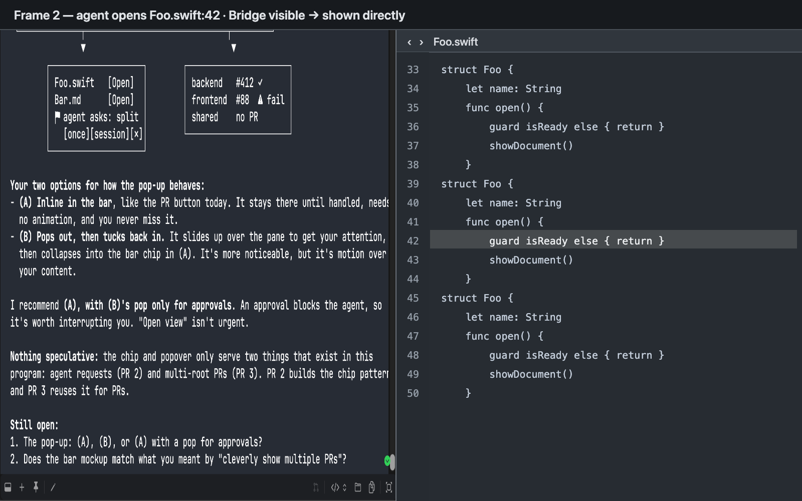
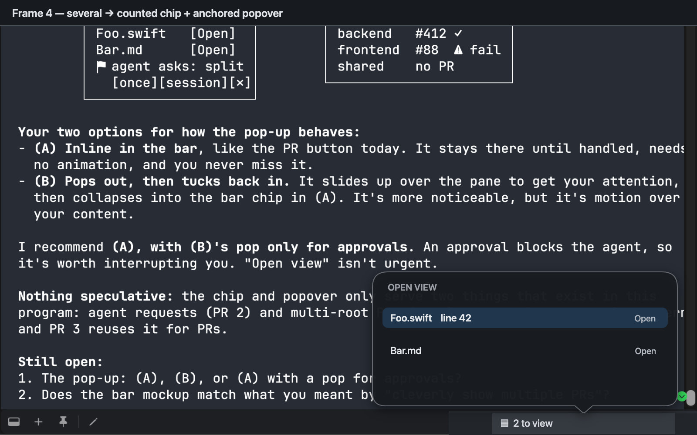
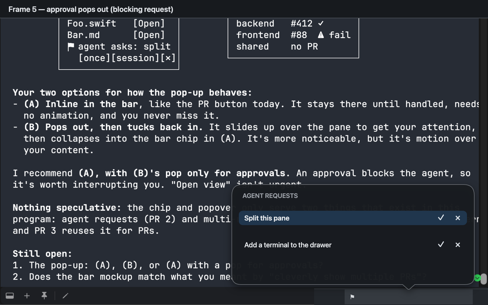
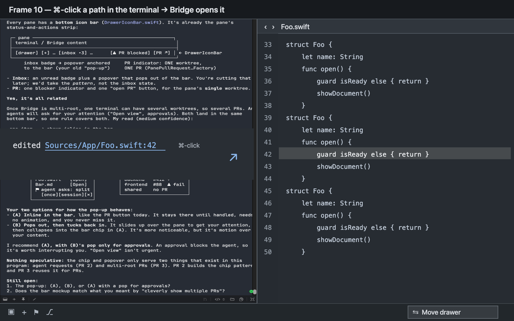

# Workspace IPC Control — Requirements

Agents running in Agent Studio panes should be able to drive the app the way a
person does: show a file, open a drawer terminal, run any command they are
authorized for. A person should see an agent's request only when they must act
on it, in the app's own popover, and never lose their place because an agent
acted.

[Requirements](./requirements.md) → [Specification](./specification.md) →
[Program Design](./program-design.md).

## Who is affected

| Class | Job | Current pain |
| --- | --- | --- |
| Human operator (owner) | Work in a terminal while an agent in that pane works alongside; read what the agent points at; decide what the agent may do | Agent-opened files need a worktree ID and a second call; ⌘-clicking a path in the terminal opens it outside the app, and a hard-wrapped path arrives cut in half; approval requests stay pending forever |
| Agent in a pane (Claude Code, Codex, Cursor via the bundled CLI) | Show the human a file or view; add a drawer terminal; run app commands | Outside the debug app most commands are refused, layout changes can never be granted, and there is no way to ask the human for permission |

## Current foundation (observed at main `18cbc3e02`)

- Agent IPC v2 is merged: authenticated principals (pane-bound agents, CLI
  automation), per-method privileges with pane/data targets, a grant ledger,
  approval routes, typed method descriptors and `command.execute`
  (`docs/specs/2026-09-12-agent-ipc-v2/`).
- Pane agents' baseline on their own pane includes Bridge control/read and
  terminal input/snapshot/wait
  (`Sources/AgentStudioAppIPC/AgentStudioIPCRegistryAuthorization.swift:327`).
- Outside debug, only methods exposed on all channels run; most `AppCommand`s
  are debug-only (`Sources/AgentStudio/App/Commands/AppCommand+IPCProjection.swift`).
- `layoutMutate` can never be granted
  (`Sources/AgentStudioAppIPC/AgentStudioIPCPermissionBroker.swift:106`), and the
  human approval port always answers "ask"
  (`Sources/AgentStudio/App/IPCComposition/AgentStudioIPCHumanApprovalPort.swift:5`).
- `bridge.fileView.open` takes a worktree ID and always opens a new tab; revealing
  a file is a second call.
- `drawer.addPane` adds only terminals and does not return the new pane.
- Ghostty reports ⌘-clicked links, including bare file paths resolved against
  the terminal's working directory; the terminal runtime opens them outside the
  app (`Sources/AgentStudio/Features/Terminal/Runtime/TerminalRuntime.swift:410`),
  and the workspace coordinator only logs the event
  (`Sources/AgentStudio/App/Coordination/WorkspaceSurfaceCoordinator.swift:748`).
  Ghostty's matcher spans soft-wrapped rows but stops at a hard newline, so a
  path a CLI hard-wraps arrives truncated (`vendor/ghostty/src/Surface.zig:4345`).
  OSC 8 hyperlinks arrive whole regardless of wrapping.
- Pane bottom icon bars already host native popovers anchored to a bar button:
  pane note and "Launch bookmarked"
  (`Sources/AgentStudio/Core/Views/Drawer/DrawerIconBar.swift:190`, `:258`).

## Owner statements (2026-09-23, owner Shravan, orchestrator session f4ba41d2)

| ID | Statement (verbatim or transcribed voice) |
| --- | --- |
| S1 | "I think we actually want everything to be controllable by IPC." |
| S2 | "I want to be able to spawn drawers through IPC, and be able to control files through IPC." |
| S3 | "We should be able to have full control over the whole system, so every command is reachable as long as it is authorized by the agent. The agent wants us to show a screen; it should show a file and be able to do that." |
| S4 | "It should all show up at the terminal's bridge, so the terminal's bridge should display it. There is no code viewer in the drawer—absolutely no code viewers in the drawer. There is no bridge inside a drawer; this is not allowed." |
| S5 | "I want everything to be controlled by IPC so it's easy for the agent to do things when you say, 'Tell the agent to open a file.'" |
| S6 | "IPC: I think we can load it silently and the notification says 'open view' with a little pop-up so we can click on it. If the bridge is open already we can show it." |
| S7 | "IPC, can you check the code for IPC? It has some kind of system for authorization; that's what I want you to understand." |
| S8 | "…command-click controls to pick up any file link, so that the spacing that's cut off by junk gets fixed… The user can use it… that's part of this as well." |
| S9 | "If something is immediately actionable, it should be a pop-up. If something is a notification, it should obviously be a notification." |
| S10 | Inbox: "just keep it disconnected and take the ideas… we're gonna take it later in another PR and we're gonna cut it." Sessions: "We have a separate PR for session management, which is going to be a new system." |
| S11 | "We would have to use the macOS popup like [the Arrangements popover]" and the bottom-bar "Launch bookmarked" popover ("but I get the idea"). |
| S12 | "It's a list with approve deny icon buttons, not ugly big buttons." Asked whether approve means "allowed for this agent's session": "yeah, that's what we want." |
| S13 | "We should never forget… the architecture document to make sure nothing gets done in the main actor, and we follow the exact existing systems… Performance is key." |
| S14 | "We never make any upstream changes to anything." |
| S15 | Drawers: "They can hold web views, like browsers, but they cannot hold a bridge." |
| S16 | "In its own domain, the agent can control the drawers and the bridge." |
| S17 | The main-actor rules are the repo agent instructions: "It's in the agents' MD file; it's everywhere." |
| S18 | Goal boundary as drawn on 2026-09-23 (inside / outside / built on / proven by): "Yes, the boundary looks good within the drawer control." |
| S19 | Approval lifetime: "Let's figure out the approval later and make it simple for now… it's there till user clears." |
| S20 | "We need a clear all button… like in inbox." |
| S21 | "The agent shouldn't just randomly change the layout… if… the user is in full-screen mode without the approval [pop-up] that we talked about." |
| S22 | On constraining agents to their own pane (drawer children included) and not allowing destructive app-wide commands yet: "Maybe we should constrain the commands that we allow." Then: "Yes, we can drop approvals from V1. So we can do the others after we spec it out." |
| S23 | ⌘-click: "cmd click goes to our view with option to open as default shown in bridge for all files." |
| S24 | "No, agents cannot close their own pane." |
| S26 | Structure: "We can separate them out into two different PR stacks… and you can use work trees for that." Destroying things outside the agent's own pane (step 3): "If we don't have to worry about step three yet, it's not really in scope." |
| S27 | After evidence showed the terminal's Bridge exists today only as the transient full-screen companion (no stable per-terminal Bridge, no files outside the worktree, no line targeting): moving file opening, ⌘-click and Open view to the Bridge stack — "yes make sense". |
| S28 | "We're not gonna have settings in app; we use agent to write settings for now through IPC commands with approval." |
| S25 | Fast follow: "If I have a chief of staff agent and I want to open other panes and other tabs, that is a functionality that needs approval and it would probably open a bunch at the same time… that can be a separate work tree and a fast follow. But with approval system." |

## User requirements

All rows: authority **authorized** by the owner statements cited; priority
unranked (owner has not ordered them).

| ID | Need and why | Source |
| --- | --- | --- |
| U-IC-01 | An agent can reach app commands and control methods through IPC when authorized, so "tell the agent to do X" works. In this version "authorized" means the command acts within the agent's own domain (U-IC-09); commands outside it are refused as not yet allowed and are opened up in later, separately specified work. | S1, S3, S5, S22 |
| U-IC-02 | An agent can add a terminal or a browser (webview) to a pane's drawer through IPC and then address that new drawer pane. | S2, S15 |
| U-IC-03 | An agent can open any readable file for the human. It appears in the agent's terminal's own Bridge: shown immediately when that Bridge is visible; otherwise loaded silently with an actionable "Open view" popover to reveal it. | S3, S4, S6 |
| U-IC-04 | Drawers never contain Bridge or code-viewer content. Terminals and browsers are allowed. | S4, S15 |
| U-IC-09 | Within its own domain — its own terminal, that pane's drawer and drawer children, and that terminal's Bridge — an agent acts without asking. It cannot close its own pane, zoom it, move keyboard focus, touch other panes, tabs or windows, change app-wide UI, run app-wide destructive commands, or leave the app (Finder, editor, pull request, sign-in). | S16, S21, S22, S24 |
| U-IC-05 | **Deferred from this version by the owner (S22); delivered by the fast-follow cross-pane control work (S25).** When an agent needs permission it does not have, the human sees a list of pending requests in a popover, with icon-only approve and deny buttons per row; approving allows that kind of action for that agent until the human clears the approval (no automatic expiry in this version; richer lifetime rules, e.g. tied to agent hooks, are later work). The popover offers clearing one approval and a Clear all, following the existing Inbox pattern (per-pane clear and clear-all are catalog commands, `AppCommand.clearPaneInboxNotifications` / `.clearAllInboxNotifications`), without reconnecting the Inbox. | S3, S9, S11, S12, S19, S20 |
| U-IC-06 | The human can ⌘-click a file path printed in the terminal, including a path broken across wrapped lines, and it opens and is shown in that terminal's Bridge by default; a setting can make ⌘-clicked files open in the system default app instead; there is no settings screen, so agents change that setting through an approved IPC command (A2). | S8, S23, S28 |
| U-IC-07 | Pop-ups are used only for things the human can act on now (in this version: Open view) and look like the app's existing bottom-bar native popovers. Informational and session events are not pop-ups. | S9, S10, S11 |
| U-IC-08 | None of this adds heavy work to the main actor; it follows the Performance Lane Directive in the repo agent instructions (`AGENTS.md` / `CLAUDE.md`) and the documents it links, and reuses the existing IPC, Bridge, EventBus admission and command systems. | S13, S17 |
| U-IC-10 | No changes to upstream or vendored projects (Ghostty, zmx, other dependencies). | S14 |

### What it looks like (storyboard mockups over the current app; not pixel specs)

Agent opens `Foo.swift:42` while the terminal's Bridge is visible — shown directly (U-IC-03):

Bridge not visible — Open view popover from a bottom-bar button (U-IC-03, U-IC-07):

Agent requests needing approval — a list with ✓ / ✕ icon buttons (U-IC-05, **deferred**; kept as the agreed direction for later work):

⌘-click a path in terminal output (U-IC-06):

## Boundary

**Existing foundation to reuse:** IPC v2 principals, privileges, targets, grant
ledger and approval routes; typed descriptors and `command.execute`; the
`AppCommand` catalog and its IPC projection; Bridge pane controllers; Ghostty
link actions; the bottom-bar popover mechanism.

**Delivery layers (S26, S27):** stack A — A1 own-pane agent control (U-IC-01,
U-IC-02, U-IC-04, U-IC-08, U-IC-09, U-IC-10), A2 approvals and outside-pane
control (U-IC-05, and settings written by agents with approval, S28); stack B —
B1 stable per-terminal Bridge with multi-root membership, B2 file opening for
agents and ⌘-click with Open view (U-IC-03, U-IC-06, U-IC-07), B3 multi-PR
summary. B2's observable contract lives in the Bridge navigation
Specification; this document remains the source of those needs.

**Non-goals (owner-excluded or owned elsewhere):**

- Reconnecting or removing the notification Inbox (S10; later PR).
- Sessions UI or session management (S10; separate PR). Session-type events are
  not surfaced by this work.
- Bridge or code viewer inside drawers (S4).
- Multi-root Bridge membership and collection behavior (Bridge navigation track,
  `docs/specs/2026-09-12-bridge-navigation/` in `agent-studio.drawer-changes`).
- Drawer presentation, Zoom side placement and gap (drawer track,
  `docs/specs/2026-09-13-drawer-presentation/`).
- A control replay journal (Agent IPC v2 decision AD stands).
- Any change to upstream or vendored projects (S14).
- Approvals and agent control outside its own domain (S22). A fast-follow
  worktree adds them with the approval popover (U-IC-05), first for a
  chief-of-staff agent opening other panes and tabs — possibly several in one
  request (S25). This version must not foreclose that: commands carry their
  own-domain eligibility in the catalog so the follow-up can widen it. Delivery
  shape (S26): stack A — A1 this version (inside the agent's own pane), A2 the
  fast follow (outside the pane, with approval). Destroying anything outside
  the agent's own pane (closing other panes, tabs or windows, removing a repo,
  deleting an arrangement) is out of scope for both layers.

**Acceptable outcome evidence:** an agent through the bundled CLI performs each
U row against a running app, authorized and unauthorized; native proof on a
PID-targeted debug app; marker-scoped performance evidence per the repo proof
model.

## Open owner decisions (block the Specification)

| Gap | Question | Why it blocks |
| --- | --- | --- |
| G1 | Resolved 2026-09-23 (S15): terminals and browsers yes; Bridge and code viewer never. | — |
| G2 | Resolved 2026-09-23 (S16, S19): own domain needs no approval; an approval stays until the human clears it. | — |
| G3 | Resolved 2026-09-23 (S17): the Performance Lane Directive in `AGENTS.md` / `CLAUDE.md` and its linked architecture documents. | — |
| G4 | Resolved as evidence 2026-09-23: feasible without Ghostty changes. Soft wraps already work; OSC 8 links (emitted by Claude Code and Codex when enabled) arrive whole; plain hard-wrapped text can be rejoined in the app from the clicked row and its continuation using libghostty's existing text-read API. Not an owner decision. | — |
