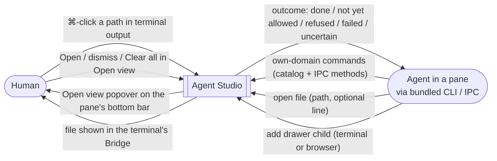
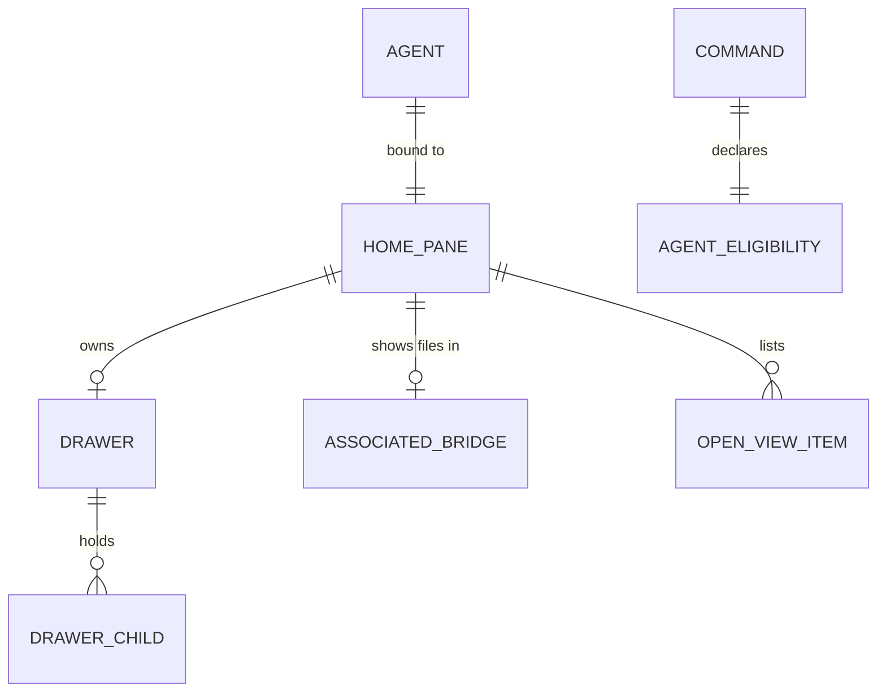

# Workspace IPC Control — Specification

Governing needs: [Requirements](./requirements.md) (U-IC-01 … U-IC-10, owner
statements S1–S25). Program Design: not yet written.

In this version an agent drives only its own domain — its terminal, that
pane's drawer and drawer children, and that terminal's Bridge — through the
same command catalog a person uses. Everything else is refused as not yet
allowed; approvals and cross-pane control are a separate fast follow. Files an
agent or a ⌘-click opens land in the terminal's own Bridge.

## Context



Outside this system boundary: approvals and control of other panes (fast
follow), the notification Inbox, Sessions screens, Bridge multi-root
membership, drawer presentation geometry, and any change to Ghostty, zmx or
other vendored projects.

## Entities

| ID | Term | Identity | Relationships | Invariants | Observable states |
| --- | --- | --- | --- | --- | --- |
| E-IC-1 | Agent | The authenticated pane-bound IPC principal of one terminal pane (Agent IPC v2 pane credential) | bound to exactly 1 home pane | Never authenticates as the human or as another pane | connected, disconnected |
| E-IC-2 | Own domain | Derived from one agent: its home terminal, that pane's drawer and drawer children, and that terminal's associated Bridge | belongs to 1 agent | Contains no other pane, tab, window, app-wide UI, or the home pane's own close | — |
| E-IC-3 | Associated Bridge | The Bridge in which a terminal pane's files are shown (the receiver of the Bridge navigation Specification); for a drawer terminal, the owning pane's | 1 terminal pane → 0..1 | Never a drawer child | visible, not visible, unavailable |
| E-IC-4 | Command | One `AppCommand` catalog identity or one IPC control method | has 1 agent eligibility (E-IC-5) | No agent action bypasses the catalog or the IPC method registry | — |
| E-IC-5 | Agent eligibility | Per command: **own domain** (an agent may run it against a target inside its own domain) or **not yet allowed** | 1 per command | Declared once in the catalog; widening it is a catalog change | own domain, not yet allowed |
| E-IC-6 | Open-view item | Home pane + resolved file path; opening the same file again from that pane updates the same item (line replaced) | belongs to 1 home pane; refers to 1 file | Exists only for a file loaded into a not-visible associated Bridge | waiting → opened (Open), dismissed (dismiss or Clear all) |
| E-IC-7 | File link | A file path the human ⌘-clicks in a terminal: an OSC 8 `file://` link, a plain path on one row, or a plain path continued on the next row after a hard wrap | belongs to 1 terminal pane | Resolved against that terminal's working directory | — |
| E-IC-8 | Drawer child | As the drawer Specification's E-DP-5: a terminal or a browser inside a drawer | belongs to 1 drawer | Never Bridge, never code viewer | — |



## Agent command set in this version

```text
 OWN DOMAIN (agent may run)                      NOT YET ALLOWED (refused)
 ──────────────────────────────────────────      ─────────────────────────────────────
 its terminal  send input, read snapshot,        other panes, tabs, windows (any command)
               status, wait, scroll,             its own pane: close, zoom, extract,
               jump to prompt                      move, minimize, split, focus moves
 its drawer    toggle, add terminal/browser,     drawer: enter / focus / navigate
               close its own drawer child,         children (focus moves), detach
               move side in full screen          Bridge: show / reveal a hidden Bridge,
 its Bridge    open file (R-IC-3), existing        open in a new tab
               bridge.* control/read methods     app-wide: sidebar, command bar,
               on that Bridge, reload              arrangements, management layer
                                                 app-wide destructive: close tab/window,
                                                   remove repo, delete arrangement
                                                 leaves the app: Finder, editor,
                                                   open pull request, sign-in
```

## Requirements

### R-IC-1 — Own-domain commands reachable on every channel

An agent MUST be able to run every command whose eligibility is own domain,
against a target inside its own domain, through IPC on every channel (debug,
beta, stable). Eligibility MUST be declared per command in the catalog, and the
set above is this version's own-domain set.

Basis: U-IC-01, U-IC-09, S1, S3, S5, S16, S22. Proof: V-IC-1.

### R-IC-2 — Everything else refused as not yet allowed

If an agent calls a command whose eligibility is not yet allowed, or targets
anything outside its own domain, then the call MUST NOT execute and MUST
return a not-yet-allowed outcome that names the command, with no change to the
workspace. Closing the agent's own pane MUST be refused. The debug diagnostic
client keeps its existing Agent IPC v2 reach.

Basis: U-IC-09, S22, S24. Proof: V-IC-1.

### R-IC-3 — Opening a file for the human

An agent MUST be able to open any readable file by path — absolute, or relative
to its terminal's working directory — with an optional line. The file MUST load
into the agent terminal's associated Bridge (E-IC-3):

- **Visible Bridge:** the file MUST be shown there at the line.
- **Not-visible Bridge:** the file MUST load without changing what the human
  sees, and an Open-view item MUST appear in the home pane's Open view popover.
  Opening the same file again MUST update that item, not add another. Choosing
  Open MUST make the associated Bridge visible and show the file at the line.

The file MUST NOT open in a new tab, a drawer, or a code viewer. The outcome
MUST say which happened (shown, or waiting in Open view) or why not: unreadable
path, unsupported file, or no associated Bridge available. The outcome never
reports shown until the Bridge has displayed the file.

Basis: U-IC-03, U-IC-04, S3, S4, S6. Proof: V-IC-2.

### R-IC-4 — Adding drawer children

An agent MUST be able to add a terminal or a browser (with a URL) to its own
pane's drawer, and the outcome MUST identify the new drawer child so later
calls can target it. A request to add Bridge or code-viewer content MUST be
refused without creating a pane.

Basis: U-IC-02, U-IC-04, S2, S15. Proof: V-IC-3.

### R-IC-5 — ⌘-clicking a file path

When the human ⌘-clicks a file link (E-IC-7), the file MUST open in that
terminal's associated Bridge and be shown at the line, including when the
Bridge was not visible — the human asked directly. A path split by a hard line
wrap MUST resolve to the full path when the next row continues it. Where the
human has set ⌘-click to use the system default app, the file MUST open there
instead. Links that are not local files (for example `https://`) keep opening
outside the app. A path that does not resolve to a readable file MUST NOT open
anything.

Basis: U-IC-06, S8, S23. Proof: V-IC-4.

### R-IC-6 — Open view popover

The Open view popover MUST be the app's native popover anchored to a button in
the pane's bottom icon bar, matching the existing pane note and "Launch
bookmarked" popovers. It lists waiting files with Open and dismiss per row and
a Clear all. The bar button MUST show how many files are waiting and MUST NOT
take keyboard focus from the terminal when an item arrives. No toast, banner,
window-level alert or Inbox entry is created. Labels and the Open, dismiss and
Clear all actions MUST come from the command catalog, and they are human
actions: their agent eligibility is not yet allowed.

Basis: U-IC-07, S9, S10, S11, S20. Proof: V-IC-5.

### R-IC-7 — Responsiveness and existing systems

No new work MUST run on the main actor per terminal output sample, per
keystroke, or per file byte. Path resolution, file reading and ⌘-click path
reassembly MUST NOT block the main actor. All behavior MUST reuse the command
catalog, Agent IPC v2 authentication and method registry, the Bridge and the
existing bottom-bar popover mechanism, following the Performance Lane
Directive in `AGENTS.md` / `CLAUDE.md`. No change is made to Ghostty, zmx or
other vendored projects.

Basis: U-IC-08, U-IC-10, S13, S14, S17. Proof: V-IC-6.

## Outcomes an agent receives

| Outcome | Meaning |
| --- | --- |
| done | The command ran; result data as the command defines (R-IC-3: shown or waiting in Open view; R-IC-4: the new drawer child) |
| not yet allowed | Not run: the command or target is outside this version's own domain |
| refused | Never allowed: Bridge or code viewer into a drawer, invalid target |
| failed | Allowed but could not complete: unreadable or unsupported file, no associated Bridge |
| uncertain | The connection ended before a result (Agent IPC v2; no replay journal, so a retry may run again) |

## Negative space

- No approvals, requests or grants in this version; nothing waits for the human.
- No agent reaches another pane, tab, window, app-wide UI, or outside the app.
- No agent closes, zooms or refocuses its own pane.
- No file opens outside the associated Bridge; no Bridge or code viewer in a drawer.
- No change to how non-file links open.
- No Inbox reconnection, Sessions screen or notification history.

## Coverage and proof

| Need | Entities | Requirement | Evidence |
| --- | --- | --- | --- |
| U-IC-01, U-IC-09 | E-IC-1, 2, 4, 5 | R-IC-1, R-IC-2 | V-IC-1: bundled CLI against a running stable-channel build and debug: each own-domain command succeeds on its own-domain target; the same command on another pane, each not-yet-allowed class, and closing its own pane return not yet allowed with no workspace change |
| U-IC-03 | E-IC-3, 6 | R-IC-3 | V-IC-2: native debug app (PID-targeted): Bridge visible → shown at line; Bridge hidden → Open view item with no visible change, Open → shown; repeated open updates one item; failure outcomes for unreadable, unsupported and no Bridge |
| U-IC-02, U-IC-04 | E-IC-8 | R-IC-4 | V-IC-3: CLI adds a terminal and a browser and targets the returned child; Bridge and code-viewer requests refused with no pane created |
| U-IC-06 | E-IC-7 | R-IC-5 | V-IC-4: native ⌘-click on OSC 8, plain, soft-wrapped and hard-wrapped paths from Claude Code and Codex output, with the setting in both positions; `https://` still opens externally; a non-file path opens nothing |
| U-IC-07 | E-IC-6 | R-IC-6 | V-IC-5: native visual capture of the popover, count on the bar button, no focus change on arrival, dismiss and Clear all; an agent calling those actions gets not yet allowed |
| U-IC-08, U-IC-10 | — | R-IC-7 | V-IC-6: marker-scoped main-actor held time and hop counts for file open, popover updates and ⌘-click under the current workload; no vendored-project diff |
| U-IC-05 | — | deferred (S22, S25) | Fast-follow cross-pane control work |
