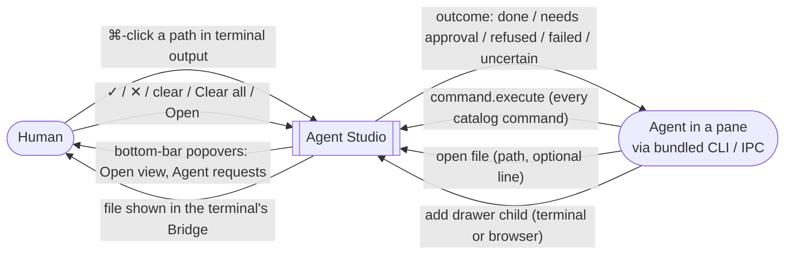
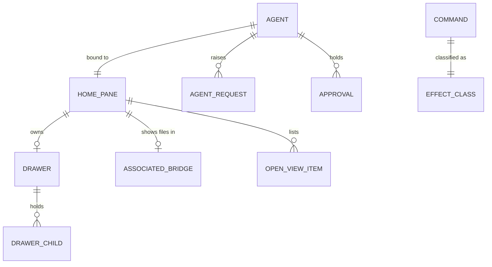

# Workspace IPC Control — Specification

Governing needs: [Requirements](./requirements.md) (U-IC-01 … U-IC-10, owner
statements S1–S20). Program Design: not yet written.

Agents drive the app through the same command catalog a person uses. What an
agent may do alone is bounded by its own domain and by whether the action would
rearrange the human's screen; anything else becomes a request the human
answers in a native popover. Files an agent (or a ⌘-click) opens always land in
the terminal's own Bridge.

## Context

Not in this system boundary: the notification Inbox, Sessions screens, Bridge
multi-root membership, drawer presentation geometry, and any change to Ghostty,
zmx or other vendored projects.

## Entities

| ID | Term | Identity | Relationships | Invariants | Observable states |
| --- | --- | --- | --- | --- | --- |
| E-IC-1 | Agent | The authenticated pane-bound IPC principal of one terminal pane (Agent IPC v2 pane credential). A new principal for the same pane is the same agent only if Agent IPC v2 treats it as the same authenticated principal. | bound to exactly 1 home pane | An agent never authenticates as the human or as another pane | connected, disconnected |
| E-IC-2 | Own domain | Derived from one agent: its home pane, that pane's drawer and drawer children, and that terminal's associated Bridge | belongs to 1 agent | Contains no other pane, tab, window or Bridge | — |
| E-IC-3 | Associated Bridge | The Bridge in which a terminal pane's files are shown (the receiver defined by the Bridge navigation Specification). For a drawer terminal, the owning pane's associated Bridge. | 1 terminal pane → 0..1 associated Bridge | Never a drawer child | visible, not visible, unavailable |
| E-IC-4 | Command | One `AppCommand` catalog identity, or one IPC control method | has exactly 1 effect class (E-IC-5) | Every agent action is a command; no action bypasses the catalog | — |
| E-IC-5 | Effect class | Per command: **quiet** (nothing on the human's screen moves) or **rearranging** (changes focus, the selected window/tab, Zoom, split/close/move/resize of panes, or drawer expansion, side or visibility) | 1 per command | Assigned once in the catalog, not per call | quiet, rearranging |
| E-IC-6 | Agent request | Agent + command + target scope. The same agent asking the same command for the same target again is the same request. | belongs to 1 agent; shown in the home pane's popover | Visible to the human until answered or dropped | pending → approved, denied, dropped (home pane closed) |
| E-IC-7 | Approval | Agent + command + target scope, created when the human approves a request | belongs to 1 agent | Grants only that command for that target scope to that agent | active → cleared (human clears it, Clear all, or app quits) |
| E-IC-8 | Open-view item | Home pane + resolved file path. Opening the same file again from that pane is the same item (line updated). | belongs to 1 home pane; refers to 1 file | Exists only while its file was loaded into a not-visible associated Bridge | waiting → opened (human clicks Open), cleared |
| E-IC-9 | File link | A file path the human ⌘-clicks in a terminal: an OSC 8 `file://` link, a plain path on one row, or a plain path continued across wrapped rows | belongs to 1 terminal pane | Resolved against that terminal's working directory | — |
| E-IC-10 | Drawer child | As the drawer Specification's E-DP-5: a terminal or a browser inside a drawer | belongs to 1 drawer | Never Bridge, never code viewer | — |

## Requirements

### R-IC-1 — Every command reachable when authorized

Every catalog command and IPC control method MUST be executable through IPC by
an agent on every channel (debug, beta, stable) when that agent is authorized
for it. An agent is authorized for a command on a target when any of these
holds:

1. the target is in its own domain and the command is quiet;
2. it holds an active approval for that command and target scope;
3. it is the debug diagnostic client already authorized by Agent IPC v2.

Otherwise the call MUST NOT execute and MUST return the approval-required
outcome (R-IC-3). Commands that answer or clear agent requests and approvals
(R-IC-4) MUST NOT be executable by any agent on any channel except the debug
diagnostic client.

Basis: U-IC-01, U-IC-09, S1, S3, S5, S16. Proof: V-IC-1, V-IC-2.

### R-IC-2 — Rearranging needs the human (see OD-IC-1)

A rearranging command MUST require an approval when it would change what the
human currently sees, even inside the agent's own domain. The one exception is
R-IC-5: showing an opened file in an associated Bridge that is already visible.

Basis: S3 ("as long as it is authorized"), the owner's 2026-09-23 statement that
an agent "shouldn't just randomly change the layout… in full-screen mode without
the approval", U-IC-09. Proof: V-IC-2.

### R-IC-3 — Asking for approval

When an unauthorized agent calls a command, the call MUST return an
approval-required outcome carrying the request's identity, without executing,
and the agent request MUST appear in the home pane's Agent requests popover. A
repeated identical call MUST NOT add a second row. The popover MUST open by
itself when a new request arrives, anchored to its bottom-bar button, without
taking keyboard focus from the terminal. If the human dismisses the popover,
the bar button MUST keep showing the number of pending requests.

Approving MUST create an approval and move the row to the Allowed section.
Approval does not run the original call: the agent learns the answer through
the request's status and re-issues the command, which then runs if still
authorized. Denying MUST remove the row and make the request's status denied.
A pending request MUST be dropped when its home pane closes.

Basis: U-IC-05, U-IC-07, S9, S12. Proof: V-IC-2, V-IC-5.

### R-IC-4 — Approvals last until cleared

An approval MUST stay active until the human clears it (per row or with Clear
all) or the app quits. There is no automatic expiry. Clear all MUST clear every
approval shown in that popover in one action. Clearing, approving, denying and
Clear all MUST be catalog commands reachable from the popover and the command
bar.

Basis: U-IC-05, S19, S20. Proof: V-IC-5.

### R-IC-5 — Opening a file for the human

An agent MUST be able to open any readable file by path — absolute, or relative
to its terminal's working directory — with an optional line. The file MUST load
into the agent terminal's associated Bridge (E-IC-3):

- **Visible Bridge:** the file MUST be shown there at the line. This is quiet
  for authorization purposes.
- **Not-visible Bridge:** the file MUST load without changing what the human
  sees, and an Open-view item MUST appear in the home pane's Open view popover.
  Opening the same file again MUST update that item, not add another.
  Clicking Open MUST make the associated Bridge visible and show the file at
  the line.

The file MUST NOT open in a new tab, a drawer, or a code viewer. The outcome
MUST say which happened (shown, or waiting in Open view) or why not: unreadable
path, unsupported file, or no associated Bridge available. The request never
reports shown until the Bridge has actually displayed the file.

Basis: U-IC-03, U-IC-04, S3, S4, S6. Proof: V-IC-3, V-IC-5.

### R-IC-6 — Adding drawer children

An agent MUST be able to add a terminal or a browser (with a URL) to a drawer
through IPC, and the outcome MUST identify the new drawer child so later calls
can target it. A request to add Bridge or code-viewer content MUST be refused
without creating a pane. Adding to its own drawer is authorized under R-IC-1
and R-IC-2 like any other drawer command.

Basis: U-IC-02, U-IC-04, S2, S15. Proof: V-IC-4.

### R-IC-7 — ⌘-clicking a file path

When the human ⌘-clicks a file link (E-IC-9), the file MUST open in that
terminal's associated Bridge and be shown at the line — the human asked
directly, so it is shown even when the Bridge was not visible. A path split by
a hard line wrap MUST resolve to the full path when the continuation row holds
the rest of it. Links that are not local files (for example `https://`) keep
opening outside the app as today. A path that does not resolve to a readable
file MUST NOT open anything.

Basis: U-IC-06, S8. Proof: V-IC-6.

### R-IC-8 — Popovers only for things to act on now

The Open view and Agent requests surfaces MUST be the app's native popovers
anchored to a button in the pane's bottom icon bar, matching the existing pane
note and "Launch bookmarked" popovers: rows, icon-only ✓ and ✕ for requests, a
clear control per approval and Clear all. No toast, banner, window-level alert
or Inbox entry is created. Informational and session events are not shown here.
Popover content, counts and button labels MUST come from the command catalog's
display pipeline.

Basis: U-IC-05, U-IC-07, S9, S10, S11, S12. Proof: V-IC-5.

### R-IC-9 — Responsiveness and existing systems

No new work MUST run on the main actor per terminal output sample, per
keystroke, or per file byte. Path resolution, file reading and ⌘-click path
reassembly MUST NOT block the main actor. All behavior MUST reuse the command
catalog, Agent IPC v2 authorization, the Bridge and the existing bottom-bar
popover mechanism, following the Performance Lane Directive in `AGENTS.md` /
`CLAUDE.md`. No change is made to Ghostty, zmx or other vendored projects.

Basis: U-IC-08, U-IC-10, S13, S14, S17. Proof: V-IC-7.

## Open decision

| ID | Question | Options | Consequence |
| --- | --- | --- | --- |
| OD-IC-1 | Inside its own domain, which rearranging commands need approval? The owner said the agent "can control the drawers and the bridge" in its own domain, and also that it "shouldn't just randomly change the layout… in full-screen mode without the approval". | (a) Always: every rearranging command needs approval, own domain or not. (b) Only while the human is in full screen (Pane Zoom) or looking at that pane: otherwise own-domain rearranging runs freely. (c) Never inside own domain. | (a) simplest and safest, more ✓ clicks. (b) matches the full-screen concern with fewer prompts, but "looking at" needs a precise rule. (c) contradicts the full-screen concern. R-IC-2 is written as (b)'s "would change what the human currently sees" until decided. |

## Outcomes an agent receives

| Outcome | Meaning |
| --- | --- |
| done | The command ran; result data as the command defines (for R-IC-5: shown or waiting in Open view; for R-IC-6: the new drawer child) |
| approval required | Not run; carries the request identity; status later reads pending, approved or denied |
| refused | Never allowed (Bridge or code viewer into a drawer, an agent answering approvals, invalid target) |
| failed | Allowed but could not complete (unreadable file, unsupported file, no associated Bridge) |
| uncertain | The connection ended before a result (Agent IPC v2; no replay journal, so a retry may run again) |

## Negative space

- No approval ever runs a command by itself on the agent's behalf.
- No expiry timer for approvals; nothing is saved across app quit.
- No file opens outside the associated Bridge; no Bridge or code viewer in a drawer.
- No agent can approve, deny or clear requests or approvals.
- No change to how non-file links open.
- No Inbox reconnection, Sessions screen or notification history.

## Coverage and proof

| Need | Entities | Requirement | Evidence |
| --- | --- | --- | --- |
| U-IC-01, U-IC-09 | E-IC-1, 2, 4, 5 | R-IC-1 | V-IC-1: through the bundled CLI on a running stable-channel build and on debug, an agent runs a quiet own-domain command and an approved command; an unapproved command returns approval required; an agent calling approve/deny/clear is refused |
| U-IC-05 | E-IC-5, 6, 7 | R-IC-2, R-IC-3, R-IC-4 | V-IC-2: CLI transcript plus popover state — request appears once for repeated calls, ✓ then re-issue runs, ✕ returns denied, closing the home pane drops pending, Clear all removes every approval |
| U-IC-03 | E-IC-3, 8 | R-IC-5 | V-IC-3: native debug app (PID-targeted): Bridge visible → file shown at line; Bridge hidden → Open view row, no visible change, click → shown; outcome text matches; failure cases return failed |
| U-IC-02, U-IC-04 | E-IC-10 | R-IC-6 | V-IC-4: CLI adds a terminal and a browser, targets the returned child; Bridge/code-viewer requests refused with no pane created |
| U-IC-07 | E-IC-6, 7, 8 | R-IC-8, R-IC-3 | V-IC-5: native visual capture of both popovers, auto-open on request without focus change, counts after dismissal |
| U-IC-06 | E-IC-9 | R-IC-7 | V-IC-6: native ⌘-click on OSC 8, plain, soft-wrapped and hard-wrapped paths from Claude Code and Codex output; http link still opens externally |
| U-IC-08, U-IC-10 | — | R-IC-9 | V-IC-7: marker-scoped main-actor held-time and hop counts for file open, popover updates and ⌘-click under the current workload; no vendored-project diff |
