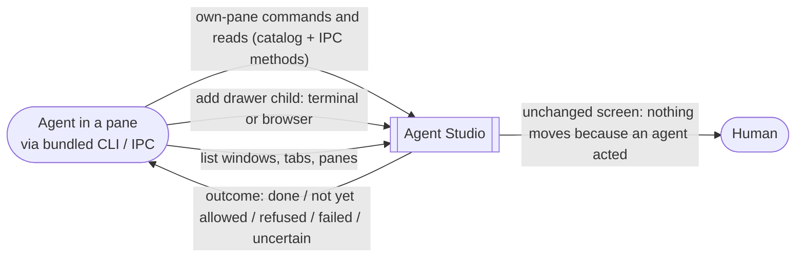
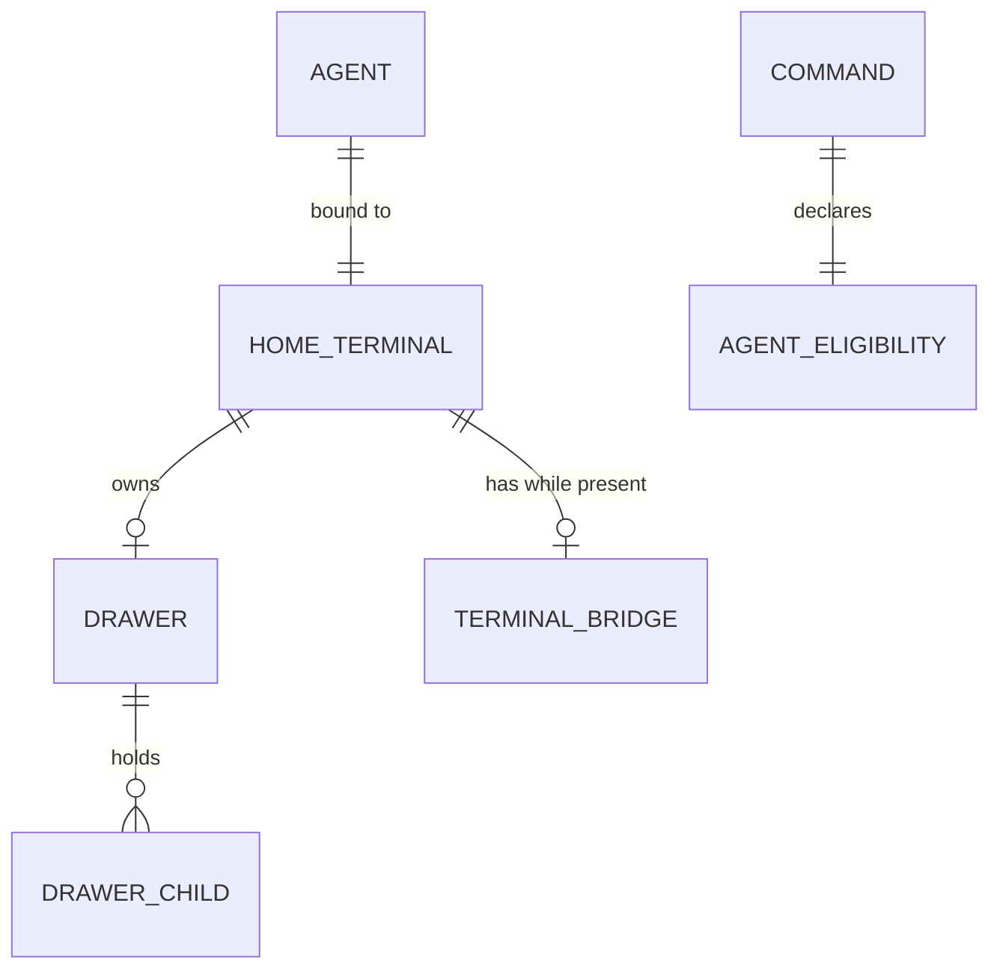

# Workspace IPC Control (A1) — Specification

Governing needs: [Requirements](./requirements.md) (U-IC-01, U-IC-02, U-IC-04,
U-IC-08, U-IC-09, U-IC-10; owner statements S1–S30). Program Design:
[program-design.md](./program-design.md).

This is layer A1 of stack A. An agent drives only its own pane — its terminal
and that pane's drawer and drawer children — through
the same command catalog a person uses. Everything else is refused as not yet
allowed. Approvals and control outside the agent's pane are layer A2. The
terminal's Bridge joins the agent's own pane in layer B1, when it becomes a
stable, addressable pane; opening files for the human, ⌘-click and Open view
are layer B2.

## Context



Outside this layer: approvals and outside-pane control (A2), settings writes
(A2), file opening, ⌘-click and Open view (B2), the notification Inbox,
Sessions screens, drawer presentation geometry, and any change to Ghostty, zmx
or other vendored projects.

## Entities

| ID | Term | Identity | Relationships | Invariants | Observable states |
| --- | --- | --- | --- | --- | --- |
| E-IC-1 | Agent | The authenticated pane-bound IPC principal of one terminal pane (Agent IPC v2 pane credential). A terminal inside a drawer is its own agent, bound to that drawer terminal. | bound to exactly 1 home terminal | Never authenticates as the human or as another pane | connected, disconnected |
| E-IC-2 | Own pane | For an agent in a main-layout terminal: that terminal pane, its drawer and drawer children, and (from B1) its Bridge (E-IC-3). For an agent in a drawer terminal: that drawer terminal and (from B1) its owning pane's Bridge; not the owning pane itself, not sibling drawer children. | derived from 1 agent | Never another main-layout pane, tab, window or app-wide UI | — |
| E-IC-3 | Terminal's Bridge | The Bridge in which a terminal's files are shown. Today only the transient full-screen companion, which is not addressable through IPC; from layer B1 an agent reaches it through its own terminal's handle, and B1 resolves that to the terminal's receiver. | 1 terminal → 0..1 | Never a drawer child | present, absent |
| E-IC-4 | Command | One `AppCommand` catalog identity or one IPC control method | has 1 agent eligibility (E-IC-5) | No agent action bypasses the catalog or the IPC method registry | — |
| E-IC-5 | Agent eligibility | Per command: **own pane** (runs against a target inside the agent's own pane), **any target** (read-only listing of windows, tabs and panes), or **not yet allowed** | 1 per command | Declared once in the catalog; widening it is a catalog change | own pane, any target, not yet allowed |
| E-IC-6 | Drawer child | As the drawer Specification's E-DP-5: a terminal or a browser inside a drawer | belongs to 1 drawer | Never Bridge, never code viewer | — |



## Agent command set in this layer

```text
                  INSIDE OWN PANE (A1)                   OUTSIDE OWN PANE
 OBSERVE          its terminal status/snapshot/wait;     list windows/tabs/panes: allowed
                  events; session query; its Bridge's    other panes' contents: A2
                  state and content from B1
 QUIET WRITE      type in and scroll its terminal, jump  A2
                  to prompt; inside its Bridge (search,
                  filter, reveal, select, refresh,
                  reload) from B1
 CREATE           add a terminal or browser to its       A2 (panes, tabs, sessions —
                  drawer, added collapsed (R-IC-3)          chief of staff)
 BRING TO VIEW    none — agents cannot toggle or         A2 (focus, select tab, take
                  expand the drawer, move its side,         the human to a session)
                  zoom, move focus or reveal a Bridge
 DESTROY          close its own drawer child             out of scope (refused)
                  (never its own pane)
 LEAVE THE APP    —                                      A2
 SETTINGS         —                                      A2 (agents write settings with approval)
```

## Requirements

### R-IC-1 — Own-pane commands reachable on every channel

An agent MUST be able to run every command whose eligibility is own pane,
against a target inside its own pane (E-IC-2), and every command whose
eligibility is any target, through IPC on every channel (debug, beta, stable).
Eligibility MUST be declared per command in the catalog, and the table above
is this layer's set. A target given as the agent's own drawer child counts as
inside its own pane.

Basis: U-IC-01, U-IC-09, S1, S3, S5, S16, S22. Proof: V-IC-1.

### R-IC-2 — Everything else refused as not yet allowed

If an agent calls a command whose eligibility is not yet allowed, or targets
anything outside its own pane, then the call MUST NOT execute and MUST return a
not-yet-allowed outcome that names the command, with no change to the
workspace. Closing the agent's own pane MUST be refused. The outcome MUST be
distinguishable from authentication failures and from missing-target errors.
The debug diagnostic client keeps its existing Agent IPC v2 reach.

Basis: U-IC-09, S22, S24, S26. Proof: V-IC-1.

### R-IC-3 — Adding drawer children

An agent MUST be able to add a terminal, or a browser with a URL, to its own
pane's drawer. The outcome MUST identify the new drawer child so later calls
can target it. When an agent adds it, the drawer's expanded or collapsed state
and keyboard focus MUST NOT change; the human sees the child the next time they
open the drawer. A request to add Bridge or code-viewer content MUST be
refused without creating a pane. An agent in a drawer terminal cannot add
drawer children (drawers do not nest).

Basis: U-IC-02, U-IC-04, S2, S15. Proof: V-IC-2.

### R-IC-4 — Nothing moves because an agent acted

No A1 command run by an agent MUST change which window, tab or pane is
selected or focused, whether a drawer is expanded, Pane Zoom, or whether a
Bridge is shown. Observable effects stay inside the agent's own terminal and
drawer children.

The one exception is closing an agent's own drawer child (owner decision S30):
it is allowed even when that child is focused or selected in an expanded
drawer, and focus and selection then move exactly as they do when the human
closes the same child (`WorkspaceSurfaceCoordinator+PaneDiscard.swift:23–71`).

Basis: U-IC-09, S21, S22. Proof: V-IC-1, V-IC-2.

### R-IC-5 — Responsiveness and existing systems

Authorization and target checks MUST add no disk or network access per call
and no work per terminal output sample or keystroke on the main actor. All
behavior MUST reuse the command catalog, Agent IPC v2 authentication, method
registry and principals, and the existing drawer and Bridge owners, following
the Performance Lane Directive in `AGENTS.md` / `CLAUDE.md`. No change is made
to Ghostty, zmx or other vendored projects.

Basis: U-IC-08, U-IC-10, S13, S14, S17. Proof: V-IC-3.

## Outcomes an agent receives

| Outcome | Meaning |
| --- | --- |
| done | The command ran; result data as the command defines (R-IC-3: the new drawer child) |
| not yet allowed | Not run: the command or its target is outside this layer's own-pane set |
| refused | Never allowed: Bridge or code viewer into a drawer, closing its own pane, invalid target |
| failed | Allowed but could not complete, with the command's existing failure reason |
| uncertain | The connection ended before a result (Agent IPC v2; no replay journal, so a retry may run again) |

## Negative space

- No approvals, requests or grants in this layer; nothing waits for the human.
- No agent reads another pane's contents or acts on another pane, tab, window,
  app-wide UI, settings, or outside the app; it may only list them.
- No agent destroys anything outside its own pane, in this layer or A2.
- No agent closes, zooms or refocuses its own pane, or expands, toggles or
  moves its drawer, or reveals a Bridge.
- No file opening for the human, ⌘-click change or Open view (B2).
- No Inbox reconnection, Sessions screen or notification history.

## Coverage and proof

| Need | Entities | Requirement | Evidence |
| --- | --- | --- | --- |
| U-IC-01, U-IC-09 | E-IC-1, 2, 3, 4, 5 | R-IC-1, R-IC-2, R-IC-4 | V-IC-1: bundled CLI against a running stable-channel build and debug, for an agent in a main terminal and one in a drawer terminal: each own-pane command succeeds on its own terminal and drawer child; Bridge methods return not yet allowed; listing succeeds; the same commands on another pane, each not-yet-allowed class, and closing its own pane return the right outcome with no workspace change; selection, focus, drawer expansion and Zoom are unchanged afterwards |
| U-IC-02, U-IC-04 | E-IC-6 | R-IC-3, R-IC-4 | V-IC-2: CLI adds a terminal and a browser, receives and targets the new child; drawer stays collapsed and focus unchanged (native check on a PID-targeted debug app); Bridge and code-viewer requests refused with no pane created; drawer-terminal agent cannot add |
| U-IC-08, U-IC-10 | — | R-IC-5 | V-IC-3: marker-scoped main-actor held time for authorization under the current workload; no vendored-project diff |
| U-IC-03, U-IC-06, U-IC-07 | — | moved to B2 (S27) | Bridge navigation Specification |
| U-IC-05 | — | A2 (S22, S25, S26, S28) | A2 Specification (later) |
