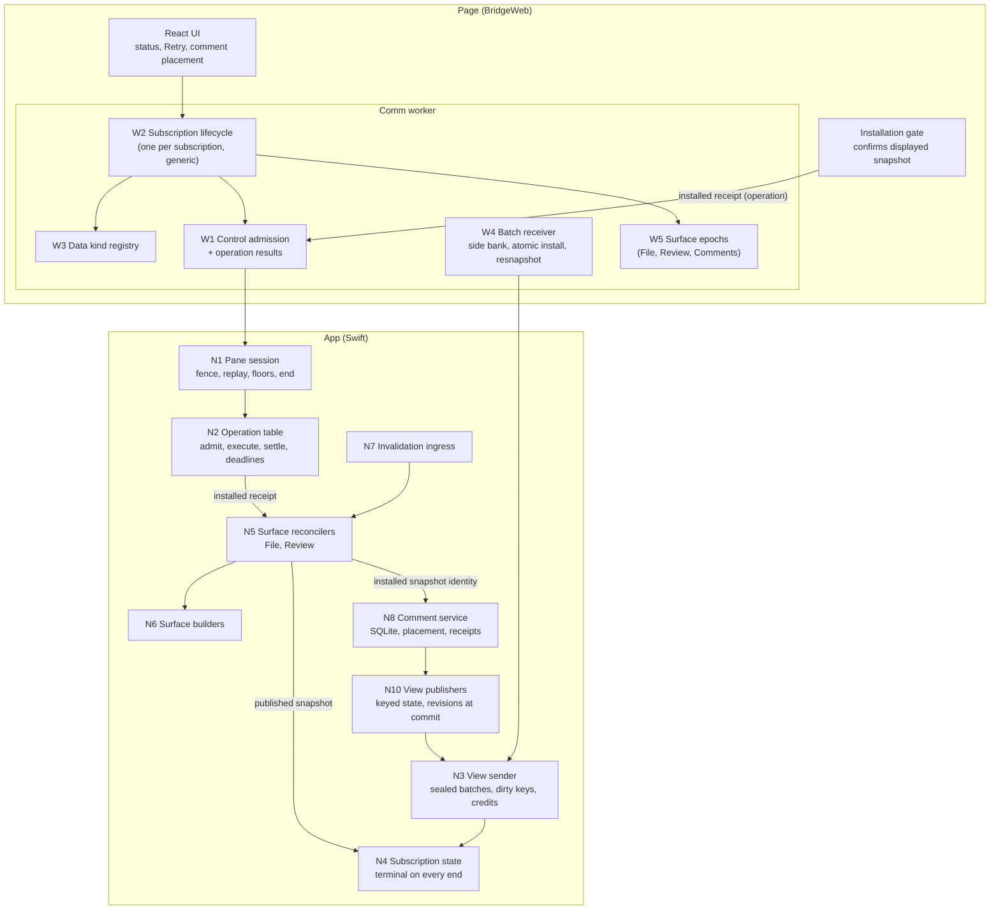
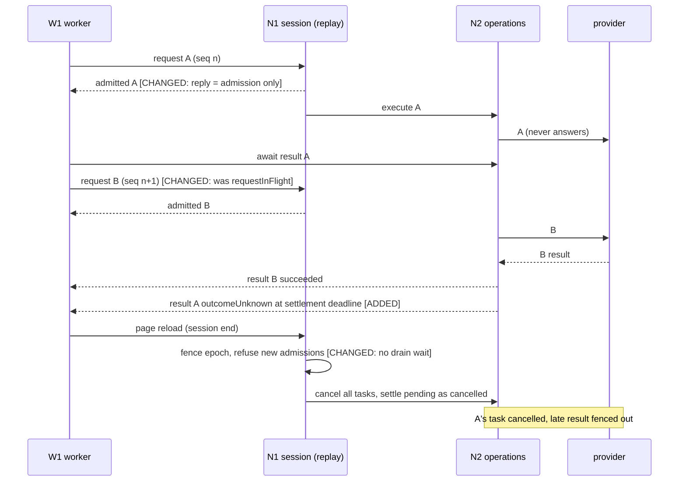
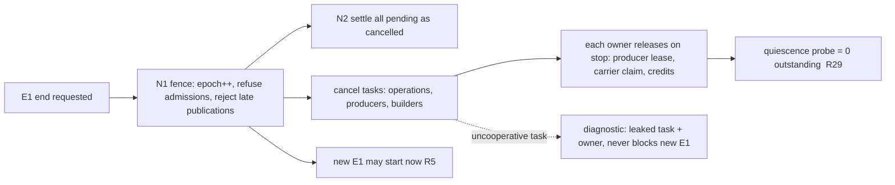
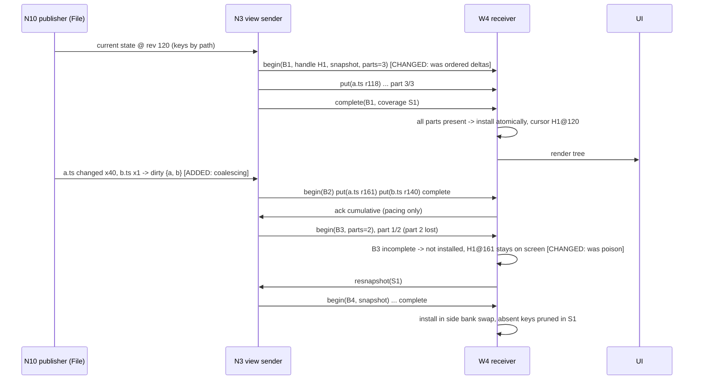
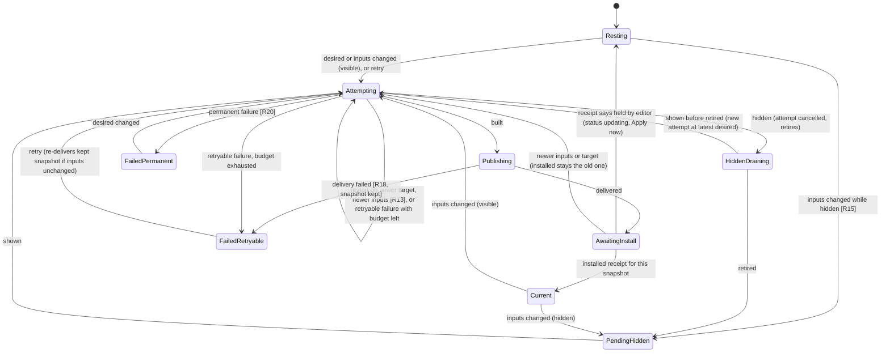
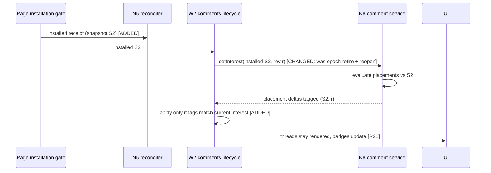
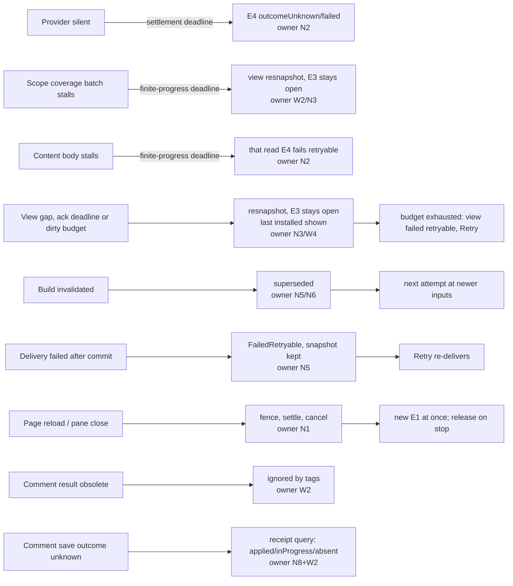
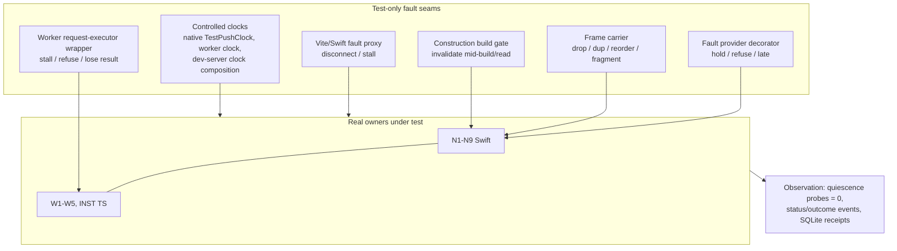

# Bridge Stability: Program Design

**How the Bridge will meet the [Specification](2026-09-24-bridge-stability-specification.md)** (E1–E18, R1–R32). The needs and boundary it serves are in the [Requirements](2026-09-24-bridge-stability-requirements.md). Current-system evidence lives in `tmp/2026-09-24-bridge-stability-research/`; it is cited by `file:line` at HEAD `97725b7ae`.

## The design in one picture

Six decisions carry the design:

1. **Settlement has an owner, and progress has a deadline.** Every wait is registered with the lifecycle owner that can end it: the pane session, the subscription, the operation, or the surface attempt. That owner ends the wait on its own terminal transition. Every wait on a peer's *progress* belongs to one of three deadline categories, each driven by an injected clock:
   - operation settlement;
   - finite progress, which covers a barrier after a response and the rest of a started body;
   - acknowledgement.
2. **Admission is serial and cheap, execution is concurrent.** Control requests keep today's exact-replay sequence protocol. But native answers each request as soon as it is *admitted*, and the operation's result arrives separately. One slow operation therefore never holds the sequence.
3. **Cancel is out-of-band.** A cancel or retirement never queues behind the work it ends. Native always admits it, even below the surface floor.
4. **Surfaces reconcile towards a desired state.** One reconciler per pane per surface (File, Review) replaces the shared task slot, the scattered generation counters, and the self-rescheduling tail. A snapshot counts as displayed only when the page confirms installing it.
5. **Comments are their own surface.** The *installed* File or Review snapshot is an interest of the comment subscription, not its lifetime. Comments are created against the version the user sees.
6. **Metadata is replicated as keyed state, in sealed batches.** Native is the single writer. Each view (subscription) carries an incarnation handle, per-key revisions minted at commit, and atomic batches that are installed only when complete. A gap means a staged **resnapshot**: never a dead subscription, never a blank view. Native coalesces changes per key, so a slow page sees the latest values, never a backlog. There is no CRDT and no Lamport clock; neither is needed with one writer.

*Read top-down: the page asks through admission (W1→N1→N2) and gets results separately. The app streams through per-subscription credits (N3→W4). Surfaces converge in N5, and "displayed" only advances when the page's installation gate confirms it. Comments are placed against whatever the page actually shows.*

## Selected direction and the alternatives we rejected

| Crux | Selected | Rejected alternative (still credible) | Why selected | Falsifier: what would reopen it |
|---|---|---|---|---|
| Where do waits end? | Owner-registered settlement plus three injected-clock deadline categories (R1, R3, R10) | Timeouts on every await | Timeouts on every await are unprovable, and they encode timing in behavior. With owners, a leftover-state probe can prove "nothing left" (R29). | A wait that no owner can end without an ad-hoc timer |
| Control concurrency | Serial admission, concurrent execution, results by operation id (N2, W1). Keeps exact replay (`BridgeProductControlReplayCache.swift:84-87,144`). | (a) One slot plus a deadline. (b) Per-lane sequence numbers. | (a) keeps S13 at deadline length. (b) needs a new multi-sequence replay protocol. Admission-only replay keeps today's proven replay and makes the in-flight window as short as admission. Cancel-before-open can't happen: an open is admitted, so known, before any later cancel. | Admission itself needs I/O |
| Metadata wire model | Keyed state in sealed batches, with resnapshot-only recovery in v1 (N3, N10, W4) | (a) Keep the ordered delta log and harden it with checkpoints. (b) State sync with "resume since cursor" patches. | (a) A gap is fatal (`bridge-product-subscription-state.ts:358`), overflow resets (`BridgeProductProducerRegistry.swift:176-215`), and a reopen wipes the tree (`bridge-comm-worker-file-metadata-projection.ts:103-112`). Hardening keeps all three couplings. (b) needs tombstone retention, a compaction floor and per-client view records. Resnapshot-only needs none of them, and never blanks. | A frame kind that is really a transition; a largest-tree resnapshot causing a visible stall; a second revision minter for the same data |
| Acknowledgement | Per-view credit windows, cumulative acks, pacing only (N3, W4) | (a) Per-frame acks. (b) One window per physical stream. | (a) keeps the one-in-flight pump (`BridgeProductSchemeAdapter.swift:445-460`). (b) lets one busy view end its siblings (R8). Acks carry no correctness once batches seal. | Acks needed to advance retained history (would make them correctness again) |
| Surface currentness | One reconciler per surface, with desired state, attempts, typed outcome and page-confirmed display (N5), plus builders (N6) | Patch the livelock guard (the rejected band-aid) | The band-aid keeps five copies of the Review generation and the self-rescheduling tail. The reconciler deletes them, and File and Review share it (U3). | A builder that can't report a typed outcome |
| Comment lifetime and creation | Comments surface with its own epoch; installed snapshot identity as an interest; creation bound to the displayed version (W3, N8) | Keep annotation subscriptions on the File/Review epochs; create comments by re-reading disk | Epoch binding retires comments on every reload (`bridge-product-metadata-application-registry.ts:99,125`). Re-reading disk rejects comments on a stale view (`WorktreeAnnotationSourceCapture.swift:670-683`), violating R19 and R22. | Placement that needs a lifetime-bound snapshot |

**Cost and who pays.** Three PRs of substantial change across Swift and TypeScript, and the Bridge wire protocol cuts over (approved). The refresh-admission coordinator's dirty facts and authority generations are folded into the reconcilers, so that code is rewritten rather than patched. Old comment data is discarded (approved).

**Accepted debt, builders.** Review construction keeps its shared build model and publication lease. File keeps incremental changeset publication. The builders wrap them and don't rewrite them. The payer is a future performance program.

**Accepted debt, continuous churn.** An attempt superseded by newer inputs restarts at them. While a worktree changes faster than one Review build, Review shows the last good snapshot as `updating` (R19) and publishes nothing intermediate. R12 requires convergence only once the inputs stop. The revisit signal is a measured starvation during agent write bursts. The fix would be "publish the completed attempt, then continue", which changes no contract.

## Components and ownership

| ID | Component | Owns (single source of truth) | Consumers | Status and current anchor |
|---|---|---|---|---|
| N1 | Pane session (`BridgeProductSession`) | E1 lifecycle, the admission fence, exact replay of admission, per-surface floors | Scheme adapter, N2, N4 | Changed. Replay covers admission only. Session end fences first and never awaits providers or drains (`BridgeProductSession.swift:692-702`; `BridgePaneProductSessionOwner.swift:296`) |
| N2 | Operation table | E4 state after admission: execution task, settlement, `outcomeUnknown`, deadlines, the result store, human-wait detachment | N1, scheme dispatcher, result requests | New; replaces the `pendingControl` slot (`BridgeProductSession.swift:459-507`) |
| N3 | View sender | E15 per view: batch parts in flight, cumulative ack acceptance, ack deadline, and the dirty-key set with its budget. Seals batches, and turns "over budget" or "ack deadline" into a resnapshot | Scheme pump, N10 | New; replaces the one-frame observation (`BridgeProductSchemeFramePump.swift:203-224`) and the event queue with its overflow reset (`BridgeProductProducerRegistry.swift:176-215`) |
| N10 | View publishers (File, Review, Comments) | Each kind's **current keyed state** and per-key revisions minted at commit: the File manifest index (rows keyed by path, with parent and sort key), the Review publication (items keyed by id, staged per publication), the comment catalog (sessions and threads keyed by id, revision minted inside the SQLite write transaction) | N3 | Changed. The File source stops emitting position-based deltas (`bridge-comm-worker-file-metadata-projection.ts:191-229`). The comment revision moves from after the awaited mutation (`WorktreeAnnotationServiceActor+MetadataPublication.swift:163`) into the transaction. Transitions such as `file.invalidated`, `review.reset` and `controlChanged` become key values ("descriptor X superseded by Y") |
| N4 | Subscription state | E3 records; terminal on every end | N1, producers | Kept; floor terminals already exist (`BridgeProductSession.swift:773-788`) and become the rule |
| N5 | Surface reconciler (File, Review) | E8 desired state, attempts (at most one running and one retiring), the E14 surface failure, surface status, the installed E7 identity (from page receipts) | Invalidation intake, page Retry/visibility, N6, N8 | New; absorbs `activeReviewRefreshTask`, both Review generation counters, the File driver's retry state, and the coordinator's dirty facts |
| N6 | Surface builders (File, Review) | How one attempt builds and publishes | N5 | Wraps the existing File source/binder and the Review binder/package/publication |
| N7 | Invalidation ingress | Deciding whether an envelope is a material change | N5 via construction invalidation | Changed: equal-status snapshots are suppressed (`BridgeDevelopmentProductHost.swift:268`, `WorkspaceSurfaceCoordinator+FilesystemSource.swift:253`) |
| N8 | Comment service and source | E10–E13 in SQLite; placement; creation against the displayed version; mutation receipts | Comments subscription, output effects | Changed: version record, placement states, receipts table, evaluator relocation rule (`WorktreeAnnotationSourceEvaluation.swift:209-255`) |
| N9 | Human-wait effects (Save panel) | Panel lifetime; a cancellation handle; write admission fenced against session end | N2 (detached operation) | Changed: an async sheet instead of `runModal()` (`WorktreeAnnotationOutputEffects.swift:18-25`); write fence in `WorktreeAnnotationOutputCoordinatorActor.swift:260-302` |
| W1 | Worker control admission (`BridgeProductControlMux`) | Page-side sequence and admission, operation-result requests, the worker settlement deadline | W2, product controller | Changed: admission chain stays serial but is cheap (`bridge-product-session-authority.ts:322-383`); results are awaited per operation |
| W2 | Subscription lifecycle | Each E3's page-side lifecycle, desired vs committed interest, recovery, typed failure, Retry | Product and comments controllers, UI | New; absorbs the per-kind reopen budgets (`bridge-comm-worker-product-controller.ts:466-617,751-807`) and the comment controller's counters |
| W3 | Data kind registry | E16 definitions (C-KIND) | W2 | Changed: comment kinds bound to the Comments surface |
| W4 | Batch receiver | Per view: stages a batch in a side bank, verifies every declared part, installs atomically, applies per-key revision rules, asks for a resnapshot on any gap, and emits cumulative acks | W2, N3 | Changed: no per-frame ack await (`bridge-product-transport.ts:681-742`); no sequence poison (`bridge-product-subscription-state.ts:358`); no wipe on reopen |
| W5 | Surface epoch authority | Transport-incarnation epochs for File, Review and Comments | W1, W2 | Kept; the advance no longer waits for cancels |
| INST | Page installation gate | What the page actually shows, and emitting the installed receipt | N5 (via W1), UI | Changed: sends a receipt on install (`bridge-main-review-presentation-installation-gate.ts:173-211,354-366`) |

**Dependency and executor rules.**
- N5 and N6 run off the MainActor, in their own actors. The MainActor only publishes the surface status and applies the reconciler's already-decided outcome (CLAUDE.md, "Performance Lane Directive"). Blocking I/O in builders stays `@concurrent nonisolated`.
- The page never decides File/Review currentness. Native never decides comment presentation.
- Builders never schedule. Only N2 settles an operation. Only N4 ends a subscription.
- Deadlines and window sizes are `AppPolicies`. They are sent in session bootstrap.

## Interfaces that matter

**Admission and results (N1, N2, W1).**
- A control request is admitted in sequence with exact replay. Its reply means only `admitted(operationId) | refused`.
- Admission does no provider work, so the in-flight window is microseconds, and the existing single-in-flight replay rule holds.
- The result is fetched with a per-operation result request that native holds open until settlement. The settlement deadline and session end bound it. A repeat of the same result request returns the stored settlement.
- **Result capacity.** An ordinary operation reserves a result slot at admission. When every slot is taken, admission refuses it with a typed `resultCapacityExhausted`, and the page must first acknowledge settled results. The page acknowledges each result after reading it. That frees the slot, and nothing is evicted before acknowledgement or session end.
- **Escape controls never need a slot.** Cancel, retire and result acknowledgement settle in their admission reply and reserve nothing. So a full table can never block the way out.
- Human-wait operations reserve from a separate, small pool (`AppPolicies`), so a stuck dialog can't use up the ordinary slots.
- **Lost admission reply.** The wait for an admission reply is itself bounded by W1's settlement deadline, for every request, human-wait ones included, since only the human *effect* is exempt.
  - On expiry, W1 re-sends the identical request, and exact replay returns the stored admission, so the operation never runs twice.
  - After a bounded number of re-sends, W1 declares the session suspect and recovers onto a new session.
  - Recovery never queues behind the stuck admission: the old admission chain is abandoned along with the old session.
- Result requests are outside the serial admission chain. Waiting on one never delays another request's admission.
- A cancel or retire is admitted like any request, but it acts at once on its target, even below the floor. It settles the target's in-flight operations as `cancelled`, and never waits on them.

**Operation settlement (N2).**
- Every admitted E4 settles exactly once: `succeeded | refused | failed | outcomeUnknown | cancelled`.
- The **settlement deadline** turns silence into `outcomeUnknown` for a mutation that may have started, and into `failed` otherwise.
- Settlement does not stop execution. N2 also cancels the operation's task.
- A **late result is rejected by operation identity**: N2 accepts a completion only for an operation still in a live state. Any publication an operation makes goes through the same check, so a late result can't publish.
- N1's session fence is used only when the whole session ends, never for a single operation's timeout. Healthy siblings in the same session are unaffected.
- A mutation that already started keeps its recorded and reconciled outcome (receipts, R26).
- Execution quiescence is tracked separately (see [Session end](#session-end-fence-then-release)).
- W1's own deadline is longer than N2's by a fixed margin. It only covers a lost result request or a native side that stopped answering. On expiry, W2 resyncs the session, and recovers onto a new session if the resync also fails. **Human-wait operations are declared at admission and exempt from both N2's settlement deadline and W1's.** A pending human result never triggers recovery; only session end cancels it (N9).

**Scope changes (W2, N3, N10).** Interest is the view's **scope**.
- `setScope(scope, scopeRevision)` is latest-wins, with at most one in flight.
- Native answers with a sealed **coverage batch** for the new scope: newly included keys at their current value whatever their revision (R9b), and evictions for keys that left it. Completion of that batch is the barrier.
- If the coverage batch doesn't complete within the finite-progress deadline, W2 asks for a resnapshot at the latest desired scope. There is no committed-base rebase to reason about, because the resnapshot establishes the base.

**Batches, credits and acknowledgement (N3, N10, W4).**
- A batch is `begin(batchId, handle, scope, base→target, parts)`, then `put(key, record, rev)` / `delete(key, rev)` / `evict(key)` parts, then `complete(coverage)`.
- **Snapshot batches** carry the whole scope; their completion prunes keys absent from the scope. **Change batches** carry only dirty keys.
- W4 stages each batch in a side bank. At `complete`, it verifies every declared part and installs atomically. The previously installed state stays shown until then.
- A missing part, a conflicting duplicate, a scope mismatch, or a stale handle abandons the batch, and W4 asks for a **resnapshot** (v1 recovery). Resume-since-cursor is deliberately deferred.
- **Applicability: when a complete batch may install.** Every batch carries `(handle, scopeRevision, base, target)`, and N3 sends one view's batches in increasing `target` order.
  - W4 installs a **snapshot** batch only if its handle is current, its `scopeRevision` equals the current scope, and its `target` is at or above the installed cursor.
  - W4 installs a **change** batch only if its `base` equals the installed cursor. Any other change batch is ignored, and a gap leads to a resnapshot.
  - A duplicate or delayed batch with a lower `target` is ignored. That covers a snapshot at revision 10 arriving after a change at 11.
  - Pruning at snapshot completion removes only keys whose installed revision is at or below the snapshot's `target`, so a newer key survives a delayed snapshot.
  - A scope change increments `scopeRevision`. Keys leaving the scope are evicted. On A→B→A, the coverage batch for the new A resends every key at its current value, so re-entry never depends on remembered revisions.
- **Empty is complete, and only a snapshot certifies absence.** Any batch may have zero parts, and the receiver tells "declared zero parts" apart from "parts missing".
  - A zero-record **snapshot** certifies that its declared region is empty, and prunes it.
  - A zero-record **coverage** batch means "no keys entered or left". It completes the scope transition and deletes nothing: expanding a folder with an empty subfolder keeps every file already shown.
- Native keeps the **dirty-key set** per view, not an event queue. Fifty changes to one key coalesce into one record. When the set exceeds its budget, the view is marked resnapshot-required instead of queueing.
- **Credits return when a part is received, not when the batch installs.** Each view may have up to `creditParts` / `creditBytes` of parts not yet received. W4 acks cumulatively as soon as it has validated and staged a part, with one ack request in flight per stream; a lost ack request is re-sent.
  - So a batch larger than the credit window still completes: credits bound what is *in transit*.
  - Staging memory is bounded by the view's own projection size: the page can't display what it can't hold.
  - Install stays atomic, at `complete`.
- When a view's oldest unacknowledged part passes the **ack deadline**, that view resnapshots. Its siblings are unaffected. The stream ends for everyone only on transport-level failure.
- **Bounded resnapshot, without ending the subscription.** A resnapshot never ends the E3 and never clears the installed view. W2 counts consecutive unsuccessful resnapshots per view.
  - When the count reaches its budget, the view shows `failed(retryable)` on its surface. The E3 stays open, and the last installed state stays readable.
  - Retry starts the resnapshot again.
  - The count resets on a successful install.
  - An abandoned staging bank is dropped, and its in-transit credits are returned.
  - Finite content reads are separate: their failures end only that read.
- **Where it matters for each kind:**
  - **File:** rows keyed by path, carrying parent and sort key, so the page computes the order. A File snapshot is windowed per directory range; each window certifies its own range. The admitted scan is frozen while it's sent, so churn can't keep a snapshot from ever completing: newer changes go in the next batch.
  - **Review:** one publication is one batch. Keys from different comparisons are never merged; a superseded, uninstalled publication is replaced whole.
  - **Comments:** catalog keys (sessions, threads, placement) are keyed state. Message bodies stay pulled on demand. Thread and message changes from one transaction go in one batch.

**Merged seams with #367, the multi-root Files collection plus the annotation subject model** (owner decision C, 2026-09-25; evidence in `tmp/2026-09-24-bridge-stability-research/seam-comparison/2026-09-25-seam-comparison.md`).
- **File record key.** The File record key is #367's **display key**: the member-group prefix plus the member-relative path. The descriptor identity (`m<digest(canonicalRoot)>.`… for members, `d<digest(canonicalPath)>.`… for loose documents; `BridgeFileCollectionLayout.swift:85,118` on `bridge-multi-root`) is a **field of the record, not part of the key**, as the existing code keeps them. Native descriptor routing stays authoritative: a presentation path grants no read. The exact serialized key recipe is frozen in the shared Swift/TS fixtures (`Tests/BridgeContractFixtures`). `file.memberGroups` maps worktree-relative locations to display keys. This is the one key; there is no parallel key. PR1 uses this key shape from the start, even with a single member (one group), so #367 rebases with no key change.
- **Multi-root obligations this design keeps** (from #367's `docs/specs/2026-09-12-bridge-navigation/`, as stated by its orchestrator on 2026-09-25):
  - The receiver's persisted navigation record and its ownership are unchanged. Review stays one worktree; a Files transition never rewrites Review state.
  - **Activation and draft barrier.** A source switch settles drafts first, and a refused flush keeps the old document.
    - **Navigation sequencing stays in `BridgeNavigationCommandHandler`**, at receiver level. It spans old-session preparation and new-session activation. Every *transport* operation stays bound to one pane session: when a session is replaced mid-activation, that session's operations settle `cancelled` and the handler re-issues in the new session. No E4 is carried across a session fence.
    - The receiver **navigation generation is captured before discovery** and checked before every effect and every receipt. Today admission is acquired after awaits (`BridgePaneController+FileActivation.swift:43-58`), and the generation is checked only after arrival (`BridgeNavigationCommandHandler+Activation.swift:58-60`), which is too late.
    - **Capacity.** The receiver-level activation is not an N2 operation and holds no ordinary result slot. Its prerequisite operations (draft flush, installed receipt) have bounded capacity that doesn't depend on the waiting parent.
    - Activation completes on a **generation-matched INST receipt**, and a human selection supersedes it, including for the same file.
  - **The INST receipt contract lands in PR1**, not PR2, because #367's activation needs it. PR2's reconciler extends the same owner. A receipt is emitted when the model and content are installed, independent of paint and visibility. It is correlated by session and source, selection generation, command identity and displayed descriptor. So two selections in one publication are distinguished, and a human selecting the same file never inherits a native command's identity. Today receipts are inactive-gated and correlated by file id alone (`use-bridge-file-viewer-selection-receipts.ts:100-120`). Hidden preparation keeps #367's no-focus, no-visible-selection-change contract. An IPC "shown at line" is never reported from metadata installation alone.
  - **Reveal (R39).** A reveal resolves the admitted canonical document, then pins its key and the directory coverage it needs into the File view's scope, even when the directory is filtered out or unopened. It then awaits the draft gate and a correlated installation. Only successful complete coverage establishes "not found"; a deadline expiry settles unavailable and retryable. IPC keeps "accepted" and "shown" distinct (#364). Today missing rows are rejected immediately (`use-bridge-file-viewer-control-event-listeners.ts:119-125`), and the selection promise is discarded (`bridge-file-viewer-app.tsx:407-409`). With no live page, a reveal settles `noLivePage` at admission.
  - **Non-render state never waits on paint.** Batch install, the logical index, selection, content requests and control replies complete while the page is hidden. The INST receipt means *installed in the page model*, not painted. Only paint and scroll use rAF.
- **The collection is the File view's content.** #367's `BridgeFileCollectionSource` feeds N10. Members may be **0..n**.
  - **Membership update = one sealed batch.** The ordered inventory, the loose-document mapping, `membershipRevision`, and every eviction or replacement of rows that the membership change affects install together. Today they are emitted separately across suspension points (`BridgeFileCollectionSource+Membership.swift:35-58` on `bridge-multi-root`), which would let new rows install with old mappings. A member's full scan can then complete in later batches, each with its own coverage.
  - **The File view's scope is separate from membership.** Scope = member-qualified browse ranges, plus the change filter, plus pins (the open file, a pending reveal). Membership says which members exist.
  - **Coverage is per member.** A snapshot's completion certifies absence only for the ranges that enumerated successfully. A member that fails keeps its previous rows, marked unavailable or stale, and is never pruned. The current collection-wide final window after a member failure (`BridgeFileCollectionSource+MemberForwarding.swift:47-60,118-135`) must not be translated into a whole-scope snapshot.
  - `membershipRevision` stays a domain payload; `scopeRevision` stays the transport fence.
- **Change filter per member (U12).** Each member computes its own changed set: `uncommitted` against its HEAD, `originDefaultMergeBase` against its own origin default. A member with no origin default (or whose diff fails) reports a member-level failure; it never reports empty matches, and never borrows another member's baseline. The collection's first-member status summary (`BridgeFileCollectionSource.swift:217-227`) is not changed-set authority. Loose documents and the open-file pin are explicit filter exceptions; loose documents are marked "not in git".
- **Comments: subject plus version.**
  - Keep #367's session **subject**, a Git worktree or a local file (the "where").
  - Add our E12 **version record** on the thread and group (the "which bytes"). For local files, it is the file content identity.
  - #367's `scopeKey` becomes the comment view's **scope value**: the Files collection token, or the Review worktree, together with the receiver's current **admitted subject set**. It is no longer a lifetime. Epoch-bound catalog retirement is removed, because the Comments surface owns lifetime.
  - **Authorization is by subject, not by the pane's worktree.** Creation, edits, replies and receipt reconciliation are authorized by the admitted subject plus the installed descriptor and version. A local-only or multi-root receiver works the same way. E12 records which bytes; it does not replace subject authorization.
  - **A subject survives regrouping.** Adding a member that contains a loose document moves the file out of "Open Files" (`BridgeFileCollectionLayout.swift:97-105`), but the comments' local subject stays as it is, and so do its catalog visibility and exact-file authority. Today annotation scope is recomputed from layout (`BridgeFileCollectionSource+Annotations.swift:12-21`), and local refresh requires the loose entry (:175-180); that would drop the comments from the drawer. Where reading is no longer authorized, placement shows unavailable.
  - Placement uses our labels (attached, moved, outdated, unavailable) and our excerpt-only matching rule, for Git and local subjects alike.
- **Migration.** #367's migration 017 (subject columns on `annotation_session`) is the base. Our **018**:
  - deletes all existing annotation rows (owner: drop old comments);
  - adds `version_record_json` to `annotation_thread` and `annotation_session`;
  - adds `annotation_mutation_receipt(operation_id TEXT PRIMARY KEY, payload_digest TEXT NOT NULL, outcome TEXT NOT NULL, thread_id TEXT, message_id TEXT, created_at REAL NOT NULL, confirmed_at REAL)`. Unconfirmed receipts are never evicted by age.
- **Output.** Copy and export carry the subject, E12 and placement. Delivery stays human-mediated, as in #367.
- **Transport.** All #367 payloads (member groups, annotation catalogs, file-collection search as an operation) ride the v2 envelope. #367's current reliance on per-frame acks, sequence poison and reopen wipes is replaced when it rebases onto PR1.

**Three routes, unchanged in shape.**

| Route | Carries |
|---|---|
| Command | Admission, result requests, acknowledgements |
| Stream | One always-on metadata stream per pane session, multiplexing every E3 (file metadata, review metadata, file and review comments) |
| Content | One finite body per content read (file bytes, review item content), separate from the metadata stream |

A content read is an E4 with a finite body, addressed by descriptor, so a repeat returns the same bytes and it can be retried safely. Its chunks use the same credits and cumulative ack, scoped to that read. Today it uses a per-frame ack await (`bridge-product-transport.ts:907-918`). Its rest-of-body stall is bounded by the finite-progress deadline. A read for a descriptor that has moved on answers a typed `superseded`. A stalled or cancelled content read ends only itself, never the metadata stream.

**File tree change filter (U12, R33–R38).**
- **Scope values.** The File view's scope gains a change filter: `none` (all files), or `changes(baseline, kinds)`. `baseline` is `uncommitted` ("Uncommitted") or `originDefaultMergeBase` ("All Changes"). It is deliberately a union, so that a future checkpoint baseline (`commit(oid)`, for turn- and time-based diffs, which is a separate project) is additive, with no wire break. A filter change is an ordinary scope change: a coverage batch with evictions (R9b). A lazily loaded tree can't be filtered page-side, because changed files deep in unexpanded folders aren't loaded.
- **Changed-set sources, owned by the N10 File publisher.**
  - `uncommitted` comes from the **rich SDK status facts** (typed `indexState`, `worktreeState`, untracked, previous path). They are read through the existing Bridge-owned scheduled status read (`AgentStudioGitBridgeReviewDataClient+GitIO.swift:236`), and normalized with Review's existing status-kind normalization (`AgentStudioGitBridgeReviewDataClient.swift:655`), so File and Review classify the same raw facts the same way. The Core `GitWorkingTreeStatusProvider` summary the File source reads today is lossy: it can't tell Added from Modified, or find Deleted or Copied. It is **not** the changed-set source, and the shared Core contract stays unchanged. Untracked counts as Added. A rename keeps its previous path. Deleted paths become ghost rows. (Delta review U12-F1.)
  - `allChanges` comes from a **files-only** diff against the merge-base with the origin default branch. That is Review's default target, `WorkspaceReviewContributionTarget.originDefaultBranch` with basis `.commonCommit` (`Core/Models/BridgePaneState.swift:66`), and it is independent of the pane's current Review selection. It runs through the existing `agentstudio-git` diff that the Review data client uses (`AgentStudioGitBridgeReviewDataClient+Contribution.swift:165`). It is scheduled through the git scheduler, only while that filter is on, and recomputed per input generation. It never starts a Review package build (R36, U8).
- **Rows.** Matching paths plus their ancestor folders. Deleted paths become **ghost rows**, `kind = deleted`, with no descriptor, so they can't be opened; ghost parent folders appear where a folder is gone. Renames carry their old path. An empty result is an empty snapshot (R34).
- **Continuity (R38).** The open file stays in scope, pinned, until the page leaves it. Comment threads don't depend on File scope.
- **UI.** The File facet reuses the shared `BridgeViewerFacetMenu`: a "Changes" group (Uncommitted, All Changes) and a "Git status" kinds group. Review's picker and facet labels change (R37). The File view shows no target control or chip.

**Surface reconciler (N5).** Inputs:
- `setVisibility(visible)`;
- `setTarget(target)` (Review);
- `inputsChanged(generation)`;
- `retry()`;
- `installed(snapshotId)` from the page;
- `sessionRecovered()`.

Output: `status(current | updating | stale(failure) | unavailable(failure))`, the published E7, and the installed E7.

Guarantee: after inputs stop changing, at most `attemptBudget` attempts run per (desired revision, input generation), with at most one running and one retiring at any moment, and then the reconciler rests.

**Builder (N6).** `attempt(desired, inputs, cancellation) → built(snapshot) | superseded(newerInputs) | failed(retryable|permanent, phase: build|delivery)`. Construction `.invalidated` and epoch mismatches map to `superseded`, for File and Review alike.

**Comment creation (N8).**
- A create, edit or reply carries the page's displayed version (E12) and the selected excerpt and context, as the page shows them.
- **The claimed version must be authorized.** It must equal the installed E7 identity that N5 holds for that pane and surface, from the page's receipt. Any other version is refused as `displayedVersionUnknown`, and the page retries after its next receipt settles.
- **What "installed" means for File.**
  - File's E7 is a pair: the installed metadata cursor for the view, plus, for each file whose content the page actually displays, that content's descriptor.
  - INST sends a receipt when the code panel installs a file's content, or keeps an older descriptor to protect an editor. The receipt names the path and the displayed descriptor.
  - A File comment's E12 is that path plus the displayed descriptor's content identity. N8 authorizes it against N5's recorded pair.
  - The arrival of metadata alone never counts as display. For Review, the installed publication already names its content.
- If native can still read that installed snapshot's content (the current File source, or a retained Review publication), N8 validates the excerpt against it, as today.
- If it can't (the File view is stale and disk has moved on), N8 records the comment against the installed version, with the page-supplied excerpt as provenance, and marks it **attached** to its page-supplied anchor.
- **Placement is evaluated only against a snapshot whose content native can read.** A placement result belongs to the snapshot it was evaluated against, and is kept only for that same snapshot. When a *newly* installed snapshot can't be read, every thread on it shows `unavailable` (retryable), with its thread, excerpt and editing intact, rather than inheriting a placement from an older snapshot. Everything is re-evaluated when the next readable snapshot is installed (R23).
- Source authorization is unchanged: the path must belong to the pane's admitted worktree and surface.
- No historical bytes are stored (U6).

**Comment placement (N8).** Placement results are tagged with the installed snapshot identity and the comment subscription's interest revision. The page applies a result only if both tags match its current interest, so an older evaluation can never overwrite a newer one. Relocation matches the excerpt alone: exactly one match means moved, and several mean outdated. Context lines never select between matches. The evaluator's context requirement (`WorktreeAnnotationSourceEvaluation.swift:250-258`) is removed for relocation.

**Mutation receipts (N8, W2).**
- Every comment mutation carries a client operation id bound to its payload.
- N8 writes the mutation and its receipt in one transaction.
- A reconciliation query answers `applied(result) | inProgress | absent`. `inProgress` is answered by the in-flight operation table, so a query before the commit never reports `absent` for a mutation that is still running.
- Reconciliation uses **only** the receipt query, never the comments catalog. The catalog is coalesced state and can replace one operation's trace with a later one (R9c).
- **The in-progress set lives in the application-scoped comment service** (`WorktreeAnnotationServiceActor`), not in the session-scoped N2 store. A mutation that outlives its pane session is still `inProgress` to a new session's query, until its transaction commits or fails. The service tracks the mutation's execution, so a session end doesn't stop that tracking.
- **Finding pending saves after a reload.** A new page first asks N8 for its **unresolved operations**: every unconfirmed receipt, plus every still-running mutation, for the receiver's **admitted subjects**, within the page's admitted authorization. That list comes from the receipt and in-progress boundary, not from drafts, so it survives a successful save deleting its draft.
  - The page then queries each operation's outcome, and confirms each one after reconciling it.
  - The draft row still carries its pending id and payload digest, to link an unfinished draft to its operation.
- **A receipt outlives its draft.** When a save commits and deletes its draft, the receipt row, holding the outcome and the resulting message id, stays.
- An **unconfirmed** receipt is never evicted by age. It is removed only after the page confirms reconciliation. Its count is bounded by the number of pending saves.
- Age-based retention (`AppPolicies`) applies only to confirmed receipts.
- So for an **unresolved** operation, `absent` always means "never applied": it is never "applied, then forgotten". Confirmed receipts may be removed by retention, because the page has already reconciled them.

**Save panel (N9).** The panel runs as an async sheet with a cancel handle. Write admission is serialized with N1's fence:
- a session end before the write starts cancels the panel or the pending write;
- a write that has already started completes, and its outcome is recorded, but it isn't reported to the ended session (R4).

## How the key paths change

### Control with an unanswered provider (R2–R5, S13)

Removed edges:
- replay rejecting a second in-flight request, because the in-flight window is now only admission (`BridgeProductControlReplayCache.swift:84-87`);
- revocation awaiting `pendingProviderDispatchCompletion` (`BridgeProductSession.swift:698`);
- the owner awaiting `schemeRouter.waitForDrain()` before a new session (`BridgePaneProductSessionOwner.swift:296`).

Kept on purpose: authorization, and exact replay of admission.

**Activation while old claims retire (router and development host).**
- Today the scheme session router refuses to activate a new installation until every claim is gone: `precondition(activeSchemeTaskIds.isEmpty && activeTransportClaimIds.isEmpty)` (`BridgeProductSchemeSessionRouter.swift:63-79`).
- Instead, each claim records the installation it belongs to. Activating the new installation needs only a valid admission, and old claims finish under their own installation's scope.
- Drain, finish and the quiescence probe count claims per installation, so "old is still cleaning up" is honest and never blocks "new is active".
- The development host's retirement barriers and stream drain (`BridgeDevelopmentProductHost` bootstrap path) follow the same rule.
- Capability validation is unchanged.

### Session end: fence, then release

The frame pump's producer stop and lifecycle acknowledgement (`BridgeProductSchemeFramePump.swift:529-537`) run behind the fence and release claims locally. A stopped scheme task gets no further callbacks, as `WKURLSchemeHandler` requires, so ends destined for a destroyed page are recorded rather than sent (R6).

### Metadata as sealed batches (R8–R10, R9a–R9c, wedges b, i)

Removed edges:
- sequence-gap poison (`bridge-product-subscription-state.ts:358`);
- queue overflow → `closeRequired` / reset (`BridgeProductProducerRegistry.swift:176-215`);
- `file.sourceAccepted` wiping the projection (`bridge-comm-worker-file-metadata-projection.ts:103-112`);
- per-frame ack as a correctness gate (`BridgeProductSchemeAdapter.swift:445-460`).

### Review refresh, comparison switch, hide/show (R11–R15, R17–R19, wedges c, h)

The current loop (verified):
1. invalidation → `retireActiveReviewRefreshTask` (`+RefreshAdmission.swift:137`);
2. `.stale` (`+DiffCommands.swift:829`);
3. `restoreDirtyFact` (`BridgePaneRefreshAdmissionCoordinator.swift:402`);
4. the tail reschedules (`+RefreshAdmission.swift:209`).

A mismatch closes the gates (`+ReviewContribution.swift:14-41`), hiding cancels the build (`+RefreshAdmission.swift:57-74`), and Retry is a no-op on an unchanged target.

**Installed-receipt protocol (INST → N5).**
- A receipt is a latest-wins state report, not an event: "installed X", or "held: showing A, B pending". It carries the publication sequence.
- N5 accepts a receipt only if its sequence is at or above the current installed one. This keeps the existing predecessor, worker and monotonic guards (`BridgeReviewPublicationCoordinator.swift:512-601`), so an older receipt can never regress displayed identity. A duplicate is idempotent.
- INST re-sends its current state until N5 settles the receipt operation as succeeded, so a lost receipt converges without new inputs.
- A deliberate hold, where the page protects an open editor, rests in `updating` with the existing "Apply now" control. It is not a failure and schedules nothing.

Rules:
- The reconciler is the only scheduler.
- A late result from a retired attempt is rejected at publication admission, by attempt identity. It never marks the surface dirty.
- At most one attempt runs and one retires. A restart while one is retiring waits for it, coalescing to the latest desired state.
- A retiring attempt that hasn't stopped by its finite-progress deadline is **abandoned**. Its attempt identity is already fenced, so it can never publish. It is recorded as a leaked task, and N5 proceeds without it. Convergence never waits on an uncooperative attempt.
- **Active attempts are bounded the same way.** Each wait of the *running* attempt (acquiring a shared build, building, delivering) has a finite-progress deadline.
  - On expiry, the attempt ends `failed(retryable, phase)`, and that uses up budget. So an attempt that joined a shared build still held by someone else can't sit there forever.
  - The attempt *detaches logically* from the shared build, and the construction coordinator already lets a waiter detach while the build continues for its other consumers (`BridgeWorktreeProductConstructionCoordinator.swift:621-643`). The physical build releases when it finishes.
  - Git scheduling keeps its own logical deadlines.
- Attempt identity is (desired revision, input generation, nonce). Visibility is part of desired state, so hiding during Attempting fences and cancels the build.
- Hiding does not cancel Publishing or AwaitingInstall, because the snapshot is already built. The page may defer installing while hidden, and its receipt settles it as usual.
- The budget resets only on a new desired revision, a new input generation, or Retry.
- An invalid comparison target is `failed(permanent)` for that target. Changing the target reopens the gates, which no longer close for the whole pane.
- Status maps to C-UI:
  - Attempting, Publishing and AwaitingInstall with a last good snapshot → `updating`;
  - Failed → `stale`, or `unavailable` when there is no last good snapshot.

File uses the same machine with the File builder. Construction `.invalidated` during bootstrap is `superseded` (wedge d, today `BridgePaneProductFileMetadataSource.swift:208-220` → `stale_source`).

### Comments across a surface reload (R21–R27, wedges g, k)

- Removed edge: the File/Review epoch advance → comment subscription retirement (`bridge-product-metadata-application-registry.ts:99,125`; `bridge-comm-worker-annotation-projection-query-controller.ts:363-377`).
- The seven silent `return false` gates (`worktree-annotation-projection-store.ts:148-180`) become typed outcomes. An obsolete result is ignored because its tags don't match. A current result that is rejected leads to a re-query, then `failed(retryable)` on the Comments status after the budget (R25).

## State ownership

| State | Owner | Kind |
|---|---|---|
| E1 lifecycle, fence, floors | N1 | In-memory |
| E4 execution and settlement, result store | N2 (native); W1 mirrors the settlements it has received | In-memory, bounded |
| E15 credits, dirty-key sets, staged batches | N3 (native) and W4 (page), per view, scoped to the handle | In-memory, bounded |
| Current keyed state and per-key revisions | N10: File manifest index, Review publication, comment catalog in SQLite | In-memory for File and Review; persisted for comments |
| E8 desired state, attempts, failure; published and installed E7 | N5 | In-memory per pane; the target comes from existing persisted pane state |
| What the page shows | INST | Page memory; reported by receipt |
| E10–E13, drafts, mutation receipts | N8 SQLite | Persisted: `version_record_json` on the thread and the group, and a new receipts table with bounded retention. Placement is derived |
| Comments status | W2 | In-memory |

**Migration.** A forward-only migration recreates the annotation tables with the new columns plus the receipts table. Existing comment rows are discarded (owner decision). There is no dual read path.

## Failure, recovery and concurrency

- **Retries** are bounded by budgets. N5 owns surface retries. W2 owns subscription retries and view resnapshot retries, which never end the E3. Permanent failures never auto-retry.
- **Ordering.** Batches are sent in increasing `target` per view, and installed by the applicability rule. Admission is ordered per session. Execution is unordered, except that scope changes on one view are one at a time.
- **Races.**
  - Cancel vs terminal: the first one wins, and the second is a no-op.
  - Late results are rejected by operation identity. After session end, the fence rejects them too.
  - A delayed or duplicate batch is ignored by the applicability rule.
  - Hide during publish: publication admission checks the attempt identity.
  - Placement evaluated for S2 arriving after S3 is installed: ignored by tags.
- **Backpressure.** Per-view credits bound what is in transit. Native's per-view dirty-key set bounds what is pending. Over budget, only that view resnapshots; nothing ends.

## Cross-cutting realization

- **Security.** N1 keeps authorization and exact replay for admission. Result requests are bound to the session and operation, and can't be used by another session. Cancel below the floor only ends things. Comment creation on a stale version still requires the path to be in the admitted worktree and surface.
- **Diagnosability.** N1, N2, N3, N5 and W2 record every forced end, deadline expiry, leaked task and E14 with its reason through the lifecycle trace recorder. The development host gets a recorder. The existing scrub rules apply.
- **Accessibility.** Retry, the status text, Re-attach and Resolve use BridgeWeb's action-spec display path.
- **Platform.** Swift 6.2 isolation: N5 and N6 are actors, and blocking reads are `@concurrent nonisolated`. `WKURLSchemeTask`: a stopped task never receives callbacks.

## Proof architecture

These production interfaces are needed **for correctness**, and are used by tests:
- an injected `any Clock<Duration>` for N2, N3 and N5;
- an injected deadline clock for W1, W2 and W4;
- owner quiescence probes (outstanding operations, credits, claims, attempts);
- the installed-receipt operation.

These seams are **test-only**, in test support or a test-owned host composition, never behind `#if DEBUG`:
- the fault provider decorator;
- the frame carrier;
- the construction build gate;
- the worker request-executor wrapper;
- the Vite/Swift fault proxy;
- a development-server composition that takes a controlled clock.

**Contract suite (R28).** It is parameterized over the four data kinds and runs at three layers: Swift integration, the worker against the real codec, and Vite/Swift E2E. Its properties are: a missing, duplicated, reordered or conflicting part; delete then recreate; a snapshot overlapping live changes; scope expansion with old-revision keys; a slow consumer touching many keys (the budget leads to a resnapshot); worker replacement; and no blank view at any point. All converge to native's state once inputs stop. PR1 lands R1–R10 with R9a–R9c. PR2 adds R11–R14.

**Enforcement.**
- Settlement is exactly once: a runtime guard plus a test.
- Every forget of a subscription goes through its terminal: an interface guarantee.
- A builder holds no reconciler reference: an interface guarantee.
- Records and settlements from an old handle or incarnation are unrepresentable as current: every record carries its handle, and the receiver installs only its current handle.
- A partially received batch can't be installed: the side bank commits only on verified complete coverage.
- A revision can't go backwards: it is minted inside the authority's commit (the SQLite transaction, manifest publication, or Review publication).
- No elapsed-time verdicts: lint.

**Wedge tests (R31).** Each is driven through the existing entry points. Where the wedge is already repaired on this branch (b: floor terminals, `BridgeProductSession.swift:773-788`), the failing evidence comes from the revision before the repair, and the test stays as a regression.
- a (FX + W5);
- b (FC, historical);
- c (BG + N5);
- d (BG);
- e (FP);
- f (FP delivery);
- g (W2 obsolete/rejected);
- h (N5 validation);
- i (FC + CK);
- j (FP + session end);
- k (installed-receipt change plus comments).

**Packaged proof.** One WKWebView journey: page replacement during a held operation and frames in flight. The new session is usable at once, and the old one's quiescence probe reaches zero.

## Delivery shape (three stacked PRs)

Each head must pass `mise run test` and leave a working app.

| PR | Delivers | Proves | Oracle rewrites that move with it |
|---|---|---|---|
| **Landing order (owner, 2026-09-25):** #364 (IPC; not ours) → **PR1** transport + INST receipt core → **PR2 = #367** multi-root, adapted onto PR1 and proved on it → **PR3** surfaces + File change filter per member → **PR4** comments on migration 017 + our 018. Each boundary freezes the shared contracts and fixtures. #367 must pass on PR1 before PR3 may supply any missing behavior. | | | |
| 1 Transport that always settles | N1–N4, N9, **N10 (keyed state for all four kinds, File rows with parent and sort key, comment revision minted in the transaction)**, W1, W2 (generic lifecycle, with every consumer cut over), W3, W4 (sealed batches), W5; clocks and quiescence probes; test seams; contract suite, transport part | R1–R10, R9a–R9c; wedges a, b, e, i, j. **The File scope values for U12 and the INST receipt contract and owner (model and content installation, correlated by session, selection generation, command and descriptor) are in PR1**, because #367's activation needs them | S13 held-provider tests, the retirement-transport poll helpers |
| 2 Surfaces that converge | N5, N6, N7, the INST receipt; File/Review status and Retry UI; **the File change filter** (changed-set sources, ghost rows, facet UI, Review label changes) | R11–R20; contract suite adds R11–R14; wedges c, d, f, h | The "gates stay closed" comparison test; refresh-admission tests |
| 3 Comments stand on their own | N8 (version records, creation on the displayed version, placement tags, receipts, evaluator), comment kinds on the Comments surface, placement UI, migration | R21–R27; wedges g, k | Annotation epoch-cutover tests, the recovery/history browser waits |

PR1 keeps comment subscriptions on their current epochs, but through W2. PR3 moves them to the Comments surface. That is a contained cutover of one binding, with no dual path at any head.

In PR1 and PR2, a comment mutation that settles `outcomeUnknown` is handled exactly like today's unknown-after-dispatch outcome for annotation commands. The pending draft is kept, the user sees it as unconfirmed, and the next catalog update resolves it. PR3 replaces this with receipts. No head loses today's late-outcome behavior.

## Requirement → owner → proof

| Requirement | Owner | Proof seam |
|---|---|---|
| R1–R5 | N1, N2, W1, W2 | FP, FX, CK, quiescence probes |
| R6, R8, R9, R9a–R9c | N4, N3, N10, W4 | FC, contract suite (missing/dup/reorder parts, scope expansion, slow consumer) |
| R7, R28 | W2, W3, contract suite | 4 kinds × 3 layers |
| R10 | N3, W4 | FC + CK |
| R11–R15, R17, R18, R20 | N5, N6, INST | BG, FP, reconciler events |
| R16 | N1, N2, N3, N5, W2 plus the recorder | diagnostics assertions |
| R19 | N5 status, UI | visual evidence plus page state |
| R21–R27 | N8, W2, INST, UI | File/Review parity, SQLite receipts, visual |
| R29, R30, R32 | test support, lint | lint, rewritten tests |
| R33–R38 | N10 File publisher, Review data client (files-only diff), UI | scope/filter tests per baseline, a no-Review-build assertion, visual |
| R31 | all | failing-then-passing runs per wedge |
