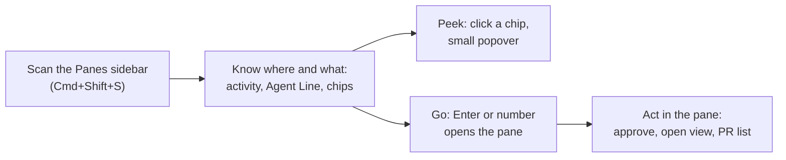
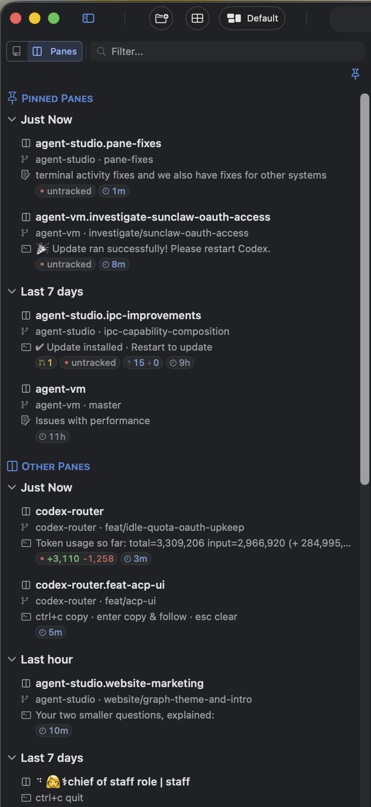
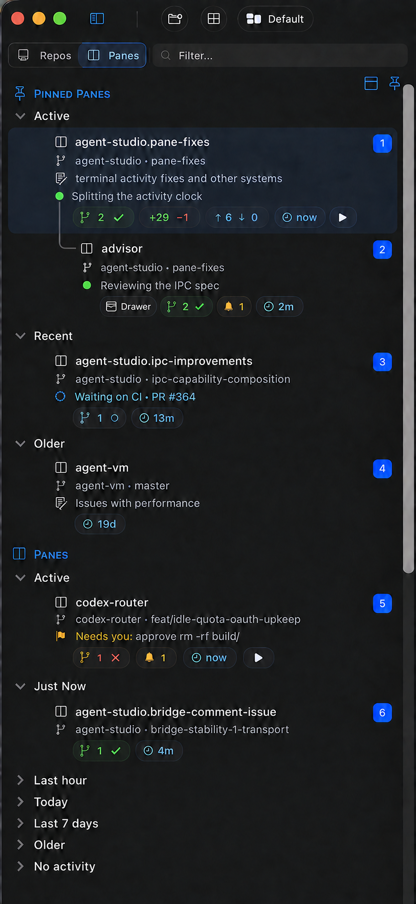

# Panes Stage 1 — Requirements

Why the Panes sidebar changes now, for whom, and within what limits. The observable contract lives in the [Specification](2026-09-25-panes-stage1-specification.md). The owner of Agent Studio decides; every row below comes from the owner in conversation on the stated date. The 2026-09-23 pane-activity drafts are historical context only.

## The job

A person runs many terminal and agent panes at once. They open the Panes sidebar to answer three questions without visiting each pane:

1. **Where did something happen recently?**
2. **What is going on there?** Which agent is working on what, which PR it belongs to, and whether something needs them.
3. **How do I get there?** Jump in with the keyboard, and act inside the pane.

The sidebar row is where the person **learns where to go**. The pane is where they **act**.

## What is wrong today

*Current app (owner capture, 2026-09-26).*

- **Three clocks disagree.** The group reads when a terminal's latest line changed, the clock chip reads when the pane was last clicked or created, and ▶ means focused. A pane you just clicked looks fresh although nothing happened. The earlier capture ([2026-09-25](assets/current-panes-sidebar-owner-capture.png)) showed a "2m" chip inside "Last 7 days".
- **Rows jump.** Chips appear and disappear, and row heights change as they do, so the list shifts under the eye.
- **Rows don't say what's going on.** The third line is either the person's note or whatever the terminal printed last, e.g. "ctrl+c copy · enter copy & follow · esc clear" — noise, not information. Nothing says what an agent is working on or which PRs relate to the pane.
- **Pinned panes copy the full time taxonomy** instead of a smaller set, and the unpinned section is named "Other Panes".
- **The old inbox popups were removed** because they were confusing and did not work well. The popup design starts from scratch.

## What it should look like

*Target illustration (details iterate later). Compare with the capture above: one activity clock, no terminal noise, and each row says what the agent is doing and how its PRs stand.*

## Authorized needs

| ID | Priority | Need and why it matters | Source |
| --- | --- | --- | --- |
| U1 | Must | A pane's activity means **something actually happened in that terminal**: agent hook activity (Claude, Cursor, Codex) and terminal output, best effort, using what already exists. | Owner, 2026-09-25 |
| U2 | Must | Activity is **not** what was clicked, focused or looked at last. | Owner, 2026-09-25 |
| U3 | Must | Group, order, clock chip and Active indicator agree, because they describe the same activity. | Owner, 2026-09-25 |
| U4 | Must | **Pinned Panes** use a smaller set of time groups: Active, Recent, Older. | Owner, 2026-09-23; reconfirmed 2026-09-26 |
| U5 | Must | **Panes** (the unpinned section) keep the detailed time and date groups, so panes are easy to find. | Owner, 2026-09-25; reconfirmed 2026-09-26 |
| U6 | Must | The two sections are titled **Pinned Panes** and **Panes**. | Owner, 2026-09-26 |
| U7 | Must | A row reads top to bottom: **pane name, worktree · branch, Note, Agent Line, chips**. The Note line appears only when the person wrote a note; the Agent Line appears only when an agent set one. Raw terminal output is never shown on the row. | Owner, 2026-09-26 |
| U8 | Must | Rows are stable: chips appearing or changing never make rows jump or change height. | Owner, 2026-09-26 |
| U9 | Must | Chips form a designed, useful set. Clicking a chip gives a small popover that helps the person decide where to go; for example, a PR chip shows the related PRs and their statuses. | Owner, 2026-09-26 |
| U10 | Must | Drawer panes are clearly identifiable; the drawer chip comes first in the chip row. | Owner, 2026-09-25 |
| U11 | Must | An agent can tell the person what it is working on through an **Agent Line** on its pane, separate from the person's own note. | Owner, 2026-09-26 |
| U12 | Must | An agent can set its pane's terminal title. | Owner, 2026-09-26 |
| U13 | Must | An agent can send notifications for its pane. They show on the Panes row and in the pane. The hooks Agent Studio already installs for Claude, Codex and Cursor use the same notification path. | Owner, 2026-09-26 |
| U14 | Must | An agent can link and unlink related worktrees and PRs to its pane, across several repositories. The person can always see every link and remove any except the pane's current working-directory worktree. An agent removes only what it added; adding twice has no second effect. | Owner, 2026-09-26 |
| U15 | Must | Switching is fast: Cmd+Shift+S and the existing keyboard navigation get the person onto the list and into the pane. Escape or a second Cmd+Shift+S returns them to typing. | Owner, 2026-09-25 and 2026-09-26 |
| U16 | Must | Agent Running and Needs You belong to the separate Sessions view, not to Panes. | Owner, 2026-09-25 |
| U17 | Must | Stage 1 does not change zmx. Agent writes go through Agent Studio's own IPC, not zmx IPC. | Owner, 2026-09-26 |
| U18 | Must | Popups for git and notifications use the same popover style as the pane arrangement popup, redesigned from scratch; the removed inbox components are not revived. Visual details iterate after the first working version. In the pane, agent popups are a button in the pane's bottom icon bar with a popover; approvals open automatically. All Panes UI, including these in-pane popovers, is built by the Panes workstream; the IPC workstream supplies data and methods. | Owner, 2026-09-23 and 2026-09-26 |
| U19 | Must | Every row (main and drawer) and the pane's bottom toolbar show **one git/PR summary button**, colored like today's PR button, covering all the pane's worktrees and PRs; clicking it shows each worktree and PR with its state and who added it. It is one shared implementation, the same one Bridge uses. | Owner, 2026-09-26 |
| U20 | Must | Panes group by activity only; the Repo and Tab grouping options are removed from Panes (multi-repo work makes Repo misleading, and Tab grouping confused pins). | Owner, 2026-09-26 |
| U21 | Must | A sidebar toggle with a shortcut shows or hides drawer panes under their owner pane, like showing or hiding sub-issues. A drawer's links live on its owner pane. The owner pane's notification button also surfaces its drawers' notifications and approvals. | Owner, 2026-09-26 |
| U22 | Must | What an agent puts in front of the person is modelled explicitly: an approval (blocks the agent; Allow/Deny, and Ask where the route supports it), a question (never blocks; answered any time; the answer reaches the agent through its pane's change feed), a request to open something (who asked and why, opened through Bridge), and an artifact (defined now so references are stable; publishing later). Each shows who asked and why. | Owner, 2026-09-26 |
| U23 | Must | Each agent can check what happened on its pane since it last looked: answers to its questions, links the person removed, notifications dismissed, approvals answered or expired. A removed link can be re-added as a normal add; the person tells the agent directly if a link should stay gone. | Owner, 2026-09-26 |

Names: **Agent Line** is the name people see; `AgentStatusLine` is the name in code (owner, 2026-09-26). The person's own note stays **Note**.

## Boundary

- **Changes:** the Panes sidebar (activity clock, section titles, time groups, row lines, chip set, chip popovers, keyboard entry and exit); agent-writable pane context (Agent Line, terminal title, notifications, related git links) and how it shows in Panes and in the pane.
- **Reused:** existing agent hooks and their qualification, terminal settled-line observation, git and PR facts the app already tracks, the person's pane note, sidebar keyboard navigation and number badges, native popovers.
- **Protected:** zmx, its protocol and daemon lifecycle; the Repos surface's behavior; Sessions state and its view.
- **Shared with the IPC workstream:** the IPC methods and permissions agents use to write pane context are designed by the IPC orchestrator (ipc-improvements) against the pane-context contract in this design set. All UI stays with Panes.
- **Non-goals:** persisting activity across app restart; detecting repeated identical output; telling a TUI redraw from real work; Running/Needs You/Done categories in Panes; new zmx metadata; Stage 2 host or remote work.

## Delivery order

- **Stage 1 = PR A + PR B/C.** PR A makes today's Panes right on existing data: activity clock, sections, activity-only grouping, pinned groups, row lines, stable heights, drawer chip and toggle, keyboard entry and exit. PR B (IPC workstream) adds pane context over IPC: title, Agent Line, notifications, links, approvals, questions, open requests, change feed, and the git/PR summary value. PR C shows it: Agent Line, notifications, the git/PR summary button and popover, the approval and question surfaces.
- **Stage 2 = restart resilience:** after a reboot, scrollback returns and each pane's command or agent resume is ready to run. Agents need not start themselves. The app may need to be open to capture scrollback at first; later a low-CPU daemon captures while it is closed.
- **Stage 3 (parked):** zmx fork, agentd and remote hosts.

## Open decisions

| Item | State |
| --- | --- |
| How agents or hooks trigger writes (e.g. when a hook updates the Agent Line) | Out of scope by owner decision; this design covers what the IPC can express. |
| Cursor approval timeout: fail open or closed | Deferred; recommendation is fail closed. |
| Detailed question forms (elicitation), pushing answers into a running agent, "always allow this session" | Later stages; the entities leave room for them. Simple nonblocking questions with free-text or choice answers, pulled by the agent, are Stage 1 (U22, U23). |
| Snooze (future Sessions view) | Anything time-sensitive (a live approval or question) cannot be snoozed. |
