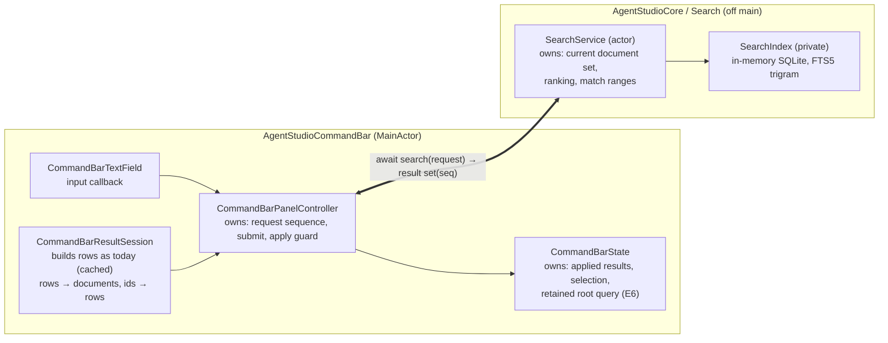
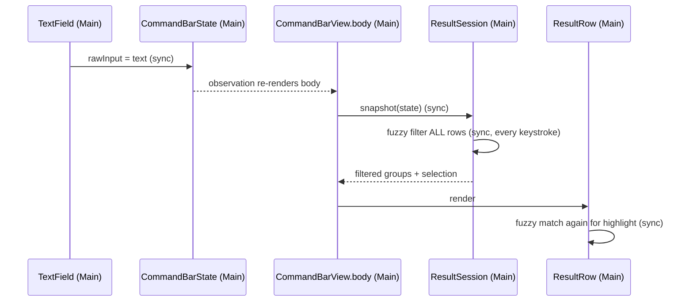
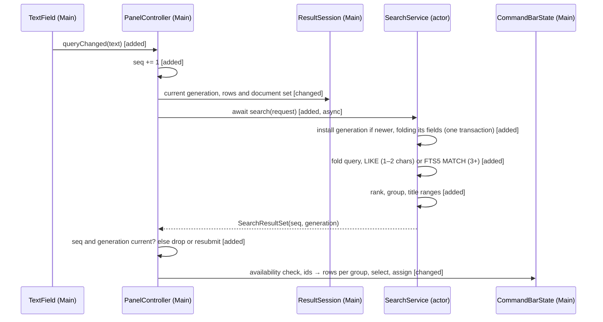
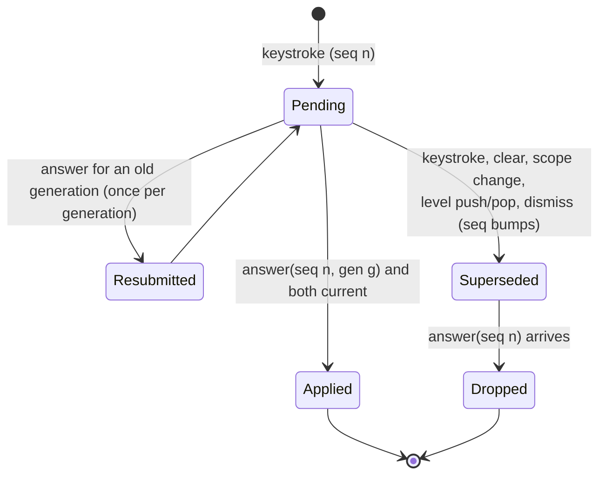

# Find: search service program design

Requirements: [requirements](2026-09-26-find-search-service-requirements.md) (U1–U13) · Specification: [specification](2026-09-26-find-search-service-specification.md) (E1–E7, R1–R15, C1–C3, F1–F5).

## How it fits together

**The change in ordinary words:**
- **Matching leaves the main thread and becomes SQLite.** Today the command bar ranks every row synchronously inside SwiftUI's `body` with a fuzzy matcher. After this change the command bar sends each query to a `SearchService` actor, and the actor matches it with SQLite FTS5 (trigram), a case-insensitive substring match. The command bar applies the answer only if it is still the newest request.
- **Every kind uses one path.** The command bar already builds every row (repos, worktrees, panes, tabs, commands, nested-menu rows) on the main thread and caches it per scope, open and topology change. Each rebuild of those rows gets a new **row generation**. The rows of a generation are turned once into an immutable `SearchDocumentSet` (id, group, searchable fields), and every request carries its generation's set; the service installs a generation once and skips it after. The service indexes, matches, ranks and **groups**. No new feed from persistence, no second copy of repo or branch facts.
- **Searchable fields are declared separately from display text.** A worktree row is searched by name, folder name and branch; a repo row by name, folder name and tags; never a full path, never display counts like "3 worktrees" (R2, R3).
- **What stays the same:**
  - how rows are built and cached;
  - the empty-query view (no search runs);
  - navigation levels, text-entry levels (never searched), ↵ behaviour;
  - grouping order;
  - Webview's new-tab history search (it keeps its own `FuzzySearch`, out of scope).
- **Why this is enough:** the rows already exist, and there are hundreds of them. The engine is the forward-facing part: a future large kind (sessions, history) plugs into the same service with its own file-backed index.
- **Cost:**
  - one new Core slice (`Core/Search/`);
  - results become asynchronous; the last applied rows stay visible for the ≤16 ms wait;
  - `agvmoa`-style gap matching is gone (owner, U10).
- **Who pays:** command-bar code: the synchronous filter path and its row-time highlighting are replaced.

## Components and ownership

| Component | Owns (single source) | Consumers | Changes when |
|---|---|---|---|
| **`SearchService`** (actor, `Core/Search/`) | the installed document generation, request answering: short or indexed path (R5), ranking (R5, R6), grouping (R7), title match ranges | the command bar now; IPC or remote consumers later (C2) | ranking or matching rules change |
| **`SearchIndex`** (private type in `SearchService.swift`) | the in-memory SQLite database: `search_document` and its FTS5 index; the only writer; rebuilt from the held document set | `SearchService` only | index layout changes |
| **Search values** (`Core/Search/`, `package`, `Sendable`) | `SearchDocument`, `SearchDocumentSet`, `SearchDocumentGeneration`, `SearchGroup`, `SearchRequest`, `SearchResultSet`, `SearchResultGroup`, `SearchMatch`, `SearchKind`, `SearchDegradedReason`, typed ids | service and command bar | the contract changes |
| **`CommandBarResultSession`** (existing, MainActor) | building and caching rows (unchanged); the **row generation** (advances on every rebuild, invalidation and nested-level replacement); the generation's `SearchDocumentSet`; mapping result ids back to that generation's rows | the controller and views | row shapes change |
| **`CommandBarPanelController`** (existing, MainActor) | the request sequence; submitting requests; the single apply entry with the currentness guard (R9) | the text field callback; views | bar lifecycle changes |
| **`CommandBarState`** (existing, MainActor) | applied result rows, selection, retained root query (R12) | views | UI state changes |
| **`CommandBarView`** (existing view) | firing the per-result publication acknowledgement with the applied `(sequence, generation)` (R10 measurement) | controller | view lifecycle changes |
| **`CommandBarResultRow`** (existing view) | drawing the title with the match range it's given; no matching | — | row visuals change |
| **Row builders** (`CommandBarDataSource*`, existing) | each row's **searchable fields**, declared separately from display (see *Searchable fields*) | result session | a kind's searchable fields change |
| **App composition** (`AppDelegate+WorkspaceBoot.swift:516`) | creating one `SearchService` and passing it to `CommandBarPanelController` | — | wiring changes |

**Forbidden edges:**
- CommandBar → `FuzzySearch` or any matcher: `CommandBarItemSearch.swift` is deleted (hard cutover), and the row stops calling `FuzzySearch`. An architecture test asserts CommandBar sources don't reference `FuzzySearch`.
- anything except `SearchService` → `SearchIndex` or SQL (a private type: unrepresentable);
- `SearchService` → atoms, `CommandBarItem` or any Feature type (Core can't import Features);
- the index → used as a source of truth (it holds copies of row text, rebuilt at will).

## What runs where

| Work | Runs on | Primitive |
|---|---|---|
| keystroke: text assignment, sequence bump, submit | MainActor | existing local `@Observable` state (`CommandBarState`); no atom |
| building rows | MainActor, unchanged, cached per identity | existing `CommandBarResultSession` cache; no new observer |
| rows → `SearchDocumentSet` | MainActor, once per row generation (not per keystroke) | plain value copy of the rows' declared searchable fields; no folding or other derivation |
| install a new generation (fold every field once), write the index, fold the query, match, rank, group, compute match ranges | `SearchService` actor | actor-private state and a private in-memory SQLite database; not an atom (no UI subscriber) |
| apply: guard, keyed availability check, map ids to the generation's rows per returned group, reconcile selection | MainActor | assign only, O(result rows); no grouping or sorting |

No new atom, bus event, observer or coordinator responsibility.

## Interfaces

**`SearchService` (actor), consumed by the command bar (C2)**

- `search(_ request: SearchRequest) async -> SearchResultSet`
  - **`SearchRequest`**: `sequence: SearchRequestSequence`, `text: String` (non-empty), `recentItemIds: [SearchItemId]`, `documentSet: SearchDocumentSet`. **Every request carries its generation's set.** It is an immutable value built once per generation, so passing it on every request costs a reference copy, not a rebuild.
  - **`SearchDocumentSet`**: `generation: SearchDocumentGeneration` (monotonic per controller), `groups: [SearchGroup]` (id and priority, in the command bar's group order), `documents: [SearchDocument]`. Item ids are unique within a set; the builder guarantees it, and the service keeps the first occurrence of a duplicate and records it in the trace.
  - **Install rule:**
    - if `documentSet.generation` equals the installed generation, nothing is written;
    - if it is newer, the service replaces the index contents with this set in one transaction (keyed delete and insert by `SearchItemId`);
    - if it is older, the request is answered `obsolete` without touching the index (its sequence is necessarily stale).
    - Cancelling a request can therefore never lose a set: the next request carries the same set (N-01).
  - **Case folding (one rule for both paths, on the actor only):** the set carries original text. When the service installs a new generation it folds every searchable field once (Foundation `folding(options: [.caseInsensitive, .widthInsensitive], locale: nil)`; diacritics stay distinct) and stores both the display and the folded copy. It folds each request's query the same way. Both paths match folded against folded, so `é` finds `École` at any query length (N-04).
  - **Path:**
    - 1–2 characters: `LIKE '%'||?||'%' ESCAPE '\'` over the folded columns, with `%`, `_` and `\` in the query escaped; the trigram index isn't used (R5);
    - 3+ characters: FTS5 `MATCH` over the folded columns, with the folded text quoted as one FTS5 string (inner `"` doubled), so `.`, `/`, `-` and `"` match literally (R6).
  - **Ranking:**
    - tiers: title starts with the query → a word in the title starts with it → the title contains it → only another searchable field contains it;
    - **short queries (1–2 characters):** recent items first in recents order, then the rest by tier (R5 overrides R6 here, N-05);
    - **indexed queries (3+):** by tier, then recents order within a tier (R6);
    - remaining ties are free.
  - **Grouping (R7, C3):** the service returns `groups: [SearchResultGroup]`, each `{ groupId, matches: [SearchMatch] }` in the set's group order, with empty groups omitted. The main thread only maps; it doesn't group or sort (N-06).
  - **Result:** `SearchResultSet { sequence, generation, groups, outcome }`. Here `SearchMatch = { itemId, titleMatch: Range<Int>? }`: character offsets into that generation's display title, located on the actor by a case-insensitive `range(of:)` of the query in the display title (highlight only; admission is SQLite's). `outcome` is one of `answered`, `obsolete`, `degraded(SearchDegradedReason)`, where `SearchDegradedReason` is `databaseUnavailable` or `unreadableRow`.
  - **Errors:** none surface to callers. A SQLite error recreates the database from the request's set and retries once. A second failure answers `degraded(.databaseUnavailable)` with no groups.
- The whole request (install, match, rank, group) runs synchronously inside one actor turn on the in-memory database, so requests never interleave inside the actor. This is CPU work on memory, not blocking I/O.

**`SearchDocument`**: `itemId: SearchItemId`, `kind: SearchKind`, `groupId`, `title: String`, `fields: [String]` (the row's declared extra searchable fields; see below). `SearchItemId` wraps the row's existing stable `id`; its constructor rejects empty. `SearchKind` is a Swift enum (`repo`, `worktree`, `pane`, `tab`, `command`, `other`), mapped from `CommandBarItemKind` in the command bar.

**`CommandBarResultSession`: the row generation (N-02)**
- The generation advances whenever the row snapshot changes: a rebuild for a new cache identity, the existing invalidation (`topology_observation`, including branch changes read through the keyed enrichment read), a level push or pop, and a nested level replaced in place (`CommandBarState.swift:317-320`).
- An invalidation marks the generation stale at once. The next request rebuilds lazily, as today, and gets the new generation.
- Each generation keeps its rows, and the document set built from them, together.

**`CommandBarPanelController`**
- `queryChanged(text:)`, called from the text field's input callback (`CommandBarTextField.swift:81-84`). It bumps the sequence. For empty text it applies the empty projection directly (R4). Otherwise it submits a request carrying the current generation's set.
- **Lifecycle bumps:** clearing the text, scope change, level push or pop, dismiss and open all bump the sequence, which invalidates any pending answer (R9).
- `apply(_ result:)` is the only way results reach `CommandBarState`. It applies only when `result.sequence` is current **and** `result.generation` is the current row generation. On a generation mismatch it resubmits the current text with the current generation instead of applying (once per generation, so it can't loop). It then checks repo and worktree availability for each matched row through the existing keyed check (`CommandBarDataSource+RepositoryAvailability.swift:12-17`), dropping unavailable ones (R8). Finally it maps ids to that generation's rows per returned group, reconciles selection and assigns. Title ranges always refer to the same generation's titles.

**Adding a kind (C3, R14):** a kind that is a command-bar row needs a `SearchKind` case plus its row builder, which declares its searchable fields; the service is unchanged. A future large kind that isn't a row (sessions, history at 100k+) adds a **file-backed** index to the service, fed by its own repository with a commit sequence number. That is the extension point, recorded here and not built now.

## Searchable fields (N-03)

Searchable fields are declared by each row builder, separately from what the row displays:

| Row | Searchable (title + fields) | Never searchable |
|---|---|---|
| repo | name, folder name (last path component), tags | worktree names, subtitle counts ("3 worktrees"), the word "repo", full paths |
| worktree | name, folder name, branch (when known) | full paths |
| pane, tab | title plus today's keywords, with any path-valued keyword reduced to its last component | full paths |
| command | title plus today's keywords | — |
| nested action rows (copy path, reveal, open, …) | title only | paths shown in subtitles or keywords |
| nested repo target rows | title, folder name | the full path shown as subtitle |

The display subtitle is never searched unless the builder lists it as a field. Display text and execution targets are unchanged.

## Search index storage

**Rules (owner, 2026-09-26/27):**
- no triggers;
- no SQL constraints except boolean CHECKs; there are none here;
- enums live in Swift: `kind` is plain text, parsed into `SearchKind` when read, and an unknown value fails closed (the row is dropped and the answer is marked degraded; it never defaults to some other kind);
- tables by write pattern, not per kind: one current-values table plus its FTS5 index; a new kind adds a `kind` value;
- typed columns, no JSON blobs;
- one writer;
- no migrations.

| Table | Write pattern | Columns | Keys and indexes |
|---|---|---|---|
| `search_document` | current values; installing a newer generation replaces the contents in one transaction | implicit `rowid`, `item_id`, `kind`, `group_id`, `title`, `folded_title`, `folded_fields` (newline-joined folded copies of `fields`) | a plain (non-unique) index on `item_id`; the writer keeps one row per id |
| `search_document_fts` | FTS5 external-content index over `search_document`, kept in step by the writer (FTS5 `delete` command with the old values, then insert), no triggers | `folded_title`, `folded_fields`; `tokenize='trigram'` | `content_rowid = rowid` |

**In memory, not a file.** The documents are rebuilt from rows for every generation, so a file would only add stale state after restart (review F-04) with nothing to gain. The database is a GRDB in-memory queue owned by `SearchIndex`, created when the service starts, and recreated after any error. It has no file and no migration.

Validated on this Mac's SQLite 3.51 on 2026-09-27: quoted trigram queries match `vm.oa`, `feature/o` and `OAUTH`; `title : "oauth"` restricts to one column; manual external-content delete works without triggers; `agvmoa` and `oauht` match nothing, as intended.

## Call paths: keystroke to results

**Current** (`CommandBarTextField.swift:81-84` → `CommandBarState` → `CommandBarView.body` → `CommandBarResultSession.snapshot` → `CommandBarItemSearch.filter`; the row also calls `FuzzySearch` at `CommandBarResultRow.swift:214`):

**Proposed:**

| Edge | Change |
|---|---|
| body → snapshot → fuzzy filter | removed |
| row → `FuzzySearch` | removed; the row draws `titleMatch` |
| text field → controller | added (the input callback also calls the controller) |
| controller → service | added, async, one call per request |
| rows → documents | added, once per row generation |
| empty-query projection | **intentionally unchanged** (R4) |
| row building and cache | **intentionally unchanged** |

## When a worktree or branch changes

The row cache already invalidates on topology observation (`CommandBarResultSession` `rootItemSnapshotInvalidationReason`: `topology_observation`). The prototype's worktree rows read branch through the keyed enrichment read, so a branch change invalidates the cache the same way. The invalidation advances the row generation at once. So an answer still pending for the old generation is resubmitted rather than applied, and the next request carries the rebuilt rows. Search freshness is therefore from the invalidation to the first answer on the new generation. It doesn't depend on the persistence debounce, and it doesn't include time the user spends not typing (see the measurement below).

## Request lifecycle

**Illegal:** applying an answer whose sequence or row generation isn't current. It is rejected at the single apply entry and checked by an automated test. An empty query never creates a request; it bumps the sequence and applies the empty projection, so a late answer can't overwrite it (review F-08).

**Retained root query (E6, R12):** `CommandBarState` records the text on dismiss when the scope is root, no level is open and there is no prefix. `show(defaultScope:)` restores it and asks the field to select all, which then submits a request. `show(prefix:)` and `switchPrefix` ignore it. It is never persisted.

## Failure, recovery, concurrency

| Situation | Detection | Containment and recovery | Owner |
|---|---|---|---|
| F1: SQLite error | error from the in-memory database | recreate it from the held document set, retry once; on a second failure answer `degraded` with no rows and a trace attribute; typing never blocks | `SearchService` |
| unknown `kind` text read back | parse failure at read | drop the row, mark the answer degraded; never default | `SearchService` |
| F2: overlapping or cancelled requests | sequence, generation | every request carries its generation's set, so a cancelled request never loses an install; an older generation answers `obsolete`; the controller applies only the current sequence and generation | controller + service |
| F3: an entity withdrawn while shown or pending | the keyed availability check at apply; the generation advances on topology invalidation | dropped at apply; a pending answer from the old generation is resubmitted; ↵ on a withdrawn entity follows today's activation validation | controller |
| F4: branch not known yet | the worktree row has no branch keyword | still found by name and folder; matched by branch after the enrichment read changes | row builder |
| F5: restart | nothing is persisted | the first open builds rows from the restored inventory and sends them with the first request | controller |
| an older generation arrives after a newer one | generation older than installed | answered `obsolete`, index untouched | `SearchService` |
| a duplicate item id in a set | install | first kept, trace records it | `SearchService` |

## Cross-cutting realization

| Obligation | Realization | Proof seam |
|---|---|---|
| R13 off main by construction | the only search API is the actor's `async search`; SQL is inside a private type; the command bar's matcher file is deleted and the row stops matching | compile-time (no call path) plus an architecture test that CommandBar sources don't reference `FuzzySearch` |
| R10 speed | MainActor: assign, bump, submit, and on apply O(result rows) with no grouping or sorting; the row rebuild and document capture run only per generation; SQLite work on the actor | **end-to-end:** one correlated trace from the input callback to a **per-result publication acknowledgement**. That is a new callback on the existing view-to-controller boundary, alongside today's open-only `onInitialResultsPublished` (`CommandBarView.swift:76`, `CommandBarPanelController.swift:291-293,325-342`). `CommandBarView` fires it with the applied `(sequence, generation)` when it renders a newly applied result. It observes SwiftUI publication of the result rows, not a compositor-presented frame. Stages: main submit (including a cache-miss row rebuild and document capture when one happens), queue wait before the actor starts, actor work (install, match, rank, group), wait for main, main apply, publication. Superseded, obsolete and degraded requests are counted separately. Measured end to end twice: on the owner's real set (marker-scoped debug run), and on a **10,000-row fixture** in `test:swift:benchmark`, which drives the real controller, real service and a hosted `CommandBarView` from input to the per-result acknowledgement. **Engine only:** the same 10,000 documents against the service alone, labelled as the engine share, a diagnostic and not the R10 figure |
| R11 freshness | the invalidation advances the generation; the next request carries the new set | trace attribute: time from the invalidation to the new generation's first answer being published, measured only for a request already pending or issued **after** the invalidation, minus the time no request existed (user idle time excluded). Proof: a test issues a controlled query after a topology or branch fact and checks it is answered from the new generation |
| Privacy | local only; in memory; holds row text the app already shows | — |
| Accessibility | row labels unchanged; the restored query is the field's value | manual VoiceOver spot check |

## How each obligation is realized and proved

| R | Entities | Owner | Interface or shape | Failure | Proof |
|---|---|---|---|---|---|
| R1 | E1 E3 E4 E5 E7 | row builder + `SearchService` | worktree row keywords (name, folder, branch) → documents; `search` | F4 | service test with real documents on a real in-memory database: name, folder, branch hits in root and `#` |
| R2 R3 | E1 E3 | row builders | declared searchable fields (see *Searchable fields*) | — | data-source-to-real-service tests: repo not found by "worktrees", "repo" or a worktree name; no row found by an ancestor path in root, `#`, quick-open or nested scopes; name, folder and branch positives |
| R4 | E4 E5 | controller | empty text applies the empty projection; no request | late answer dropped | existing `CommandBarResultSessionTests` unchanged, plus a clear-while-pending test |
| R5 | E4 E5 | `SearchService` | folded `LIKE` path; recency first | — | service test: `wt`, `vm` answer; a recent lower-tier item ranks above a non-recent title-prefix item; `é` finds `École`; `%`, `_`, `\` literal |
| R6 | E3 E4 | `SearchService` | folded, quoted FTS5 `MATCH`, tier ranking | — | service test: `vm.oa`, `feature/o`, `OAUTH`, `ÉCOLE`, `"` literal, `agvmoa` → none, tier order with recents inside a tier |
| R7 | E5 | `SearchService` | groups returned in the set's group order | — | real-service tests for root, prefixed and nested group order; apply has no grouping or sorting |
| R8 | E1 E5 | controller | keyed availability check at apply; generation guard | F3 | controller tests: withdraw before apply (root and nested); same-key branch change; rename to a shorter title (ranges stay valid); nested level replaced without push or pop |
| R9 | E4 E5 | controller + service | sequence and generation guard; lifecycle bumps; set carried on every request | F2 | controller tests with a controlled service fake: out-of-order answers, clear, scope switch, push/pop, dismiss/reopen; service test: the first request for generation B cancelled before install, a later B request still searches B; requests admitted in reverse order |
| R10 | E4 E5 | controller + service + view | trace stages above; per-result publication acknowledgement | — | measurement (owner's set, 10k UI fixture); causal tests: open once and type two queries → two distinct acknowledgements carrying their sequences; holding the publication stage lengthens the measured interval (no elapsed-time assertions) |
| R11 | E1 E3 | result session + controller | generation advances on invalidation | — | measurement (idle time excluded) plus a test: a controlled query after a topology or branch fact is answered from the new generation |
| R12 | E6 E4 E7 | `CommandBarState` | retained query | — | controller tests (esc, ↵, prefix, nested, restart) |
| R13 | E4 E5 | `SearchService` | private index, async only | — | compile-time + architecture test |
| R14 | E2 E3 | `SearchKind` + row builder | a new kind = enum case + rows | — | service test: a test-only kind's documents are found; existing kinds' results for the same queries are unchanged |
| R15 | E1 E3 | `SearchIndex` | in-memory FTS5 over row documents | F1 | service test: forced database error → recreated, answer correct; second failure → degraded |

**What's real and what's replaced in the proofs:**
- **Real in service tests:** the in-memory SQLite database and the ranking.
- **Replaced only in controller tests:** the service, by a fake that releases answers in a chosen order through explicit continuations (no sleeps).

The UI change the user sees is the Requirements visual (`assets/find-today-vs-after.png`); substring search gives the same `oauth` result.
