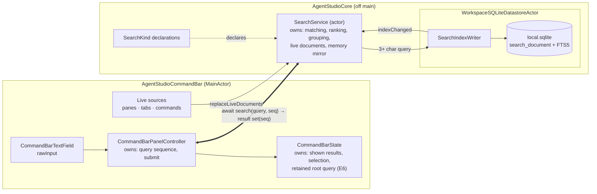
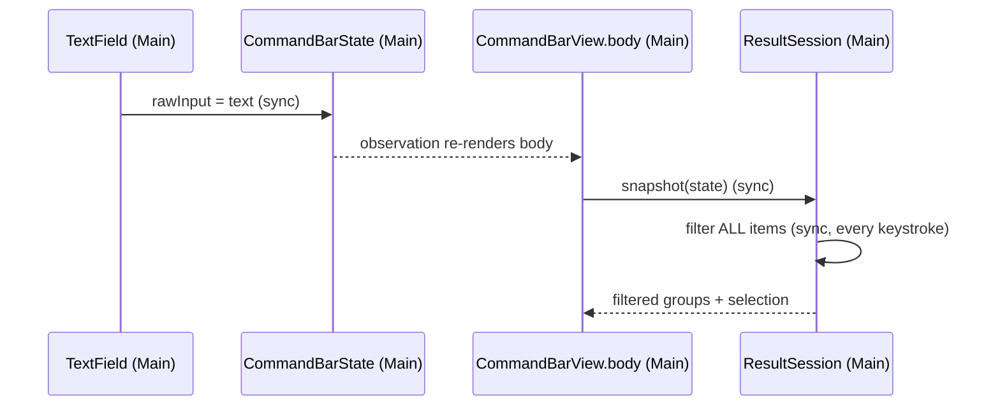
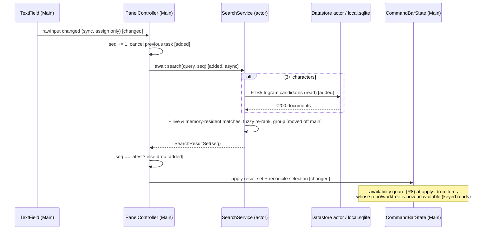
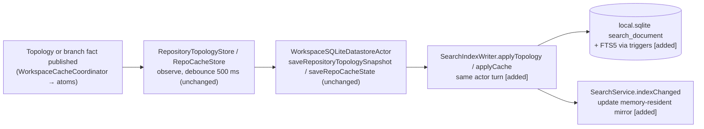
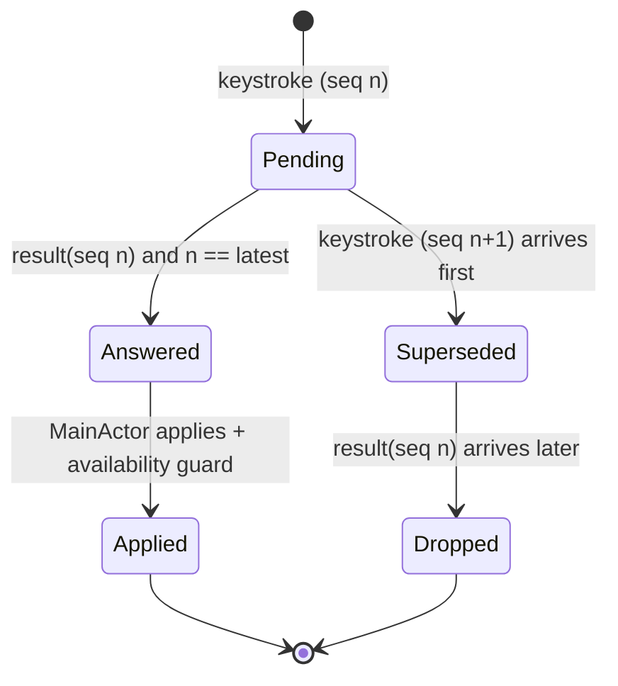

# Find: search service program design

Requirements: [requirements](2026-09-26-find-search-service-requirements.md) (U1–U13) · Specification: [specification](2026-09-26-find-search-service-specification.md) (E1–E7, R1–R15, C1–C3, F1–F5).

## How it fits together

**The change in ordinary words:**
- **Matching leaves the main thread.** Today the command bar ranks every item synchronously inside SwiftUI's `body`. After this change it sends the query to a `SearchService` actor and shows the answer when it arrives, and only if it is still the newest query.
- **Repos and worktrees become indexed documents.** They live in one SQLite table (with an FTS5 trigram index) that the existing persistence actor rewrites whenever it already saves topology or branch data. So the index is always a derived copy, never a new source of truth.
- **Panes, tabs and commands stay in memory.** They are live UI state, so the command bar hands them to the service as *live documents* whenever they change.
- **Every kind is declared the same way:** fields, group, and indexed or live. That is how new kinds plug in later.
- **What stays the same:**
  - the empty-query view;
  - navigation levels and ↵ behaviour;
  - the matcher's scoring (moved, not rewritten);
  - the existing persistence stores and debounce.
- **Why this is enough:** every fact already reaches the datastore actor and local.sqlite. The index rides on writes that happen anyway, so nothing new has to watch the filesystem, git or the atoms.
- **Cost:**
  - one new Core slice (`Core/Search/`);
  - one new local.sqlite migration;
  - the command bar's results become asynchronous (one frame of the previous results can remain until the answer lands, ≤16 ms by R10).
- **Who pays:** command-bar code (the synchronous snapshot path is replaced) and the datastore write path (the index update adds to each topology and cache save).

## Components and ownership

| Component | Owns (single source) | Consumers | Changes when |
|---|---|---|---|
| **`SearchService`** (actor, `Core/Search/`) | query answering: candidate retrieval, fuzzy re-rank, grouping (R6, R7), short-query rule (R5); the live-document set; the memory-resident mirror of small indexed kinds | CommandBar now; IPC and remote consumers later (C2) | matching or ranking policy changes |
| **`SearchKind`** declarations (`Core/Search/`) | per-kind fields (E3), result group, storage class (`indexed` or `live`), memory-resident flag, recency boost | `SearchService`, index writer, sources | a kind or field is added (R14) |
| **Fuzzy ranker** (private to `SearchService`) | today's `CommandBarSearch` scoring, moved; reachable only from inside the actor (R13) | `SearchService` only | scoring rules change |
| **`SearchIndexWriter`** (inside `WorkspaceSQLiteDatastoreActor`) | the `search_document` rows and their FTS5 shadow in local.sqlite: derived and rebuildable (R15) | datastore save paths; `SearchService` reads through `performApplicationLocalRead` | index shape changes |
| **Indexed-kind contributors** (repo, worktree) | mapping persisted topology and cache snapshots to documents: name, folder name (last path component only, R3), tags, branch, availability; no worktree names on repo documents (R2) | `SearchIndexWriter` | a kind's persisted fields change |
| **CommandBar live sources** | mapping the existing cached pane, tab and command items to documents | `SearchService` | command-bar item shapes change |
| **`CommandBarPanelController`** | query sequence numbers, submission, cancellation of the superseded task, applying only the current sequence's result (R9) | CommandBar views | bar lifecycle changes |
| **`CommandBarState`** | the displayed result set, selection, retained root query (E6, R12) | CommandBar views | UI state changes |

**Forbidden edges:**
- CommandBar → the fuzzy ranker (**unrepresentable**: a private type in another module);
- MainActor → `SearchIndexWriter` (the datastore actor only);
- `SearchService` → atoms (it receives documents; it never reads MainActor state);
- index → any second copy of repo, worktree or branch facts outside local.sqlite's derived table.

## Interfaces

**`SearchService` (actor), consumed by the command bar (C2)**
- `search(SearchQuery) async -> SearchResultSet`
  - **Query:** scope (E7), text, session id, sequence.
  - **Result:** the query's sequence plus grouped documents (E5). The result is always tagged with the sequence it answers, so answers may arrive out of order and the caller drops stale ones.
  - **Rules:**
    - an empty text is never sent (the empty view stays on today's MainActor projection, R4);
    - 1–2 characters rank live documents plus the memory-resident mirror, recents first, without touching the index (R5);
    - 3+ characters take FTS5 trigram candidates (≤ 200) plus live and memory-resident matches, then the fuzzy re-rank, then grouping (R1, R6, R7).
  - **Errors:** none surface to callers. If the index read fails, it degrades to memory-only results and records an `index_unavailable` trace attribute (F1).
- `replaceLiveDocuments(kind:, documents:, revision:)`: last-writer-wins by revision per kind; older revisions are ignored.
- `indexChanged(kind:, upserts:, removals:)`: called by the index writer after a committed write; updates the memory-resident mirror (R11).

**`SearchIndexWriter`, inside the datastore actor**
- `applyTopology(snapshot)` and `applyCache(snapshot)` run in the same actor turn as the existing `saveRepositoryTopologySnapshot` and `saveRepoCacheState`. Each upserts or removes `search_document` rows, and FTS5 stays in sync through same-database triggers.
- `rebuild(core:, local:)` runs when the index is missing, its version is stale, or it fails integrity. It rebuilds from the persisted rows (F1, F5).

**`SearchKind` declaration (C3):** `id`, `group` (Repos · Worktrees · Panes · Tabs · Commands), `fields: [SearchFieldName]`, `storage: .indexed(contributor) | .live`, `memoryResident: Bool`, `recencyBoost`. Adding a kind means one declaration plus its contributor or live source (R14).

## Call paths: keystroke to results

**Current** (source: `Views/CommandBarTextField.swift:74-84` → `CommandBarState.swift:34-47` → `Views/CommandBarView.swift:19-60` → `CommandBarResultSession.swift:56-112` → `CommandBarItemSearch.swift:44-87`):

**Proposed:**

**Edge changes:**

| Edge | Change |
|---|---|
| body → `snapshot` → `filter` | removed from the keystroke path |
| controller → service | added, async |
| service → datastore read | added, reusing the `SessionsRepository` read pattern through `performApplicationLocalRead` |
| apply with sequence guard | added |
| the empty-query projection | **intentionally unchanged**, on MainActor (R4) |
| selection reconcile | **intentionally unchanged** in rule; now runs on apply |

## Call paths: a worktree or branch changes

The worst-case freshness is the 500 ms debounce plus one write, which is under R11's 1 s. Scoped topology already calls `flushAsync` on revision changes (`WorkspaceCacheCoordinator+ScopedTopology.swift:84-96`), which shortens the add and remove path.

## Query lifecycle

**Illegal:** applying a result whose sequence isn't the latest. This is rejected at the single apply entry, the controller's guard, and enforced by an automated test.

**Retained root query (E6):** `CommandBarState` records the text on dismiss when the scope is root, no level is pushed and there is no prefix. `show(defaultScope:)` restores it and asks the field to select all. `show(prefix:)` and `switchPrefix` ignore it. It is never persisted (R12).

## Failure, recovery, concurrency

| Situation | Detection | Containment and recovery | Owner |
|---|---|---|---|
| F1: index missing, stale version or corrupt | on the migration or version check at datastore open; a read error during a query | the query answers from memory-resident and live documents; the datastore schedules `rebuild` from core + local rows; a trace attribute records the degraded answer | `SearchIndexWriter` (rebuild), `SearchService` (degrade) |
| Index write fails inside a save | error from the write | the existing save completes on its own (the index write runs after it and never blocks persistence); the index is marked stale and rebuilt on the next open or save | `SearchIndexWriter` |
| F2: overlapping queries | sequence numbers | the actor answers each; the controller drops stale ones; the previous task is cancelled (cooperative, a best-effort saving) | controller |
| F3: an item withdrawn while shown | availability guard on apply; the next index write removes the row | a stale row is dropped at apply; ↵ on a withdrawn entity follows today's handling | controller + contributors |
| F5: restart | the index persists in local.sqlite | the first query is answered from the index before any scan; the memory-resident mirror loads from the index at service start | `SearchService` |
| Reentrancy | actor awaits the datastore read | an interleaved newer query is harmless because results are tagged; the live and mirror sets are replaced atomically inside the actor | `SearchService` |
| Writer vs reader | WAL (`SQLiteDatabaseFactory`) | readers don't block the writer; the FTS query sees the last committed write | SQLite |

## Cross-cutting realization

| Obligation | Realization | Proof seam |
|---|---|---|
| R13 off main by construction | `SearchService` is an actor; the fuzzy ranker is a `private` type in `Core/Search/` (a different module from CommandBar); the command bar's only path is `await search` | static: the CommandBar module cannot reference the ranker (compile error); `Infrastructure/Search/CommandBarSearch.swift` is deleted in the same change (hard cutover, no second matcher) |
| R10 budgets | MainActor work = assign + submit + apply(O(results)); ranking off main; candidates capped at 200 | new spans `performance.search.query` (duration, kind counts, index hit or degraded) and `performance.commandbar.apply` (MainActor duration), read by a marker-scoped debug run plus a 10k-document synthetic benchmark in the existing `test:swift:benchmark` lane |
| R11 freshness | index writes ride the existing saves (≤ 500 ms + write) | span `performance.search.index_write` with its lag since the fact was published |
| Privacy | local-only; documents hold names, folder names, tags and branches already stored | not applicable beyond this |
| Accessibility | result rows keep today's labels; the restored query is the field value | manual VoiceOver spot check |

## How each requirement works and how we verify it

| Obligation | Realized by | Proof |
|---|---|---|
| R1 R2 R3 | worktree and repo contributors + FTS5 + ranker | service tests with real documents over an in-memory `DatabaseQueue` (as `WorkspaceCoreRepositoryTestSupport` does): name, folder, branch hits; no repo hit via worktree names; no full-path hit |
| R4 | unchanged MainActor empty projection | the existing `CommandBarResultSessionTests`, unchanged |
| R5 R6 R7 | `SearchService` short-query rule, ranker, grouping | service tests (`agvmoa`, 1–2 characters without index access, group order) |
| R8 | contributor availability + apply guard | a controller test where an item turns unavailable between query and apply |
| R9 | sequence guard | a controller test with out-of-order answers from a controlled service fake |
| R10 R11 | spans + benchmark | measurement (marker-scoped debug run, synthetic 10k) |
| R12 | `CommandBarState` retained query | controller tests (esc, ↵, prefix, nested, restart) |
| R13 | module and private type | compile-time (no call path exists) |
| R14 | `SearchKind` declaration | test: a test-only live kind appears, and existing kinds' results are unchanged |
| R15, F1, F5 | index writer + rebuild | integration test: datastore save → index rows; corrupt or missing index → degraded answers → rebuild; a reopened DB answers before any topology event |

What is real and what is replaced in the proofs:
- **Real in service and integration tests:** SQLite/GRDB (in-memory or temp file) and the ranker.
- **Replaced only in controller tests:** the service, faked to control answer order.

The UI change the user sees is the Requirements visual (`assets/find-today-vs-after.png`); nothing else in the UI changes.
