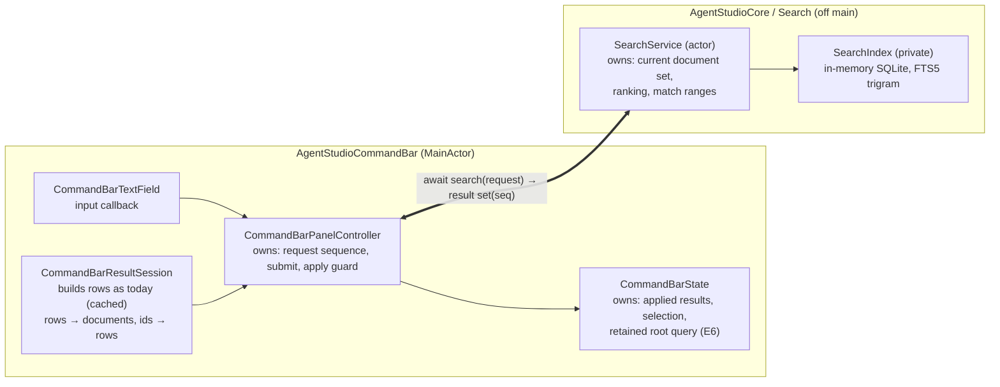
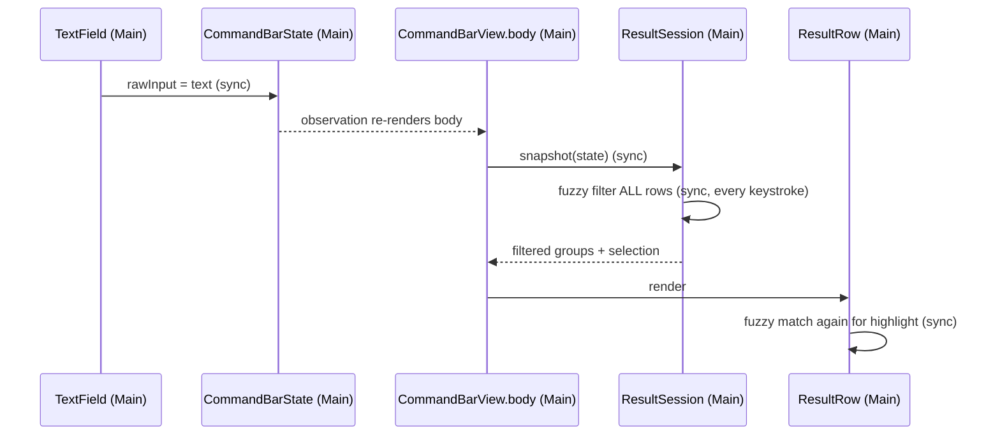
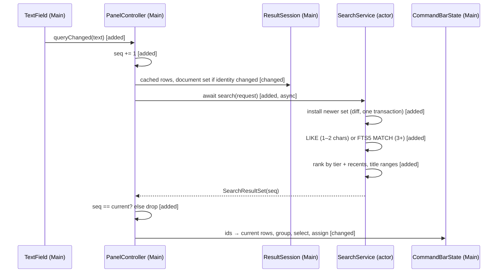
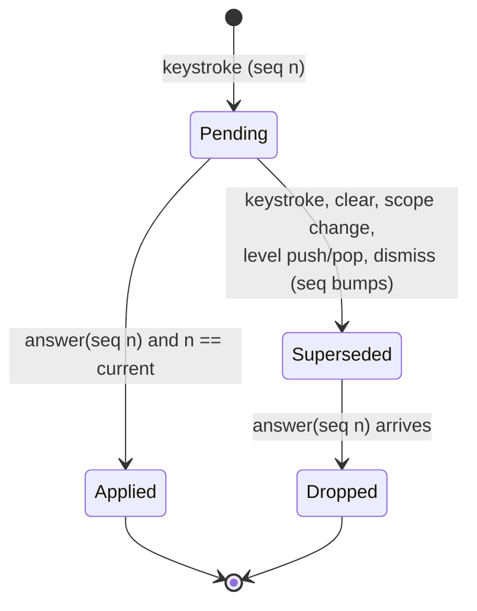

# Find: search service program design

Requirements: [requirements](2026-09-26-find-search-service-requirements.md) (U1–U13) · Specification: [specification](2026-09-26-find-search-service-specification.md) (E1–E7, R1–R15, C1–C3, F1–F5).

## How it fits together

**The change in ordinary words:**
- **Matching leaves the main thread and becomes SQLite.** Today the command bar ranks every row synchronously inside SwiftUI's `body` with a fuzzy matcher. After this change the command bar sends each query to a `SearchService` actor, and the actor matches it with SQLite FTS5 (trigram), a case-insensitive substring match. The command bar applies the answer only if it is still the newest request.
- **Every kind uses one path.** The command bar already builds every row (repos, worktrees, panes, tabs, commands, nested-menu rows) on the main thread and caches it per scope, open and topology change. Whenever that cached set changes, it turns the rows into plain `SearchDocument` values (id, kind, title, subtitle, keywords) and sends them with the next request. The service indexes them. No new feed from persistence, no second copy of repo or branch facts.
- **Worktrees are found by name, folder and branch** because their rows carry those as keywords (S1 of the prototype). Repo rows stop carrying worktree names (R2).
- **What stays the same:**
  - how rows are built and cached;
  - the empty-query view (no search runs);
  - navigation levels, text-entry levels (never searched), ↵ behaviour;
  - grouping order;
  - Webview's new-tab history search (it keeps its own `FuzzySearch`, out of scope).
- **Why this is enough:** the rows already exist, and there are hundreds of them. The engine is the forward-facing part: a future large kind (sessions, history) plugs into the same service with its own file-backed index.
- **Cost:**
  - one new Core slice (`Core/Search/`);
  - results become asynchronous; the last applied rows stay visible for the ≤16 ms wait;
  - `agvmoa`-style gap matching is gone (owner, U10).
- **Who pays:** command-bar code: the synchronous filter path and its row-time highlighting are replaced.

## Components and ownership

| Component | Owns (single source) | Consumers | Changes when |
|---|---|---|---|
| **`SearchService`** (actor, `Core/Search/`) | the current document set (values), request answering: short or indexed path (R5), ranking (R6), title match ranges | the command bar now; IPC or remote consumers later (C2) | ranking or matching rules change |
| **`SearchIndex`** (private type in `SearchService.swift`) | the in-memory SQLite database: `search_document` and its FTS5 index; the only writer; rebuilt from the held document set | `SearchService` only | index layout changes |
| **Search values** (`Core/Search/`, `package`, `Sendable`) | `SearchDocument`, `SearchDocumentSet`, `SearchRequest`, `SearchResultSet`, `SearchMatch`, `SearchKind`, typed ids | service and command bar | the contract changes |
| **`CommandBarResultSession`** (existing, MainActor) | building and caching rows (unchanged); mapping the cached rows to a `SearchDocumentSet` when the cache identity changes; mapping result ids back to rows | the controller and views | row shapes change |
| **`CommandBarPanelController`** (existing, MainActor) | the request sequence; submitting requests; the single apply entry with the currentness guard (R9) | the text field callback; views | bar lifecycle changes |
| **`CommandBarState`** (existing, MainActor) | applied result rows, selection, retained root query (R12) | views | UI state changes |
| **`CommandBarResultRow`** (existing view) | drawing the title with the match range it's given; no matching | — | row visuals change |
| **App composition** (`AppDelegate+WorkspaceBoot.swift:516`) | creating one `SearchService` and passing it to `CommandBarPanelController` | — | wiring changes |

**Forbidden edges:**
- CommandBar → `FuzzySearch` or any matcher: `CommandBarItemSearch.swift` is deleted (hard cutover), and the row stops calling `FuzzySearch`. An architecture test asserts CommandBar sources don't reference `FuzzySearch`.
- anything except `SearchService` → `SearchIndex` or SQL (a private type: unrepresentable);
- `SearchService` → atoms, `CommandBarItem` or any Feature type (Core can't import Features);
- the index → used as a source of truth (it holds copies of row text, rebuilt at will).

## What runs where

| Work | Runs on | Primitive |
|---|---|---|
| keystroke: text assignment, sequence bump, submit | MainActor | existing local `@Observable` state (`CommandBarState`); no atom |
| building rows | MainActor, unchanged, cached per identity | existing `CommandBarResultSession` cache; no new observer |
| rows → `SearchDocumentSet` | MainActor, only when the row cache identity changes (not per keystroke) | plain value copy of fields the rows already hold |
| diff the set, write the index, match, rank, compute match ranges | `SearchService` actor | actor-private state and a private in-memory SQLite database; not an atom (no UI subscriber) |
| apply: guard, map ids to rows, group, reconcile selection | MainActor | assign only, O(result rows) |

No new atom, bus event, observer or coordinator responsibility.

## Interfaces

**`SearchService` (actor), consumed by the command bar (C2)**

- `search(_ request: SearchRequest) async -> SearchResultSet`
  - **`SearchRequest`**: `sequence: SearchRequestSequence`, `text: String` (non-empty), `recentItemIds: [SearchItemId]`, `documentSet: SearchDocumentSet?`. The set is included only when the command bar's row cache identity changed since its last request.
  - **Document set rule:** a set is installed only if its `setId` is newer than the held one (monotonic per controller). Installing diffs by `SearchItemId` against the held set and writes the index in one transaction. A request answers against the newest installed set.
  - **Path:**
    - 1–2 characters: a `LIKE` scan (escaped, ASCII case folding) over title, subtitle and keywords of the current set, not using the trigram index (R5);
    - 3+ characters: FTS5 `MATCH` with the text quoted as one FTS5 string (inner `"` doubled), so `.`, `/`, `-` and `"` match literally (R6).
  - **Ranking (R6):** ranked by tier: title starts with the query → a word in the title starts with it → the title contains it → only the subtitle or keywords contain it. Within a tier, recent items come first in recents order. Remaining ties are free. The service does not group; the command bar groups the ranked rows with its existing stable grouping (R7).
  - **Result:** `SearchResultSet { sequence, setId, matches: [SearchMatch], outcome }`, where `SearchMatch = { itemId, titleMatch: Range<Int>? }` (character offsets into the title, for highlighting) and `outcome ∈ { answered, degraded(reason) }`.
  - **Errors:** none surface to callers. A SQLite error recreates the database from the held set and retries once. A second failure answers `degraded` with no matches and a trace attribute (F1).
- The whole request (install, match, rank) runs synchronously inside one actor turn on the in-memory database. So no two requests interleave inside the actor. This is CPU work on memory, not blocking I/O.

**`SearchDocument`**: `itemId: SearchItemId`, `kind: SearchKind`, `title: String`, `subtitle: String?`, `keywords: [String]`. `SearchItemId` wraps the row's existing stable `id`; its constructor rejects empty. `SearchKind` is a Swift enum (`repo`, `worktree`, `pane`, `tab`, `command`, `other`), mapped from `CommandBarItemKind` in the command bar.

**`CommandBarPanelController`**
- `queryChanged(text:)`, called from the text field's input callback (`CommandBarTextField.swift:81-84`). It bumps the sequence. For empty text it applies the empty projection directly (R4). Otherwise it submits a request, with the document set when the row cache identity changed.
- **Lifecycle bumps:** clearing the text, scope change, level push or pop, dismiss and open all bump the sequence, which invalidates any pending answer (R9).
- `apply(_ result:)` is the only way results reach `CommandBarState`. It applies only when `result.sequence` equals the current sequence. It maps ids to the current cached rows and drops ids with no current row (R8), then groups, reconciles selection and assigns.

**Adding a kind (C3, R14):** a kind that is a command-bar row needs a `SearchKind` case plus its row builder; the service is unchanged. A future large kind that isn't a row (sessions, history at 100k+) adds a **file-backed** index to the service, fed by its own repository with a commit sequence number. That is the extension point, recorded here and not built now.

## Search index storage

**Rules (owner, 2026-09-26/27):**
- no triggers;
- no SQL constraints except boolean CHECKs; there are none here;
- enums live in Swift: `kind` is plain text, parsed into `SearchKind` when read, and an unknown value fails closed (the row is dropped and the answer is marked degraded; it never defaults to some other kind);
- tables by write pattern, not per kind: one current-values table plus its FTS5 index; a new kind adds a `kind` value;
- typed columns, no JSON blobs;
- one writer;
- no migrations.

| Table | Write pattern | Columns | Keys and indexes |
|---|---|---|---|
| `search_document` | current values; installing a document set upserts changed ids and deletes missing ones in one transaction | implicit `rowid`, `item_id`, `kind`, `title`, `subtitle`, `keywords` (newline-joined) | a plain (non-unique) index on `item_id`; the writer keeps one row per id |
| `search_document_fts` | FTS5 external-content index over `search_document`, kept in step by the writer (FTS5 `delete` command with the old values, then insert), no triggers | `title`, `subtitle`, `keywords`; `tokenize='trigram'` | `content_rowid = rowid` |

**In memory, not a file.** The documents are rebuilt from rows at every bar open, so a file would only add stale state after restart (review F-04) with nothing to gain. The database is a GRDB in-memory queue owned by `SearchIndex`, created when the service starts, and recreated after any error. It has no file and no migration.

Validated on this Mac's SQLite 3.51 on 2026-09-27: quoted trigram queries match `vm.oa`, `feature/o` and `OAUTH`; `title : "oauth"` restricts to one column; manual external-content delete works without triggers; `agvmoa` and `oauht` match nothing, as intended.

## Call paths: keystroke to results

**Current** (`CommandBarTextField.swift:81-84` → `CommandBarState` → `CommandBarView.body` → `CommandBarResultSession.snapshot` → `CommandBarItemSearch.filter`; the row also calls `FuzzySearch` at `CommandBarResultRow.swift:214`):

**Proposed:**

| Edge | Change |
|---|---|
| body → snapshot → fuzzy filter | removed |
| row → `FuzzySearch` | removed; the row draws `titleMatch` |
| text field → controller | added (the input callback also calls the controller) |
| controller → service | added, async, one call per request |
| rows → documents | added, only on row cache identity change |
| empty-query projection | **intentionally unchanged** (R4) |
| row building and cache | **intentionally unchanged** |

## When a worktree or branch changes

The row cache already invalidates on topology observation (`CommandBarResultSession` `rootItemSnapshotInvalidationReason`: `topology_observation`). The prototype's worktree rows read branch through the keyed enrichment read, so a branch change invalidates the cache the same way. The next request carries the new document set. With the bar open, freshness is the next request after invalidation, far under R11's 1 s, and it doesn't depend on the persistence debounce (review F-01). With the bar closed, the set is rebuilt on open.

## Request lifecycle

**Illegal:** applying an answer whose sequence isn't current. It is rejected at the single apply entry and checked by an automated test. An empty query never creates a request; it bumps the sequence and applies the empty projection, so a late answer can't overwrite it (review F-08).

**Retained root query (E6, R12):** `CommandBarState` records the text on dismiss when the scope is root, no level is open and there is no prefix. `show(defaultScope:)` restores it and asks the field to select all, which then submits a request. `show(prefix:)` and `switchPrefix` ignore it. It is never persisted.

## Failure, recovery, concurrency

| Situation | Detection | Containment and recovery | Owner |
|---|---|---|---|
| F1: SQLite error | error from the in-memory database | recreate it from the held document set, retry once; on a second failure answer `degraded` with no rows and a trace attribute; typing never blocks | `SearchService` |
| unknown `kind` text read back | parse failure at read | drop the row, mark the answer degraded; never default | `SearchService` |
| F2: overlapping requests | sequence | the actor answers in order; the controller applies only the current sequence; a cancelled request returns early at actor entry | controller |
| F3: an entity withdrawn while shown | ids with no current row at apply; the row cache invalidates on topology | dropped at apply; ↵ on a withdrawn entity follows today's handling | controller |
| F4: branch not known yet | the worktree row has no branch keyword | still found by name and folder; matched by branch after the enrichment read changes | row builder |
| F5: restart | nothing is persisted | the first open builds rows from the restored inventory and sends them with the first request | controller |
| an older document set arrives after a newer one | `setId` not newer | ignored | `SearchService` |

## Cross-cutting realization

| Obligation | Realization | Proof seam |
|---|---|---|
| R13 off main by construction | the only search API is the actor's `async search`; SQL is inside a private type; the command bar's matcher file is deleted and the row stops matching | compile-time (no call path) plus an architecture test that CommandBar sources don't reference `FuzzySearch` |
| R10 speed | MainActor: assign, bump, submit, and on apply O(result rows); the document set is copied only on cache change; SQLite work on the actor | one correlated trace from the input callback to apply, with stages: main submit, queue wait before the actor starts, actor work (install, match, rank), wait for main, main apply. Superseded and degraded requests are counted separately. Measured on the owner's real set (marker-scoped debug run) and on 10,000 synthetic documents in `test:swift:benchmark` |
| R11 freshness | the row cache invalidates → the next request carries the new set | trace attribute on the first request after an invalidation: time from the invalidation to its answer being applied |
| Privacy | local only; in memory; holds row text the app already shows | — |
| Accessibility | row labels unchanged; the restored query is the field's value | manual VoiceOver spot check |

## How each obligation is realized and proved

| R | Entities | Owner | Interface or shape | Failure | Proof |
|---|---|---|---|---|---|
| R1 | E1 E3 E4 E5 E7 | row builder + `SearchService` | worktree row keywords (name, folder, branch) → documents; `search` | F4 | service test with real documents on a real in-memory database: name, folder, branch hits in root and `#` |
| R2 | E1 E3 | row builder | repo row keywords exclude worktree names | — | data-source test |
| R3 | E3 | row builder | keywords carry the last path component only | — | data-source test |
| R4 | E4 E5 | controller | empty text applies the empty projection; no request | late answer dropped | existing `CommandBarResultSessionTests` unchanged, plus a clear-while-pending test |
| R5 | E4 E5 | `SearchService` | `LIKE` path for 1–2 characters | — | service test: `wt`, `vm` answer; recents first |
| R6 | E3 E4 | `SearchService` | quoted FTS5 `MATCH`, tier ranking | — | service test: `vm.oa`, `feature/o`, case, `agvmoa` → none, tier order |
| R7 | E5 | command bar grouping (existing) | stable group of ranked rows | — | controller test: group order |
| R8 | E1 E5 | controller | ids without a current row dropped at apply | F3 | controller test: withdraw between request and answer |
| R9 | E4 E5 | controller | sequence guard; lifecycle bumps | F2 | controller test with a controlled service fake: out-of-order answers, clear, scope switch, push/pop, dismiss/reopen |
| R10 | E4 E5 | controller + service | trace stages above | — | measurement |
| R11 | E1 E3 | result session + controller | set on cache identity change | — | measurement plus an injected-clock test (no wall clock): invalidation → next request carries the new set |
| R12 | E6 E4 E7 | `CommandBarState` | retained query | — | controller tests (esc, ↵, prefix, nested, restart) |
| R13 | E4 E5 | `SearchService` | private index, async only | — | compile-time + architecture test |
| R14 | E2 E3 | `SearchKind` + row builder | a new kind = enum case + rows | — | service test: a test-only kind's documents are found; existing kinds' results for the same queries are unchanged |
| R15 | E1 E3 | `SearchIndex` | in-memory FTS5 over row documents | F1 | service test: forced database error → recreated, answer correct; second failure → degraded |

**What's real and what's replaced in the proofs:**
- **Real in service tests:** the in-memory SQLite database and the ranking.
- **Replaced only in controller tests:** the service, by a fake that releases answers in a chosen order through explicit continuations (no sleeps).

The UI change the user sees is the Requirements visual (`assets/find-today-vs-after.png`); substring search gives the same `oauth` result.
