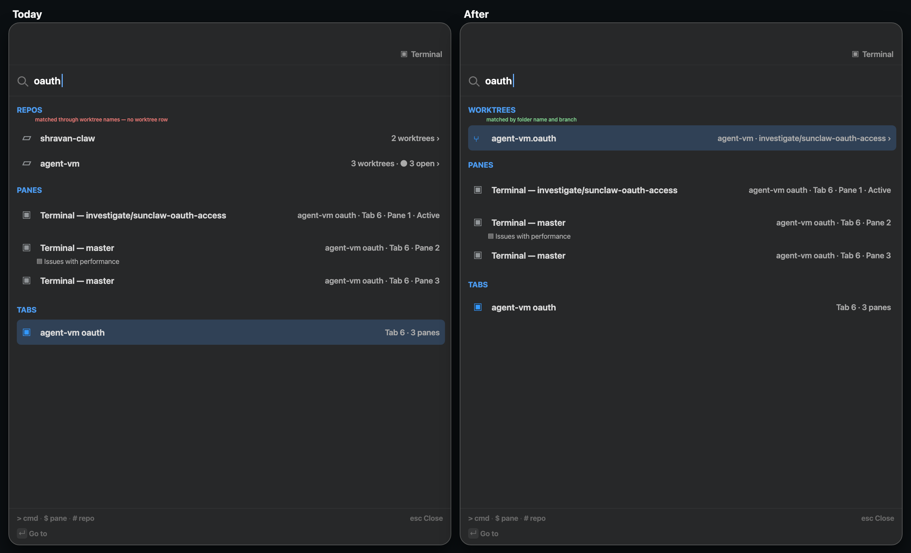

# Find: search service requirements

Specification: [2026-09-26-find-search-service-specification.md](2026-09-26-find-search-service-specification.md)

## Who needs this and why

**Affected people**

- **Agent Studio user (developer, owner):** runs many repos and worktrees, often with agents working in parallel, and jumps between them from the command bar.
- **Agents driving the app (future consumer):** they will query what exists through the app's programmable surface.
- **Future clients (a phone, remote hosts):** they may ask a host to search instead of holding every fact themselves.

**Today's pain** (observed 2026-09-26; code evidence in `tmp/research-workflows/2026-09-26-fast-worktrees/lane-1-search-findings.md`):

- Typing a worktree's name (for example `oauth`) finds the **repo** and the **tab**, not the **worktree**. Worktrees are only individual results when the query is empty, and then only the 5 most recent.
- A branch name finds panes and tabs, but never the worktree that is on that branch.
- All matching runs synchronously on the main thread for every keystroke. That is fine at today's size, but it grows with every item, and more kinds are coming.

## Requirement rows

Authority: every row is `authorized`, decided or confirmed by the owner in the 2026-09-26 planning conversation.

| ID | Need or outcome | Why it matters | Authority | Priority |
|---|---|---|---|---|
| U1 | Find repos and worktrees fast from the command bar | reaching a worktree is the daily loop with many agents | authorized ("we need to find repos and worktrees fast") | P0 |
| U2 | A worktree is found by its own name or folder name, and a repo by its name, folder name or tags. A repo is **not** found through its worktrees' names | one step to the target, less noise | authorized (owner chose "worktree row only") | P0 |
| U3 | A worktree is found by the **branch** it is on | agents name work by branch | authorized (owner confirmed "match branch") | P0 |
| U4 | Paths match by **folder name only**, never by the full path | avoids `dev` matching every repo | authorized (owner chose "folder name only") | P1 |
| U5 | 1–2 character queries still answer, by substring over the current items with recent items first; 3+ characters use the index | the trigram index needs 3+ characters | authorized (owner chose "recents + in-memory"; restated 2026-09-27 for substring matching) | P1 |
| U6 | The last root query is kept and shown **selected** when the bar reopens (after esc and after ↵; prefix opens win; memory only) | reopen and continue, or overwrite by typing | authorized ("yes this sounds good") | P1 |
| U7 | Search never slows typing or the UI: **all search work runs off the main thread, enforced by the service itself**, not by caller discipline | performance directive; owner: "it should automatically be off main actor by default since it's a service, encoded" | authorized | P0 |
| U8 | One **reusable search service** that other command-bar entity kinds (repos, worktrees, panes, tabs, commands) and future kinds (sessions, history, notifications) plug into **without rewriting** matching, ranking or grouping | avoid a one-off; grow search as the app grows | authorized ("a consistent service that can be used for other things with some aspect of abstractions"; "without rewriting everything") | P0 |
| U9 | Search is backed by **SQLite FTS5 (trigram)** as the one search engine, over data the app already has | one engine that scales to large future kinds; forward-facing | authorized ("we can just use sqlite"; 2026-09-27: "C is forward facing") | P0 |
| U10 | Matching is **case-insensitive substring** anywhere in a field (`oauth`, `vm.oa`, `feature/o`). Out-of-order-gap fuzzy matching (`agvmoa` → `agent-vm.oauth`) is **dropped** | people type parts of names, not letter skeletons; one engine beats a second matcher | authorized (2026-09-27: "it's ok to give up what we have because agvmoa isn't something people will search for as humans") | P1 |
| U11 | Worktree results appear in their own **Worktrees** group, between Repos and Panes; the empty query stays as it is today | predictable layout; the idle bar stays short | authorized (owner confirmed) | P2 |
| U12 | Unavailable repos and worktrees are never offered | the event-bus cleanup contract (owner: "we had a huge effort to clean up worktrees and repos that don't exist") | authorized | P0 |
| U13 | Speed is **proven by measurement** against these targets: main-thread work ≤ 1 ms per keystroke; results shown ≤ 16 ms p95 on the owner's real repo set and ≤ 50 ms p95 at 10k items; a new or removed worktree, or a branch change, is searchable ≤ 1 s after the app knows it | "fast" must be observable | authorized (owner accepted the targets) | P1 |

## Boundary

- **Changes:** Agent Studio app only. agentstudio-git is untouched (owner).
- **Kinds now:** repos, worktrees (including branch), and the existing command-bar kinds routed through the service (panes, tabs, commands).
- **Non-goals now:**
  - searching sessions, history or notifications (the service must accept them later, as their own slice);
  - full-path matching;
  - persisting the retained query across app restarts;
  - exposing search over IPC or a network;
  - changing agentstudio-git;
  - a daemon.
- **Protected:** today's command-bar behaviour outside search results (navigation levels, commands, New Worktree flows); the event-bus availability contract.
- **Direction to not foreclose:** a local daemon may later host facts behind a socket, and phone or remote clients may query a host (see `docs/wip/2026-09-26-remote-boxes/` on branch `docs/2026-09-26-remote-boxes`).

*Caption: the `oauth` search from the owner's current app (left) and the intended result (right). Illustrative: exact rows depend on the live repo set.*
