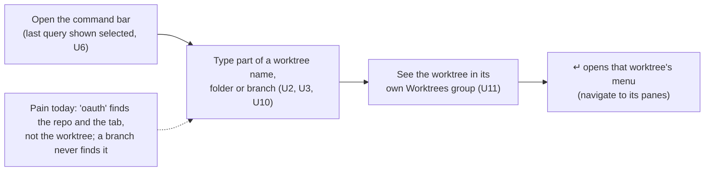
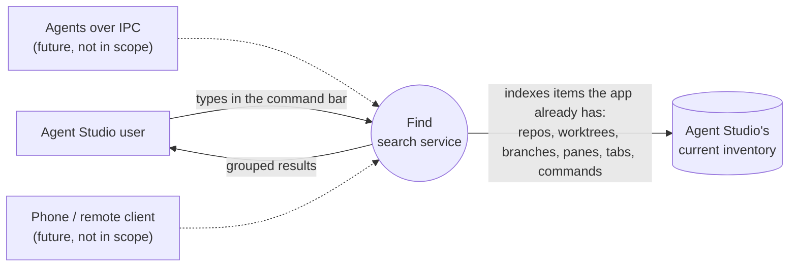
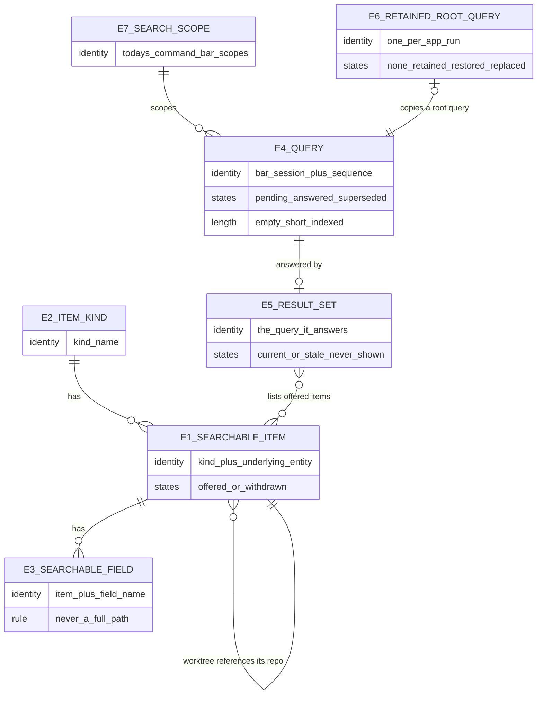

# Find: search service specification

Requirements: [2026-09-26-find-search-service-requirements.md](2026-09-26-find-search-service-requirements.md) (U1–U13) · Program Design: [2026-09-26-find-search-service-program-design.md](2026-09-26-find-search-service-program-design.md)

## What changes, in one picture

Today a worktree is hidden behind its repo in search, branches only find panes, and all matching runs on the main thread. After this change, repos and worktrees are first-class results, worktrees are found by name, folder and branch, and every command-bar kind is served by one search service that stays off the main thread and accepts new kinds without rewriting.

### The journey (Agent Studio user, U1–U6)

### Who uses the search, and through which surface

The service is one opaque system here. How it is built is Program Design's job.

## Entities

| ID | Term | Identity rule (what makes two the same) | Relationships | Invariants | Observable states |
|---|---|---|---|---|---|
| E1 | **Searchable item** | the same Item kind plus the same underlying app entity (the same repo, worktree, pane, tab or command, by that entity's existing stable identity); renaming or a branch change keeps the same item | belongs to exactly one E2; a worktree item references exactly one repo item | only **available** entities are items (U12); at most one item per underlying entity per kind | *offered* (can appear in results) → *withdrawn* (entity removed or unavailable) |
| E2 | **Item kind** | the kind's name: repo, worktree, pane, tab, command (now); session, history, notification (future) | has many E1; declares its E3 fields and its result group | adding a kind never changes another kind's matches or order (U8) | — |
| E3 | **Searchable field** | the same E1 plus the same field name | belongs to exactly one E1 | worktree: name, folder name, **branch**; repo: name, folder name, tags; existing kinds keep today's fields. **Never a full path** (U4); a repo never carries its worktrees' names (U2) | its value changes when the entity changes (for example a branch switch) |
| E4 | **Query** | one bar session plus its sequence number; retyping the same text is a new query | answered by at most one E5; belongs to one E7 scope | *empty* (0 characters), *short* (1–2), *indexed* (3+) | *pending* → *answered* \| *superseded* (a newer query arrived first) |
| E5 | **Result set** | the E4 it answers | answers exactly one E4; ordered E1s in groups | shows only offered items; groups in the order Repos · Worktrees · Panes · Tabs · Commands (U11) | *current* (answers the latest query) \| *stale* (never shown) |
| E6 | **Retained root query** | at most one per app run | copies the text of one root-scope E4 | kept in memory only; gone after the app quits (U6) | *none* → *retained* → *restored (selected)* → *replaced* |
| E7 | **Search scope** | today's command-bar scopes: root (everything), repos (`#`), panes (`$`), commands (`>`), quick open | covers a set of E2 kinds | worktree items are in the root and `#` scopes | — |

The entity table is the normative home. The map only shows relationships.

## Obligations

| ID | Obligation | Over | From |
|---|---|---|---|
| R1 | When an **indexed** query (3+ characters) is entered in the root or `#` scope, the result set **must** include every offered worktree item whose name, folder name or current branch matches the query | E1 E3 E4 E5 E7 | U1 U2 U3 |
| R2 | A repo item **must** match only through its name, folder name or tags, never through the names of its worktrees | E1 E3 | U2 |
| R3 | A query **must not** match a full path; only the last folder name of a repo or worktree is a searchable field | E3 | U4 |
| R4 | While the query is **empty**, the result set **must** be the same as today's empty-query results (recent repos and up to 5 recent worktrees in `#`, today's root view) | E4 E5 | U11 |
| R5 | When the query is **short** (1–2 characters), the result set **must** contain every current item with a field containing the text, recent items ranked first, without using the trigram index | E4 E5 | U5 |
| R6 | A query **must** match a field exactly when the field contains the query text, ignoring case, with punctuation matched literally (`vm.oa`, `feature/o`). Letters with gaps between them (`agvmoa`) **must not** match. Within a group, ranking **must** prefer title matches over other fields, then matches at the start of the title or of a word, with recent items boosted | E3 E4 | U10 |
| R7 | Results **must** be grouped Repos · Worktrees · Panes · Tabs · Commands, with a group shown only when it has results | E5 | U11 |
| R8 | A withdrawn (removed or unavailable) repo or worktree **must not** appear in any result set produced after the app knows it is withdrawn | E1 E5 | U12 |
| R9 | The bar **must** only ever **apply** the result set of the **latest** query. An answer to a superseded query **must** never be applied. While the latest query is pending, the previously applied rows may stay visible (no flicker). Clearing the text, changing scope or level, and dismissing **must** invalidate any pending answer | E4 E5 | U7 |
| R10 | Typing **must** cost ≤ 1 ms of main-thread work per keystroke; results **must** be shown ≤ 16 ms p95 after the keystroke on the owner's real repo set and ≤ 50 ms p95 with 10,000 items | E4 E5 | U7 U13 |
| R11 | When the app learns that a worktree was added or removed, or that a branch changed, the result set for a new query **must** reflect it within 1 s | E1 E3 | U13 |
| R12 | When the bar is dismissed from the root scope with no open level and no prefix (by esc, or after ↵ acts), the query text **must** be retained. When the bar next opens without a prefix, that text **must** be shown **fully selected** (typing replaces it). Prefix opens (`>`, `$`, `#`) and nested levels **must not** restore it. It **must not** survive an app restart | E6 E4 E7 | U6 |
| R13 | **Search work must be off the main thread by construction:** a consumer cannot cause matching or index work to run on the main thread; the main thread only submits a query and receives its result set | E4 E5 | U7 |
| R14 | A **new item kind** (for example sessions) **must** become searchable by declaring its fields, group and item source only, with **no change** to the results of existing kinds | E2 E3 | U8 |
| R15 | Matching **must** be done by SQLite FTS5 (trigram) over documents derived from the items the app already has; the index **must not** become a second source of truth for any fact | E1 E3 | U9 |

## Contracts the consumer can rely on

**C1: the command bar's search results (user-facing).**
- **Inputs:** the scope and the typed text.
- **Outputs:** the grouped result set of R7.
- **↵ on a worktree item** opens that worktree's existing menu. **↵ on a repo item** opens the repo menu, as today.
- **Visible state:**
  - the retained query, selected (R12);
  - results replacing each other as you type, never out of order (R9).
- **Undefined, left free:** tie order within a group, as long as R6's preferences hold.

**C2: the search service's query contract (internal consumers: the command bar now, later agents and remote clients).**
- **Input:** a query (scope, text, sequence).
- **Output:** exactly one result set tagged with that query's sequence.
- **Supersession:** a newer query from the same session supersedes older ones, and a superseded query may be answered or dropped, but never shown (R9).
- **Isolation:** the contract gives the caller no way to run search work on the main thread (R13).

**C3: adding a kind (developer-facing).** A kind declares its searchable fields, its result group and its item source. The source must offer only available items (R8), and the service owns matching, ranking and grouping (R14).

## Failure and edge behaviour

| Situation | Must happen |
|---|---|
| **F1:** the index is unavailable, corrupt or mid-rebuild | typing is never blocked; no error is shown; the query answers with no rows and the degraded answer is observable in traces; the index is rebuilt from the current items before the next query |
| **F2:** a query arrives while an older one is still being answered | the older answer is never shown (R9) |
| **F3:** an item is withdrawn while its row is on screen | the next result set omits it; ↵ on the stale row follows today's unavailable-entity handling (nothing opens for a withdrawn entity) |
| **F4:** a branch is unknown yet (not computed) | the worktree is still found by name and folder name; branch matching starts once the branch is known (R11) |
| **F5:** the app restarts | search works as soon as the app's restored inventory is loaded, before any folder scan completes; the retained query is gone (R12) |

## Non-goals and negative space

- No search over sessions, history or notifications yet (R14 makes it possible later).
- No full-path matching (R3).
- No persisted retained query (R12).
- No search over IPC or a network.
- No change to agentstudio-git.
- No daemon.
- No change to navigation levels or to the New Worktree flows.

## Cross-cutting

| Quality | Obligation or reason not applicable |
|---|---|
| **Performance** | R10, R11 |
| **Responsiveness** | R13 |
| **Privacy** | search stays local; no text is sent anywhere; the index holds only names, folder names, branches and tags the app already stores |
| **Security** | not applicable: no new trust boundary; local data only |
| **Accessibility** | result rows keep today's accessibility labels; the restored selected query is announced as the field's value |
| **Data lifecycle** | the index is derived and rebuilt from current items; nothing is migrated |
| **Observability** | search timing, result counts and index health are observable in the existing performance traces, so R10 and R11 can be measured |

## Proof

| Obligations | Evidence that can tell pass from fail |
|---|---|
| R1–R9, R12, F2–F4 | **automated behaviour:** real items in the results for given queries (name, folder, branch, substring with punctuation, gap letters not matching, groups, empty and short queries, withdrawn items, latest-query-only and invalidation, retained-query open/close sequences) |
| R10 | **performance measurement:** main-thread time per keystroke and keystroke-to-results p95, on the owner's real repo set (marker-scoped debug run) and on a 10,000-item synthetic set |
| R11 | **trace measurement:** time from the app publishing a worktree or branch change to the change being searchable |
| R13 | **static analysis:** the service's isolation prevents main-thread search work (compile-time isolation; architecture check) |
| R14 | **automated behaviour:** a test-only kind added by declaration becomes searchable, and existing kinds' results for the same queries are unchanged |
| R15, F1, F5 | **automated behaviour:** the FTS5 index answers from current items; an unavailable index degrades without blocking and is rebuilt; search works after restart before any scan |
| C1 visuals | **manual visual:** the grouped rows and the selected retained query in the running app |

## Coverage

| U | Entities | Problem | Outcome | Obligations | Contracts | Proof |
|---|---|---|---|---|---|---|
| U1 | E1 E5 | worktrees hidden behind repos | worktrees are results | R1 | C1 | automated |
| U2 | E1 E3 | repo noise | worktree row only | R1 R2 | C1 | automated |
| U3 | E3 | branch never finds a worktree | branch matches | R1 R11 | C1 | automated, trace |
| U4 | E3 | full paths too noisy | folder name only | R3 | C1 | automated |
| U5 | E4 | index needs 3+ characters | short queries still answer | R5 | C1 | automated |
| U6 | E6 | query lost on close | retained and selected | R12 | C1 | automated, manual |
| U7 | E4 E5 | matching on the main thread | off main by construction | R9 R10 R13 | C2 | measurement, static |
| U8 | E2 E3 | one-off search | reusable service | R14 | C3 | automated |
| U9 | E1 E3 | — | SQLite FTS5 engine | R15 | C2 | automated |
| U10 | E3 E4 | two matchers would drift | substring matching | R6 | C1 | automated |
| U11 | E5 | — | groups and empty view | R4 R7 | C1 | automated, manual |
| U12 | E1 E5 | offering what's gone | never offered | R8 | C1 C3 | automated |
| U13 | E4 E5 | "fast" unproven | measured targets | R10 R11 | — | measurement, trace |
