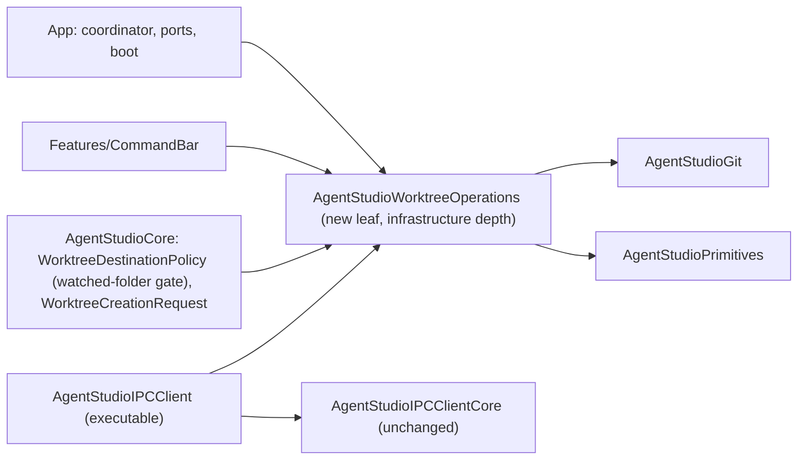

# Worktree CLI: how it is built

Date: 2026-09-27, revision 3 (round 2: supported layouts, leftovers, local error kinds). Revision 2 answered F1–F5. Realizes
[the Specification](2026-09-27-worktree-cli-specification.md) revision 2
(WR1–WR9).

## What exists (checked in code; SDK at agentstudio-git `87193257e5`)

| Area | Fact | Anchor |
| --- | --- | --- |
| SDK discovery | `validateWorktree(GitValidateWorktreeRequest { worktreePath })` opens with `git_repository_open_ext`, which searches upward from any folder, and returns `GitWorktreeValidation { snapshot?, isValid }`. `snapshot.canonicalPath` is the containing worktree's root (main or linked). `repositoryIdentity(for:)` only checks `<path>/.git` and does **not** search upward. | `LibGit2WorktreeReader.swift:54-87`; `GitRepositoryIdentityResolver.swift:41-59` |
| SDK create | `createWorktree(GitCreateWorktreeRequest { repositoryPath, destinationPath, mode: .newBranch(name, startPoint) })` throws `GitDataPlaneError`. It rolls back on failure but ignores rollback errors, so it gives **no cleanup evidence**. | `LibGit2WorktreeWriter.swift:14-93`; `LibGit2WorktreeCreateRollback.swift:20-79` |
| SDK fork | `forkWorktree(GitForkWorktreeRequest { sourceWorktreePath, destinationPath, mode })` → `GitForkWorktreeResult { worktree, materialization }`. `GitWorktreeForkError = rejected(reason) \| gitFailure(GitDataPlaneError) \| sourceChanged(relativePath, reason) \| entryFailed(relativePath, reason, errno?) \| cancelled \| validationFailed(reason, relativePath?) \| cleanupIncomplete(primary, residue: [GitWorktreeForkResidue { kind, location }])`, where the residue kinds are `destinationContent \| linkedWorktreeAdministration \| nestedAdministration \| createdBranch \| temporaryArtifact`. It builds at the final path, and its rollback journal reports incomplete cleanup. | `GitWorktreeForkContracts.swift:62-90`; `GitWorktreeForkError.swift:6-110`; `WorktreeForkRollbackJournal.swift:76-132` |
| SDK errors | `GitDataPlaneError` has 19 cases (`repositoryNotFound`, `headUnavailable`, `revisionUnavailable`, `libgit2Failure(code, klass, message)`, …); it has no public kind, so this design declares `WorktreeGitErrorKind`. | `GitDataPlaneError` at the pin |
| App types to share | `WorktreeBranchName` (`Core/Models/WorktreeBranchName.swift:16`); `WorktreeDefaultStartPoint` and `WorktreeDefaultStartPointResolving` (`Core/Models/WorktreeDefaultStartPoint.swift:5-11`); `SDKWorktreeDefaultStartPointResolver` (`App/Coordination/WorktreeCreationPorts.swift:39-60`); the slug and sibling path in `WorktreeDestinationPolicy` (`Core/Models/WorktreeDestinationPolicy.swift:46-111`), which also holds the watched-folder gate; the constants in `AppPolicies.WorktreeCreation` (`Infrastructure/AppPolicies.swift:634-641`). | as listed |
| Consumers | `App/Boot/AppDelegate+WorkspaceBoot.swift`; `App/Coordination/WorktreeCreationCoordinator.swift`, `WorktreeCreationPorts.swift`; `Core/Actions/Commands/WorktreeCreationRequest.swift`; `Features/CommandBar/CommandBarDataSource+WorktreeCreation.swift`, `CommandBarPanelController.swift`, `CommandBarState.swift`, `CommandBarWorktreeCreationResolver.swift`; tests `AppCommandDispatcherWorktreeCreationTests`, `WorktreeCreationCoordinatorTests`, `WorktreeDestinationPolicyTests`, `CommandBarWorktreeCreationTests`, `WorktreeCreationEndToEndTests`, `WorktreeDefaultStartPointResolverIntegrationTests`. | grep of the moved names |
| Module rules | `AgentStudioPrimitives` is the only dependency-free leaf, and the doc says the CLI stays "off Infrastructure's GRDB/OTel/libgit2 base". The architecture lint classifies each imported module's layer (`AgentStudioPrimitives` → `.infrastructure`). | `docs/architecture/structure/directory_structure.md:180-250`; `Tools/AgentStudioArchitectureLint/…/AgentStudioPathClassifier.swift:125-158` |
| CLI | The `AgentStudioIPCClient` executable links only IPC client targets and Primitives. | `Package.swift:311-322` |

## Choices

1. **The CLI calls agentstudio-git in its own process** (owner). No socket,
   no credential, no app.
2. **The CLI now links libgit2, deliberately.** That changes the documented
   "CLI stays off libgit2" rule. The owner accepted the cost when choosing
   this shape: a bigger bundled CLI and a slower start. The directory-structure
   doc is updated to say that the CLI links `AgentStudioWorktreeOperations`,
   and through it `AgentStudioGit`, for the worktree verbs.
3. **One shared leaf target, `AgentStudioWorktreeOperations`**, depending only
   on `AgentStudioGit`, `AgentStudioPrimitives` and Foundation. It sits at
   Infrastructure's depth, so every layer that may import Infrastructure may
   import it. The architecture lint classifies it as `.infrastructure`, like
   `AgentStudioPrimitives`, and the module graph in the doc gains it.
   Infrastructure does not re-export it; each consumer imports it directly.
   Hard cutover: the moved types leave Core, App and `AppPolicies`, with no
   alias, copy or re-export left behind. It owns:
   - `WorktreeBranchName`;
   - `WorktreeDefaultStartPoint`, `WorktreeDefaultStartPointResolving`, and
     the SDK-backed resolver (off-main, as today);
   - `WorktreeDestinationNaming` (slug, sibling path, empty-slug refusal);
   - `WorktreeCreationPolicy` (the moved constants);
   - `WorktreeOperationRunner` and its result types;
   - `WorktreeCommandLine` (argument parsing, output, exit codes).

   `WorktreeDestinationPolicy` stays in Core and keeps only the watched-folder
   gate, calling `WorktreeDestinationNaming`.
4. **The CLI dispatches `worktree` before any IPC work.** The executable's entry
   point checks `argv[1] == "worktree"` and hands off to
   `WorktreeCommandLine.run(arguments:currentDirectory:output:)`, which never
   constructs the IPC client or reads `AGENTSTUDIO_*` variables.
5. **The partway-visible fork is accepted** (Spec WR8). The remedy, "fork into a
   staging name, then move", is recorded as an agentstudio-git follow-up. The
   CLI never waits for or talks to the app.

## Discovery (F1)

```text
start = --repo / --from path, else the current directory
v = validateWorktree(GitValidateWorktreeRequest(worktreePath: start))
  isValid == false or snapshot == nil → refused notInRepository (list/new) | notInWorktree (fork)
  a GitDataPlaneError                 → failed readFailed(kind), leftovers notNeeded
current worktree root = v.snapshot.canonicalPath                       (main or linked)
repository = repositoryIdentity(for: current worktree root)           (root has .git, so this works)
main worktree = repository.mainWorktreePath  → E3 naming base (new/fork only)
  nil → refused unsupportedRepositoryLayout for new/fork (Spec E6: outside the supported
        layouts, e.g. a separate Git directory or a submodule); list continues from the root
fork source    = current worktree root       → never the main checkout unless that is where you are
```

## The result contract (F2, F3)

```swift
enum WorktreeOperationOutcome: Sendable, Equatable {
    case created(WorktreeCreatedSummary)                  // operation, branch, path, repository, materialization?
    case listed(WorktreeListingSummary)                   // repository, [WorktreeListing { path, branch?, isMain }]
    case refused(WorktreeOperationRefusal)
    case failed(WorktreeOperationFailure)
}
enum WorktreeOperationRefusal: Sendable, Equatable {
    case notInRepository(URL); case notInWorktree(URL)
    case noDefaultBranch; case invalidBranchName(WorktreeBranchNameRejection); case emptyBranchSlug
    case branchAlreadyExists(String); case destinationExists(URL); case destinationParentMissing(URL)
    case unsupportedRepositoryLayout(URL)
    case forkUnavailable(GitWorktreeForkRejectionReason)
}
struct WorktreeOperationFailure: Sendable, Equatable {
    let failure: WorktreeFailureKind
    let leftovers: WorktreeLeftoverStatus
}
enum WorktreeFailureKind: Sendable, Equatable {
    case readFailed(WorktreeGitErrorKind)
    case createFailed(WorktreeGitErrorKind)
    case forkGitFailed(WorktreeGitErrorKind)
    case sourceChanged(relativePath: String, reason: GitWorktreeForkSourceRaceReason)
    case entryFailed(relativePath: String, reason: GitWorktreeForkEntryFailureReason, errno: Int32?)
    case validationFailed(reason: GitWorktreeForkValidationFailureReason, relativePath: String?)
    case cancelled
}
enum WorktreeLeftoverStatus: Sendable, Equatable {
    case notNeeded                          // a read failed before anything was attempted
    case noLeftovers                        // fork: failed before changing anything, or fully compensated
    case unverified                         // create: agentstudio-git gives no evidence either way
    case incomplete([WorktreeCleanupLeftover])
}
/// Declared here: agentstudio-git's GitDataPlaneError has no public kind at the pin.
/// One exhaustive switch projects all 19 cases; associated values (including libgit2
/// messages) are dropped, so no raw Git text reaches the output.
enum WorktreeGitErrorKind: String, Sendable, Equatable {
    case repositoryNotFound, worktreeNotFound, locked, worktreeNotPrunable, unsafeWorktreeRemoval
    case contentTooLarge, pathEscapesRepository, revisionUnavailable, headUnavailable
    case requiredObjectNotFound, noSharedHistory, multipleBestMergeBases
    case processFailed, processTimedOut, processCancelled, processOutputTooLarge
    case remoteRefTransactionIndeterminate, libgit2Failure, unsupported
}
struct WorktreeCleanupLeftover: Sendable, Equatable {
    let kind: GitWorktreeForkResidueKind
    let location: String
    let base: WorktreeLeftoverBase     // .destination | .repositoryGitDirectory | .branchReference | .temporary
}
```

**Preflight that refuses before any change** (in this order):
1. Discovery (above).
2. Branch name validation → `invalidBranchName`.
3. Slug → `emptyBranchSlug`.
4. Sibling path exists → `destinationExists`; parent missing →
   `destinationParentMissing`.
5. `branches(for:)` contains the name → `branchAlreadyExists`.
6. `new` only: default start point `.noDefaultBranch` → refusal `noDefaultBranch`.

A read error in any step is `failed(readFailed(kind), leftovers: .notNeeded)`.

**The SDK error mapping** is one total switch, with nothing defaulted:

| SDK outcome | Result |
| --- | --- |
| `forkWorktree` → `.rejected(reason)` | `refused`: `.destinationExists` / `.destinationParentMissing` / `.invalidBranchName` / `.branchAlreadyExists` map to their named refusal; every other reason → `forkUnavailable(reason)` |
| `.cancelled`, `.gitFailure`, `.sourceChanged`, `.entryFailed`, `.validationFailed` | `failed(<kind with its typed detail>, leftovers: .noLeftovers)`. These can come before or after the first mutation, and the error carries no stage, so no stage is claimed. What holds either way is the writer's contract (`LibGit2WorktreeForkWriter.swift:8`): every failure after the first mutation is compensated through the journal, and an incomplete compensation surfaces as `cleanupIncomplete` instead |
| `.cleanupIncomplete(primary, residue)` | `failed(<primary's kind>, leftovers: .incomplete(residue mapped kind → base))`; the primary failure is kept |
| `createWorktree` throws `GitDataPlaneError` | `failed(createFailed(kind), leftovers: .unverified)`: the SDK ignores its own rollback errors, so nothing is claimed |

The residue base per kind follows the SDK's documentation
of `GitWorktreeForkResidue.location` (`GitWorktreeForkError.swift:81-98`):
destination-relative for `destinationContent`, relative to the Git directory
for the administration kinds, a full ref for `createdBranch`, and as
documented for `temporaryArtifact`.

**Output.** One formatter turns an outcome into the human line or the `--json`
object of Spec WR3–WR6. Exit codes: 0 created or listed, 1 refused, 2 failed.
No raw Git or libgit2 message text is printed; `libgit2Failure` prints only its
kind.

## Components and dependencies



## Changes by file (for the plan)

- `Package.swift`: the new target; the CLI, `AgentStudioCore`, the CommandBar
  feature module (if it's a separate target) and the app depend on it;
  the test targets depend on it too.
- `Sources/AgentStudioWorktreeOperations/`: the moved and new files listed in
  choice 3.
- Moved out: `Core/Models/WorktreeBranchName.swift`,
  `Core/Models/WorktreeDefaultStartPoint.swift`, the resolver in
  `App/Coordination/WorktreeCreationPorts.swift`, the naming half of
  `Core/Models/WorktreeDestinationPolicy.swift`, and
  `AppPolicies.WorktreeCreation`.
- Updated imports: every consumer in the inventory above.
- `Sources/AgentStudioIPCClient/`: `worktree` dispatch before IPC.
- `Tools/AgentStudioArchitectureLint/…/AgentStudioPathClassifier.swift`:
  classify `AgentStudioWorktreeOperations` as `.infrastructure`, with its test.
- `docs/architecture/structure/directory_structure.md`: the module graph, the
  new leaf's paragraph, and the CLI's libgit2 dependency.
  `docs/architecture/commands/ipc.md`: the CLI verbs. The bundled `agentstudio`
  skill.

## Proof

- **Unit:** naming (slug, sibling path, length limit, empty slug); branch
  validation; the SDK mapping table row by row (every
  `GitWorktreeForkRejectionReason`, each post-mutation kind,
  `cleanupIncomplete` with each residue kind, a create error → `unverified`);
  argument parsing; the formatter's golden human and `--json` output for all
  four outcomes and their exit codes.
- **Integration (temporary repositories):** discovery from the root and a
  nested folder in the main and a linked worktree, plus `--repo` / `--from`;
  a fork from a linked worktree copies that tree; `new`; `list`; each
  preflight refusal.
- **Dispatch:** a test through the executable's top-level dispatch seam runs a
  successful `worktree list` and observes that the IPC client factory and
  credential reader are never called.
- **Existing:** the six moved-type test files are updated to the new imports
  and stay green, so the command bar's behavior is unchanged. Architecture
  lint passes with the new classification.
- **Packaged smoke:** the bundled CLI forks from a pane in a watched
  repository, and the sidebar eventually shows it.
- `mise run test` before the PR.

## Open

- An SDK "stage then move" fork (WR8's window) and create-rollback cleanup
  evidence: follow-ups in agentstudio-git.
- `worktree remove`: the next design (the SDK already has `removeWorktree`).
- The move touches the Worktrees orchestrator's #363 code. They were notified
  on 2026-09-27; their answer is pending.
