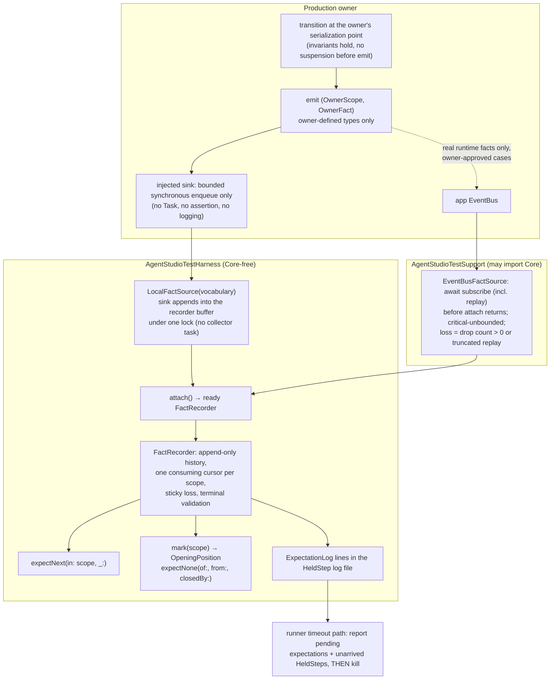

# Typed-fact test harness — Program Design

Status: owner-accepted direction 2026-09-28; revised after advisor rounds 6–7 · 2026-09-28

Artifacts: [Requirements](2026-09-28-typed-fact-test-harness-requirements.md) · [Specification](2026-09-28-typed-fact-test-harness.md) · [Program Design](2026-09-28-typed-fact-test-harness-program-design.md)

Realizes Specification H1–H11.

## Shape



## Harness API (Core-free, `AgentStudioTestHarness`)

Production code never sees these types. An owner's sink signature uses only the owner's own scope and fact types (see "Owner fact pattern"); the test side adapts them into the harness.

```swift
/// Test-side description of an owner's fact vocabulary. The owner's types stay plain `Hashable & Sendable`.
package struct FactVocabulary<Scope: Hashable & Sendable, Fact: Sendable>: Sendable {
    package let describeScope: @Sendable (Scope) -> String
    package let describeFact: @Sendable (Fact) -> String
    package let isClosing: @Sendable (Scope, Fact) -> Bool      // the ONLY definition of a terminal fact
}

package enum FactSourceEvent<Scope: Hashable & Sendable, Fact: Sendable>: Sendable {
    case fact(scope: Scope, fact: Fact, sequence: UInt64)
    case ended                              // normal end: buffered facts may still be consumed
    case lost(description: String)          // sticky; checked before any later fact can satisfy anything
    case cancelled                          // the source itself was cancelled (distinct from an expectation's cancellation)
}

/// Owner-local source: create before the owner, hand `sink` to the owner, `attach` before the stimulus.
/// The sink appends synchronously into the recorder-owned, locked buffer: no collector task, so no backlog.
package final class LocalFactSource<Scope: Hashable & Sendable, Fact: Sendable>: Sendable {
    package init(vocabulary: FactVocabulary<Scope, Fact>)
    package var sink: @Sendable (Scope, Fact) -> Void { get }  // bounded synchronous enqueue, matches owner signature
    package func attach() -> FactRecorder<Scope, Fact>          // ready on return; a second attach traps as misuse
}

/// What a recorder owns to stop its source; `finish()` calls it. Local: end + detach sink. Bus: cancel subscription + join.
package protocol FactSourceHandle: Sendable {
    func stop() async
}

package final class FactRecorder<Scope: Hashable & Sendable, Fact: Sendable>: Sendable {
    package func expectNext(in scope: Scope, _ expected: Fact, sourceLocation: SourceLocation = #_sourceLocation) async throws
        where Fact: Equatable
    package func expectNext(in scope: Scope, where matches: @Sendable (Fact) -> Bool, _ description: String,
                            sourceLocation: SourceLocation = #_sourceLocation) async throws -> Fact
    package func mark(_ scope: Scope) -> OpeningPosition<Scope>     // bound to this recorder + scope; taken before the stimulus
    package func expectNone(of forbidden: @Sendable (Fact) -> Bool, _ description: String,
                            from opening: OpeningPosition<Scope>, closedBy expectedClose: @Sendable (Fact) -> Bool,
                            sourceLocation: SourceLocation = #_sourceLocation) async throws
    package func finish() async throws                              // idempotent: stop source, join, settle, report violations
}
```

- **Consumption and history.** The recorder keeps the full append-only history for its lifetime. It's test-scoped, so memory is bounded by the scenario. Each scope has one cursor, and cursors only move forward. `expectNone` reads history from its opening position without moving any other expectation's cursor. It then advances the scope's cursor past the close, never backwards.
- **Terminal classification.** `FactVocabulary.isClosing` is the only definition of a closing fact, and it's used everywhere. In `expectNext`, a fact arriving in a scope after that scope's close fails with `FactAfterClose`. `expectNone` requires the first closing fact after the opening position both to satisfy `isClosing` and to match `expectedClose`: a different close, such as another generation's, fails. `finish()` reports duplicate closes.
- **Opening-position linearization.** `mark` records the scope's current history index under the same lock the sink appends under, so every fact enqueued before `mark` is ordered before the interval. For the bus source, `mark` first awaits delivery of everything the subscription had enqueued at that moment: it uses the `EventBusDeliveryCheckpoint.enqueuedCount` read at `mark` as the boundary, and facts with a lower sequence count as before the interval.
- **Failures** are thrown errors: `UnexpectedFact`, `SourceEnded`, `FactsLost`, `Cancelled`, `ConcurrentExpectation`, `DuplicateClose`, `FactAfterClose`. Each names the expected fact, the actual fact, the scope and the call site.
- **Cancellation.** The waiter is registered and cancelled under one lock, with exactly-once settlement; it's removed before being resumed.
- **Sink shape.** The sink is nonisolated, synchronous and nonthrowing. A MainActor owner adapts at its own boundary: it passes values, never isolated state, and never re-enters the owner.

## EventBus adapter (`AgentStudioTestSupport`)

`EventBusFactSource.attach(bus:, scope:)` is `async`. It awaits `subscribe` with the critical-unbounded policy (`EventBus.swift:258–307`) and inspects replay truncation before returning the ready recorder. It maps envelopes to `(scope, fact)` through a test-side classifier, with the owner's `FactVocabulary`. Before delivering each fact, and again at end and at finish, it reads the delivery checkpoint (`EventBusDeliveryCheckpoint`, from #379); a nonzero drop count turns into `lost`. Tests use a fresh bus or an explicit replay baseline, so old facts can never satisfy new operations.

## Owner fact pattern

- A closed enum `package enum <Owner>Fact: Sendable`, plus a scope type built from the owner's existing identities (worktree id plus generation, refresh id, request or lease id).
- An injected `factSink: (@Sendable (<Owner>Scope, <Owner>Fact) -> Void)?`, `nil` by default. It uses only owner-defined `Hashable & Sendable` types, so production code never imports the test harness (`Package.swift:348–374` stays as it is). It's invoked at the serialization point, after invariants hold, with no suspension between. The test hands it `LocalFactSource.sink`, whose signature matches, and supplies the owner's `FactVocabulary` on the test side.
- Every operation has exactly one closing fact per terminal disposition. Coalescing states which inputs a close covers. Retries and follow-ups never close the original operation.
- Existing production callbacks are adapted, not replaced (EagerDerivedAtom's `@MainActor` `onProjectionCompletion` becomes an adapter into the sink). An outcome callback that fires before follow-up admission is scoped to its outcome and never used as the operation's close.

## Canonical scenario (deferred deadline, negative without idle)

The claim: while a status fetch for W is held, a deadline for W that fires is **deferred**, and it doesn't start a second fetch. Both the decision and the forbidden outcome are facts in the **deadline** scope, so the negative can actually fail. The held provider proves the first fetch really is in flight.

```swift
let source = LocalFactSource(vocabulary: .projector)
let provider = HeldStep<Void>("status provider")                      // the real dependency, held
let projector = makeProjector(statusProvider: provider.gatedProvider, factSink: source.sink, clock: clock)
let facts = source.attach()                                           // ready before any stimulus
let fetch = ProjectorScope.refresh(worktree: W, generation: 1)
let evaluation = ProjectorScope.deadline(worktree: W, generation: 1)

await projector.enqueue(change)                                       // act
try await facts.expectNext(in: fetch, .refreshAdmitted)
_ = try await provider.firstArrival()                                 // the fetch really reached the provider and is held
try await facts.expectNext(in: evaluation, .deadlineRegistered)
let opening = facts.mark(evaluation)
clock.advance(by: interval)
try await facts.expectNone(of: { $0 == .deadlineDisposition(.admitted) }, "second fetch admitted while one is held",
                           from: opening, closedBy: { $0 == .deadlineDisposition(.deferred) })
#expect(provider.recordedArrivals.count == 1)                         // real state: still exactly one provider call

provider.release()
try await facts.expectNext(in: fetch, .refreshClosed(.completed))     // separate scope, separate close
try await facts.finish()
```

## Runner report protocol

`ExpectationLog` writes to the `AGENTSTUDIO_HELD_STEP_LOG` file in the `HeldStepEventLog` style (one `write(2)`, `O_APPEND`). Fields are escaped: tab and newline become `\t` and `\n`, and descriptions are capped at 200 characters. It logs the expected case, scope and call site, never payload dumps.

```text
expecting<TAB><pid>-<expectation id><TAB><expected case><TAB><scope><TAB><test><TAB><call site>
settled<TAB><pid>-<expectation id><TAB>matched|unexpected|ended|cancelled|lost
```

A record can't report its own write failure into the file that failed. So on the **first** open or write failure, both `ExpectationLog` and `HeldStepEventLog` write one line to standard error: `[agentstudio-test-log] unavailable path=<path> errno=<n>`. They write nothing further, and there's no periodic output. The runner already captures lane output. At timeout it reports `held_step_log_unavailable` when that line is present, so a missing record is never read as "nothing pending". `HeldStepEventLog.swift:43–50` currently drops these failures silently, and R0 fixes that.

`print_held_steps_unarrived_at_timeout` (`swift-test-helpers.sh:263–297`) is extended into one parser that reports each pending `expecting` next to each unarrived `waiting`. It handles a `settled` line appearing before its `expecting`, duplicates, and a partial last line, and it reports `unavailable`. It runs on the existing timeout path before the kill (`:1937`).

## Lint and ledger

- New rule `agentstudio_no_forbidden_test_wait`. It flags calls and resolvable references to `waitUntilIdle`, `assertEventuallyAsync` and `assertEventuallyMain` under `Tests/`, including qualified calls, optional chaining and function references. It never flags comments, string fixtures or production declarations. The existing `agentstudio_no_polling_wait_in_tests` keeps its yield-loop, budget and `for await` distinctions unchanged.
- The rule's debt lives in a **new ledger file**, `Tools/AgentStudioArchitectureLint/forbidden-test-wait-ledger.tsv`. The ratchet treats a ledger missing at the merge base as its initial baseline (`check-ledger-ratchet.sh:8–9`), so introducing the file admits today's counts once, after review. Existing polling rows stay unchanged.
- **Normal lint uses both Swift ledgers.** `scripts/lint-swift.sh:38–40` passes both files. `ArchitectureLintCommand` (`:105–122`) reconciles a list of ledgers through a rule-to-ledger ownership map: each rule's rows may live only in its own ledger, and duplicate `(rule, file)` keys across or within ledgers fail. Per-file counts stay exact, with over and under both reported. `check-ledger-ratchet.sh` lists the new file next to the existing Swift and BridgeWeb ledgers.
- Guidance and lint diagnostics that still recommend test quiescence are updated in the same change: the testing architecture doc and the rule text.

## Rollout

| Step | Change | Proof gates |
|---|---|---|
| R0 | Harness API, EventBus adapter, runner parser, lint rule and ledger, doc guidance. Before the API is frozen, a spike confirms one actor producer and one MainActor callback can feed the sink synchronously | Harness behavior tests (below), runner script tests, lint rule tests, ratchet test, `CIFastLaneWorkflowTests` |
| R1 | Projector fact enum, scopes and sink, with owner review of the fact list. Every projector-owned call site and claim migrates, shared files included. The test `waitUntilIdle` API is deleted; the lifecycle code in `+Quiescence.swift` (subscription start and shutdown joins, stream-end shutdown, drain removal) is kept or relocated with its proof, and zero-drop evidence is kept for the projector's `.lossyNewest` input | Causal scenarios per migrated claim; ledger rows for the projector go down |
| R2… | FilesystemActor (reuse `refreshID`), ForgeActor and RemoteReferenceRefreshActor (provider task identities), EagerDerivedAtom and RepoExplorerProjectionAdapter (projection generation and materialization settlement), Bridge owners (request, page and lease ids), UIStateStore, CommandBarPanelController | One PR per owner. Each fact list goes to the owner; each PR lowers its ledger rows |

## Proof (harness, R0)

Controlled interleavings, not repetition. All of these cases must pass:
- attach race: facts emitted before collection begins are kept;
- buffered-before-next;
- scope interleaving;
- unexpected fact fails and can't be skipped;
- EOF with buffered facts, and premature EOF;
- cancellation before and after registration;
- loss immediately before a close;
- duplicate or late close;
- an early close or forbidden fact injected into `expectNone`;
- `finish()` against an endless source;
- concurrent-expectation misuse;
- a mixed HeldStep and expectation timeout report produced by the real runner path.

Owner PRs add causal scenarios: hold the effect and observe the earlier step; release or fail it and require the terminal fact and the real state. Three focused runs are supplemental only.
