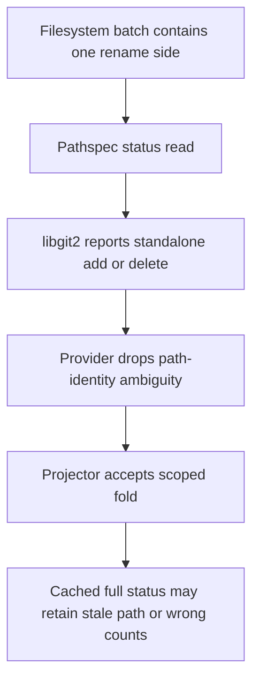
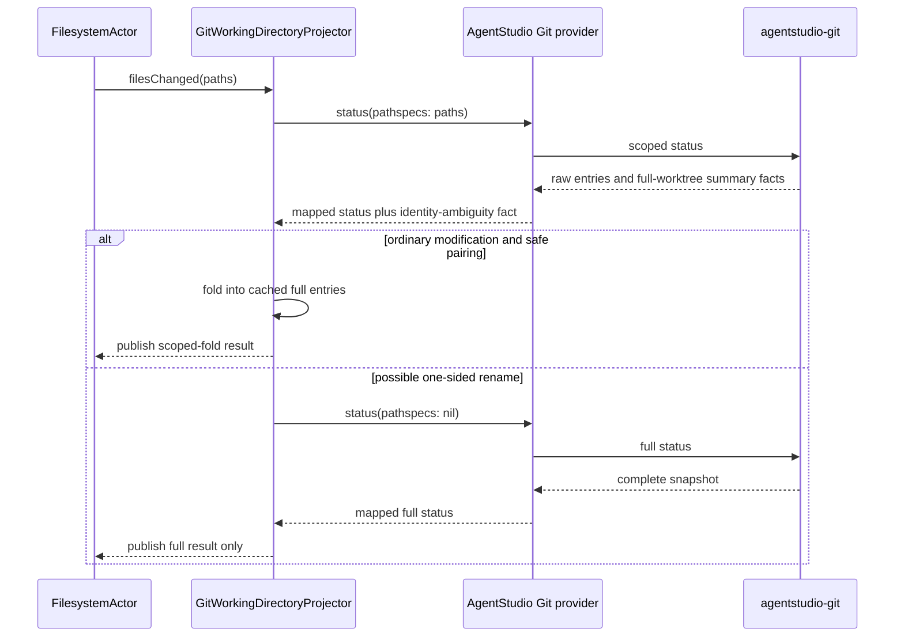

# Git Pathspec Status Fold Safety

Date: 2026-07-22
Status: proposed bounded correctness follow-up

## Product Problem

AgentStudio reduces repository-refresh cost by asking `agentstudio-git` for
status entries scoped to the paths reported by the filesystem watcher, then
folding those entries into the last full-worktree status snapshot.

That fast path is correct for ordinary file modifications, but it is not safe
for every path-identity transition. When a pathspec contains only one side of a
rename, libgit2 reports the visible side as an ordinary add or delete without
the original path. The current AgentStudio fold cannot distinguish that entry
from a genuine add or delete, so it can retain the old path, misclassify the new
path, or publish file counts that disagree with a full status read.

The customer problem is stale or incorrect repository state after a rename.
The performance requirement is equally important: ordinary modifications must
continue to use the scoped status path rather than reverting every filesystem
batch to a full repository walk.

## Scope

This specification covers the AgentStudio consumer side of pathspec-scoped Git
status and its package revision cutover.

In scope:

- preserve enough information from an `agentstudio-git` scoped snapshot to
  recognize a possible one-sided rename;
- reject an unsafe scoped fold and use the existing full-status fallback;
- preserve the current scoped fast path for ordinary modifications;
- update AgentStudio to the final reviewed `agentstudio-git` revision;
- add focused deterministic tests for package mapping, fold behavior, and the
  package-to-AgentStudio seam.

Out of scope:

- changes to libgit2, Ghostty, zmx, filesystem event production, EventBus, or
  Bridge demand scheduling;
- new actors, queues, registries, event types, retry systems, or persistence;
- package-global Git admission limits or changes to existing status capacity;
- pathspec-scoped shortstat, branch, upstream, sync, or origin facts;
- rename reconstruction or heuristic pairing inside AgentStudio;
- benchmark frameworks, proof scripts, wall-clock thresholds, or UI work.

## Current Contract And Failure

`agentstudio-git` intentionally has hybrid pathspec semantics:

```text
pathspec-scoped
  entries
  changed / staged / unstaged / untracked / ignored file counts

full-worktree even when pathspecs are present
  lines added / deleted
  head / branch
  ahead / behind / upstream
  origin
```

For renames, the package contract is also explicit:

```text
both sides visible     -> rename(path, previousPath)
target side only       -> standalone add or untracked entry
source side only       -> standalone delete entry
```

AgentStudio currently preserves explicit `.renamed` and `previousPath` facts,
but it discards the distinction between ordinary modified entries and
standalone add/delete entries before the projector decides whether the scoped
result is safe to fold.



## Boundary And Separability Map

```text
agentstudio-git
  owns: libgit2 reads and raw status semantics
  exposes: GitStatusSnapshot and GitStatusEntry facts
                     |
                     v
AgentStudioGitWorkingTreeStatusProvider
  owns: package-to-AgentStudio status mapping
  derives: whether a scoped snapshot contains ambiguous path identity
  does not own: cached fold state or refresh scheduling
                     |
                     v
GitWorkingDirectoryProjector
  owns: cached full entry set and scoped/full refresh decision
  rejects: scoped folds that cannot prove path-identity completeness
  publishes: one coherent GitWorkingTreeSnapshot
                     |
                     v
Existing runtime event and UI consumers
  receive: unchanged snapshot/event contracts
```

No MainActor work is added. Both the scoped read and the existing fallback read
remain behind the current Git status provider and its bounded physical-read
custody.

## Requirements

### R1. Final package revision

AgentStudio must pin `Package.swift` and `Package.resolved` to the final reviewed
`agentstudio-git` commit containing the accepted PR #6 fixes and tests. A stale
intermediate revision is not sufficient.

### R2. Preserve the ordinary modification fast path

A warm-cache filesystem batch containing ordinary modified paths must perform
one pathspec-scoped status read and fold the result into the cached full entry
set. It must not perform a full status read merely because the path was absent
from the previous dirty-entry cache.

### R3. Preserve scoped identity ambiguity

When `pathspecs` is non-`nil`, the AgentStudio provider must preserve a bounded
derived fact indicating that the raw package snapshot contains an entry which
may be one visible half of a rename.

The fact is true when an entry has no usable rename pairing and the raw package
state is a standalone add, delete, or untracked path. It is false for an
ordinary modified entry.

This is one derived fact on the existing internal status model. It is not a new
event, public package contract, registry, or source of truth.

### R4. Unsafe scoped folds fall back once

The projector must reject a scoped fold when either condition holds:

1. the scoped status contains the path-identity ambiguity from R3; or
2. the existing explicit rename guard finds a rename whose `previousPath` is
   outside the supplied pathspecs or whose pairing data is incomplete.

After rejection, the projector performs its existing full-worktree status read
for that batch and publishes only the full result. The rejected scoped result
must not mutate the cached entry set or reach downstream consumers.

If the full read is unavailable, the existing unavailable-result, timeout, and
backoff behavior remains authoritative. This specification adds no second
recovery policy.

### R5. Preserve hybrid summary semantics

Scoped folding continues to reconstruct entry-derived file counts from the
folded full entry set. Lines added/deleted, branch, sync, upstream, and origin
continue to come from the package's full-worktree summary facts.

AgentStudio must not implement the bot-proposed pathspec-scoped shortstat
behavior because it would overwrite full-worktree totals with partial totals.

### R6. Preserve execution and admission ownership

The change must not add synchronous Git or filesystem work to MainActor.
Existing status-read capacity, same-root exclusion, timeout, physical-drain
custody, and projector sequencing remain unchanged.

No package-global concurrency limit is added. AgentStudio's existing status and
Bridge operation-class owners remain responsible for admission.

### R7. Scope telemetry describes the published result

When the projector rejects a scoped fold and publishes a full fallback result,
the existing status-scope telemetry must report `full`, with a pathspec count of
zero. No new metric family is required.

## Required Behavior



## Proof Expectations

The implementation plan must operationalize these deterministic tests. Tests
must use exact state or event waits; they must not use wall-clock performance
thresholds or sleeps.

### Package behavior prerequisite

The reviewed `agentstudio-git` revision must contain real-repository fixtures
for source-only, target-only, and both-side rename pathspecs. Those fixtures
must prove the raw libgit2 shapes described by the package contract.

If the real fixtures contradict that contract, implementation stops and this
specification is revised before AgentStudio mapping changes proceed.

### Provider mapping tests

Focused provider tests must prove:

- ordinary scoped `.modified` entries are not identity-ambiguous;
- target-only `.added` or untracked entries are identity-ambiguous;
- source-only `.deleted` entries are identity-ambiguous;
- a full status snapshot is not labeled scoped merely because it contains an
  ordinary add or delete;
- the raw summary's full-worktree line and branch facts remain unchanged.

### Projector fold tests

Focused projector tests must prove:

- ordinary modified paths still take one scoped read after cache warm;
- target-only and source-only ambiguous entries cause exactly one existing full
  fallback read;
- an explicit paired rename whose two paths are both covered can fold safely;
- an explicit rename whose previous path is outside the scope still falls back;
- the rejected scoped result never mutates or publishes the cached snapshot;
- the published full fallback has full-scope telemetry;
- unavailable full fallback results use existing failure/backoff behavior.

The current fabricated test that gives a target-only path a fully paired rename
is insufficient by itself. It must be supplemented by cases using the actual
one-sided shapes proven by the package fixtures.

### Cross-repository compatibility

The final package revision must pass its required AgentStudio compatibility
mode against this checkout. AgentStudio's focused Git provider/projector tests
must pass against the same pinned revision. A compatibility suite that silently
skips a missing seam does not satisfy this expectation.

## Tradeoff

Gained:

- correct repository state after source-only or target-only rename observation;
- no rename heuristics and no duplicate Git authority;
- ordinary modified-file batches retain the scoped performance improvement.

Paid:

- genuine adds, deletes, and untracked paths may perform a scoped read followed
  by one full read because they are indistinguishable from a hidden rename half;
- the internal status model carries one additional derived correctness fact.

This is the smallest safe tradeoff supported by the package contract. Rename,
add, and delete transitions are lower-frequency than ordinary output-driven
file modifications, so they bear the correctness fallback cost.

## Alternatives Rejected

### Assume the watcher always reports both rename paths

Rejected because `FileChangeset` carries paths but no portable rename pairing,
and correctness cannot depend on both paths appearing in the same batch.

### Always run full status for every filesystem batch

Rejected because it discards the scoped-status performance improvement for the
dominant ordinary-modification case.

### Reconstruct renames in AgentStudio

Rejected because pairing by name, content, timestamp, or filesystem timing
would create heuristic Git authority outside libgit2.

### Add new package metadata before using existing facts

Rejected for this bounded change. The package already exposes the add, delete,
untracked, rename, and previous-path facts needed for a conservative decision.
New public metadata is considered only if real fixtures disprove that premise.

## Completion Boundary

This specification is satisfied when the final package revision is pinned,
ordinary modifications remain scoped, every proven one-sided rename shape
causes the existing full fallback, focused deterministic tests pass, and the
required cross-repository compatibility proof executes without skipping.

It does not authorize any broader Git scheduler, filesystem, EventBus, Bridge,
or performance-system redesign.
