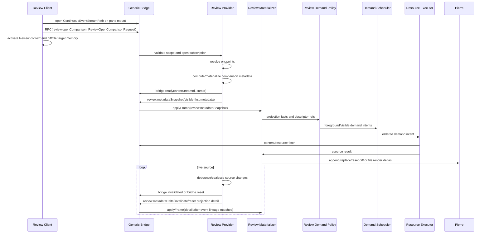

# Review Protocol Spec

Date: 2026-06-22
Status: Reopened for parent workflow alignment after the 2026-06-24 expanded
PR-ready epic reset. Review runtime implementation and Pierre/Review renderer
cutover are required downstream gates; Gate 0.a shared BridgeViewer
current-worktree proof is the first blocker before those gates resume. Gate 0.a
already includes current-worktree Review diff and Review file-target routes; it
is not a Worktree/File-only proof.
Parent: [spec.md](spec.md)

This file owns the Review application protocol. Review is one app protocol
family over generic Bridge transport. Bridge carries frames, commands, and
resource descriptors; Review owns comparison meaning.

## 1. Product Intent

Review lets a user inspect provider-computed comparisons:

- explicit git refs or commits
- base branch versus worktree
- time-window changesets
- agent/session changeset clusters
- future checkpoint or manual groupings

Review must support static DiffsHub-like diff loading and live changesets
without making the browser compute repo diffs.

## 2. Ownership

Review provider owns:

- source endpoint resolution
- Git diff calculation
- worktree comparison materialization
- time-window materialization
- changeset cluster materialization
- package id, generation, and revision authority
- source debounce/coalescing for live comparisons
- source cursors and reset decisions

Review browser owns:

- Review context state adaptation inside the shared BridgeViewer navigation store
- projection/render materialization
- tree/code ordering and filtering projections
- app demand policy and demand-intent derivation
- content hydration
- app-specific lineage decisions and commit guards
- renderer deltas into Pierre

Generic demand scheduling, resource execution, retry/abort behavior, and stale
completion drops remain shared Bridge runtime responsibilities.

Review browser must not:

- calculate repository diffs from raw file streams
- treat path hints as content authority
- store diff/file bodies in Zustand
- store Review file target bytes, Pierre instances, workers, streams, or resource
  executors in Zustand
- switch to a standalone FileViewer app when the user asks to view a Review item
  as a file
- remount CodeView for same-lineage deltas by default

BridgeViewer app composition owns active viewer context, active target, and
per-context navigation memory. Review owns comparison meaning and Review-specific
projection/materialization. A Review surface can target a diff or a file without
becoming two different apps:

```text
BridgeViewerApp
  context: Review
    target: diff -> Review rail + Pierre diff canvas
    target: file -> Review rail + Pierre/Shiki file canvas

  context: Files
    target: file -> Files rail + Pierre/Shiki file canvas
    target: diff -> future Files-context comparison target when the source
                    exposes comparison data
```

No rich-preview target is in first scope. Markdown and text-like review items
render through the Pierre/Shiki file path when the user chooses file view.

### 2.1 Native Metadata Production Scheduling

Review metadata interest served by the native provider routes through the
same generic per-pane lane scheduler defined in
[performance-demand-lanes.md](performance-demand-lanes.md). The scheduler
stays protocol-agnostic; review-specific meaning stays here:

- review metadata-interest jobs map to `foreground`, `visible`, `nearby`, or
  `speculative` from the requesting lane; review window builds serve from
  the in-memory review package in O(requested items)
- review has no full-manifest continuation, so review contributes no
  idle-lane jobs; the idle no-starvation budget applies only to protocols
  that supply idle work (Worktree/File manifest continuation)
- within a lane, jobs order by arrival; protocol id is identity and
  stale-drop scope, never priority
- review queue wait is emitted per lane from the scheduler's
  enqueue-to-dequeue instrumentation, subject to the measurement honesty
  rules in performance-demand-lanes.md; pending-buffer insertion order is
  not a scheduling contract
- review's per-item wire lineage (`loadedBy`/`lane` on item metadata) is an
  accepted existing shape; the Worktree/File frame-level lineage cutover
  does not change review wire frames, and any change here belongs to a
  later review-protocol slice

## 3. Source And Changeset Model

The product word `changeset` is a Review lens. It is not the base transport
noun.

```text
ReviewComparisonSelector
  caller describes desired comparison without minting authority
ReviewComparisonSpec
  provider resolves sources
  provider computes/materializes comparison package
  provider emits snapshot/delta/invalidation/reset
  browser materializes projection and renderer deltas
```

Changeset cluster sources can be:

- explicit sha/ref/tag ranges
- current dirty worktree
- live base branch versus worktree
- saved time window
- prompt/session checkpoint
- provider-owned agent edit batch
- touched-file accumulation
- future manual grouping

The clustering algorithm is provider-owned, but the runtime contract is not
deferred. The protocol must carry enough metadata to represent live, closed,
pinned, degraded, and reset clusters without making the browser the grouping
authority.

## 4. Changeset Cluster Contract

```ts
import { z } from 'zod';

export const ReviewSourceEndpointSpec = z.discriminatedUnion('kind', [
  z.object({
    kind: z.literal('gitRef'),
    repoId: z.string().min(1),
    worktreeId: z.string().min(1),
    ref: z.string().min(1),
    resolvedSha: z.string().min(1).optional(),
  }).strict(),
  z.object({
    kind: z.literal('commit'),
    repoId: z.string().min(1),
    worktreeId: z.string().min(1),
    sha: z.string().min(1),
  }).strict(),
  z.object({
    kind: z.literal('tag'),
    repoId: z.string().min(1),
    worktreeId: z.string().min(1),
    tag: z.string().min(1),
    resolvedSha: z.string().min(1).optional(),
  }).strict(),
  z.object({
    kind: z.literal('workingTree'),
    repoId: z.string().min(1),
    worktreeId: z.string().min(1),
    providerIdentity: z.string().min(1),
    contentSetHash: z.string().min(1).optional(),
  }).strict(),
  z.object({
    kind: z.literal('savedTimeWindowCheckpoint'),
    repoId: z.string().min(1),
    worktreeId: z.string().min(1),
    fromUnixMilliseconds: z.number().int().nonnegative(),
    toUnixMilliseconds: z.number().int().nonnegative(),
    materializedHash: z.string().min(1).optional(),
  }).strict(),
  z.object({
    kind: z.literal('sessionCheckpoint'),
    repoId: z.string().min(1),
    worktreeId: z.string().min(1),
    checkpointId: z.string().min(1),
    contentSetHash: z.string().min(1).optional(),
  }).strict(),
  z.object({
    kind: z.literal('providerChangesetCluster'),
    repoId: z.string().min(1),
    worktreeId: z.string().min(1),
    clusterId: z.string().min(1),
    materializedHash: z.string().min(1).optional(),
  }).strict(),
]);

export const ReviewChangesetClusterMetadata = z.object({
  clusterId: z.string().min(1),
  sourceId: z.string().min(1),
  algorithm: z.enum([
    'explicitRange',
    'timeWindow',
    'sessionTurnBaseline',
    'checkpoint',
    'idleDebounce',
    'touchedFileAccumulation',
    'scmResourceGroup',
    'hunkGrouping',
    'manual',
    'unknown',
  ]),
  lifecycle: z.enum(['live', 'closed', 'pinned']),
  confidence: z.enum(['incremental', 'freshScan', 'overflowRecovered', 'partial', 'unknown']),
  baselineCursor: z.string().min(1).optional(),
  headCursor: z.string().min(1).optional(),
  baselineRef: z.string().min(1).optional(),
  headRef: z.string().min(1).optional(),
  fromUnixMilliseconds: z.number().int().nonnegative().optional(),
  toUnixMilliseconds: z.number().int().nonnegative().optional(),
  includedPathHints: z.array(z.string().min(1)).optional(),
  groupingReason: z.string().min(1).optional(),
  limitations: z.array(z.enum([
    'shellEditsExcluded',
    'externalEditsExcluded',
    'remoteEditsExcluded',
    'ignoredPathsExcluded',
    'generatedFilesExcluded',
    'overflowRecovered',
  ])).optional(),
}).strict();

export const ReviewResourceKind = z.enum([
  'content',
]);

export const ProviderIssuedReviewComparisonIdentity = z.object({
  packageId: z.string().min(1),
  sourceIdentity: z.string().min(1),
  generation: z.number().int().nonnegative(),
  revision: z.number().int().nonnegative(),
  contentDescriptors: z.array(BridgeAttachedResourceDescriptor).optional(),
  changesetCluster: ReviewChangesetClusterMetadata.optional(),
}).strict();
```

Contract:

- `ReviewChangesetClusterMetadata` explains grouping provenance.
- It is not proof authority for file bytes or diff bodies.
- Provider may change the algorithm without changing Bridge transport.
- Live clusters can emit deltas; closed/pinned clusters should be immutable
  unless provider issues an explicit reset.
- Fresh-scan or overflow-recovered batches must be visible as degraded
  confidence, not silently represented as precise incremental batches.

## 5. Review Source Subscription

```ts
export const ReviewComparisonSelector = z.object({
  queryKind: z.string().min(1),
  baseEndpointId: z.string().min(1),
  headEndpointId: z.string().min(1),
  comparisonSemantics: z.string().min(1),
  pathScope: z.array(z.string().min(1)),
  viewFilterToken: z.string().min(1).optional(),
  groupingKey: z.string().min(1).optional(),
  provenanceFilterToken: z.string().min(1).optional(),
}).strict();

export const ReviewQuerySpec = ReviewComparisonSelector;

export const ReviewComparisonSpec = z.object({
  comparisonId: z.string().min(1),
  query: ReviewQuerySpec,
  baseEndpoint: ReviewSourceEndpointSpec,
  headEndpoint: ReviewSourceEndpointSpec,
  freshness: z.enum(['pinned', 'liveRight', 'liveBoth']),
  changesetCluster: ReviewChangesetClusterMetadata.optional(),
}).strict();

export const ReviewOpenComparisonRequest = z.object({
  clientRequestId: z.string().min(1),
  selector: ReviewComparisonSelector,
}).strict();

export const ReviewOpenComparisonOutcome = z.discriminatedUnion('kind', [
  z.object({
    kind: z.literal('accepted'),
    comparisonId: z.string().min(1),
    comparison: ReviewComparisonSpec,
    eventStreamId: z.string().min(1),
    intakeStreamId: z.string().min(1),
    initialCursor: z.string().min(1),
  }).strict(),
  z.object({
    kind: z.literal('rejected'),
    reason: z.enum(['invalidSource', 'staleSource', 'unsupportedComparison', 'permissionDenied']),
    userFacingReason: z.string().min(1).optional(),
  }).strict(),
  z.object({
    kind: z.literal('deferred'),
    reason: z.enum(['needsUserInput', 'providerBusy', 'sourceNotReady']),
    requestedInput: z.array(z.string().min(1)).optional(),
  }).strict(),
]);
```

`ReviewOpenComparisonRequest.selector` is caller input, not comparison
authority. Browser/app composition, dev bootstrap, and Worktree/File handoff may
describe the desired comparison with stable endpoint ids, path scope, and view
filters. Only the Review provider resolves those selectors into
`ReviewComparisonSpec`, package identity, source cursors, and stream ids.

Review file targets use the shared `BridgeViewerFileTarget` shape with
`context='review'`, a `reviewComparison` source, `comparisonId`,
`reviewItemId` or resolved `fileRef`, `version`, and `targetKind='file'`.
`reviewItemId` is the preferred resolution key when the provider can supply it.
If the target is path-bootstrapped, `fileRef + version` must resolve only inside
the accepted Review comparison/source lineage. A dev URL may use a path as a
bootstrap hint, but proof must show it resolved to a typed Review file target
under an accepted comparison. A naked path open is not a valid Review file-target
proof.

Current implementation pressure point: `reviewItemId` is already part of the
BridgeViewer navigation model and must be preferred before path fallback. Strict
`comparisonId` enforcement requires the active Review package/runtime to expose
a comparison authority that can be checked by the resolver. Until that contract
exists, proof may record the requested comparison id and source identity, but it
must not claim strict comparison enforcement from path-only matching.

Finite source examples:

- `commit` versus `commit`
- `tag` versus `commit`
- static provider-materialized comparison metadata stream
- closed time-window cluster versus base
- pinned provider changeset cluster

Live source examples:

- base branch versus live worktree
- pinned baseline versus current dirty worktree
- live agent edit cluster before the provider closes the cluster

Review subscription binding to the parent continuous event stream:

- `review.openComparison` is a command. It validates the comparison and returns a
  typed `ReviewOpenComparisonOutcome`.
- Accepted comparison outcomes activate or update the shared BridgeViewer Review
  context. They do not create a second app root and they do not require a
  user-visible route shape in production.
- An accepted outcome binds the Review comparison to the pane-scoped
  `ContinuousEventStreamPath` through `eventStreamId`, `intakeStreamId`, and
  `initialCursor`.
- Compact lifecycle facts for the comparison ride the continuous event stream:
  ready/heartbeat, source status, descriptor availability, invalidation notice,
  gap, reset, and close.
- Review intake frames carry metadata/projection materialization: metadata
  snapshots, metadata windows, metadata deltas, rich invalidation detail, resets,
  package/comparison identity, item ids, paths, filenames, tree shape,
  line/extent facts, selected target, content descriptor refs, and per-role
  content hashes. They may attach descriptors for file/diff bodies, but metadata
  itself streams through intake and is not a replacement for the continuous event
  stream.
- If a producer changes an item's content, it MUST deliver a descriptor-bearing
  frame for that item. Metadata-only re-touch/window/delta frames whose item
  metadata omits descriptors carry the item's current role `contentHashesByRole`
  so the browser can verify whether already-materialized content handles are
  still current.
- A `bridge.invalidated`, `bridge.gap`, `bridge.reset`, or `bridge.closed` event
  for a Review identity gates the matching Review intake/content work. Old intake
  frames and resource completions must stale-drop unless the provider rebinds the
  source with a new baseline/cursor.

## 6. Intake Frames

```ts
// The exact fields of these metadata schemas are implementation-owned, but they
// must cover item ids, paths, filenames, tree shape, change kind, diff facts,
// line counts/extents, content descriptor refs, and selection/visibility facts.
const ReviewItemMetadata = z.object({}).passthrough();
const ReviewTreeRowMetadata = z.object({}).passthrough();
const ReviewExtentFact = z.object({}).passthrough();
const ReviewMetadataOperation = z.discriminatedUnion('kind', [
  z.object({
    kind: z.literal('upsertItemMetadata'),
    item: ReviewItemMetadata,
  }).strict(),
  z.object({
    kind: z.literal('removeItems'),
    itemIds: z.array(z.string().min(1)),
  }).strict(),
  z.object({
    kind: z.literal('appendItems'),
    items: z.array(ReviewItemMetadata),
  }).strict(),
  z.object({
    kind: z.literal('replaceItemOrder'),
    itemIds: z.array(z.string().min(1)),
  }).strict(),
  z.object({
    kind: z.literal('upsertTreeRows'),
    rows: z.array(ReviewTreeRowMetadata),
  }).strict(),
  z.object({
    kind: z.literal('removeTreeRows'),
    rowIds: z.array(z.string().min(1)).optional(),
    paths: z.array(z.string().min(1)).optional(),
  }).strict(),
  z.object({
    kind: z.literal('replaceTreeWindow'),
    rows: z.array(ReviewTreeRowMetadata),
  }).strict(),
  z.object({
    kind: z.literal('movePathPrefix'),
    fromPath: z.string().min(1),
    toPath: z.string().min(1),
    affectedItemIds: z.array(z.string().min(1)),
  }).strict(),
  z.object({
    kind: z.literal('upsertExtentFacts'),
    facts: z.array(ReviewExtentFact),
  }).strict(),
  z.object({
    kind: z.literal('selectItem'),
    itemId: z.string().min(1).nullable(),
  }).strict(),
  z.object({
    kind: z.literal('invalidateContentDescriptors'),
    descriptorIds: z.array(z.string().min(1)),
  }).strict(),
]);

export const ReviewMetadataSnapshotFrame = BridgeIntakeFrameBase.extend({
  kind: z.literal('metadataSnapshot'),
  frameKind: z.literal('review.metadataSnapshot'),
  comparison: ProviderIssuedReviewComparisonIdentity,
  selectedItemId: z.string().min(1).nullable(),
  visibleItemIds: z.array(z.string().min(1)),
  itemMetadata: z.array(ReviewItemMetadata),
  treeRows: z.array(ReviewTreeRowMetadata),
  extentFacts: z.array(ReviewExtentFact),
}).strict();

export const ReviewMetadataWindowFrame = BridgeIntakeFrameBase.extend({
  kind: z.literal('metadataWindow'),
  frameKind: z.literal('review.metadataWindow'),
  packageId: z.string().min(1),
  revision: z.number().int().nonnegative(),
  itemMetadata: z.array(ReviewItemMetadata),
  treeRows: z.array(ReviewTreeRowMetadata),
  extentFacts: z.array(ReviewExtentFact),
}).strict();

export const ReviewMetadataDeltaFrame = BridgeIntakeFrameBase.extend({
  kind: z.literal('metadataDelta'),
  frameKind: z.literal('review.metadataDelta'),
  packageId: z.string().min(1),
  fromRevision: z.number().int().nonnegative(),
  toRevision: z.number().int().nonnegative(),
  operations: z.array(ReviewMetadataOperation),
  contentDescriptors: z.array(BridgeAttachedResourceDescriptor).optional(),
}).strict();

export const ReviewInvalidationFrame = BridgeIntakeFrameBase.extend({
  kind: z.literal('delta'),
  frameKind: z.literal('review.invalidate'),
  invalidation: z.object({
    scope: z.enum(['package', 'items', 'paths', 'treeWindow']),
    itemIds: z.array(z.string().min(1)).optional(),
    pathHints: z.array(z.string().min(1)).optional(),
    reason: z.enum(['sourceChanged', 'watchEvent', 'lineageReplaced', 'unknown']),
  }).strict(),
}).strict();

export const ReviewResetFrame = BridgeIntakeFrameBase.extend({
  kind: z.literal('reset'),
  frameKind: z.literal('review.reset'),
  reason: z.enum(['sourceChanged', 'subscriptionReset', 'providerRestart', 'authorityChanged']),
  sourceIdentity: z.string().min(1),
}).strict();
```

Review intake streams must:

- carry ordered frames with provider-issued package/generation/revision identity
- bind to an accepted continuous-event-stream lineage for the same pane,
  comparison, source identity, generation, and cursor
- treat page-world frame delivery as bundled app-internal transport, not native
  byte-serving authority
- stream Review metadata directly as intake frames, visible-first and then
  continuing over time; metadata must not require fetching a full
  `review-package` body before tree/projection render
- use descriptors only for content/body bytes such as file or diff contents
- register attached content descriptors before demand policy receives descriptor
  refs
- emit typed semantic metadata deltas. Provider/Vite/Swift deltas describe the
  Review/File source change, not Pierre renderer method calls.
- coalesce noisy watch/git events into revisioned deltas before intake. The
  browser applies each accepted delta as one normalized metadata-store
  transaction and schedules at most one projection/materialization pass for that
  transaction.
- allow same-lineage deltas without CodeView remount. The browser adapter lowers
  semantic deltas into Pierre tree/code mutations only at the renderer edge.
- preserve the last good tree/projection while a newer revision materializes;
  stale derived results must not commit, but active streams must not starve the
  UI waiting for quiet.
- fail closed on package/source authority replacement
- treat `review.invalidate` and `review.reset` frames as Review projection detail
  that must agree with the authoritative `bridge.invalidated` or `bridge.reset`
  lifecycle event for the same identity

Renderer lowering rules:

- append/remove/move metadata deltas lower to `@pierre/trees` batch operations
  when the affected path count is below the browser-side reset threshold.
- `movePathPrefix` is the semantic operation for folder moves. The browser may
  lower it to per-path Pierre moves for small affected sets or to
  `resetPaths(..., { preparedInput })` for large affected sets.
- large reorder, unknown lineage, or provider-declared reset lowers to a
  prepared tree reset.
- content descriptor changes update metadata and demand state; actual file/diff
  body hydration lowers to `@pierre/diffs` `CodeView.updateItem(...)` with a new
  item version/cache key when content arrives.
- Metadata-only item frames may preserve already-resolved browser handles only
  when their role hash is absent for a legacy producer or matches the resolved
  handle hash. A matching hash is a verified keep. A differing hash means content
  changed without a descriptor; the browser drops that role to a placeholder and
  demand policy requests fresh content. Legacy absent-hash keeps are telemetry
  counted as unverified.
- The baseline safety contract is package id, generation, ordered stream
  sequence, `fromRevision`, and `toRevision`; a revision gap requires a metadata
  window/reset instead of speculative renderer work.

Page-world push nonce checks, DOM attributes, MessagePort provenance, and
agreement between a package payload and sibling `protocolFrame` are not native
content authority. Browser descriptor refs may drive local projection and demand
policy, but bytes are served only when Swift has already issued a matching
descriptor lease. A forged, stale, or foreign page-world `__bridge_push` or
`__bridge_intake_json` must not make unauthorized
`agentstudio://resource/...` fetches succeed.

## 7. Demand Policy Stimuli

Review demand policy consumes app-specific stimuli and emits generic
`DemandIntent` values. The stimuli are discriminated unions, not loose boolean
bags. The emitted lane names remain generic Bridge lanes.

```ts
export const ReviewDemandStimulus = z.discriminatedUnion('kind', [
  z.object({
    kind: z.literal('reviewDiffTargetSelected'),
    descriptorRef: BridgeDescriptorRef,
  }).strict(),
  z.object({
    kind: z.literal('reviewFileTargetSelected'),
    descriptorRef: BridgeDescriptorRef,
  }).strict(),
  z.object({
    kind: z.literal('reviewDescriptorInvalidated'),
    descriptorRef: BridgeDescriptorRef,
  }).strict(),
  z.object({
    kind: z.literal('reviewViewportChanged'),
    descriptorRefs: z.array(BridgeDescriptorRef),
  }).strict(),
  z.object({
    kind: z.literal('reviewExplicitRefresh'),
    descriptorRef: BridgeDescriptorRef,
  }).strict(),
  z.object({
    kind: z.literal('reviewHoverChanged'),
    descriptorRef: BridgeDescriptorRef.nullable(),
  }).strict(),
  z.object({
    kind: z.literal('reviewSourceReset'),
    sourceIdentity: z.string().min(1),
  }).strict(),
]);
```

Required mappings:

- `reviewDiffTargetSelected`, `reviewFileTargetSelected`, and
  `reviewExplicitRefresh` map to `foreground`.
- `reviewDescriptorInvalidated` maps by dominant current view interest:
  selected to `foreground`, open content to `active`, visible content to
  `visible`, hidden content to no demand.
- `reviewViewportChanged` maps demanded visible descriptor refs to `visible`.
- `reviewHoverChanged` maps non-null demanded refs to `speculative`.
- `reviewSourceReset` emits no demand and invalidates queued/in-flight work by
  source identity.

## 8. Review Flow



## 9. DiffsHub Pressure Test

DiffsHub-like smoothness comes from incremental patch intake, early file/hunk
structure, line-count metadata, and renderer batching. The important lesson for
Bridge is that the virtualizer knows enough extent before content bytes finish
hydrating; scrollbars do not discover total size from late body render. Agent
Studio should preserve that shape, but the authority differs:

```text
DiffsHub-like:
  upstream/server patch stream
  browser parses patch by file
  browser batches tree/code append into Pierre

Agent Studio:
  Swift/provider computes/materializes comparison
  browser projection-materializes Review frames
  browser batches prepared tree/code deltas into Pierre
```

What we borrow:

- incremental materialization
- append/replace/reset renderer deltas
- viewport-driven hydration
- avoiding full CodeView remount for same-lineage updates
- early structure/line extent metadata that lets Pierre reserve scroll extent
  before diff/file content bytes fully hydrate

What we do not borrow:

- browser as Git diff authority
- raw patch as the only domain model

## 10. Deferred Changeset Algorithm

The exact first automatic clustering algorithm can be selected by a plan, but
the Review protocol contract must be able to represent provider-owned
changesets from the first Review implementation.

Provider-compatible clustering families:

- idle/debounce or filesystem settle window
- time window
- session/turn baseline
- touched-file accumulation
- checkpoint
- Git/SCM staging or resource groups
- hunk/semantic grouping
- manual user grouping
- overflow-recovered recrawl

Required future properties:

- stable cluster id
- lifecycle: live, closed, pinned
- source cursors or checkpoint ids
- algorithm metadata
- confidence/degraded-mode metadata
- limitations for out-of-band, shell, remote, ignored, or generated edits
- included path hints and optional hunks/ranges
- materialized comparison metadata stream plus content descriptor refs
- reset behavior when provider cannot continue same lineage

Required runtime contract:

- every changeset-backed comparison has a stable provider-issued cluster id
- cluster metadata declares lifecycle: live, closed, or pinned
- live clusters carry source cursors or checkpoint ids sufficient for stale-drop
  and reset decisions
- provider emits deltas for same-lineage live changes
- provider emits reset when the comparison authority, baseline, source cursor,
  or clustering authority changes
- degraded states such as overflow recovery, fresh scan, excluded shell edits,
  or partial confidence are explicit metadata
- browser materializes changeset metadata and renderer deltas but never creates
  the authoritative cluster id, source cursor, or package identity
- a plan may defer choosing idle/debounce versus time-window versus
  session/checkpoint grouping, but it must not defer the wire/runtime fields
  required to represent those options

## 11. Proof Expectations

- provider-owned comparison: browser never computes repo diffs
- provider-issued package identity: browser request does not mint package id,
  generation, revision, or source cursor
- same-lineage delta preserves renderer identity
- package reset rejects stale resources
- selected review item maps to the generic `foreground` lane
- selected Review diff target and selected Review file target both map to generic
  `foreground` demand without switching app roots
- Review file target renders through Pierre/Shiki file rendering and remains in
  Review context
- Review file target proof records comparison id, review item id or resolved file
  ref, source identity, version, target kind `file`, and active context `review`;
  path-only bootstraps are hints, not proof authority
- Gate 0.a Review diff-route proof may use direct route/bootstrap selection, but
  it must not claim interactive review-item selection unless the verifier changes
  selection through a visible browser-actionable UI path. Internal dispatch is a
  bootstrap/protocol proof helper, not user-interaction proof.
- Accepted interactive proof changes selection by clicking the visible Pierre
  tree row after opening/searching the Review tree. `__bridge_select_review_item`
  and other direct DOM event dispatch helpers are not user-interaction proof.
- demand policy inputs are discriminated stimuli, not loose boolean bags
- review frames attach descriptors instead of exposing raw descriptor strings
- native descriptor leases reject forged, stale, foreign, revoked, or over-limit
  Review content fetches
- selected invalidated review content maps to `foreground`
- changeset metadata can be present without becoming transport authority
- closed/pinned changeset behaves as immutable input
- live changeset can update with bounded debounce/coalescing
- overflow/fresh-scan changesets expose degraded confidence
- live changeset runtime proof covers live to closed/pinned lifecycle,
  provider-issued cluster id stability, stale-drop cursors/checkpoints, degraded
  confidence, and provider reset when comparison authority, baseline, source
  cursor, or clustering authority changes
- schema-only changeset metadata is not enough to satisfy the first Review
  runtime contract
- review metadata interest routes through the generic native lane scheduler;
  review lane order and per-lane queue-wait samples come from scheduler
  instrumentation, not pending-buffer insertion order or relabeled
  request-to-delivery spans
- a shared-pane scenario proves review foreground/visible interest is not
  starved by Worktree/File idle manifest continuation

## 12. Open Decisions

OD-R1. Review content revision authority.

Recommended default: generation plus content handle/hash is authority; revision
is included only for resource kinds whose body identity is revision-scoped.

OD-R2. Live changeset lineage continuity.

Recommended default: one live changeset keeps a stable package id while the
comparison spec and provider authority stay the same; provider emits reset when
authority changes.

OD-R3. First clustering algorithm.

Open. The protocol supports multiple clustering algorithms; plan creation can
choose the smallest first implementation after review. This open algorithm
choice does not remove the required runtime contract in section 10.
