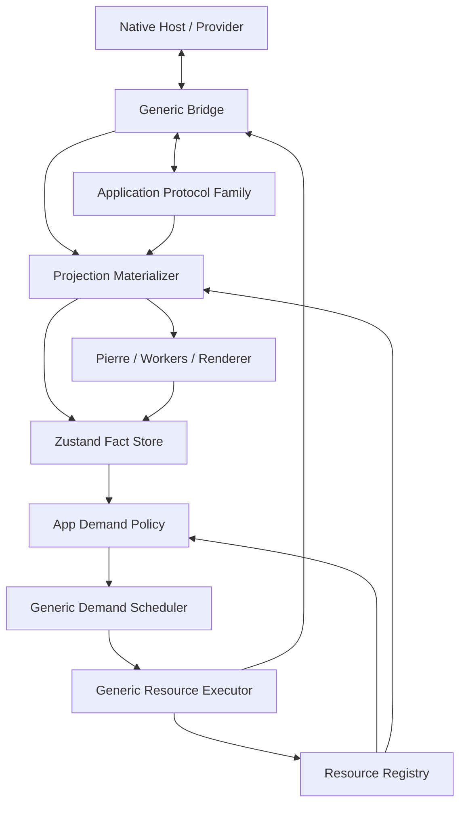

# Bridge Transport And App Protocol Architecture Spec

Date: 2026-06-22
Status: Reopened again for the 2026-06-25 shared BridgeViewer app goal. Gate 0.a
is still the first mandatory blocker, but it is no longer a FileViewer-only
renderer/layout correction. It must first prove one BridgeViewer app with shared
navigation/store state, Review and Files contexts, current-worktree dev-server
routes for Files, Review diff, and Review file target, and matching Agent Studio
Bridge/WKWebView proof before PR-ready. The full goal continues through
transport/protocol/scheduler implementation, Worktree/File and Review protocol
implementation, Pierre renderer cutover for both ReviewViewer and FileViewer,
and PR-ready non-merge wrapup.
Audience: product/design reviewers, Bridge implementers, Review Viewer maintainers, Worktree/File Surface maintainers, future agents

This is a product and architecture spec. It aligns the design before
implementation. It is not an implementation plan.

This parent file owns the generic Bridge contract and cross-protocol invariants.
Application-owned protocol details live in:

- [review-protocol.md](review-protocol.md)
- [worktree-file-surface-protocol.md](worktree-file-surface-protocol.md)

Goal-state context lives in:

- [details.md](/Users/shravansunder/Documents/dev/project-dev/agent-studio.bridge-start/tmp/workflow-state/2026-06-25-bridgeviewer-shared-app-pr-ready/details.md:1)
- [events.jsonl](/Users/shravansunder/Documents/dev/project-dev/agent-studio.bridge-start/tmp/workflow-state/2026-06-25-bridgeviewer-shared-app-pr-ready/events.jsonl:1)

## 0. Epic Gates And Review Context

This spec feeds a full PR-ready epic. Gate 0 is the first gate, not the final
scope.

Gate order:

1. Gate 0.a: shared BridgeViewer navigation/store and current-worktree product
   proof. Dev-server proof must cover:
   - Files context:
     `?fixture=worktree&viewer=file&workers=on&scenario=current-worktree`
   - Review diff context:
     `?fixture=worktree&viewer=review&workers=on&scenario=current-worktree`
   - Review file target:
     `?fixture=worktree&viewer=review&presentation=file&path=<path>&version=<base|head|current>&workers=on&scenario=current-worktree`
   The legacy `?fixture=worktree&workers=on&scenario=current-worktree` URL may
   default to Files context for compatibility, but it is not sufficient proof by
   itself. Gate 0.a must prove one BridgeViewer app, shared navigation/store
   state, primary Pierre CodeView/File canvas on the left, Pierre FileTree/right
   rail on the right, Shiki syntax highlighting, worker-backed highlighting path
   when workers are enabled, browser-visible controls, Review file-target
   behavior, Files-to-Review typed handoff, and negative-substitute assertions.
   Gate 0.a also records the native Agent Studio Bridge/WKWebView proof
   requirement: dev-server proof gets the product route honest first, but final
   PR-ready proof must show the same scenarios through the app-hosted Bridge
   surface against the local worktree.
2. Gate 1: generic Bridge transport/protocol/scheduler implementation.
3. Gate 2: Worktree/File and Review application protocol implementation.
4. Gate 3: Pierre/Review renderer rewrite/integration on the new
   transport/materialization/scheduler model.
5. Gate 4: PR-ready non-merge wrapup with proof pyramid, implementation review,
   checks, PR state, review-thread state, and mergeability freshly reported.

Every reviewer packet for this epic must include prior failure context. A
reviewer must be able to distinguish the old narrow green proof from the current
product red proof and must explicitly ask whether the submitted proof can pass
while the user-visible product is still wrong. Reviewer packets that omit this
context are incomplete.

## 1. Product Intent

Bridge should be generic transport infrastructure for app-owned web panes in
Agent Studio. Review is the first serious client, but Bridge must not become a
Review-specific IPC layer by accident.

The system must support:

- static DiffsHub-style review packages
- live review comparisons, such as base branch versus live worktree
- provider-owned changeset clusters, such as agent/session/time-window batches
- live worktree exploration through FileViewer with tree, file content, and git
  status in the same BridgeViewer shell
- future comments and agent communications anchored to the same Worktree/File
  Surface once their schema/permission slice exists
- demand-driven hydration of huge repos, huge diffs, and huge files
- a startup continuous event stream, similar in role to SSE or MCP-style server
  notifications, that carries source facts, invalidations, cursors, gaps,
  resets, and descriptor availability while heavy bodies stay on bounded
  resource/content paths
- real user-visible FileViewer proof, not only schema or test-harness proof:
  the dev-server route must render the same BridgeViewer UX shell and Pierre
  renderer stack as ReviewViewer, driven by a worktree source adapter rather
  than raw transport payloads, concatenated path dumps, or a custom `<pre>`
  mini-app

The design succeeds when large or live review/worktree/file surfaces can update
without whole-pane resets, eager full-data fetches, or unclear ownership.

## 2. Requirements

R1. Bridge must support multiple application protocol families.

Bridge carries protocol messages and resources. It does not know Review,
Worktree, File, Comment, or Agent Comms semantics.

R2. App protocols must own domain meaning.

Review owns comparison and package semantics. The Worktree/File Surface owns
tree, file content, status, comments, and agent-comms semantics. Bridge owns
transport mechanics only.

R3. Large data must stay out of Zustand.

Zustand stores facts, metadata, and references. File bytes, diff bytes, tree
windows, parsed renderer objects, streams, promises, abort controllers, worker
handles, and Pierre instances live outside Zustand.

R4. Transport pathways must be named and bounded.

Commands, signals, intake frames, and content streams have separate purposes.
Large bodies must move through the content/resource pathway, not through RPC,
events, or store updates.

R5. Source identity must be explicit.

Every live or finite stream must carry enough identity to reject stale frames,
stale resource completions, and cross-source descriptor reuse.

R6. Demand policy, scheduling, and backpressure must be explicit and separate.

Application demand policy decides which work matters now. Generic demand
scheduling orders lane queues. Generic backpressure limits execution pressure.
The lane is the bridge between app policy and generic execution.

R7. Provider authority must remain on the host/server side.

Git diff calculation, worktree watch classification, file source authority,
changeset clustering, and content descriptor issuance are provider concerns,
not browser concerns.

R8. Open file content must preserve reader continuity.

If a file is not open, live tree/status/descriptors may update continuously. If
a file is open and its backing source changes, the surface marks the content
stale and exposes refresh/update affordance instead of silently replacing the
reader's current content by default.

R9. Specs must feed a later implementation plan.

This spec defines boundaries, contracts, invariants, proof expectations, and
open decisions. It does not define task order or exact test commands.

R10. A continuous event stream is mandatory.

Bridge must establish one pane-scoped continuous event stream at startup or pane
mount for provider-to-browser facts. This stream is the default carrier for
compact source updates: subscription ready, invalidation, cursor, gap, reset,
descriptor availability, status, and heartbeat frames. It is SSE-like in
product role and MCP-like in command/event separation: browser commands remain
request/response, while provider facts arrive over the stream. The event stream
must not carry heavy file/diff/tree bodies; those remain descriptor-backed
content/resource transfers.

R11. Runtime proof must verify the actual visible app, not only payload shape.

A Worktree/File proof is invalid if the route renders raw frame text,
concatenated paths, missing CSS, or an unstructured payload dump while tests
still pass. Browser/dev-server proof must assert machine-checkable visible
signals: app root, tree pane, and file pane all have non-zero visible client
rects; sampled tree entries occupy distinct row boxes; selected file content
preserves visible line structure for exact-line-count fixtures; packaged styling
affects the mounted surface; and no raw transport payload, serialized frame
field, or raw path corpus is visible outside intentional tree/content UI.

R11 is not satisfied by a minimal two-pane file list plus `<pre>` content, even
if the file tree and content load correctly. The dev-server Files proof for
`?fixture=worktree&viewer=file&workers=on&scenario=current-worktree` must
exercise the intended FileViewer mode inside the shared BridgeViewer shell:
route/protocol identity, provider/source provenance, file click/open behavior,
Pierre FileTree right rail, Pierre CodeView/File item rendering,
Shiki-highlighted file content, worker-backed highlighting path when
`workers=on`, tree filtering controls, search text input, regex toggle behavior,
status/filter controls, refresh/stale affordance when applicable, large-tree
scroll stability, large-file scroll stability, and screenshot/DOM artifacts
reviewed against the visible product surface. This Files proof is only one slice
of Gate 0.a; the full gate also requires Review diff and Review file-target
proofs. The root mock Review route, Review package fixtures, custom
WorktreeFileApp scaffolds, raw `<pre>` renderers, and DOM-only content-ready
markers are prohibited substitutes for this FileViewer proof.

R11.a. UX checkpoint proof must be browser/native visible proof.

For BridgeViewer UX work, jsdom is not an accepted proof layer unless the user
explicitly requests a narrow lower-level state guard. It may supplement tests,
but it must not be cited as proving visible UX, layout, Pierre/Shiki rendering,
worker-backed behavior, search/filter controls, context switching, or scroll
behavior. UX checkpoint proof must use Vitest Browser, Playwright/dev-server,
or native Agent Studio/WKWebView proof as appropriate. Each visible-behavior
checkpoint must include screenshot or video artifacts, real interaction
assertions, and a second-agent visual/code onlook against the product contract.
The onlook must inspect both screenshots and relevant source paths before a
checkpoint can be accepted. A checkpoint that changes visible UI but has no
browser/native screenshot artifact and no independent onlook remains open even
if lower-level tests pass.

R12. Renderer cutover is a first-class architecture requirement.

The new transport/materialization system is not complete if Pierre, CodeView,
File, or tree rendering remain on an incompatible identity/remount model that
defeats same-lineage updates, stable scroll extent, descriptor-backed
hydration, Shiki highlighting, or worker-backed rendering. Plans may slice the
renderer cutover, but PR-ready status requires hard cutover for every in-scope
renderer entry path. A named residual gap can justify non-PR-ready status only;
it cannot satisfy the PR-ready gate. Cutover proof must include negative
assertions that covered ReviewViewer/FileViewer routes cannot reach the legacy
renderer/remount bypass or a custom `<pre>` file viewer bypass.

R13. Source adapters must respect repository ignore policy before publishing
viewer candidates.

Worktree/File and worktree-backed Review source adapters must apply gitignore
and repository ignore policy before descriptor, tree, or review-candidate
frames are emitted to the browser. Ignored files and directories must not appear
in FileViewer trees, ReviewViewer worktree comparison candidates, search
results, preloading queues, route bootstraps, or proof fixtures unless a later
explicit "show ignored files" product mode is accepted. This is a provider /
source-adapter boundary, not a client-side cosmetic filter: the browser may
filter already-admitted descriptors for search and mode controls, but it must
not be responsible for hiding ignored repo content from the canonical candidate
set. Production Swift/native source adapters must use the repo's
`agentstudio-git` library for git status, diff, ignore-policy, and candidate
preparation; TypeScript git helpers are allowed only in clearly marked Vite
dev-server utilities or test fixture utilities. Proof must include at least one
ignored path fixture and assert it is absent from FileViewer and worktree-backed
Review candidate surfaces.

R14. Bridge viewer modes must share one product shell.

`ReviewViewer` and `FileViewer` are viewer modes inside the same
`BridgeViewerApp`. `worktree`, `mock`, `reviewPackage`, `changeset`, and future
native providers are source adapters, not separate apps. FileViewer and
ReviewViewer may use different app protocols and materializers, but they must
share the product UX shell, Pierre FileTree/right rail, Pierre CodeView/File
renderer, Shiki theme/highlighting system, worker-pool integration, and
scroll/proof contract unless a later accepted spec explicitly splits a new
viewer mode. A route switch that mounts a standalone Worktree/File app is a
contract violation.

Bridge's default Pierre rendering setting is wrapped lines. The shared
BridgeViewer CodeView/File options must set Pierre `overflow: 'wrap'` by
default for Review diff targets, Review file targets, and Files file targets.
Pierre upstream defaults to `overflow: 'scroll'`, so Bridge must pass this
setting explicitly through the shared renderer options used by both
ReviewViewer and FileViewer. A future user setting may override this via
application state, but the default contract remains wrapped rendering.

The shared shell has one visual contract for both viewer modes. The source can
change and the active target can change, but the product surface must still feel
like one BridgeViewer app:

R15. File data includes metadata, and native providers own that metadata.

For Worktree/File and worktree-backed Review, file data is not limited to file
body bytes. It includes authoritative file-tree metadata, review-file metadata,
paths, names, parent/depth facts, file ids, directory facts, status/change
facts, size facts, line/extent facts, descriptor refs, invalidations, resets,
and deltas. Production Swift/native source adapters own production of these
metadata facts from filesystem/git truth, using `agentstudio-git` where git
truth is required. BridgeWeb JavaScript consumes, validates, materializes,
schedules interest, and renders these facts; it must not discover or synthesize
the authoritative file tree for native product surfaces. Vite/dev-server code
may mimic the same stream contract for fast testing, but it is an adapter and
proof loop, not the architecture source of truth.

R16. Metadata is a persistent stream with lane-aware interest, not a cold
background continuation.

The Worktree/File and Review metadata stream is long-lived for the accepted
source. Startup metadata, continuing manifest/tree rows, viewport ranges,
selected/open target facts, descriptor availability, status changes, filesystem
updates, git updates, invalidations, resets, and replacement facts all flow over
the persistent event/intake stream lineage. Browser demand for metadata is a
compact interest/control signal into that existing source stream: selected/open
targets are `foreground`, current viewport ranges are `visible`, adjacent and
scroll-direction ranges are `nearby`, predictions are `speculative`, and full
manifest completion is `idle`. These lane signals prioritize which metadata the
provider emits next; they do not authorize browser-side file discovery and they
do not move metadata into body/resource blobs. Metadata needed to paint a
selected or visible tree/review row must not sit behind idle manifest crawling
or content warming.

R17. Content streams are body/range streams, separate from metadata streams.

File text, diff text, markdown source, large file ranges, and other body bytes
move through descriptor-backed `ContentStreamPath` resources. Content streams
may use the same generic lane vocabulary and backpressure model, but they must
not block metadata needed for the tree, scroll extent, selected/open target, or
descriptor readiness. Metadata can reference content descriptors; content
streams cannot become the first place the browser learns the authoritative file
tree or review manifest.

R17.a. BridgeWeb data controllers mount outside lazy visual shells.

The BridgeViewer app frame owns durable mode hosts. FileView and Review
metadata stream controllers, materializers, demand-lane state, lightweight
stores, selection/open state, and metrics snapshots must mount independently
from lazy/Suspense visual shells. Lazy loading is allowed for visual shell code,
Pierre renderer adapters, chrome, and heavy renderer modules. It is not allowed
to gate source subscription, metadata intake, demand-lane interest, last-good
projection state, or context memory. Switching FileView and Review must not
tear down the active source manifest, blank the tree because a visual chunk is
loading, or reload title/header/chrome that is already app-frame state.

Zustand is the browser control-plane store for stream and view facts. It may
store source identity, stream status, cursors, generations, tree/review metadata
facts, descriptor refs, selected/open/visible state, lane queue/in-flight facts,
stale/drop/error facts, and small timing snapshots. It must not store file
text, diff text, raw bytes, stream objects, `AbortController` instances,
workers, schedulers/executors, Pierre instances, or other content/runtime
bodies.

R17.b. Native proof must include a headless Swift-plane manifest benchmark.

Native correctness is not proven only by Vite parity, browser screenshots, or a
WKWebView visual smoke. The Swift plane must have a headless e2e/benchmark
harness that opens Worktree/File and worktree-backed Review sources from the
current worktree, observes emitted metadata frames and demand decisions, and
proves:

- all non-ignored files eventually appear in the metadata manifest;
- the artifact records how each row arrived: initial window, foreground,
  visible, nearby, speculative, idle continuation, delta, reset, or replacement;
- selected/open and visible metadata are emitted before idle manifest
  continuation under pressure;
- full-manifest completion continues with a no-starvation budget while
  selected/visible work remains responsive;
- content descriptor publication and content stream demand remain separate from
  metadata frame production;
- p95 and p99 are reported for native open-to-first-window,
  metadata-interest-to-frame, full-manifest-complete, queue-wait-by-lane,
  metadata apply, and content fetch phases.

The same protocol shape must then be proven through native WKWebView product
proof. The headless Swift plane is the fast native truth loop; Vite/dev-server
is a parity adapter and cannot satisfy native manifest completeness or native
lane-order proof by itself.

```text
BridgeViewerAppShell
  ┌──────────────────────────────────────────────────────────────┬─────────────┐
  │ left content region                                          │ right rail  │
  │ ┌──────────────────────────────────────────────────────────┐ │             │
  │ │ source/title on left        Files | Review + actions     │ │ compact     │
  │ └──────────────────────────────────────────────────────────┘ │ Pierre tree │
  │ primary Pierre CodeView/File canvas                          │ toolbar     │
  │   Review diff target  -> Pierre diff items                   │ selection   │
  │   Review file target  -> Pierre/Shiki file item              │ status      │
  │   Files file target   -> Pierre/Shiki file item              │ expansion   │
  └──────────────────────────────────────────────────────────────┴─────────────┘
```

Accepted decision C: the BridgeViewer shell has one content header, and that
header belongs only to the left content region. The source/title sits on the
left of that header. The `Files | Review` switcher and content actions sit on
the right of that same header. The Pierre right rail is not part of the header;
it stays full-height and top-aligned. This is the accepted content-header
layout. The header is a row inside the left content region, not a full-window
toolbar:

```text
full viewer width
┌──────────────────────────────────────────────────────────────┬─────────────┐
│ content header: title left, mode/actions right               │ right rail  │
├──────────────────────────────────────────────────────────────┤ starts here │
│ content canvas                                               │ at y = 0    │
└──────────────────────────────────────────────────────────────┴─────────────┘
```

The following are explicit failures, even when data loads:

- a black or themed strip spanning the full viewport above the right rail;
- a centered/floating `Files | Review` switcher detached from the content
  header;
- a right-rail toolbar pushed down by content-header height;
- a Files-only toolbar/search row with larger buttons than ReviewViewer rail
  controls;
- duplicate search/filter controls where FileViewer and ReviewViewer use
  different primitives for the same interaction.

The content header is not app-wide chrome. It belongs only to the left content
region, must not cover the right rail, and must not push the right rail down.
The right rail starts at the top of the viewer and owns its own compact toolbar.
The content header has two slots:

- left slot: a compact title using the `source / selected target` form in dev
  proof, for example `dev-worktree-source / .github/workflows/ci.yml`;
- right slot: the shared context switcher (`Files | Review`) plus mode-specific
  content actions, sized like the ReviewViewer/DiffsHub controls.

Accepted decision C uses "top right" to mean the right slot of the left content
header, not the top right of the full viewport. The mode switcher belongs beside
the content actions in that right slot. It must not float in the middle of the
viewport, sit in a separate full-width strip, or move into the right rail. The
containing header still ends at the left edge of the right rail. The current
accepted layout is therefore: title/source left, switcher and content actions
right inside the content header, right rail independent and top-aligned.

The header/canvas/rail geometry is part of the proof contract:

- content header `left` equals content canvas `left`;
- content header `right` is less than or equal to right rail `left`;
- content canvas `top` is greater than or equal to content header `bottom`;
- right rail `top` is not pushed down by the content header;
- FileViewer, Review diff, and Review file-target routes satisfy the same
  geometry.

The visible chrome size contract is also part of the proof contract. A passing
route/layout proof is not enough if these rows are wrong:

- the content header height and the right-rail toolbar height must match within
  the same rendered pixel row across FileViewer, Review diff, and Review
  file-target routes;
- the content header and right-rail toolbar must use the same chrome background,
  bottom border color, vertical padding rhythm, and top-edge alignment;
- icon buttons in the content header and right rail must share one compact
  visual box size, icon size, focus ring treatment, hover fill, active fill, and
  border radius;
- the `Files | Review` segmented control must align to the same height and
  selected-fill rhythm as the adjacent top-bar buttons; it must not render as a
  larger standalone switcher;
- the title/provenance text must be a compact single-line label in the content
  header's left slot. It uses `mode source / selected target`, truncates inside
  that slot, and must not create a taller header or duplicate rail metadata;
- the right rail toolbar must not show visible count/source metadata such as
  `480/480 dev-worktree-source...`. File counts and source provenance may be
  exposed through sr-only status text, data attributes for proof, tooltips, or a
  later approved compact status/footer surface, but not as visible prose in the
  rail toolbar row;
- visual proof must record measured content-header height, rail-toolbar height,
  representative content-button boxes, rail-button boxes, and switcher box
  geometry. Screenshot review must compare those rows explicitly.

The content header, context switcher, and rail controls must use the same
BridgeViewer shared chrome primitive layer and compact sizing that ReviewViewer
uses where applicable. The neutral ownership name is BridgeViewer shared
chrome, not ReviewViewer chrome. ReviewViewer is the current style baseline,
but shared controls must not permanently live behind Review-namespaced
component owners once FileViewer consumes them. The ReviewViewer right rail is
the current sizing/style baseline:
button height, icon size, toolbar rhythm, borders, colors, and text scale must
match for FileViewer unless functionality requires a different enabled action.
Shared primitives must use owned shadcn-style source primitives from
`BridgeWeb/src/components/ui/` for reusable React controls. `ToggleGroup` is the
accepted primitive family for compact option-set controls such as `Files |
Review` and the Review projection mode selector unless implementation-time
source inspection finds an equivalent owned shadcn primitive already in the
repo. If the required primitive does not exist locally, add the shadcn-style
primitive source there, edit that owned component for Agent Studio product
tokens and sizing, then compose it through a feature-neutral BridgeViewer/shared
wrapper. Base shadcn/base UI is a primitive substrate, not permission for
route-local visual language. A route-local custom segmented control, toggle,
button, menu, input, or toolbar widget cannot close a visible UX checkpoint when
the interaction is a reusable UI primitive.
FileViewer must not introduce route-local raw buttons, custom oversized icon
buttons, separate input chrome, or a separate visual scale for the same
interaction semantics.
A shared control should be visually interchangeable across FileViewer and
ReviewViewer at the same zoom level: button heights, icon box sizes, selected
state, focus ring, border treatment, and spacing should match unless a mode has
a concrete interaction that the other mode does not expose. The proof should
compare controls in screenshots, not only DOM attributes, because a component
can technically share a primitive while still rendering at the wrong scale.
A FileViewer-only search row, raw buttons, oversized custom icon buttons, or
route-local chrome can exist only as an explicit temporary failing state while
the checkpoint is being developed; it cannot satisfy Gate 0.a. Review mode and
Files mode may expose different enabled actions, but placement, primitive
layer, and visual language must be coherent with each other and with the
DiffsHub/Pierre reference behavior.

Review-namespaced chrome may appear only as an explicitly tracked failing
intermediate state during a local refactor. It cannot close a visible UX
checkpoint. Gate 0.a proof must verify that FileViewer and ReviewViewer render
shared interaction semantics through neutral BridgeViewer shared primitives over
the existing shadcn/base UI substrate. The end-state code must not leave shared
app chrome named or owned as Review-only if FileViewer depends on it.
The forbidden ownership edge is: shared BridgeViewer shell/header/context
switcher/rail-control code must not import Review-only chrome modules as its
permanent implementation. Shared chrome belongs under the neutral BridgeViewer
or shared UI ownership boundary and may compose shadcn/base UI primitives plus
Pierre-provided surfaces. Review and Files may import the shared primitives;
shared primitives must not depend on Review-owned chrome through re-export
wrappers or aliases.

R18. Bridge viewer navigation state is app state, not route shape.

The Browser app owns a single navigation/view store. Zustand is the source of
truth for active source refs, active viewer context, active target, rail
search/filter/expansion/selection state, canvas scroll anchors, and
loading/stale/error facts. Zustand must not store large file bodies, raw diff
bodies, worker instances, Pierre instances, stream handles, or resource
executors. `ReviewViewer` and `FileViewer` are contexts in this store, not
separate application roots.

The app has a context toggle:

```text
BridgeViewerApp
  active context: Review | Files
  per-context memory:
    source identity and comparison/source refs
    selected target
    rail search/filter/expanded paths/selected path/scroll
    canvas scroll anchor
```

Only the active context may create foreground demand, user-visible loading
state, and route-level telemetry for the current interaction. An inactive
mounted context may retain memory, cache already-materialized refs, keep
projection order/materialized item identity, and accept explicit lifecycle
invalidations, but it must not start new foreground content fetches, keep stale
subscriptions alive as user-visible work, or mutate visible selection/loading
state. Projection coordinators are retention/model work, not foreground content
hydration: they may keep the inactive context's item order usable so switching
back does not collapse into an unavailable projection. Visible content
hydration, selected-content fetches, control listeners, preview workers,
route-level foreground telemetry, and `mark viewed`-style user effects must be
paused, cancelled, or stale-dropped while inactive. If an inactive context needs
to preserve liveness beyond retained projection memory, its work must be
downgraded to an explicit background/speculative lane with source, generation,
and active-context stale-drop checks. Hidden ReviewViewer or FileViewer side
effects are therefore a production blocker unless proof shows they are paused,
cancelled, or safely downgraded.

Targets drive the content canvas independently from context:

```text
Review context + diff target  -> review rail + Pierre diff canvas
Review context + file target  -> review rail + Pierre/Shiki file canvas
Files context  + file target  -> file rail + Pierre/Shiki file canvas
Files context  + diff target  -> future affordance only; it must bind to
                                  Review/comparison identity and must not be
                                  satisfied from Worktree/File protocol data
                                  alone
```

There is no rich preview target in the current scope. Text-like file viewing,
including markdown in this gate, uses the Pierre/Shiki file rendering path.

Review file targets must remain Review-owned even when the selected file path
originates from Worktree/File exploration or a dev query parameter. A Review
file-target route/proof must include the accepted Review comparison identity,
source identity, selected review item or file ref, version, and target kind.
Path-only proof is insufficient because it can accidentally prove a Worktree/File
content load while bypassing the Review comparison boundary.

Dev-server query parameters are a dev-only adapter into the same store, not the
production navigation API. Swift production navigation uses internal
BridgeViewer intents/commands to mutate the same store through the Bridge host
boundary. Product behavior must not depend on user-visible query parameters.

The shared navigation contract is protocol-neutral and must be the only state
mutation surface for dev query params, Review UI actions, Worktree/File UI
actions, and Swift-hosted Bridge commands:

```ts
export const BridgeViewerContextSchema = z.enum(['files', 'review']);

export const BridgeViewerFixtureSourceRefSchema = z.object({
  sourceKind: z.literal('fixture'),
  sourceId: z.string().min(1),
  generation: z.string().min(1).optional(),
  cursor: z.string().min(1).optional(),
}).strict();

export const BridgeViewerWorktreeSourceRefSchema = z.object({
  sourceKind: z.literal('worktree'),
  sourceId: z.string().min(1),
  generation: z.string().min(1).optional(),
  cursor: z.string().min(1).optional(),
}).strict();

export const BridgeViewerReviewComparisonSourceRefSchema = z.object({
  sourceKind: z.literal('reviewComparison'),
  sourceId: z.string().min(1),
  comparisonId: z.string().min(1),
  generation: z.string().min(1).optional(),
  cursor: z.string().min(1).optional(),
}).strict();

export const BridgeViewerSourceRefSchema = z.discriminatedUnion('sourceKind', [
  BridgeViewerFixtureSourceRefSchema,
  BridgeViewerWorktreeSourceRefSchema,
  BridgeViewerReviewComparisonSourceRefSchema,
]);

export const BridgeViewerFileTargetSchema = z.object({
  targetKind: z.literal('file'),
  fileRef: z.object({
    path: z.string().min(1),
    sourceId: z.string().min(1),
  }).strict(),
  version: z.enum(['base', 'head', 'current']),
  reviewItemId: z.string().min(1).optional(),
  comparisonId: z.string().min(1).optional(),
}).strict();

export const BridgeViewerDiffTargetSchema = z.object({
  targetKind: z.literal('diff'),
  comparisonId: z.string().min(1),
  reviewItemId: z.string().min(1),
  fileRef: z.object({
    path: z.string().min(1),
    sourceId: z.string().min(1),
  }).strict().optional(),
}).strict();

export const BridgeViewerTargetSchema = z.discriminatedUnion('targetKind', [
  BridgeViewerFileTargetSchema,
  BridgeViewerDiffTargetSchema,
]);

export const BridgeViewerNavigationCommandSchema = z.object({
  commandId: z.string().min(1),
  commandKind: z.enum(['initialize', 'activateContext', 'activateTarget']),
  context: BridgeViewerContextSchema,
  source: BridgeViewerSourceRefSchema,
  target: BridgeViewerTargetSchema.optional(),
  restoreMemory: z.boolean().default(true),
}).strict();

export const BridgeViewerNavigationOutcomeSchema = z.discriminatedUnion('kind', [
  z.object({
    kind: z.literal('accepted'),
    commandId: z.string().min(1),
    activeContext: BridgeViewerContextSchema,
  }).strict(),
  z.object({
    kind: z.literal('rejected'),
    commandId: z.string().min(1),
    reason: z.enum(['invalidSource', 'invalidTarget', 'unsupportedContext', 'staleCommand']),
  }).strict(),
]);
```

Review-context navigation has an additional invariant because a file target in
Review is not equivalent to a Worktree/File open. Caller input from Worktree,
Files, or dev query parameters starts as selector intent only. A
`source.sourceKind === 'reviewComparison'` command is valid only after Review
has accepted that selector and returned comparison authority. When
`BridgeViewerNavigationCommand.context === 'review'` and
`target.targetKind === 'file'`:

- `source.sourceKind` must be `reviewComparison`;
- `source.comparisonId` is the accepted Review comparison authority;
- `target.comparisonId`, when present, must equal `source.comparisonId`;
- `target.reviewItemId`, when present, is the preferred item resolution key;
- if `target.reviewItemId` is absent, `target.fileRef + target.version` must
  resolve only inside the accepted Review comparison/source lineage;
- a path from a query parameter or Worktree/File handoff is only a bootstrap
  hint until the Review provider returns the accepted comparison and target.
- an explicit Review file target that is hidden by retained Review rail search
  or filters must clear the conflicting search/filter refinements before
  selection; silently selecting a hidden item or falling back to the first
  visible projected item is a bug.

The dev query adapter must produce `BridgeViewerNavigationCommand`; it must not
select React roots directly. The Swift host must send the same command shape
through Bridge host wiring and observe `BridgeViewerNavigationOutcome` before a
native proof can claim the route is loaded.

R19. Review handoff from Worktree/File is in current scope and must be explicit.

The shared-app Gate 0.a goal requires a Files-context action that opens Review in
the same BridgeViewer app. The handoff must be a typed app-composition contract:
Worktree/File emits an `OpenReviewComparisonIntent`, Review validates the intent
and resolves a provider-owned `ReviewComparisonSpec`, and the Review provider
computes/materializes the comparison. Only after Review returns an accepted
outcome may app composition create a `reviewComparison`
`BridgeViewerNavigationCommand`. Worktree/File must not become the diff engine,
must not mint Review comparison/source identity, and this handoff cannot remain
an invisible optional idea. Accepted
handoff switches active context to Review through
`BridgeViewerNavigationCommand`, records accepted Review comparison/target
identity, and preserves Files-context memory for toggle-back.

## 3. Non-Goals

This spec does not:

- adopt MCP wholesale
- redesign Agent Studio authentication
- implement source mutation through Bridge resource streams
- make Pierre aware of Bridge URLs or application descriptors
- turn Zustand into a data cache
- make the browser calculate Git diffs
- force worktree exploration through the Review package/diff model
- split Worktree and FileView into separate user-facing apps
- split FileViewer from the shared BridgeViewer shell or reimplement file
  rendering outside Pierre/Shiki/workers
- define implementation task order
- choose exact concurrency numbers before implementation profiling, but it does
  require a profiling and telemetry gate before production tuning is called
  complete

## 4. Architecture Spine

Bridge carries typed application protocols through bounded RPC, a mandatory
continuous event stream, typed intake streams, and finite content/resource
streams.
Application projection materializers turn intake frames into projection facts,
references, and render deltas. Application demand policies decide what is
useful now and map app-specific interest onto generic urgency lanes. A generic
demand scheduler orders lane queues. A generic resource executor runs bounded
work under backpressure. Renderers consume prepared data.

```text
Native Host / Provider
  owns: pane lifetime, provider authority, filesystem/Git authority,
        app assets, resource validation, authoritative metadata production
  exposes: BridgeTransportHost

        │ typed transport envelopes, source metadata frames,
        │ resource descriptors, streams
        ▼

Generic Bridge
  owns: RPC/event/intake/resource carriers, stream ids, cursor checks,
        cancellation, parser limits, source-scrubbed errors
  exposes: Command RPC Path, Continuous Event Stream Path, Intake Stream Path,
           Content Stream Path
  does not own: review/worktree/file/comment semantics

        │ protocol-scoped frames and commands
        ▼

Application Protocol Family
  examples:
    Review Protocol
    Worktree/File Surface Protocol
  owns: source specs, domain commands, intake frame schemas,
        materialization identity, app-specific invalidation semantics,
        metadata interest vocabulary
  exposes: projection materializer, app demand policy, descriptors,
           viewer-mode input

        │ facts, references, render deltas, resource intents
        ▼

Browser Runtime
  owns: Zustand facts/refs, registries, demand scheduler,
        resource executor, shared BridgeViewer shell, renderer adapters,
        Pierre integration
  does not own: native file-tree metadata production
```



## 5. Transport Pathways

`CommandRPCPath`

: Request/response for commands, small facts, and descriptors. It is the path
  for "open stream", "select item", "get descriptor", "refresh content", and
  "cancel". It also carries compact browser-to-provider interest updates such as
  selected path, visible tree range, expanded subtree, adjacent range, or
  speculative target when those updates are needed to prioritize the existing
  persistent metadata stream. It must not carry large bodies or authoritative
  file-tree metadata payloads.

`ContinuousEventStreamPath`

: Mandatory pane-scoped stream established at startup or pane mount. It carries
  compact provider-to-browser facts: subscription readiness, invalidations,
  cursors, heartbeats, gap notices, reset notices, descriptor availability,
  source status, and stream lifecycle events. It says something changed or a
  descriptor is available; it does not fetch the changed body itself.

  This path is SSE-like in role: one long-lived server-to-client notification
  lane that updates app facts and wakes demand. It is not a universal heavy-data
  pipe. Browser commands still use `CommandRPCPath`; large bodies still use
  `ContentStreamPath`.

`IntakeStreamPath`

: Typed application stream into a projection materializer. It carries ordered
  frames such as review snapshots/deltas, worktree snapshots/tree windows/status
  patches/file descriptors, or rich app-specific invalidation/reset details. It
  can be finite or continuous. For Worktree/File and worktree-backed Review,
  file-tree/review-tree metadata arrives here as streamed metadata facts from
  the native provider. It is not a browser-produced tree, and it is not a
  descriptor-backed metadata blob that must be fetched before FileTree can
  render.

`ContentStreamPath`

: Bounded body/window transfer for file text, diff text, markdown source, large
  file ranges, and other body bytes. It is exposed through an opaque
  `agentstudio://resource/...` URL or equivalent stream descriptor. It is not
  the carrier for authoritative file-tree metadata.

`AppSourceSubscription`

: App protocol pattern for a source that can change over time. It is built over
  the continuous event, intake, and content pathways. Review and Worktree/File
  Surface subscriptions use the same Bridge transport primitives but own
  different app semantics.

Source subscription control flow:

```text
Browser starts pane
  -> Bridge opens ContinuousEventStreamPath
  -> browser sends CommandRPCPath open/subscribe request
  -> provider validates and returns stream ids / accepted source ack
  -> provider publishes compact lifecycle/update facts on ContinuousEventStreamPath
  -> provider publishes typed metadata/projection frames on IntakeStreamPath
     when source materialization changes
  -> browser sends compact metadata interest updates for selected/open/visible/
     nearby/speculative/idle source ranges
  -> provider reorders metadata frame production on the persistent stream
  -> app demand policy schedules only demanded body descriptors
  -> ResourceExecutor fetches body/range bytes over ContentStreamPath
```

The continuous event stream must define:

- stream id and pane/source identity
- ready and heartbeat frames
- monotonically ordered cursor or sequence semantics
- gap/reset frames and recovery rules
- cancellation/close behavior
- bounded buffer and memory rules
- source-scrubbed error frames
- parser fixture parity between Swift and TypeScript

Normative event-versus-intake split:

- `ContinuousEventStreamPath` is the only carrier for compact provider
  lifecycle/update facts: ready, heartbeat, source status, descriptor available,
  invalidation notice, gap, reset, and close. These events wake app policy,
  update small facts, and define cursor lineage. They do not carry file bodies,
  diff bodies, or other content bytes. The provider-to-browser stream surface is
  the event stream plus the matching app intake stream; Vite and native Swift
  must expose the same browser-visible contract.
- `IntakeStreamPath` carries app metadata/projection frames: Review metadata
  snapshots/windows/deltas and Worktree/File source snapshots/tree windows/tree
  deltas/status patches/file descriptors. These frames stream the facts needed
  to build tree/projection/scroll state; they are not a body-resource shortcut
  and they are not allowed to point at one full startup package/tree blob before
  useful UI can render.
- Worktree/File tree metadata and worktree-backed Review file metadata are
  native-provider-produced file data. Vite/dev-server TypeScript may emulate the
  same stream for proof, but production BridgeWeb must not replace the native
  provider by scanning or authoritatively synthesizing the file tree in JS.
- Browser-to-provider metadata interest messages are control inputs into the
  persistent stream scheduler. They carry range/path/subtree interest and lane
  priority, not metadata bodies.
- `descriptorAvailable` on the event stream points at a registered descriptor or
  at the next intake frame that attaches the descriptor. It does not duplicate
  descriptor bodies or metadata/projection payloads.
- `invalidation`, `gap`, `reset`, and `close` events on the continuous stream
  are the authoritative lifecycle facts. App-specific intake frames may carry
  richer invalidation/reset details only after the event stream has established
  the same `streamId`, `sourceId`, `generation`, and `cursor` lineage.
- If the continuous event stream gaps, resets, or closes, app intake and content
  work for the affected identity must rebind or fail closed. A one-off push
  helper, polling refresh, or protocol-local stream without this lifecycle
  binding fails the spec even if it can render data.

## 6. Generic Contracts

The schema examples are architecture contracts. Exact implementation placement
can vary, but the fields and invariants must be represented.

```ts
import { z } from 'zod';

export const BridgeProtocolId = z.enum([
  'bridge.system',
]).or(z.string().regex(/^[a-z][a-zA-Z0-9]*([.-][a-z][a-zA-Z0-9]*)*$/));

export const BridgeResourceKind = z.string().regex(
  /^[a-z][a-zA-Z0-9]*([.-][a-z][a-zA-Z0-9]*)*$/,
);

export const BridgeIntegrityDescriptor = z.discriminatedUnion('kind', [
  z.object({
    kind: z.literal('wholeHash'),
    algorithm: z.enum(['sha256']),
    value: z.string().min(1),
  }).strict(),
  z.object({
    kind: z.literal('chunkManifest'),
    algorithm: z.enum(['sha256']),
    manifestResourceId: z.string().min(1),
  }).strict(),
  z.object({
    kind: z.literal('previewOnly'),
  }).strict(),
]);

export const BridgeTraceContext = z.object({
  traceparent: z.string().optional(),
  spanId: z.string().optional(),
}).strict();

export const BridgeIdentity = z.object({
  paneId: z.string().min(1),
  protocol: BridgeProtocolId,
  sourceId: z.string().min(1).optional(),
  packageId: z.string().min(1).optional(),
  generation: z.number().int().nonnegative().optional(),
  revision: z.number().int().nonnegative().optional(),
  streamId: z.string().min(1).optional(),
  cursor: z.string().min(1).optional(),
}).strict();

export const BridgeRpcRequest = z.object({
  jsonrpc: z.literal('2.0'),
  id: z.string().min(1),
  protocol: BridgeProtocolId,
  method: z.string().min(1),
  params: z.unknown(),
  identity: BridgeIdentity.optional(),
  limits: z.object({
    maxRequestBytes: z.number().int().positive(),
    maxResponseBytes: z.number().int().positive(),
  }).strict(),
  trace: BridgeTraceContext.optional(),
}).strict();

export const BridgeIntakeFrameBase = z.object({
  streamId: z.string().min(1),
  generation: z.number().int().nonnegative(),
  sequence: z.number().int().nonnegative(),
}).strict();

export const BridgeDescriptorRef = z.object({
  descriptorId: z.string().min(1),
  expectedProtocol: BridgeProtocolId,
  expectedResourceKind: BridgeResourceKind,
  expectedIdentity: BridgeIdentity,
}).strict();

export const BridgeEventFrameBase = z.object({
  streamId: z.string().min(1),
  sequence: z.number().int().nonnegative(),
  cursor: z.string().min(1),
  protocol: BridgeProtocolId,
  identity: BridgeIdentity,
  trace: BridgeTraceContext.optional(),
}).strict();

export const BridgeEventFrame = z.discriminatedUnion('eventType', [
  BridgeEventFrameBase.extend({
    eventType: z.literal('bridge.ready'),
    payload: z.object({
      acceptedProtocolIds: z.array(BridgeProtocolId),
      serverCursor: z.string().min(1),
    }).strict(),
  }).strict(),
  BridgeEventFrameBase.extend({
    eventType: z.literal('bridge.heartbeat'),
    payload: z.object({
      observedCursor: z.string().min(1),
    }).strict(),
  }).strict(),
  BridgeEventFrameBase.extend({
    eventType: z.literal('bridge.sourceStatus'),
    payload: z.object({
      status: z.enum(['current', 'stale', 'degraded', 'recovering']),
      reason: z.string().min(1).optional(),
    }).strict(),
  }).strict(),
  BridgeEventFrameBase.extend({
    eventType: z.literal('bridge.descriptorAvailable'),
    payload: z.object({
      descriptorRef: BridgeDescriptorRef.optional(),
      intakeStreamId: z.string().min(1).optional(),
      intakeSequence: z.number().int().nonnegative().optional(),
    }).strict(),
  }).strict(),
  BridgeEventFrameBase.extend({
    eventType: z.literal('bridge.invalidated'),
    payload: z.object({
      scope: z.enum(['source', 'projection', 'descriptor', 'file', 'status']),
      descriptorRef: BridgeDescriptorRef.optional(),
      reason: z.enum(['sourceChanged', 'watchEvent', 'lineageReplaced', 'unknown']),
    }).strict(),
  }).strict(),
  BridgeEventFrameBase.extend({
    eventType: z.literal('bridge.gap'),
    payload: z.object({
      expectedSequence: z.number().int().nonnegative(),
      observedSequence: z.number().int().nonnegative(),
      recovery: z.enum(['resetRequired', 'boundedReplayAvailable']),
    }).strict(),
  }).strict(),
  BridgeEventFrameBase.extend({
    eventType: z.literal('bridge.reset'),
    payload: z.object({
      reason: z.enum(['sourceChanged', 'subscriptionReset', 'providerRestart', 'authorityChanged']),
      replacementCursor: z.string().min(1).optional(),
      replacementStreamId: z.string().min(1).optional(),
    }).strict(),
  }).strict(),
  BridgeEventFrameBase.extend({
    eventType: z.literal('bridge.closed'),
    payload: z.object({
      reason: z.enum(['normal', 'cancelled', 'stale', 'error']),
    }).strict(),
  }).strict(),
]);

export const BridgeResourceDescriptor = z.object({
  descriptorId: z.string().min(1),
  protocol: BridgeProtocolId,
  resourceKind: BridgeResourceKind,
  resourceUrl: z.string().min(1),
  identity: BridgeIdentity,
  content: z.object({
    mediaType: z.string().min(1),
    encoding: z.enum(['utf-8', 'binary']).optional(),
    expectedBytes: z.number().int().nonnegative().optional(),
    maxBytes: z.number().int().positive(),
    integrity: BridgeIntegrityDescriptor.optional(),
  }).strict(),
  window: z.object({
    start: z.number().int().nonnegative().optional(),
    count: z.number().int().positive().optional(),
    maxCount: z.number().int().positive(),
  }).strict().optional(),
}).strict();

export const BridgeAttachedResourceDescriptor = z.object({
  ref: BridgeDescriptorRef,
  descriptor: BridgeResourceDescriptor,
}).strict();
```

Generic contract invariants:

- Protocol ids and resource kinds are registered by app protocols. Generic
  Bridge validates that a protocol/kind pair is registered and fail-closed; it
  does not hardcode Review or Worktree/File semantics.
- RPC validates protocol and method before execution.
- Protocol registrations provide method, event, intake-frame, and resource-kind
  schemas plus size classes. `params` and event `payload` are unknown only at
  the generic carrier boundary; they must be decoded by the registered protocol
  before dispatch.
- Every protocol boundary has an explicit strict contract test in both
  directions:
  - browser-to-host RPC/input fixtures are decoded by Swift and rejected on
    missing required fields, unknown fields, wrong protocol ids, or invalid
    enum values;
  - host-to-browser RPC results and intake/output frames are emitted by Swift,
    accepted by the TypeScript Zod schema, and rejected by Zod on malformed
    protocol ids, unknown fields, or missing identity;
  - no BridgeViewer protocol may rely on `unknown`, unchecked casts, raw JSON
    passthrough, or fixture-only equality as the only contract proof.
- RPC returns descriptors for large data.
- Intake and event streams preserve order with `streamId`, `sequence`, and
  `cursor`; app intake for a source must bind to the same source identity and
  generation as the continuous event lineage.
- Sequence gaps fail closed into gap/reset recovery.
- Resource descriptors include stale-drop identity and hard size/window limits.
- Descriptor refs must bind expected protocol, kind, pane/source/package
  identity, limits, and cursor before fetch or commit.
- A provider that minted a descriptor for an accepted source cursor must be able
  to serve that descriptor's body by descriptor/cursor authority without
  re-materializing the whole source first. Source refresh may mint a newer
  cursor and reject older descriptors after that newer surface is accepted, but
  content fetch for the already-accepted descriptor cannot depend on a fresh
  worktree-wide scan.
- A protocol frame that introduces a new schedulable descriptor must carry a
  `BridgeAttachedResourceDescriptor` or reference a descriptor attached earlier
  in the same accepted stream lineage. The Bridge runtime registers attached
  descriptors before materializer or app demand policy runs.
- `BridgeAttachedResourceDescriptor.ref` must match the attached descriptor's
  id, protocol, resource kind, and identity. Mismatches fail closed.
- App protocols must not turn raw descriptor id strings into fetchable demand.
  Demand policy only receives `BridgeDescriptorRef` values that came from the
  accepted descriptor registry.
- Resource URLs are opaque to UI and never expose raw paths as authority.
- Async results commit only if their identity is still current.

### 6.1 Required Identity Matrix

| Domain entity | Required stale-drop identity |
| --- | --- |
| Review package | pane id, protocol id, provider-issued package id, generation, revision or content handle/hash, stream cursor |
| Review item/content | Review package identity plus stable item id and content descriptor id |
| Review delta operations | Review package id, generation, from revision, to revision, ordered stream sequence, typed semantic operations, stream cursor |
| Worktree tree projection | pane id, protocol id, provider-issued source id, subscription generation, source cursor, tree window key |
| Worktree file descriptor | Worktree source identity, provider-issued file id, content handle, optional content hash |
| Worktree open file session | open file session id, file descriptor id, render content key, latest known descriptor id |
| Comment/comms future anchor | source identity, file id/path, range model, content hash policy, thread/message id |

If the required identity cannot be proven at frame or resource completion time,
the result must be dropped or force a protocol reset.

## 7. Resource URL Contract

Canonical URL:

```text
agentstudio://resource/<protocol>/<resourceKind>/<opaqueId>?generation=<n>&revision=<n>&cursor=<opaque>
```

Parser rules:

- unknown protocol fails closed
- unknown resource kind fails closed
- duplicate query key fails closed
- unknown query key fails closed
- invalid generation/revision fails closed
- malformed cursor fails closed
- path traversal fails closed
- read resources allow only `GET` and optional `HEAD`
- Swift and TypeScript share accept/reject fixtures for this grammar

`agentstudio://resource/...` may be backed by WKURLSchemeHandler or another
host/browser stream carrier. The protocol contract is streaming-capable and
bounded; the implementation plan chooses the concrete carrier after proof.

### 7.1 Capability URL Authority

Resource URLs are bearer capabilities. Authority lives in a host-side lease
table, not in URL text.

Required lease binding:

- issued-for `paneId`
- protocol id and resource kind
- source/package identity
- generation/revision/cursor when present
- descriptor id
- max bytes/window limits
- expiry or explicit revocation

Required rejection cases:

- cross-pane replay
- wrong protocol or resource kind
- old generation/revision/cursor
- fetch after source reset
- fetch after descriptor revocation/cancel
- URL appearing in DOM, telemetry, provider errors, markdown, comments, or
  agent communications

### 7.2 RPC Ingress Boundary

Bridge APIs exist only in the isolated Bridge content world. Page-world data,
markdown, comments, and agent communications are untrusted content. They cannot
directly invoke privileged RPC or resource fetches.

BridgeWeb runs as bundled application code inside the Swift app. Page-world
Review frames are app-internal transport and projection input, not the security
authority for bytes. Descriptor registration in the browser may create demand
refs and rendering facts, but native resource serving remains authoritative only
through the host-side lease table in section 7.1.

A page-visible nonce, DOM attribute, internally consistent sibling payload, or
MessagePort transfer is not native content authority. A forged, stale, or
foreign page-world frame from Review, Worktree/File, dev fixtures, markdown, or
agent communication may at worst corrupt local UI projection state; it must not
make `agentstudio://resource/...` fetches succeed unless Swift has already
issued a matching lease for that pane, source/package identity,
generation/revision/cursor, descriptor id, and byte/window limits.

Future hardening may add HMAC or encryption for frame tamper/replay detection.
That hardening only earns authority if the secret and verifier stay outside
page-world; it is not required for the current closed Swift app boundary where
native lease validation remains byte authority.

RPC dispatch requires:

- content-world ingress
- method allowlist for the registered protocol
- schema decode after byte-limit checks
- pane/provider scope validation
- source-scrubbed error output

### 7.3 Stream Lifecycle

```text
opening
  -> active after first accepted frame or provider ready

active
  -> gapDetected on duplicate/out-of-order/missing sequence
  -> closed on cancel or normal finite completion
  -> replaced on authority/source reset

gapDetected
  -> resetRequired unless bounded recovery descriptor is valid

resetRequired
  -> active only after provider establishes a new baseline/cursor

closed/replaced
  -> no later frame or resource result may commit
```

Rules:

- first accepted frame establishes stream sequence baseline
- duplicate frames are dropped and counted
- out-of-order or missing frames fail closed to gap/reset
- max buffered recovery is bounded by implementation policy
- reset establishes a new cursor and stale-drops prior resources

## 8. State Placement

```text
Fact
  Small state the app can decide from or render directly.
  Example: selectedItemId, activeGeneration, invalidatedItemIds.

Metadata
  Small descriptive fact about a resource or projection.
  Example: mediaType, expectedBytes, changeKind, lineCount, stale flag.

Reference
  Small pointer to data or work outside Zustand.
  Example: descriptorId, resourceKey, streamId, cursor, registry handle.

Body
  The large payload or runtime object.
  Example: file text, diff text, markdown HTML, parsed CodeView items,
  worker buffers, Pierre instances.
```

Allowed in Zustand:

- active protocol/source/package/file identity
- stream id, generation, revision, cursor
- descriptor references
- selected item id and selected file id
- visible item ids and visible tree rows
- invalidated ids
- cache status facts
- request status facts
- small progress/error facts

Forbidden in Zustand:

- file text
- diff text
- huge tree arrays
- parsed CodeView items
- markdown HTML
- stream buffers
- promises
- abort controllers
- worker handles
- Pierre model/controller instances

If losing the Zustand snapshot would lose source bytes, parsed render data, or
an active runtime object, the data was placed in the wrong layer.

## 9. Materialization, Demand Scheduling, And Backpressure

`ProjectionMaterializer`

: App-specific materialization. It consumes typed frames and resource results,
  updates projection state, emits facts/references, and emits renderer-ready
  deltas.

`AppDemandPolicy`

: App-specific demand logic. It decides which descriptors matter now based on
  app state such as selection, viewport, invalidations, cache facts, comments,
  and open content. It maps that app-specific meaning onto generic urgency
  lanes. It does not order queues or own transport pressure.

`DemandScheduler`

: Generic lane ordering. It owns lane queues, ordering within a lane, queued
  dedupe/replacement, and starvation guards. It does not know Review, Worktree,
  trees, files, diffs, viewport semantics, or provider identity semantics.

`ResourceExecutor`

: Generic bounded execution. It owns concurrency, byte/work budgets, in-flight
  coalescing, retry/cooldown, local abort intent, stale completion drops, and
  base backpressure.

`DemandLane`

: Generic urgency class. Lane names must not encode application concepts.
  Application policies may map app concepts onto lanes, but the scheduler only
  sees generic urgency.

```text
foreground
  > active
  > visible
  > nearby
  > speculative
  > idle
```

Lane jobs:

- `foreground`: direct user-blocking work, such as selected item content or an
  explicit refresh, plus metadata needed to reveal/select/open the current
  target.
- `active`: already-open content that should remain reasonably fresh without
  blocking foreground interaction.
- `visible`: metadata and content required by the current viewport.
- `nearby`: adjacent metadata/content work that makes short navigation smooth.
- `speculative`: prediction, hover, or prefetch work that is safe to drop.
- `idle`: low-value background completion, cache warming, and downgraded
  retries.

FileViewer maps worktree metadata interest and file-read stimuli onto these
generic lanes without making the scheduler FileViewer-specific:

- selected/open file metadata, ancestor rows, descriptor facts, content, and
  explicit refresh use `foreground`;
- already-open stale-status checks use `active`;
- tree/review rows in the current viewport and bounded content previews for
  those rows use `visible`;
- rows adjacent to the selected/open row and scroll-direction lookahead use
  `nearby` so arrow-key and short scroll navigation can feel warm without
  waiting for click-time metadata or bytes;
- hover, focus, recent-search candidates, and source-provider predictions use
  `speculative`;
- debounced provider events for recently updated files may use `speculative`
  when FileViewer is open and the descriptor remains relevant to the current
  source/filter/tree neighborhood; they may upgrade to `nearby` only when the
  updated file is adjacent to the selected/open/visible region;
- broad manifest completion and cache warming use `idle`.

Metadata lanes are source-stream scheduling signals. They tell the native
provider which metadata frames to produce next on the persistent stream. They do
not mean that BridgeWeb owns file-tree metadata discovery, and they do not mean
tree metadata is fetched as arbitrary JS-managed blobs. Content lanes schedule
body/range byte streams after metadata has provided descriptor refs and extent
facts.

The scheduler owns ordering, dedupe, abort, byte budgets, and concurrency by
lane. FileViewer policy owns only which descriptors become demand intents. Large
bodies remain descriptor-backed and outside Zustand; a preload may materialize a
body/cache entry in the content/resource layer, but Zustand stores only
selection, descriptor refs, freshness keys, visible windows, and status facts.
Lower-priority FileViewer preloads must be droppable on source reset, filter
change, viewport change, selected-file change, byte-budget pressure, or
foreground starvation.

`DemandIntent`

: The data crossing from app policy to generic scheduling. It has no provenance
  field; Victoria tracing and app-level logs can explain why an intent existed
  without making that explanation part of the scheduling contract.

```ts
export const DemandLaneSchema = z.enum([
  'foreground',
  'active',
  'visible',
  'nearby',
  'speculative',
  'idle',
]);

export const DemandIntentSchema = z.object({
  descriptorRef: BridgeDescriptorRef,
  lane: DemandLaneSchema,
  orderingKey: z.string().min(1),
  dedupeKey: z.string().min(1),
  freshnessKey: z.string().min(1),
  cancellationGroup: z.string().min(1),
}).strict();
```

`DemandStimulus`

: App-specific discriminated union describing the concrete thing that changed.
  It is the input to app demand policy. It must not be represented as loose
  booleans such as `isSelected`, `isVisible`, or `isOpenAndStale`.

Demand stimulus ingress boundary:

- Only trusted Bridge content-world code may emit `DemandStimulus`.
- Allowed emitters are projection materializers, provider/reset handlers, and
  app-owned UI adapters that resolve raw UI selections through the current
  projection registry.
- Page-world events, markdown, comments, and agent communications must never
  provide `BridgeDescriptorRef` directly. They can provide raw selectors only;
  trusted app adapters must re-resolve those selectors against the current
  projection registry before emitting demand.
- A stale, foreign, cross-pane, or unregistered descriptor ref must produce no
  demand and no resource fetch.

Examples:

```ts
export const ExampleDemandStimulusSchema = z.discriminatedUnion('kind', [
  z.object({
    kind: z.literal('selectionChanged'),
    descriptorRef: BridgeDescriptorRef,
  }).strict(),
  z.object({
    kind: z.literal('descriptorInvalidated'),
    descriptorRef: BridgeDescriptorRef,
  }).strict(),
  z.object({
    kind: z.literal('viewportChanged'),
    descriptorRefs: z.array(BridgeDescriptorRef),
  }).strict(),
  z.object({
    kind: z.literal('explicitRefresh'),
    descriptorRef: BridgeDescriptorRef,
  }).strict(),
  z.object({
    kind: z.literal('hoverChanged'),
    descriptorRef: BridgeDescriptorRef.nullable(),
  }).strict(),
  z.object({
    kind: z.literal('recentlyUpdatedFile'),
    descriptorRef: BridgeDescriptorRef,
    proximity: z.enum(['nearby', 'remote']),
    sourceIdentity: z.string().min(1),
  }).strict(),
  z.object({
    kind: z.literal('sourceReset'),
    sourceIdentity: z.string().min(1),
  }).strict(),
]);
```

`DemandReadContext`

: Small read interface over current facts. The policy asks for descriptor state,
  view interest, and scheduling keys. It does not receive large bodies, parser
  output, transport handles, or renderer objects.

```ts
export const DescriptorDemandStateSchema = z.discriminatedUnion('kind', [
  z.object({ kind: z.literal('missing') }).strict(),
  z.object({
    kind: z.literal('valid'),
    freshnessKey: z.string().min(1),
    needsBodyOrWindow: z.boolean(),
  }).strict(),
  z.object({
    kind: z.literal('stale'),
    freshnessKey: z.string().min(1),
    needsBodyOrWindow: z.boolean(),
  }).strict(),
  z.object({
    kind: z.literal('reset'),
    sourceIdentity: z.string().min(1),
  }).strict(),
]);

export const ViewInterestSchema = z.discriminatedUnion('kind', [
  z.object({ kind: z.literal('none') }).strict(),
  z.object({ kind: z.literal('selected') }).strict(),
  z.object({ kind: z.literal('open') }).strict(),
  z.object({ kind: z.literal('visible') }).strict(),
  z.object({ kind: z.literal('nearby') }).strict(),
  z.object({ kind: z.literal('speculative') }).strict(),
]);

export const DemandKeysSchema = z.object({
  orderingKey: z.string().min(1),
  dedupeKey: z.string().min(1),
  freshnessKey: z.string().min(1),
  cancellationGroup: z.string().min(1),
}).strict();

type DescriptorDemandState = z.infer<typeof DescriptorDemandStateSchema>;
type ViewInterest = z.infer<typeof ViewInterestSchema>;
type DemandKeys = z.infer<typeof DemandKeysSchema>;
type BridgeDescriptorRefValue = z.infer<typeof BridgeDescriptorRef>;

type DemandReadContext = {
  getDescriptorState(ref: BridgeDescriptorRefValue): DescriptorDemandState;
  getViewInterest(ref: BridgeDescriptorRefValue): ViewInterest;
  buildDemandKeys(ref: BridgeDescriptorRefValue): DemandKeys;
};
```

State machine for app policy lane mapping:

```text
                  DemandStimulus
                            │
                            ▼
                   ┌──────────────────┐
                   │ descriptor valid?│
                   └───────┬──────┬───┘
                           │yes   │no/source reset
                           ▼      ▼
                  ┌────────────┐ ┌──────────────────┐
                  │ read current│ │ fail closed,     │
                  │ interest    │ │ clear stale work │
                  └─────┬──────┘ └──────────────────┘
                        ▼
              ┌─────────────────────┐
              │ needs body/window?  │
              └─────┬─────────┬─────┘
                    │no       │yes
                    ▼         ▼
             ┌───────────┐ ┌──────────────────────┐
             │ facts only│ │ choose generic lane  │
             │ no demand │ │ and emit intent      │
             └───────────┘ └──────────────────────┘
```

`ViewInterest` is the dominant current interest for a descriptor. If multiple
interests apply, the read context must collapse them using this precedence:

```text
selected > open > visible > nearby > speculative > none
```

Policy mapping is a table-driven match over `DemandStimulus.kind` plus the
current `DescriptorDemandState` and dominant `ViewInterest`. It must be
testable without transport, worker, renderer, or DOM setup.

Generic policy truth table:

| Descriptor state | Need body/window | Dominant interest | Result |
| --- | --- | --- | --- |
| `missing` | any | any | no demand |
| `reset` | any | any | no demand; invalidate queued/in-flight group |
| `valid` or `stale` | false | any | facts only; no demand |
| `valid` or `stale` | true | `selected` | `foreground` intent |
| `valid` or `stale` | true | `open` | `active` intent unless app policy overrides to manual refresh |
| `valid` or `stale` | true | `visible` | `visible` intent |
| `valid` or `stale` | true | `nearby` | `nearby` intent |
| `valid` or `stale` | true | `speculative` | `speculative` intent |
| `valid` or `stale` | true | `none` | no demand |

The emitted `DemandIntent.freshnessKey`, `orderingKey`, `dedupeKey`, and
`cancellationGroup` must come from `DemandKeysSchema`. They must be derived from
the authoritative descriptor identity and must not collapse across pane,
protocol, source, package, generation, revision, or cursor boundaries.

Example mappings:

| App policy observation | Generic lane |
| --- | --- |
| selected/open target metadata, ancestors, descriptor facts, body, or explicit refresh | `foreground` |
| open file/diff became stale | `active` |
| current viewport tree/review metadata, diff/code window, or visible content warming | `visible` |
| next/previous item near selection or scroll-direction metadata lookahead | `nearby` |
| hover or predicted next item | `speculative` |
| full manifest completion or downgraded retry | `idle` |

Cancellation ownership is layered:

- app demand policy decides demand is obsolete
- demand scheduler drops obsolete queued work
- resource executor owns local abort intent and stale-drop bookkeeping
- Bridge owns transport cancellation propagation
- provider owns filesystem/Git/network I/O cancellation

Foreground work must not be delayed behind debounce, speculative, idle, or
background lanes.

Base backpressure techniques:

- bounded concurrency
- in-flight coalescing
- cancellation/abort
- stale-result drops
- small bounded LRU through registries
- adaptive windows with hard ceilings
- producer-side windows for very large sources when needed

Forbidden pressure escapes:

- hydrate-all after invalidation
- deep queues for selected UX work
- direct UI-triggered bulk fetches
- body payloads in RPC/event/store paths

## 10. Invalidation Semantics

```text
entity invalidated
  stable id remains addressable
  body/render payload is stale
  -> mark stale, schedule only if demanded

entity replaced
  descriptor/version/cache references changed
  projection membership remains safe
  -> replace prepared item without remounting whole renderer

projection reset
  ordering/index/tree mapping is no longer incrementally safe
  -> rebuild projection state and send renderer reset/replace delta

source/package reset
  authority identity changed
  -> fail closed, drop old resources, reject stale completions
```

Review metadata deltas are typed semantic source changes, not renderer method
calls. Providers emit operations such as item metadata upserts/removals, item
order replacement, tree row upserts/removals, tree-window replacement,
`movePathPrefix` for folder moves, extent fact updates, selected-item changes,
and descriptor invalidations. The browser applies each accepted delta as one
normalized metadata transaction, then lowers it at the renderer edge into Pierre
tree batches, prepared tree resets, CodeView item additions, or CodeView
versioned item updates.

Noisy file-system/git updates must be coalesced before expensive projection or
renderer work starts. A hot stream must not blank the UI or wait for quiet:
derived results are allowed to stale-drop, while the last good tree/projection
stays visible until a newer accepted revision commits.

The baseline safety gate is ordered stream identity plus package id, generation,
`fromRevision`, and `toRevision`; a revision mismatch requires a metadata window
or reset instead of guessing.

The materializer decides whether an application frame is same-lineage
incremental materialization or replacement. The resource executor enforces
stale-drop at completion using the identity attached to the intent/result.

Current implementation gap:

Today's Bridge Review path is operationally safe but too reset-heavy:
CodeView identity includes review package revision, selected/visible content
can clear broadly on revision changes, and content hydration/scroll repair must
catch up after remount. The target is same-lineage updates preserving renderer
identity by default.

## 11. Pierre And Renderer Boundary

Pierre receives prepared render inputs through app/protocol-owned renderer
adapters in the browser runtime. Generic Bridge may carry descriptors, stream
identity, and prepared transport frames, but it must not interpret Review or
Worktree/File render semantics. Raw Pierre instances and DOM structure are
implementation details unless Pierre explicitly promotes them to a public API.

Pierre inputs:

- prepared tree paths
- tree status patches
- stable virtualized-size facts that are metadata, not hydrated bodies: tree row
  count/row height, code item line or hunk counts, estimated item heights, and
  known total extent when available
- placeholder/loading/hydrated CodeView item bodies
- fully materialized CodeView items
- scroll/reveal/selection/collapse commands
- worker/highlighter config

Pierre outputs:

- rendered item ids
- sticky header/render readiness
- scroll-extent observations: scrollTop before/after materialization, visible
  range, total content height, anchor item/offset, and reconciliation reason
- tree selection/search events
- imperative handle readiness

Pierre must not fetch Bridge resources, interpret app descriptors, or become
the authority for source state.

Virtualized-size contract:

- Providers or protocol materializers must publish enough size facts for the
  renderer adapter to reserve stable scroll extent before content bytes arrive
  for the visible tree/file rows. These facts are a separate contract from
  content body hydration: bodies may still be loading, stale, preview-only,
  binary-unavailable, or demand-scheduled while the virtualizer already knows
  its best stable extent.
- The contract is DiffsHub-style because smooth scrolling comes from knowing
  enough patch/file structure and line extent early. A body stream, DOM render,
  or measured row cannot be the first source of total scroll extent; otherwise
  scrollbars jump as streams hydrate.
- Review can use parsed patch metadata such as file, hunk, and line counts.
  Worktree/File can use tree `pathCount`/window counts and fixed tree row
  height, plus CodeView/file-content line counts or conservative estimated
  extent metadata when exact counts are unavailable.
- The Worktree/File provider side of this contract must expose tree
  row/count/window facts and CodeView/file-content line-count or estimated extent
  facts early enough for the browser surface to virtualize before any hydrated
  content body is fetched, streamed, or measured.
- The browser surface owns consuming the provider facts and proving that the
  browser virtualizer's `scrollHeight` or `totalSize` remains within the
  declared tolerance before and after hydration.
- The renderer adapter may reconcile sparse measured deltas after DOM render,
  but reconciliation must preserve scroll anchoring by item id and offset.
- Proof must include a telemetry canary for scroll jumps with
  scrollTop before/after, total content height before/after, visible range,
  anchor item/offset, reconciliation reason, and measured item ids. The canary
  passes only when the anchor item remains stable across non-reset
  reconciliation, anchor-offset drift stays within one declared row/line height
  after compensation, and every total-height change is attributable to logged
  estimated-versus-measured deltas. A subjective manual scroll check is not
  enough.

## 12. Security And Integrity

Security-sensitive surfaces:

- `agentstudio://resource/...` capability URLs
- WKWebView page/content-world boundary
- RPC method routing
- source descriptors containing repo/worktree identity
- file content, diff content, markdown, comments, and agent communications
- worker asset loading
- telemetry

Threat-model invariants:

- page world is less trusted than Bridge content world
- nonces are not auth
- every RPC method is allowlisted by protocol
- every resource URL is validated in Swift
- resource URLs are opaque capabilities
- raw paths are never authority
- CORS is not authority
- markdown remains inert
- workers load only app-owned assets
- telemetry excludes raw paths, source text, prompts, handles, and capability
  URLs

First implementation integrity rule:

- authoritative file, diff, markdown, comment, and agent-comms resources are
  whole-body verified when an integrity hash is issued
- ranged/chunked reads are preview-only until chunk manifests exist
- preview-only ranges cannot anchor final comments, final review facts, or
  provider authority decisions

Comment and agent-comms resources are reserved-disabled in the first
implementation. The rule above applies only after a later schema slice enables
those resource kinds; until then they must fail closed and must not become
fetchable or authoritative.

Future chunk manifests may promote ranged resources to authoritative after the
manifest contract and tamper fixtures exist.

First-slice progressive materialization rule:

- when a resource has only whole-body integrity, the content stream may expose
  provisional chunks/windows to the content/materialization layer before the
  final hash is known
- provisional chunks must remain bound to the descriptor identity, source
  identity, generation/revision/cursor, and active consumer epoch that requested
  them
- provisional chunks must not be copied into Zustand, RPC results, continuous
  events, intake frames, telemetry, DOM proof payloads, comments, or agent
  communications
- provisional chunks may drive visible loading/preview renderer deltas only when
  the materializer can drop or replace them on abort, stale completion,
  truncation, or whole-hash mismatch
- final review facts, comments, provider authority decisions, and stable
  renderer/cache entries become authoritative only after successful whole-body
  validation when an integrity hash is issued
- if whole-body validation fails, the implementation must reject the resource
  completion, invalidate or remove provisional materialization for that
  descriptor epoch, and surface a bounded source-scrubbed failure fact rather
  than silently keeping partial bytes

Markdown rendering contract:

- markdown and rendered comments/comms are untrusted input
- raw HTML policy must be explicit before enabling raw HTML
- sanitizer allowlist blocks script, event handlers, remote loads, and
  `javascript:` URLs
- Bridge capability URLs must never be rendered into markdown/comment/comms DOM
- inert-rendering proof must include XSS, remote-load, and capability-leak
  fixtures

Provider-scope validation:

- repo/worktree ids are resolved by provider authority, not trusted browser
  strings
- refs/tags are resolved and scoped by provider
- path/cwd scopes, path hints, symlinks, traversal, and root tokens are
  canonicalized and containment-checked provider-side
- browser strings are selectors, not filesystem authority

Telemetry allowlist:

- telemetry schemas are allowlists, not denylist scrubbing
- trace fields are host-issued or grammar/length validated
- demand scheduler/executor trace events include only allowlisted audit fields:
  `stimulusKind`, `stimulusOrigin`, `lane`, `dropReason`, and hashed current
  identity
- provider errors are source-scrubbed before crossing Bridge
- canaries include raw paths, prompts, comments, comms, handles, capability
  URLs, and source text

## 13. Proof Expectations

Proof expectations feed a later plan. They are not task order.

| Concern | Layer | Fixture | Assertion | Prohibited substitute |
| --- | --- | --- | --- | --- |
| Generic Bridge | protocol fixture | app command under registered protocol | command routes by app protocol id | generic Bridge IPC method names |
| RPC limits | protocol fixture | oversized body in RPC | rejected and replaced by descriptor flow | accepting body payload |
| Continuous event stream | WKWebView/transport fixture | startup stream with ready, heartbeat, source-status, descriptor-available, invalidated, gap, reset, and closed frames | browser observes ordered compact provider facts without body transfer; events bind source identity/cursor lineage used by app intake and content work; gap/reset lifecycle activates | one-off push helper, polling-only refresh, body fetch as notification, or protocol-local stream without event lineage binding |
| Stream safety | protocol fixture | duplicate, missing, out-of-order frames | gap/reset lifecycle activates | silent skip |
| Resource safety | security fixture | cross-pane/old-generation capability URL | fetch rejected | URL text treated as authority |
| Integrity | security fixture | tampered/truncated body and preview range | whole-body mismatch rejects; range is preview-only | authoritative unverified range |
| Zustand boundary | state fixture | store snapshot inspection | bodies/controllers/promises absent | content cache in Zustand |
| Descriptor handoff | protocol fixture | app frame with attached descriptor | registered `BridgeDescriptorRef` available before policy | raw string descriptor lookup |
| Native lease authority | security fixture | forged or stale page-world Review frame plus content fetch | UI projection may be inert/bogus, but unauthorized content fetch is rejected by native lease validation | page-visible nonce, DOM identity, MessagePort provenance, or URL text treated as byte authority |
| Demand stimulus ingress | security fixture | page-world synthetic selection/hover with descriptor-like data | no demand and no fetch | trusting page-world descriptor refs |
| Demand policy table | unit fixture | synthetic stimulus + read-context matrix | exact lane or no-demand result | ad hoc UI conditionals |
| Scheduler pressure | integration fixture | package invalidation under viewport | facts then bounded intents | hydrate-all |
| Priority | scheduler fixture | foreground/active versus visible queue | foreground/active preempts | FIFO-only queue |
| Source reset demand | scheduler/executor fixture | source reset with queued/in-flight work | queued work dropped, stale completion rejected | late commit after reset |
| Stable scroll extent | schema/provider/browser canary fixture | huge tree and opened file before content bytes hydrate | provider emits exact row/line count or conservative estimated extent; browser `scrollHeight`/virtualizer `totalSize` stays within tolerance after hydration or logs attributed measured deltas | accepting scrollbar jump as manual UX judgment |
| Worktree visible app proof | browser/dev-server fixture | current-worktree route in a real browser | app root/tree pane/file pane have non-zero visible rects; sampled tree entries occupy distinct row boxes; selected exact-line fixture preserves visible line structure; packaged styling affects the surface; proof records Worktree/File source identity, event/intake lineage, and Worktree frame provenance; raw frame fields, serialized payloads, and raw path corpus dumps are absent outside intentional tree/content UI | schema-only proof, hidden DOM text, Review package/query lineage, hardcoded pass flag, or screenshot with concatenated paths |
| BridgeViewer shared app dev E2E proof | Playwright/dev-server fixture plus parent-inspected screenshot artifact | explicit Files URL, Review diff URL, and Review file-target URL from Gate 0.a | each route identifies the same BridgeViewer app and shared navigation/store model; Files context renders local worktree files through Pierre/Shiki workers; Review context renders current-worktree review diffs; Review file target renders through Pierre/Shiki while Review context remains active and records accepted Review comparison id, source identity, review item id or resolved file ref, version, target kind, and active context; primary Pierre CodeView/File canvas is on the left; Pierre FileTree/right rail is on the right; tree/file/status controls are visible; file click changes the open content through a real browser actionability-checked click; search, regex toggle, and filter controls produce observable state/result changes; open-file invalidation produces visible stale/update state; refresh is user-invoked rather than silent replacement; refresh returns the surface to ready; large tree and large file scroll preserve stable extents; proof artifact records source/protocol provenance, every required route URL, screenshots before/after interaction, current content latency, and current preload disposition when known: cold-loaded, visible-preloaded, nearby-preloaded, speculative-preloaded, refreshed, or foreground-loaded. Full scheduler/preload tuning and production constants remain the 0.a.5 follow-up slice. | legacy URL only, synthetic DOM `dispatchEvent` interaction, root mock Review route, path-only Review file target, standalone `WorktreeFileApp`, route-local custom shell, custom tree, minimal file-list plus `<pre>` renderer, DOM text-only assertion, content-ready flag, silent content replacement, or screenshot that was not tied to Playwright interaction |
| Review tree interaction proof | Playwright/dev-server fixture | Review route selects a non-initial file through visible tree/search UI | verifier opens the Review tree search control, types a query into the Pierre tree search input, clicks the matching `file-tree-container button[data-item-path]` row through Playwright actionability, then proves selected display path, selected item id, content state, and content-route hit; use of Pierre shadow-DOM hooks is accepted only until app-owned tree row hooks exist | `__bridge_select_review_item`, `document.dispatchEvent`, direct store mutation, route bootstrap misreported as interaction proof, or path-only selected text |
| BridgeViewer UX checkpoint proof | Vitest Browser, Playwright/dev-server, or native WKWebView fixture plus screenshot/video artifact and second-agent critique | any checkpoint that changes visible BridgeViewer UX, chrome, search/filter controls, mode switching, file loading, or scroll behavior | screenshots or video demonstrate the actual visible surface; a browser/native test asserts real interaction outcomes; proof includes Files, Review diff, and Review file-target screenshots plus a topbar/rail geometry record when chrome changes; if the automated verifier only saves a subset of the required route screenshots, the proof packet must include explicit supplemental captures for the missing modes; a second agent reviews screenshots and relevant source paths for UX parity with ReviewViewer/DiffsHub/Pierre expectations; defects are either fixed or recorded in the active plan before commit | jsdom, DOM attributes only, JSON proof only, route state, screenshot without interaction/provenance, screenshot of only one mode, or no independent visual/code critique |
| Inactive viewer context side effects | browser/dev-server fixture and native WKWebView fixture | toggle Files -> Review -> Files while content work is queued or in flight | inactive context keeps memory only; proof records no new foreground fetches, no route-level foreground telemetry, no visible loading/selection mutations, no `mark viewed`-style user-visible side effects, and stale completions dropped by active context, source, and generation; explicitly background/speculative work is labeled lower-priority and abortable | hidden DOM subtree only, route-state-only assertion, background work indistinguishable from foreground work, or telemetry that cannot be attributed to active context |
| Agent Studio Bridge runtime proof | native app / WKWebView / Victoria-backed fixture | app-hosted Bridge surface opens the Files context, Review diff context, and Review file-target scenario through native Bridge wiring against the local worktree | Swift host, bridge protocol, app assets, stream/RPC/resource descriptors, internal BridgeViewer intents/commands, and browser surface agree on protocol/source identity; marker-scoped logs/metrics prove route boot, content/resource requests, event stream readiness, Files-to-Review handoff when applicable, Review file target, stale/refresh path, and scroll canaries; native proof inherits the product-surface contract for visible regions, controls, before/after screenshots, interaction assertions, and negative-substitute checks | Vite-only proof, mocked backend, packaged asset existence, healthy markers with wrong/minimal visible product surface, screenshot without bridge markers, one-scenario-only native proof, or uncorrelated logs |
| Renderer boundary and cutover | integration/browser fixture | Pierre/CodeView/tree adapter input and update lifecycle | app/protocol-owned renderer adapters receive prepared items/paths only; same-lineage updates avoid incompatible full remount; stable extent is consumed by renderer path | Bridge URL in renderer, generic Bridge interpreting app render semantics, or old renderer path bypassing the materializer contract |
| Telemetry safety | canary fixture | seeded path/content/prompt/URL/comment plus demand audit trace | exported telemetry excludes all seeds and retains safe scheduler audit fields | denylist-only claim |
| Review ownership | protocol fixture | comparison open | provider emits package frames | browser computes repo diff |
| Worktree/File ownership | UX/state fixture | open file invalidated | content marks stale and refresh is explicit | silent content replacement |
| Worktree/File to Review handoff | browser/integration fixture | Worktree/File selection opens Review comparison | Worktree emits typed intent; Review returns accepted/rejected/deferred outcome; accepted path builds `ReviewComparisonSpec`; provider materializes comparison; Worktree remains hint source, not diff authority | ad hoc route state, Worktree-built diff request, or Review-only isolated fixture |
| Changeset clustering | protocol/runtime fixture | live, closed, pinned, degraded, and reset cluster cases | stable provider id; live->closed/pinned lifecycle; cursors/checkpoints stale-drop; reset on authority/baseline/source-cursor/clustering-authority change; degraded confidence surfaces | schema-only metadata fixture or browser-owned clustering authority |
| Scheduler/transport tuning | Victoria-backed runtime fixture | large worktree scroll/click plus Review/Worktree live updates in dev-server and Swift/WKWebView | lane counts, queue depth, in-flight work, stale drops, aborts, byte-budget outcomes, content latency, event-stream gaps/resets, and scroll canary are marker-correlated before production constants graduate | ad hoc logs, single-harness trace, or subjective tuning |

## 14. Design Decisions

D1. Application UX control is protocol-specific.

Generic Bridge carries commands; app protocols define command meaning.
For Review file targets, the next implementation slice must prefer
`reviewItemId` over path matching and must record the resolved review item,
source identity, requested version, target kind, and active context. Current
code evidence shows `reviewItemId` is already part of the navigation model, but
the active `BridgeReviewPackage` schema does not yet expose a strict
package-level comparison authority. Strict `comparisonId` enforcement therefore
requires a Review package/runtime contract extension or an explicit documented
deferral; it must not be claimed from path-only proof.

D2. Continuous events are facts, not data transfer.

The startup continuous event stream updates facts, invalidations, cursors,
source status, gap/reset lifecycle, and descriptor availability.
Content/resource streams move bodies. App intake streams move metadata and
projection frames; they do not replace the continuous lifecycle/event stream
and must not defer first tree/projection render on a full package or tree body
fetch.

D3. Reducers do not own effects.

Reducers write facts. App demand policies derive intents. The demand scheduler
orders lanes. The resource executor executes bounded fetches.

D4. Zustand stores references only.

Large data lives in registries/workers/Pierre models, not Zustand.

D5. Pierre is render/runtime.

Pierre consumes prepared tree/code data and exposes viewport observations.

D6. Projection materialization is application-specific.

Bridge provides transport pathways. App protocols provide materializers that
turn frames and resources into facts, references, and render deltas.

D7. App demand policy, scheduling, and execution pressure are separate.

Application demand policy maps app meaning to generic lanes. The demand
scheduler orders lane queues. The resource executor owns concurrency, byte/work
budgets, aborts, retries, and stale completion drops.

D8. Changeset is a product lens, not the base wire noun.

Review's stable wire/materialization vocabulary is snapshot, window, typed
semantic delta, invalidation, reset, package identity, generation, and revision.
A changeset is a provider-owned review lens that materializes through those
primitives.

D9. Source subscriptions are application-level but ride the mandatory event
stream.

Live Review and Worktree/File Surface sources open app-level source
subscriptions over Bridge. Their domain meaning is not generic, but their
compact lifecycle/update facts must flow through the pane-scoped continuous
event stream.

D10. Review provider computes/materializes comparisons.

The browser never becomes the Git diff authority.

D11. Worktree/File is one app surface with internal subcontracts.

Worktree tree, file content, and status belong to one user-facing
surface/protocol family. Future comments and agent communications also belong
there once their schema slice exists. File content is not a separate app from
worktree browsing; it is a content-session subcontract inside the Worktree/File
Surface.

D12. Accepted decision C is the BridgeViewer shell geometry contract.

The content header belongs only to the left content region. The title/source
slot is on the left; the `Files | Review` switcher plus content actions sit in
the right slot of that same left-content header. The Pierre right rail is not
part of that header, starts at y=0, owns its own compact toolbar, and must not
be pushed down or covered by content chrome. Files and Review may expose
different actions, but they share the same BridgeViewer chrome scale over the
shadcn/base UI substrate.

## 15. Open Decisions

OD1. Concrete continuous event-stream carrier.

Decision already made: a continuous event stream is mandatory.

Still open: the concrete WKWebView carrier. The event vocabulary,
event-versus-intake split, and lifecycle binding to app protocols are not open.

Options:

- existing bridge-world push with stricter stream ids/cursors
- fetch-readable custom scheme stream
- EventSource-like custom scheme stream if WKWebView proof supports it

Planning gate:

Before implementation chooses or finalizes the concrete carrier, a proof spike
must demonstrate startup establishment, cancellation, chunk/frame ordering,
bounded memory, backpressure behavior, error propagation, stale close behavior,
WKWebView support, and Swift/TypeScript parser fixture parity. A plan may ship
an interim carrier only if it still exposes the mandatory continuous-stream
contract and names the remaining carrier gap.

OD2. Partial content integrity.

Decision for first implementation:

- authoritative resources use whole-body validation when integrity is issued
- ranges/chunks are preview-only until chunk manifests exist
- streamed chunks may be provisionally materialized before final whole-body
  validation only under the first-slice progressive materialization rule above

Plain-language boundary:

- whole-body integrity means the provider can prove the fetched body matches the
  descriptor's expected identity
- ranged or chunked integrity means the provider can prove a partial byte range
  belongs to a specific whole body
- this spec does not require authoritative ranged reads for the first product
  vertical
- chunk manifests stay future integrity work unless a plan explicitly needs
  authoritative partial reads for very large files/diffs
- a streamed whole-body resource is different from an authoritative ranged
  resource: it can reduce latency and memory pressure, but it does not make any
  individual chunk authoritative without a chunk manifest

OD3. Selected neighborhood order.

Options:

- package order
- projection order
- viewport geometry order

OD4. First implementation concurrency and lane budgets.

Decision: exact production numbers must be evidence-driven.

The plan must include a telemetry/profiling gate that exercises dev-server and
Swift/WKWebView paths with Victoria-backed metrics before production tuning is
called complete. Until then, default limits are provisional implementation
constants, not validated product budgets.

OD5. Provider-owned changeset clustering algorithm.

Deferred by design. The contract must allow time-window, session/turn-baseline,
checkpoint, touched-file accumulation, idle/debounce, explicit sha/range, SCM
resource groups, hunk grouping, overflow-recovered recrawls, and future manual
grouping algorithms without making the browser the grouping authority.

OD6. Open file refresh policy.

Default: mark stale and require user refresh for open file content. Future
policy may auto-refresh safe cases, but must preserve reader/comment range
continuity.

OD7. Worktree tree-window delivery.

Decision: Worktree/File tree windows are streamed metadata frames on the
persistent intake lineage. Snapshot carries an initial visible/root window, and
expansion, viewport, adjacent, and remaining-manifest windows arrive as
`worktree.treeWindow` or typed tree-delta metadata frames. Descriptor-backed
resources are only for body/range bytes; they must not be used to fetch
authoritative tree metadata.

OD8. Comment and agent-comms schema depth.

This spec reserves the Worktree/File Surface substreams so future comments and
agent communications anchor to the same source/file/range identity. They are not
part of the current implementation scope unless a later plan explicitly pulls
them in.

Until that slice exists, comment/comms flags and resource kinds are disabled and
must fail closed. The future schema must define anchors, permissions, redaction,
pagination, stale behavior, and telemetry scrub rules before any comment/comms
resource becomes fetchable.

## 16. Current Gaps To Carry Into Planning

These are current-state observations, not design goals:

- CodeView remounts on package revision changes today.
- Selected and visible content hydration clear broadly on revision changes.
- Native deltas compute content invalidation, but browser apply path does not
  yet expose that as a first-class invalidation fact pipeline.
- Identity scope is inconsistent across surfaces: CodeView includes revision,
  trees often ignore revision, projection requests include revision, and
  projection ids do not.
- Native review content URLs are generation-scoped while the web resource
  parser already anticipates optional revision on some resource URLs.
- Current tree/file browsing capability is implemented under Review query and
  provider contracts, even though runtime filesystem events are already
  worktree-native.
- The 2026-06-24 Worktree dev-server verifier proved file text rendered in a
  two-pane route, but did not prove FileViewer inside the shared BridgeViewer
  shell: the exact route could still reach `WorktreeFileApp`, raw `<pre>`
  rendering, and custom tree/content UI while bypassing Pierre FileTree, Pierre
  CodeView/File, Shiki, and workers.

## 17. Evidence Anchors

Historical local Bridge evidence is recorded in workflow lane files under
`tmp/spec-workflows/.../lanes/`. Those files are evidence anchors, not the durable
spec source of truth. The most relevant accepted evidence:

- [review-source-subscription-contract.md](/Users/shravansunder/Documents/dev/project-dev/agent-studio.bridge-start/tmp/spec-workflows/2026-06-22-bridge-transport-streaming-spec/lanes/review-source-subscription-contract.md:1)
- [worktree-source-subscription-contract.md](/Users/shravansunder/Documents/dev/project-dev/agent-studio.bridge-start/tmp/spec-workflows/2026-06-22-bridge-transport-streaming-spec/lanes/worktree-source-subscription-contract.md:1)
- [current-materialization-invalidation.md](/Users/shravansunder/Documents/dev/project-dev/agent-studio.bridge-start/tmp/spec-workflows/2026-06-22-bridge-transport-streaming-spec/lanes/current-materialization-invalidation.md:1)
- [pierre-renderer-contract.md](/Users/shravansunder/Documents/dev/project-dev/agent-studio.bridge-start/tmp/spec-workflows/2026-06-22-bridge-transport-streaming-spec/lanes/pierre-renderer-contract.md:1)
- [changeset-intake-model.md](/Users/shravansunder/Documents/dev/project-dev/agent-studio.bridge-start/tmp/spec-workflows/2026-06-22-bridge-transport-streaming-spec/lanes/changeset-intake-model.md:1)

Prior-art evidence used for changeset flexibility:

- Watchman subscriptions/triggers support settle periods, incremental clocks,
  batching, overflow/fresh-instance signaling, and VCS-operation deferral.
- Node/Chokidar prior art supports queue limits, event normalization, atomic
  writes, and write-finish stability tradeoffs.
- Git and VS Code source control prior art supports staging/index/resource
  groups, hunk/line staging, and provider-owned grouping.
- Claude Code and Claude Agent SDK checkpointing docs support prompt/session
  checkpoints, file-edit tracking, checkpoint UUIDs, and explicit limitations
  for shell/external edits.
- Local Claude Code checkout evidence from the research lane found
  session-scoped baseline capture, touched-path grouping, atomic consume/restore
  of unreviewed state, and stable session identity in the security-guidance
  plugin. The checkout is shallow, so March 3 history was not locally provable.

## 18. Workflow State Anchor

This spec was reopened because the 2026-06-24 Worktree dev-server proof was too
weak: it could pass while the exact Worktree URL reached `WorktreeFileApp` and
rendered a minimal/raw-looking tree plus file-content surface rather than
FileViewer inside the shared BridgeViewer shell.

The durable design contract is now this file plus the Review and Worktree/File
protocol files. Active phase routing is intentionally owned by the goal workflow
state, not by stale prose in the spec:

- [details.md](/Users/shravansunder/Documents/dev/project-dev/agent-studio.bridge-start/tmp/workflow-state/2026-06-25-bridgeviewer-shared-app-pr-ready/details.md:1)
- [events.jsonl](/Users/shravansunder/Documents/dev/project-dev/agent-studio.bridge-start/tmp/workflow-state/2026-06-25-bridgeviewer-shared-app-pr-ready/events.jsonl:1)

Latest accepted visible-shell checkpoint:

- `85e98cd6` aligns FileViewer and ReviewViewer on the shared content header,
  title form `source / selected target`, content-only topbar, right rail
  top-alignment, Pierre FileTree, Pierre CodeView/File, Shiki workers, and
  negative guard against standalone `WorktreeFileApp`.
- Fresh proof:
  `tmp/bridge-viewer-worktree-dev-server/2026-06-26T02-32-00-284Z/worktree-dev-server-proof.json`
- Screenshot proof:
  - `tmp/bridge-viewer-worktree-dev-server/2026-06-26T02-32-00-284Z/manual-shared-shell-proof/file.png`
  - `tmp/bridge-viewer-worktree-dev-server/2026-06-26T02-32-00-284Z/manual-shared-shell-proof/review.png`
  - `tmp/bridge-viewer-worktree-dev-server/2026-06-26T02-32-00-284Z/manual-shared-shell-proof/reviewFileTarget.png`

Latest design-geometry refresh:

- Screenshot/geometry artifacts:
  - `tmp/bridge-viewer-design-proof/2026-06-26T07-56-40-567Z-accepted-c-user-refresh-ready/files.png`
  - `tmp/bridge-viewer-design-proof/2026-06-26T07-56-40-567Z-accepted-c-user-refresh-ready/review-diff.png`
  - `tmp/bridge-viewer-design-proof/2026-06-26T07-56-40-567Z-accepted-c-user-refresh-ready/review-file-target.png`
  - `tmp/bridge-viewer-design-proof/2026-06-26T07-56-40-567Z-accepted-c-user-refresh-ready/accepted-c-design-proof.json`
- The geometry artifact records, for Files, Review diff, and Review file-target
  routes, content topbar `left=0`, `right=1708`, `height=36`; right rail
  `left=1708`, `width=340`, `top=0`; code canvas `top=36`; and
  `contentHeaderEndsBeforeRail=true`, `railStartsAtTop=true`,
  `canvasBelowHeader=true`, `switcherInsideTopbar=true`, and
  `controlsInsideTopbar=true`.
- This refresh specifically records accepted decision C: title/source left,
  `Files | Review` plus content actions right, content header ending before the
  right rail, and right rail top-aligned at `y=0`.
- This refresh is design-geometry evidence, not full content-load closure:
  content-load latency and preload behavior remain under the FileViewer
  scheduler/content proof gate.

Latest accepted-C verifier real-click refresh:

- `pnpm --dir BridgeWeb run test:dev-server:worktree` passed after the Review
  route verifier was updated to use real browser clicks for both the
  FileViewer -> Review handoff and the Review tree search path.
- Fresh proof artifact:
  `tmp/bridge-viewer-worktree-dev-server/2026-06-26T10-13-26-058Z/worktree-dev-server-proof.json`
- Screenshot proof inspected:
  - `tmp/bridge-viewer-worktree-dev-server/2026-06-26T10-13-26-058Z/worktree-file-ready.png`
  - `tmp/bridge-viewer-worktree-dev-server/2026-06-26T10-13-26-058Z/worktree-review-ready.png`
  - `tmp/bridge-viewer-worktree-dev-server/2026-06-26T10-13-26-058Z/worktree-review-file-target-ready.png`
- The proof records `reviewSelectionProof.selectionMethod =
  playwright-review-tree-search-click`, `searchOpened=true`,
  `searchInputValue=sources/agentstudio/atomregistry.swift`,
  `clickedRowItemPath=Sources/AgentStudio/AtomRegistry.swift`,
  `clickedRowItemType=file`, and `clickedRowVisible=true`.
- The FileViewer -> Review handoff proof uses `.gitignore` as the FileViewer
  tree target and records `selectedMaterializedItemType=file`,
  `sharedShellMode=review`, `fileModeHostHiddenAfterSwitch=true`,
  `reviewModeAfterReturnToFile=file`, and
  `reviewSelectedDisplayPathAfterReturnToReview=.gitignore`.
- The Review file-target route proof uses
  `Sources/AgentStudio/AtomRegistry.swift` with `presentation=file` and
  `version=current`, recording `selectedMaterializedItemType=file`,
  `selectedContentState=ready`, and `standaloneWorktreeFileAppCount=0`.
- Parent visual inspection confirms that Files, Review diff, and Review
  file-target screenshots use the accepted-C layout: title/source in the left
  content-header slot, `Files | Review` and content actions in the right
  content-header slot, header ending before the right rail, right rail
  top-aligned, Pierre FileTree on the right, and Pierre/Shiki CodeView/File on
  the left.
- DiffsHub/Pierre chrome pass is included in this run: content header and right
  rail use the darker chrome token `#181825`; code canvas keeps `#1E1E2E`;
  shared controls use compact `h-6`/`w-6` sizing, `#313244` hover, and
  `#B4BEFE` focus treatment.
- This closes the Review tree interaction proof row for the dev-server slice.
  The selector contract remains the durable guard: open
  `button[data-testid="bridge-review-search-toggle"]`, type into
  `[data-testid="bridge-review-trees-panel"] file-tree-container
  input[data-file-tree-search-input]`, then click
  `[data-testid="bridge-review-trees-panel"] file-tree-container
  button[data-item-path="<path>"][data-item-type="file"]:not([data-file-tree-sticky-row]):not([data-item-parked])`
  through Playwright actionability. Synthetic `__bridge_select_review_item`,
  `document.dispatchEvent`, and direct store mutation remain prohibited.

Latest active-context retention checkpoint:

- `BridgeWeb/src/app/bridge-app.tsx` keeps Review projection coordination fed
  by the current `reviewPackage` even while Review is inactive, so Review item
  order/materialized identity survives Files -> Review -> Files -> Review
  toggles. The implementation attempts to gate inactive Review foreground work:
  visible content hydration receives `null`, selected-content requests abort,
  control listeners detach, markdown preview work aborts, and route-level
  first-render / `review.markFileViewed` effects require the Review context to
  be active.
- Fresh dev-server proof:
  `tmp/bridge-viewer-worktree-dev-server/2026-06-26T06-06-36-494Z/worktree-dev-server-proof.json`
- Fresh screenshot/onlook artifacts:
  - `tmp/bridge-viewer-browser-onlook/2026-06-26T05-02-19-553Z/1-file-current-worktree-gitignore.png`
  - `tmp/bridge-viewer-browser-onlook/2026-06-26T05-02-19-553Z/1-file-current-worktree-gitignore--open-review-comparison.png`
  - `tmp/bridge-viewer-browser-onlook/2026-06-26T05-02-19-553Z/1-file-current-worktree-gitignore--open-review-comparison--steady.png`
  - `tmp/bridge-viewer-browser-onlook/2026-06-26T05-02-19-553Z/2-review-current-worktree.png`
  - `tmp/bridge-viewer-browser-onlook/2026-06-26T05-02-19-553Z/3-review-presentation-file-gitignore-current.png`
  - `tmp/bridge-viewer-browser-onlook/2026-06-26T05-02-19-553Z/capture-results.json`
- The verifier records `sharedShellOwner=BridgeViewerAppShell`,
  `codeOwner=CodeView.file`, `treeOwner=FileTree`, `shikiRendering=pierre`,
  `workerPoolState=ready`, `contentTopbarStopsBeforeSidebar=true`,
  `sidebarStartsAtContentTopbar=true`, and
  `standaloneWorktreeFileAppCount=0`.
- The File -> Review handoff records `.gitignore` as a Review file target,
  materialized as a `file` item with 92 lines, then records returning to Files
  and back to Review with `.gitignore` still selected and ready.
- Implementation review keeps the following items open before Gate 0.a can
  close:
  - inactive-context no-foreground-work proof is still missing for both hidden
    Review and hidden Files; Files is currently suspected to keep its worktree
    surface subscription/polling alive while Review is active;
  - Review file-target routing must resolve by accepted comparison lineage and
    `reviewItemId` first, then only fall back to provider-approved file-ref
    mapping; path-only proof is not enough;
  - Review file-target proof must record `comparisonId`, source identity,
    `reviewItemId` or resolved file ref, version, `targetKind`, and active
    context;
  - retained Review filters/search must not block an explicit Files -> Review
    target handoff or silently fall back to the first visible projected item;
  - repeated identical navigation intents must be replayable when the current
    target has moved elsewhere;
  - neutral BridgeViewer shared-chrome ownership remains open while shared
    FileViewer/header controls still import Review-namespaced primitives;
  - browser-visible context memory proof must cover rail search/filter state
    and rail/canvas scroll restoration, not only selected path survival;
  - Review content route fanout remains visible during Review startup and
    file-target routing, and remains scheduler/content-pressure work for the
    following responsiveness and preload slice.

Standing gate: every later transport/scheduler/renderer ticket keeps the
current-worktree Files, Review diff, Review file-target, and Agent Studio
Bridge/WKWebView product proof in the loop.
