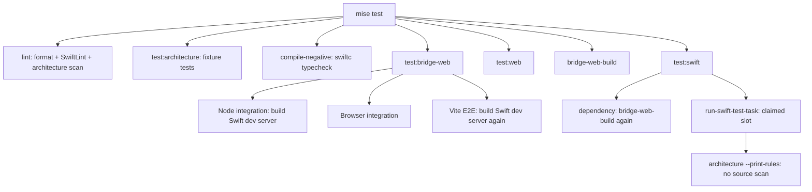
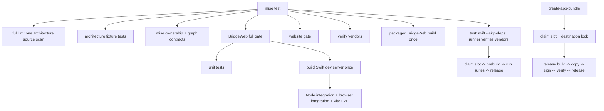

# Mise task call map — 2026-09-06

Scope: all local mise tasks, direct script entry points, nested mise and pnpm build/test calls, and CI SwiftPM consumers. This is the pre-fix inventory; the findings ledger records changes.

## Task inventory

| Task | Dependencies | Run owner / nested calls |
| --- | --- | --- |
| init-submodules |  | bash "${PROJECT_ROOT}/scripts/vendor-worktree.sh" require-producer |
| build-ghostty | init-submodules | bash "${PROJECT_ROOT}/scripts/build-ghostty-local.sh" |
| build-zmx | init-submodules | bash "${PROJECT_ROOT}/scripts/vendor-worktree.sh" require-producer bash "${PROJECT_ROOT}/scripts/zig.sh" build -Doptimize=ReleaseFast |
| copy-xcframework | build-ghostty | bash "${PROJECT_ROOT}/scripts/vendor-worktree.sh" require-producer |
| setup-dev-resources | build-ghostty | bash "${PROJECT_ROOT}/scripts/vendor-worktree.sh" require-producer mise run refresh-vendors to force)" |
| format |  |  |
| lint |  | /bin/bash scripts/lint-swift.sh |
| test:bridge-web:check | bridge-web-install, bridge-web-sync-fixtures | pnpm run check |
| bridge-web-install |  | pnpm >/dev/null 2>&1; then pnpm on PATH" >&2 pnpm install --frozen-lockfile |
| bridge-web-sync-fixtures |  | bash scripts/bridge-web-sync-fixtures.sh |
| test:bridge-web | bridge-web-install, bridge-web-sync-fixtures | pnpm run check && pnpm run test |
| test:bridge-web:unit | bridge-web-install | pnpm run test:unit |
| test:bridge-web:integration | bridge-web-install | pnpm run test:integration |
| test:bridge-web:browser | bridge-web-install | pnpm run test:browser |
| test:bridge-web:stress | bridge-web-install | pnpm run test:browser:stress |
| test:bridge-web:e2e | bridge-web-install | pnpm run test:e2e |
| verify-bridge-review-controlled-composition |  | pnpm -C BridgeWeb exec vitest run src/app/bridge-app-review-viewer-mode.product-authority.unit.test.ts &#124;&#124; unit_status=$? pnpm -C BridgeWeb exec vitest --config vitest.browser.config.ts run --project integration-browser src/app/bridge-review-product-controlled-composition.browser.test.tsx &#124;&#124; browser_status=$? |
| test:bridge-web:benchmark | bridge-web-install | pnpm run test:benchmark:browser |
| bridge-web-build | bridge-web-install | pnpm run build |
| bridge-web-audit | bridge-web-install | pnpm run audit:assets |
| bridge-viewer-benchmark | bridge-web-install | pnpm run benchmark:viewer && /bin/bash ../scripts/verify-bridge-viewer-benchmark.sh |
| verify-bridge-observability |  | bash scripts/verify-bridge-observability.sh |
| verify-bridge-headless-manifest |  | /bin/bash scripts/verify-bridge-headless-manifest.sh |
| doctor-mac |  | bash scripts/doctor-mac.sh |
| setup | bridge-web-install, web-install, install-hooks | bash "${PROJECT_ROOT}/scripts/vendor-worktree.sh" setup-local bash "${PROJECT_ROOT}/scripts/vendor-worktree.sh" role)" mise run copy-xcframework mise run --skip-deps setup-dev-resources mise run build-zmx bash "${PROJECT_ROOT}/scripts/vendor-worktree.sh" setup-shared mise run build or mise run test." |
| install-hooks |  |  |
| verify-vendors |  | bash "${PROJECT_ROOT}/scripts/vendor-worktree.sh" verify |
| build | verify-vendors, bridge-web-build | swift build --build-path "$BUILD_PATH" 2>&1 &#124; $xcb_pipe |
| build-bridge-development-server | verify-vendors | bash "${PROJECT_ROOT}/scripts/build-bridge-development-server.sh" |
| build-release | verify-vendors, bridge-web-build | swift build -c release --build-path "$BUILD_PATH" 2>&1 &#124; $xcb_pipe |
| test |  | mise run lint mise run test:architecture mise run test:atomlib-compile-negative mise run test:bridge-web mise run test:web mise run bridge-web-build mise run test:swift |
| test:web | web-install | pnpm --dir web run check && pnpm --dir web run build && pnpm --dir web exec cf build && pnpm --dir web run verify:cloudflare-discovery |
| web-install |  | pnpm --dir web install --frozen-lockfile |
| test:architecture |  | swift test --package-path Tools/AgentStudioArchitectureLint --build-path "${PROJECT_ROOT}/${SWIFT_BUILD_DIR}/architecture-lint" |
| test:atomlib-compile-negative |  | /bin/bash scripts/verify-atomlib-compile-failures.sh |
| test:swift | verify-vendors, bridge-web-build | /bin/bash scripts/run-swift-test-task.sh test |
| test:swift:fast | verify-vendors, bridge-web-build | /bin/bash scripts/run-swift-test-task.sh test-fast |
| test:swift:large | verify-vendors, bridge-web-build | /bin/bash scripts/run-swift-test-task.sh test-large |
| test:swift:prebuild | verify-vendors, bridge-web-build | /bin/bash scripts/run-swift-test-task.sh test-prebuild |
| test:swift:webkit | verify-vendors, bridge-web-build | /bin/bash scripts/run-swift-test-task.sh test-webkit |
| test:swift:coverage | verify-vendors, bridge-web-build | swift test --enable-code-coverage --skip-build --filter E2ESerializedTests --skip ZmxE2ETests --build-path "$BUILD_PATH" swift test --show-codecov-path --build-path "${BUILD_PATH}" > "${CODECOV_TMPFILE}"" |
| test:swift:e2e | verify-vendors, bridge-web-build | swift build --build-tests --build-path "$BUILD_PATH" 2>&1 &#124; $xcb_pipe swift test --skip-build --filter E2ESerializedTests --skip ZmxE2ETests --build-path "$BUILD_PATH" 2>&1 &#124; $xcb_pipe |
| test:swift:zmx-e2e | verify-vendors, bridge-web-build | swift build --build-tests --build-path "$BUILD_PATH" 2>&1 &#124; $xcb_pipe swift test --skip-build --filter ZmxE2ETests --build-path "$BUILD_PATH" 2>&1 &#124; $xcb_pipe |
| test:swift:benchmark | build | swift test --build-path "$BUILD_PATH" --filter "GlobalPreferencesBootstrapBenchmarkTests" 2>&1 &#124; $xcb_pipe |
| clean-artifacts |  | swift build dirs and app bundle in ${PROJECT_ROOT}" |
| refresh-vendors |  | bash "${PROJECT_ROOT}/scripts/vendor-worktree.sh" require-producer mise run copy-xcframework mise run setup-dev-resources |
| clean-agent-builds |  |  |
| create-app-bundle | build-release | /bin/bash scripts/inject-bundle-version.sh "$APP_DIR/Info.plist" "$MARKETING_VERSION" "$BUILD_VERSION" "$RELEASE_CHANNEL" |
| create-beta-app-bundle |  | /bin/bash scripts/create-local-beta-bundle.sh |
| run-beta-observability |  | /bin/bash scripts/run-beta-observability.sh |
| run-beta-preferences-observability |  | /bin/bash scripts/run-beta-preferences-observability.sh |
| run-debug-observability |  | /bin/bash scripts/run-debug-observability.sh |
| run-debug-preferences-observability |  | /bin/bash scripts/run-debug-preferences-observability.sh |
| run-stable-preferences-observability |  | /bin/bash scripts/run-stable-preferences-observability.sh |
| verify-beta-observability |  | /bin/bash scripts/verify-beta-observability.sh |
| verify-debug-observability |  | /bin/bash scripts/verify-debug-observability.sh |
| verify-bridge-review-journey-smoke |  | /bin/bash scripts/verify-bridge-review-journey-smoke.sh |
| verify-bridge-mode-idle-smoke |  | /bin/bash scripts/verify-bridge-mode-idle-smoke.sh |
| verify-bridge-product-paint-correlation |  | /bin/bash scripts/verify-bridge-product-paint-correlation.sh |
| run-bridge-packaged-product-journey |  | /bin/bash scripts/run-bridge-packaged-product-journey.sh |
| verify-bridge-packaged-product-journey |  | /bin/bash scripts/verify-bridge-packaged-product-journey.sh |
| verify-bridge-review-momentum-scroll-state-probe |  | /bin/bash scripts/verify-bridge-review-momentum-scroll-state-probe.sh |
| verify-stable-preferences-observability |  | /bin/bash scripts/verify-stable-preferences-observability.sh |
| verify-global-preferences-startup-performance |  | /bin/bash scripts/verify-global-preferences-startup-performance.sh |
| verify-agentstudio-ipc-phase-a-smoke |  | /bin/bash scripts/verify-agentstudio-ipc-phase-a-smoke.sh |
| smoke-debug-launchservices |  | /bin/bash scripts/run-debug-observability.sh --detach /bin/bash scripts/verify-debug-observability.sh |
| smoke-debug-preferences-launchservices |  | /bin/bash scripts/run-debug-preferences-observability.sh --detach /bin/bash scripts/verify-debug-observability.sh |
| verify-git-refresh-performance-workload |  | /bin/bash scripts/verify-git-refresh-performance-workload.sh |
| verify-sidebar-performance-workload |  | /bin/bash scripts/verify-sidebar-performance-workload.sh --sidebar-proof |
| verify-sidebar-native-table-pilot |  | /bin/bash scripts/verify-sidebar-native-table-pilot.sh |
| verify-title-pane-performance-workload |  | /bin/bash scripts/verify-title-pane-performance-workload.sh --proof |
| perf:report |  | /bin/bash scripts/perf-report.sh |
| observability:up |  |  |
| observability:status |  |  |
| observability:smoke |  |  |
| observability:down |  |  |
| generate-icon |  |  |

## Main test path

## Findings

- F1: architecture lint, architecture tests, and nested inventory invocation bypass the slot allocator/build path.
- F2: aggregate repeats packaged BridgeWeb build through separate mise invocations.
- F3: BridgeWeb full suite rebuilds the same Swift development server for Node integration and E2E.
- F4: refresh-vendors repeats Ghostty build through setup-dev-resources dependencies.
- F5: benchmark pre-build task releases a slot before benchmark compilation claims a potentially different slot.
- F6: create-app-bundle chooses a release artifact by mtime after releasing its producing slot.
- F7: clean-agent-builds mistakes no open file descriptors for no live shell owner.
- F8: release workflow still builds and packages directly from .build.
- F9: controlled-composition verification lacks the dependency-install prerequisite.
- F10: Swift format verification prints warnings while returning success without --strict.

Not duplicate scans: test:architecture scans fixture inputs, and --print-rules returns before source discovery. Scoped lint intentionally performs the full architecture gate; keep that gate intact.

Cleanup and package publication need ownership-safe behavior; no destructive cleanup or app launch is authorized as a validation shortcut.

## Applied corrections and remaining proof

F1–F10 have implementation changes on `fix/mise-task-coherence`. Full architecture scans remain intact. The two-slot pool now serializes allocation and destructive maintenance with a kernel lock; owner PID metadata prevents live-shell reclamation between compiler commands. App packaging holds its slot and an exclusive destination lock through signing. Explicit clean-artifacts refuses claimed or open artifacts.

Proof so far: the permanent `test:mise` verifier failed before owner metadata existed, then passed all six contract groups after the fix. It uses real shell processes, filesystem claims, kernel locks, and process termination in disposable fixture directories. Original-checkout architecture-tool tests passed 34 tests; they are not exact-branch proof. Original scoped lint passed. Full branch lint currently fails on four existing SwiftUI aspect-ratio warnings promoted to errors; owner permission for the unrelated substitutions is pending. Focused Swift contract suites are running in the isolated worktree.

Coverage limits: this audit traces repository-owned task calls and mutable build/artifact ownership. It does not execute destructive cleanup against real caches, publish a release, launch every observability workload, or claim every external tool implementation is defect-free. CI runtime evidence and independent diff review are still required before merge.

## Corrected call flow

Additional confirmed fixes: format now propagates failure instead of ending with a successful echo; stale registered worktrees with missing Git metadata no longer emit false setup errors. Existing format checks now use `--strict`, so warnings cannot be reported as a successful formatting gate. Cleanup treats lsof inspection errors as unknown activity and refuses deletion.

Latest scoped evidence: `mise run test:mise` passed eight groups, including syntax and acyclic dependency checks for all 78 current tasks; `mise run test:architecture` passed 34 tests in three suites; focused `test:swift` passed 37 tests in three suites; release-script verification passed; BridgeWeb package JSON formatting passed. Full lint has four pre-existing blocking violations, so aggregate/PR readiness is not established.

Final available runtime results: BridgeWeb gate exit 0 (1764 unit, 19 Node integration, 211 browser integration, 4 E2E tests passed; 5 browser tests skipped). Its log contains one Swift development-server build. Final scoped lint exit 0 with zero SwiftLint violations and full architecture scan passing. `test:mise` now has nine passing groups including actual packaging-shell compiler-failure propagation. CI code-quality runs the same mise contract gate. No merge-readiness claim: aggregate is blocked by the four pre-existing UI lint findings and independent source review is pending.

## 2026-09-07 approved remediation and operator exercise

Owner agreed to the full lifetime model and the four equivalent SwiftUI lint substitutions. Three operators exercised the actual worktree allocator: operator one held slot1 (PID64923), operator two held slot2 (PID68971), and operator three received all2-busy exit1. The parent independently received the same rejection, reclaimed slot2 after operator two released it, then reclaimed slot1 after operator one released it. Both holders exited0. The third operator's initial sandbox denial was retried outside the sandbox; it was not counted as contention proof.

A new real orphan-child regression failed before remediation: cleanup removed a claim while its child was paused without open build files. The corrected allocator gives descriptor6 an inherited per-slot kernel lock. Cleanup must acquire that token before reclaiming a dead owner's claim. Published artifacts are excluded from generic scratch cleanup. Debug launch closes the build descriptor after copying its bundle so the GUI does not retain a scratch lease.

Packaging now lives in scripts/create-app-bundle.sh. It validates resources, stages and signs privately, then swaps the validated directory atomically. Beta selects and publishes its own destination under a wrapper lock. Tests exercise compiler/resource/signing failure preservation, atomic replacement, and a destination containing spaces. Duplicate install/submodule prerequisites use skip-deps only after the earlier call succeeds. Vite's watch closure includes the new pool helper.

Current contract verifier: 12 groups passed, including real shell contention, orphan lifetime, maintenance locking, published-artifact preservation, packaging-shell failure paths and atomic filesystem publication. Full aggregate and real release packaging are in progress; this is not a readiness claim.

## Final review remediation against current main

Integrated main through afa8fc15b without conflicts, preserving its expanded native-sidebar benchmark filter and test policy. Review found two remaining P2 cases: cross-worktree beta destinations used worktree-local locks; normal release could silently abandon a claim after the five-second allocation timeout during slow maintenance. Both now have failing-before/passing-after controlled regressions. Publication and selection lock canonical destination directories; normal release retains its lifetime token and waits for maintenance. The verifier now passes 15 groups, including two distinct worktree fixtures publishing into one destination and shared beta selection exclusion.

The earlier aggregate passed 4414 Swift tests/623 suites before a stale packaging-wiring assertion failed in the large lane. That assertion now checks version injection in scripts/create-app-bundle.sh. Real release packaging passed with ad-hoc signing and independent signature/resource verification. The next aggregate and beta-packaging runs bind the final post-integration commit; earlier results remain historical proof only.
