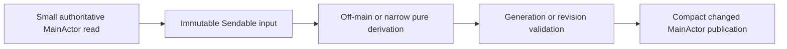

# Future MainActor Computation Follow-ups

Date: 2026-09-12
Inspected baseline: `85ae48f5e91ed8a7d473450503084ff50764248c` plus the current uncommitted performance-fix worktree state.

## Scope and evidence boundary

This is a bounded source audit for follow-up work after the current performance fix. It does not change product code, declare any candidate fixed, or claim current runtime CPU attribution. The active fix already covers targeted pin capability, indexed tab lookup/count primitives, title-slot mutation, `SingleTabContent`/`FlatTabStripContainer` layout reuse, and shared FSEvent path normalization. Those changes are treated as current source and are not repeated here.

The candidates below are ranked by trigger frequency, cardinality, and how directly the current source puts variable work on MainActor. Every timing claim is explicitly either:

- **Measured:** supported by current runtime data. There are no measured CPU findings in this audit because runtime actions were out of scope.
- **Source-only:** a current call path and cost shape are proven, but actual CPU share and latency are not.

The governing shape remains:

An `await` interval is wall latency, not proof that MainActor was occupied. A candidate becomes a CPU finding only when a marker bounds synchronous MainActor work or a current exact-PID sample attributes stacks to it.

## Ranked candidates

### 1. Command Bar typing synchronously filters, sorts, highlights, and revalidates visible rows

**Current call path.** Each text edit writes through `CommandBarTextField.Coordinator.controlTextDidChange` (`Sources/AgentStudio/Features/CommandBar/Views/CommandBarTextField.swift:81-84`), which invalidates `CommandBarView.body`; the body calls `resultSession.snapshot(state:)` inline (`CommandBarView.swift:19-21`). That snapshot synchronously builds a search document, fuzzy-filters and sorts all candidate items, groups them, materializes displayed items, and then computes dimming (`CommandBarResultSession.swift:56-111`). `CommandBarSearch.filter` lowercases and fuzzy-matches the title, every keyword, and subtitle for every item, then sorts matches (`CommandBarItemSearch.swift:46-87`). Every displayed row fuzzy-matches its title again to build highlight ranges (`Views/CommandBarResultRow.swift:202-215`). Dimming also calls `dispatcher.canDispatch` for every displayed dispatchable item (`CommandBarResultSession.swift:221-237`). This has real full-snapshot callers in nested Command Bar levels: worktree actions such as `openWorktreeInPane` are emitted as targeted dispatch rows (`CommandBarDataSource+WorktreeRows.swift:434-460`), map through `targetedSidebarAction` (`Sources/AgentStudio/App/Panes/PaneTabViewController.swift:4271-4294`), and then fall through `canExecute` to `canDispatchAction`/`actionStateSnapshot` (`PaneTabViewController.swift:4422-4424`, `2541-2563`).

**Trigger and cardinality.** Every Command Bar character edit; approximately `O(items * searchable fields + matchedItems log matchedItems + displayedItems * capability cost)` on MainActor. The root item list is cached, but search, grouping, display flattening, selection reconciliation, row availability, and highlight matching are not part of that cache hit.

**Why it is on MainActor.** `CommandBarResultSession` is MainActor-owned and the SwiftUI body requests the complete result synchronously. The fuzzy algorithm and grouping themselves do not require mutable UI state.

**Narrow/off-main direction.** Capture one immutable `CommandBarSearchDocument` plus query/generation from the existing session owner, run scoring/sort/group projection in an `@concurrent nonisolated` helper, reject stale generations, and publish one compact result back to the same session. Carry title match ranges in the result so rows do not rerun fuzzy matching. Keep command authority on MainActor, but batch availability against one narrow capability input per result generation instead of independently rebuilding workspace state for each visible target. Revalidate the selected command at execution, as today.

**Semantics to preserve.** Latest query wins; selection is reconciled against the first current result; root/nested scope and recency ranking remain exact; unavailable rows stay dimmed; execution repeats authoritative validation; cancellation is not counted as equality.

**Proof needed.** Existing `performance.commandbar.filter` duration/counts establish filter cost but do not cover grouping, dimming, SwiftUI highlight work, or queue delay. Add one result-generation probe separating MainActor capture/availability/publication from worker CPU, then run the real large-topology Command Bar typing path with exact-PID sampling.

**Confidence:** high source confidence, no current measured CPU attribution.
**Smallest next diagnostic:** record synchronous `snapshot` phase durations (`capture`, `filter`, `group/display`, `availability`) for one marker-scoped typing run before choosing the first split.

### 2. Pane SwiftUI bodies repeatedly compose rich pane state and independently validate many controls

**Current call path.** Each `PaneLeafContainer.body` constructs a `PaneManagementContext` and resolves seven targeted control presentations (`Sources/AgentStudio/App/Panes/Hosting/PaneLeafContainer.swift:201-235`). The same view has separate computed reads for drawer-child status, drawer state, and tab-wide expanded-drawer detection; the latter scans the tab's panes and calls the rich `pane(_:)` projection for each (`PaneLeafContainer.swift:113-140`). A visible toolbar then resolves nine more targeted command presentations and performs several additional rich pane/context projections (`PaneSurfaceToolbarHost.swift:162-230`). `PaneLeafCommandPresentation.resolve` and `TargetedCommandControlAction.resolve` each call `dispatcher.canDispatch` during body construction (`PaneLeafCommandPresentation.swift:13-42`; `Sources/AgentStudio/Core/Views/Panes/ArrangementPanel.swift:26-68`).

The rendered control set does **not** currently fall through to `actionStateSnapshot()`: minimize/expand/close/split/detach/extract/move/toggle/add/edit-note are handled by `targetedPaneCommandCapability` (`PaneTabViewController.swift:4521-4598`); pin/unpin has its dedicated fast path (`PaneTabViewController.swift:4334-4337`); Finder/editor/copy-path/pull-request use `targetedPaneExternalCommandCapability` (`PaneTabViewController.swift:4415-4420`, `4847-4879`); and pane-Inbox commands have their own direct check (`PaneTabViewController.swift:4393-4395`). The surviving candidate is repeated narrow/rich reads and repeated command-specific validation, not repeated whole-workspace snapshots.

`WorkspacePaneAtom.pane(_:)` is keyed, but it still reconstructs a rich `Pane`, validates topology association, reads repo enrichment, and rewrites display facets on every call (`Sources/AgentStudio/Core/State/MainActor/Atoms/WorkspacePaneAtom.swift:51-71`; `WorkspacePaneDerived.swift:30-74`). The body therefore repeats more than a dictionary lookup.

**Trigger and cardinality.** Any SwiftUI body invalidation for a visible pane or its toolbar: management-layer transitions, hover state, layout/geometry changes, pane/cache facts, and control presentation changes. Cost scales with visible panes, commands per pane, and sometimes every pane in the active tab. `tabContainsExpandedDrawer` makes this at least `O(visible panes * tab panes)` when each leaf recomputes.

**Why it is on MainActor.** SwiftUI body evaluation and atom reads are MainActor-owned. The repeated rich composition and pure capability projection arise because narrow values are not captured once at the container boundary.

**Narrow/off-main direction.** At the existing App composition boundary, capture each pane's structural facts, durable/display facts, drawer facts, and relevant keyed repo facts once per body generation. Partition tab-wide facts once in `FlatTabStripContainer` and pass values down. Resolve the visible controls from one immutable per-pane capability input while retaining the existing command-specific fast paths and authoritative revalidation in `perform`. Most of this candidate may only need narrower MainActor inputs; move pure work off-main only if measurement shows the remaining projection is variable-cost.

**Semantics to preserve.** Command presence still comes from the command catalog; enablement remains distinct from presence; execution revalidates; drawer expansion and drawer-child ownership remain canonical; repository enrichment changes still update only affected panes.

**Proof needed.** Count body evaluations, rich `WorkspacePaneDerived.pane` calls, command-specific capability checks, and MainActor held time per rendered pane under management hover, tab switch, and repository fact updates. Do not infer body frequency from source alone. A probe should also assert that this rendered control set records zero `actionStateSnapshot` fallthroughs so the corrected boundary cannot regress.

**Confidence:** high source confidence, no current measured CPU attribution.
**Smallest next diagnostic:** an opt-in marker around `PaneLeafContainer`/`PaneSurfaceToolbarHost` projection that reports bounded counts for pane reads, fast-path command validations, visible panes, synchronous duration, and any unexpected snapshot fallback.

### 3. CWD association resolution scans topology synchronously on MainActor

**Current call path.** CWD is equality-suppressed at Terminal source admission (`Sources/AgentStudio/Features/Terminal/Ghostty/GhosttyActionRouter+LocalActions.swift:90-107`) and then arrives as an exact runtime event. `WorkspaceSurfaceCoordinator.handleTerminalRuntimeEvent` normalizes it and calls `updatePaneCWDAndResolvedContext` (`Sources/AgentStudio/App/Coordination/WorkspaceSurfaceCoordinator.swift:730-738`). That method captures the topology snapshot and synchronously calls `repoAndWorktree(containing:)`, validates the previous association, may scan unavailable repositories/worktrees, emits timing, then mutates the pane (`WorkspaceSurfaceCoordinator.swift:432-490`). The immutable resolver normalizes the CWD and linearly searches the worktree path index; the unavailable fallback can normalize every unavailable worktree path (`Sources/AgentStudio/Core/State/MainActor/Atoms/RepositoryTopologyAtom.swift:86-128`).

**Trigger and cardinality.** Every changed terminal CWD fact, proportional to indexed worktrees, with a larger unavailable-topology fallback. It is not a per-keystroke path, and source does not establish an `often` rate for ordinary sessions.

**Why it is on MainActor.** The coordinator owns final pane mutation, but the immutable `RepositoryTopologyReadSnapshot` and its path search are `Sendable` and have no MainActor state dependency.

**Narrow/off-main direction.** Keep the revision reservation and compact topology snapshot capture on MainActor, await an `@concurrent nonisolated` resolver for the immutable CWD/topology input, then apply only if the pane association revision remains current. Preserve ordered CWD handling by awaiting this work in the existing serial runtime-event consumer rather than spawning unordered tasks.

**Semantics to preserve.** Every admitted changed CWD remains ordered; temporarily unavailable associations remain deferred rather than cleared; stale revisions do not publish; path matching and longest-prefix/index semantics remain byte-for-byte equivalent; source equality suppression stays intact.

**Proof needed.** Split the existing topology lookup duration into worker CPU, MainActor capture/apply held time, and queue wait. Exercise many worktrees and unavailable repositories with rapid ordered CWD changes, verifying final and intermediate admitted sequence semantics.

**Confidence:** high source confidence, no current measured CPU attribution.
**Smallest next diagnostic:** use the existing lookup marker to collect index cardinality and exact synchronous lookup duration during a bounded many-worktree CWD sequence; do not treat the enclosing async event-handler latency as MainActor occupancy.

### 4. Tab switching classifies visible panes with repeated rich-pane projections

**Current call path.** Selecting a tab writes the active tab and requests restore (`Sources/AgentStudio/App/Panes/PaneTabViewController.swift:873-876`). Observation then runs `handleTabSelectionStateChange`, which synchronizes hosts, scans host visibility, normalizes focus, resolves the preferred pane, and requests visible-view restore (`PaneTabViewController.swift:707-731`). `restoreViewsForActiveTabIfNeeded` computes the complete foreground set (`Sources/AgentStudio/App/Coordination/WorkspaceSurfaceCoordinator+ActiveTabRestore.swift:8-29`). `foregroundVisiblePaneIDs` orders the whole active tab, filters visibility, then partitions main and drawer panes in two passes that each call the rich `store.paneAtom.pane` projection (`WorkspaceSurfaceCoordinator+ActiveTabRestore.swift:85-99`). Missing views cause another rich pane projection per pane before creation (`WorkspaceSurfaceCoordinator+ActiveTabRestore.swift:136-157`).

**Trigger and cardinality.** Each tab activation, plus retries when the active tab has missing visible views. Cost scales with all pane IDs retained by the active tab, including backgrounded/deferred members, and does at least two rich projections for each visible pane before any needed creation.

**Why it is on MainActor.** Host visibility, focus, view registry, and final creation are AppKit/MainActor work. Partitioning identifiers by parent ownership and assembling immutable geometry inputs do not require a rich pane projection.

**Narrow/off-main direction.** Order pane IDs with the existing visibility authority, then partition them once using `WorkspacePaneGraphAtom.paneStructuralFacts(_:)` (`parentPaneID`) and carry those keyed facts into missing-view admission. Compose a rich `Pane` only for a pane that actually needs content creation. Keep host visibility and focus application on MainActor.

**Semantics to preserve.** The complete current visible set remains the scheduler input; `visibilityTierResolver` remains the only active/visible authority; main panes precede drawer panes; missing geometry stays deferred; inactive persistent hosts remain retained; focus restoration stays after the selected host is visible.

**Proof needed.** Existing `performance.pane_view_restore` covers the restore body, not the preceding `PaneTabViewController` selection work or rich-read count. Measure one exact tab-switch interaction with tab/pane cardinalities, MainActor held segments, and number of actual missing hosts.

**Confidence:** high source confidence, no current measured CPU attribution.
**Smallest next diagnostic:** compare restore duration and rich pane-read count for switching among already-mounted tabs versus a tab with one missing host.

### 5. Every admitted Terminal runtime event composes the full tab collection before event-specific handling

**Current call path.** Both critical and batched runtime consumers execute on MainActor and call `handleRuntimeEnvelope` (`Sources/AgentStudio/App/Coordination/WorkspaceSurfaceCoordinator.swift:606-638`). For every Terminal event, `handleTerminalRuntimeEvent` first evaluates `store.tabLayoutAtom.tabs`, then searches all composed tabs for the source pane before switching on the event (`WorkspaceSurfaceCoordinator.swift:672-682`). `WorkspaceTabLayoutDerived.tabs` composes every `Tab` from shell and arrangement state (`Sources/AgentStudio/Core/State/MainActor/Atoms/WorkspaceTabLayoutDerived.swift:26-34`). This happens for title, CWD, command-finished, bell, and control events even when their handler only needs the source pane ID.

**Trigger and cardinality.** Every Terminal event admitted to this coordinator after source contraction; `O(all tabs + tab pane membership)` before event-specific work. Raw scrollbar/activity samples do not enter this path, and this audit does not claim otherwise.

**Why it is on MainActor.** Runtime coordination and mutations are MainActor-owned. Source-tab membership is already maintained as an indexed MainActor fact and does not require full tab composition.

**Narrow/off-main direction.** Use the existing `WorkspaceTabGraphAtom.tabID(containingPane:)` index through `WorkspaceTabLayoutAtom.tabID(containingPane:)` only to find the candidate owner (`Sources/AgentStudio/Core/State/MainActor/Atoms/WorkspaceTabGraphAtom.swift:83-85`, `130-131`; `WorkspaceTabLayoutAtom.swift:68-69`). Then compose that one tab and preserve the current `activePaneIds.contains(sourcePaneUUID)` admission before switching on the event. The index is deliberately broader: it is built from `TabGraphState.allPaneIds` across all arrangements (`WorkspaceTabGraphAtom.swift:138-168`), while `Tab.activePaneIds` is only the active arrangement's main layout (`Sources/AgentStudio/Core/Models/Tab.swift:98-105`). Drawer insertion also appends drawer children to `allPaneIds` (`Sources/AgentStudio/Core/State/MainActor/Atoms/TabLayoutRules/TabArrangementMutationRules.swift:91-97`). Index membership alone would therefore incorrectly admit inactive-arrangement panes and drawer children that the current handler rejects. Whether those rejected runtime sources should ever be handled is a separate contract question, not part of this optimization.

**Semantics to preserve.** Unknown/retired panes, inactive-arrangement panes, and drawer children remain rejected before handling exactly as today; indexed ownership is only the first narrowing step; ordered event handling remains unchanged; no raw or replaceable Terminal sample is added to EventBus.

**Proof needed.** Count admitted Terminal events by semantic kind, source-tab lookup path, total tab cardinality, and lookup held time. Source proves avoidable work but not that these admitted event rates dominate CPU.

**Confidence:** high source confidence, no current measured CPU attribution.
**Smallest next diagnostic:** instrument full-composition versus indexed lookup duration for the existing exact-fact workload, grouped by bounded event kind.

### 6. Repository topology publication rebuilds several fleet-wide indexes and path orderings on MainActor

**Current call path.** Non-coalescable topology facts cross to the MainActor coordinator (`Sources/AgentStudio/App/Coordination/WorkspaceCacheCoordinator.swift:98-138`). Batched discovery loops repositories within a batched topology mutation (`WorkspaceCacheCoordinator.swift:531-555`). `RepositoryTopologyAtom.replaceTopology` compares full repository arrays, repopulates ordered IDs and entity families, rebuilds multiple dictionaries, and schedules a worktree path-index rebuild (`Sources/AgentStudio/Core/State/MainActor/Atoms/RepositoryTopologyAtom.swift:219-259`). `synchronizeEntityFamilies`, `rebuildEntityIndexes`, and `rebuildWorktreePathIndexAndBumpGeneration` each traverse repository/worktree collections; the path index normalizes paths and sorts all entries (`RepositoryTopologyAtom.swift:440-489`, `496-523`).

**Trigger and cardinality.** Repository/worktree discovery, removal, reassociation, and authoritative topology replacement. Work scales with the full repository/worktree fleet even when one entity changed. It is bursty rather than ordinary typing/tab-switch work.

**Why it is on MainActor.** Canonical observable topology publication and `AtomFamily` updates belong on MainActor. Identity validation and replacement preparation are already nonisolated in `RepositoryTopologyReplacement`; the derived dictionaries and sorted immutable path index are still rebuilt after crossing to MainActor.

**Narrow/off-main direction.** Extend the existing nonisolated replacement preparation to carry validated ordered IDs, ID/stable-key maps, and the sorted worktree path index as immutable payloads. MainActor should compare semantic revisions, apply the prepared collections atomically, update only changed family slots, and bump publication revisions. This stays within the existing replacement/atom owners; it adds no atom, cache, event, or coordinator.

**Semantics to preserve.** Replacement validation precedes publication; repositories and worktrees publish atomically; per-key Observation wakes only changed keys; ordered membership and stable identities remain exact; unavailable repositories are excluded from path resolution; ambiguous stable keys retain diagnostics.

**Proof needed.** Separate preparation CPU, MainActor publication held time, number of changed family slots, and total fleet cardinality for single-repo and batched discovery. The existing Git/runtime backlog is not evidence that this MainActor publication currently blocks UI.

**Confidence:** high source confidence about the fleet-wide MainActor work, no current measured CPU attribution.
**Smallest next diagnostic:** add a marker around `replaceTopology` subphases and run the existing real-size topology fixture with one changed worktree.

### 7. Ordinary key handling linearly searches the complete shortcut catalog on MainActor

**Current call path.** The pane controller installs a local monitor for every key-down (`Sources/AgentStudio/App/Panes/PaneTabViewController.swift:544-558`). `handleAppOwnedKeyEvent` decodes the event and asks for a global shortcut before it can reject an ordinary printable key (`PaneTabViewController.swift:1876-1917`). `ShortcutDecoder.shortcut(for:in:)` linearly calls `shortcut.spec.matches` across `AppShortcut.allCases` (`Sources/AgentStudio/Core/Actions/Commands/AppShortcut.swift:693-703`). Focused Ghostty key-equivalent handling independently uses the same decoder and catalog lookup surface (`Sources/AgentStudio/Features/Terminal/Ghostty/GhosttySurfaceView+Input.swift:115-166`). Which AppKit ingress paths run for a given keystroke must be measured; source alone does not prove both scans occur for every typed character.

**Trigger and cardinality.** Potentially every ordinary terminal key-down that reaches these monitors/responders, proportional to the complete command shortcut catalog and each spec's alternate-trigger/context matching.

**Why it is on MainActor.** AppKit event handling is MainActor-owned. The catalog match is pure immutable policy, but it is currently expressed as a linear enum scan at each ingress.

**Narrow/off-main direction.** Keep event decoding and dispatch on MainActor, but replace the repeated catalog scan with an exhaustive trigger/context projection owned by `AppShortcut` and verified against `allCases`. A direct generated/switch lookup or immutable static projection is preferable to adding mutable state or a new cache owner. Apply a cheap modifier/key-class admission before consulting contexts that cannot match ordinary text.

**Semantics to preserve.** Alternate triggers and context precedence remain exact; retired Inbox shortcuts stay excluded; raw-character shortcuts retain neutral-responder gates; unavailable reserved terminal chords remain swallowed; the command catalog remains the only binding authority.

**Proof needed.** Count lookup invocations by ingress (`pane_monitor`, `ghostty_key_equivalent`, management monitor), candidate specs examined, and synchronous duration during real terminal typing. Verify a complete truth table of every declared primary/alternate trigger before changing lookup shape.

**Confidence:** medium-high source confidence, no current measured CPU attribution and uncertain per-keystroke ingress multiplicity.
**Smallest next diagnostic:** marker-scope 1,000 ordinary characters and report lookup count and examined-spec count per ingress without logging key content.

## Rejected or deliberately excluded candidates

- **Terminal scrollbar timestamp equality:** do not suppress equal `ScrollbarState` actions solely because presentation is equal. `observedAtMilliseconds` and total-row advancement feed terminal activity semantics (`TerminalLocalActionAccumulator.swift:880-908`). The current accumulator already equality-suppresses presentation while retaining changed activity evidence. Any further contraction requires a traced activity-contract change, not a local equality shortcut.
- **Async consumer lifetime:** `Task { @MainActor in for await ... }` call sites prove executor ownership around synchronous segments, not continuous MainActor occupancy while suspended. No candidate above treats time across `await` as held time.
- **Git refresh backlog:** existing off-main Git work and end-to-end refresh latency do not prove MainActor blocking in `WorkspaceCacheCoordinator` or topology publication. Candidate 6 needs its own synchronous publication measurement.
- **Legacy `ActiveTabContent`:** current source marks it deprecated and says production uses persistent per-tab `SingleTabContent` hosts. It is not an active production hotspot without contrary runtime evidence.
- **`PaneTabViewController.viewWillLayout` telemetry/count reads:** it still scans hosts and reads broad counts, but the current fix is already introducing indexed tab count/lookup primitives. Treat remaining call-site cleanup as part of that migration unless measurement shows layout itself remains a separate hotspot.

## Suggested diagnostic order

1. Command Bar typing phase timing and capability-validation counts.
2. Pane body rich-read/action-snapshot counts during management hover and repo-fact updates.
3. Exact tab-switch held-time segments and foreground classification reads.
4. Terminal exact-event source-tab lookup counts, followed by CWD lookup worker/MainActor split.
5. Topology replacement subphase timing at real fleet size.
6. Shortcut-catalog scan counts during ordinary terminal typing.

This order favors paths closest to ordinary interactive latency while retaining topology work as a fleet-size follow-up. Promotion from source candidate to fix should require current exact-PID or marker-scoped evidence, a preserved semantic contract, and a focused red/green proof before implementation.
