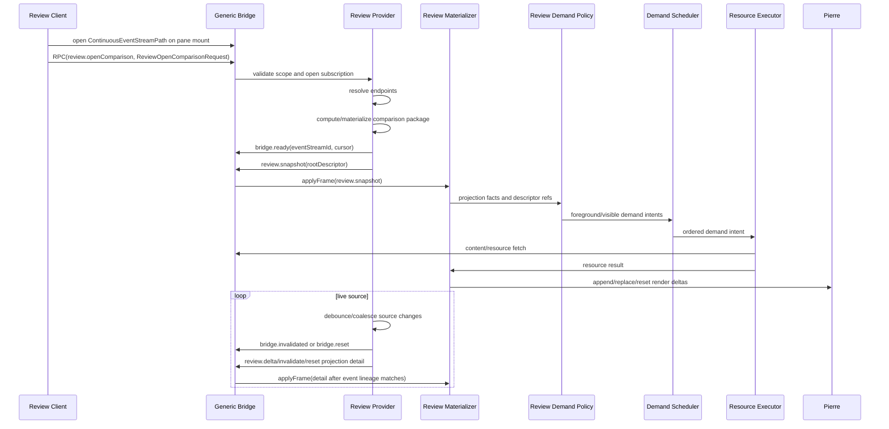

# Review Protocol Spec

Date: 2026-06-22
Status: Reopened only for parent workflow alignment after the 2026-06-24
Worktree dev-server product E2E proof correction. Review runtime implementation
remains open plan work, but this slice has no new Review-specific blocker.
Parent: [spec.md](/Users/shravansunder/Documents/dev/project-dev/agent-studio.bridge-start/tmp/spec-workflows/2026-06-22-bridge-transport-streaming-spec/spec.md:1)

This file owns the Review application protocol. Review is one app protocol
family over generic Bridge transport. Bridge carries frames, commands, and
resource descriptors; Review owns comparison meaning.

## 1. Product Intent

Review lets a user inspect provider-computed comparisons:

- explicit git refs or commits
- base branch versus worktree
- time-window changesets
- agent/session changeset clusters
- future checkpoint or manual groupings

Review must support static DiffsHub-like diff loading and live changesets
without making the browser compute repo diffs.

## 2. Ownership

Review provider owns:

- source endpoint resolution
- Git diff calculation
- worktree comparison materialization
- time-window materialization
- changeset cluster materialization
- package id, generation, and revision authority
- source debounce/coalescing for live comparisons
- source cursors and reset decisions

Review browser owns:

- projection/render materialization
- tree/code ordering and filtering projections
- app demand policy and demand-intent derivation
- content hydration
- app-specific lineage decisions and commit guards
- renderer deltas into Pierre

Generic demand scheduling, resource execution, retry/abort behavior, and stale
completion drops remain shared Bridge runtime responsibilities.

Review browser must not:

- calculate repository diffs from raw file streams
- treat path hints as content authority
- store diff/file bodies in Zustand
- remount CodeView for same-lineage deltas by default

## 3. Source And Changeset Model

The product word `changeset` is a Review lens. It is not the base transport
noun.

```text
ReviewComparisonSpec
  provider resolves sources
  provider computes/materializes comparison package
  provider emits snapshot/delta/invalidation/reset
  browser materializes projection and renderer deltas
```

Changeset cluster sources can be:

- explicit sha/ref/tag ranges
- current dirty worktree
- live base branch versus worktree
- saved time window
- prompt/session checkpoint
- provider-owned agent edit batch
- touched-file accumulation
- future manual grouping

The clustering algorithm is provider-owned, but the runtime contract is not
deferred. The protocol must carry enough metadata to represent live, closed,
pinned, degraded, and reset clusters without making the browser the grouping
authority.

## 4. Changeset Cluster Contract

```ts
import { z } from 'zod';

export const ReviewSourceEndpointSpec = z.discriminatedUnion('kind', [
  z.object({
    kind: z.literal('gitRef'),
    repoId: z.string().min(1),
    worktreeId: z.string().min(1),
    ref: z.string().min(1),
    resolvedSha: z.string().min(1).optional(),
  }).strict(),
  z.object({
    kind: z.literal('commit'),
    repoId: z.string().min(1),
    worktreeId: z.string().min(1),
    sha: z.string().min(1),
  }).strict(),
  z.object({
    kind: z.literal('tag'),
    repoId: z.string().min(1),
    worktreeId: z.string().min(1),
    tag: z.string().min(1),
    resolvedSha: z.string().min(1).optional(),
  }).strict(),
  z.object({
    kind: z.literal('workingTree'),
    repoId: z.string().min(1),
    worktreeId: z.string().min(1),
    providerIdentity: z.string().min(1),
    contentSetHash: z.string().min(1).optional(),
  }).strict(),
  z.object({
    kind: z.literal('savedTimeWindowCheckpoint'),
    repoId: z.string().min(1),
    worktreeId: z.string().min(1),
    fromUnixMilliseconds: z.number().int().nonnegative(),
    toUnixMilliseconds: z.number().int().nonnegative(),
    materializedHash: z.string().min(1).optional(),
  }).strict(),
  z.object({
    kind: z.literal('sessionCheckpoint'),
    repoId: z.string().min(1),
    worktreeId: z.string().min(1),
    checkpointId: z.string().min(1),
    contentSetHash: z.string().min(1).optional(),
  }).strict(),
  z.object({
    kind: z.literal('providerChangesetCluster'),
    repoId: z.string().min(1),
    worktreeId: z.string().min(1),
    clusterId: z.string().min(1),
    materializedHash: z.string().min(1).optional(),
  }).strict(),
]);

export const ReviewChangesetClusterMetadata = z.object({
  clusterId: z.string().min(1),
  sourceId: z.string().min(1),
  algorithm: z.enum([
    'explicitRange',
    'timeWindow',
    'sessionTurnBaseline',
    'checkpoint',
    'idleDebounce',
    'touchedFileAccumulation',
    'scmResourceGroup',
    'hunkGrouping',
    'manual',
    'unknown',
  ]),
  lifecycle: z.enum(['live', 'closed', 'pinned']),
  confidence: z.enum(['incremental', 'freshScan', 'overflowRecovered', 'partial', 'unknown']),
  baselineCursor: z.string().min(1).optional(),
  headCursor: z.string().min(1).optional(),
  baselineRef: z.string().min(1).optional(),
  headRef: z.string().min(1).optional(),
  fromUnixMilliseconds: z.number().int().nonnegative().optional(),
  toUnixMilliseconds: z.number().int().nonnegative().optional(),
  includedPathHints: z.array(z.string().min(1)).optional(),
  groupingReason: z.string().min(1).optional(),
  limitations: z.array(z.enum([
    'shellEditsExcluded',
    'externalEditsExcluded',
    'remoteEditsExcluded',
    'ignoredPathsExcluded',
    'generatedFilesExcluded',
    'overflowRecovered',
  ])).optional(),
}).strict();

export const ReviewResourceKind = z.enum([
  'content',
  'review-package',
  'review-delta',
]);

export const ProviderIssuedReviewPackageIdentity = z.object({
  packageId: z.string().min(1),
  sourceIdentity: z.string().min(1),
  generation: z.number().int().nonnegative(),
  revision: z.number().int().nonnegative(),
  rootDescriptor: BridgeAttachedResourceDescriptor,
  contentDescriptors: z.array(BridgeAttachedResourceDescriptor).optional(),
  changesetCluster: ReviewChangesetClusterMetadata.optional(),
}).strict();
```

Contract:

- `ReviewChangesetClusterMetadata` explains grouping provenance.
- It is not proof authority for file bytes or diff bodies.
- Provider may change the algorithm without changing Bridge transport.
- Live clusters can emit deltas; closed/pinned clusters should be immutable
  unless provider issues an explicit reset.
- Fresh-scan or overflow-recovered batches must be visible as degraded
  confidence, not silently represented as precise incremental batches.

## 5. Review Source Subscription

```ts
export const ReviewQuerySpec = z.object({
  queryKind: z.string().min(1),
  baseEndpointId: z.string().min(1),
  headEndpointId: z.string().min(1),
  comparisonSemantics: z.string().min(1),
  pathScope: z.array(z.string().min(1)),
  viewFilterToken: z.string().min(1).optional(),
  groupingKey: z.string().min(1).optional(),
  provenanceFilterToken: z.string().min(1).optional(),
}).strict();

export const ReviewComparisonSpec = z.object({
  comparisonId: z.string().min(1),
  query: ReviewQuerySpec,
  baseEndpoint: ReviewSourceEndpointSpec,
  headEndpoint: ReviewSourceEndpointSpec,
  freshness: z.enum(['pinned', 'liveRight', 'liveBoth']),
  changesetCluster: ReviewChangesetClusterMetadata.optional(),
}).strict();

export const ReviewOpenComparisonRequest = z.object({
  clientRequestId: z.string().min(1),
  comparison: ReviewComparisonSpec,
}).strict();

export const ReviewOpenComparisonOutcome = z.discriminatedUnion('kind', [
  z.object({
    kind: z.literal('accepted'),
    comparisonId: z.string().min(1),
    eventStreamId: z.string().min(1),
    intakeStreamId: z.string().min(1),
    initialCursor: z.string().min(1),
  }).strict(),
  z.object({
    kind: z.literal('rejected'),
    reason: z.enum(['invalidSource', 'staleSource', 'unsupportedComparison', 'permissionDenied']),
    userFacingReason: z.string().min(1).optional(),
  }).strict(),
  z.object({
    kind: z.literal('deferred'),
    reason: z.enum(['needsUserInput', 'providerBusy', 'sourceNotReady']),
    requestedInput: z.array(z.string().min(1)).optional(),
  }).strict(),
]);
```

Finite source examples:

- `commit` versus `commit`
- `tag` versus `commit`
- static provider-materialized package descriptor
- closed time-window cluster versus base
- pinned provider changeset cluster

Live source examples:

- base branch versus live worktree
- pinned baseline versus current dirty worktree
- live agent edit cluster before the provider closes the cluster

Review subscription binding to the parent continuous event stream:

- `review.openComparison` is a command. It validates the comparison and returns a
  typed `ReviewOpenComparisonOutcome`.
- An accepted outcome binds the Review comparison to the pane-scoped
  `ContinuousEventStreamPath` through `eventStreamId`, `intakeStreamId`, and
  `initialCursor`.
- Compact lifecycle facts for the comparison ride the continuous event stream:
  ready/heartbeat, source status, descriptor availability, invalidation notice,
  gap, reset, and close.
- Review intake frames carry projection materialization: snapshots, deltas,
  rich invalidation detail, resets with replacement descriptors, and package
  metadata. They may attach descriptors, but they are not a replacement for the
  continuous event stream.
- A `bridge.invalidated`, `bridge.gap`, `bridge.reset`, or `bridge.closed` event
  for a Review identity gates the matching Review intake/content work. Old intake
  frames and resource completions must stale-drop unless the provider rebinds the
  source with a new baseline/cursor.

## 6. Intake Frames

```ts
export const ReviewSnapshotFrame = BridgeIntakeFrameBase.extend({
  kind: z.literal('snapshot'),
  frameKind: z.literal('review.snapshot'),
  package: ProviderIssuedReviewPackageIdentity,
}).strict();

export const ReviewDeltaFrame = BridgeIntakeFrameBase.extend({
  kind: z.literal('delta'),
  frameKind: z.literal('review.delta'),
  packageId: z.string().min(1),
  fromRevision: z.number().int().nonnegative(),
  toRevision: z.number().int().nonnegative(),
  operationsDescriptor: BridgeAttachedResourceDescriptor,
  contentDescriptors: z.array(BridgeAttachedResourceDescriptor).optional(),
}).strict();

export const ReviewInvalidationFrame = BridgeIntakeFrameBase.extend({
  kind: z.literal('delta'),
  frameKind: z.literal('review.invalidate'),
  invalidation: z.object({
    scope: z.enum(['package', 'items', 'paths', 'treeWindow']),
    itemIds: z.array(z.string().min(1)).optional(),
    pathHints: z.array(z.string().min(1)).optional(),
    reason: z.enum(['sourceChanged', 'watchEvent', 'lineageReplaced', 'unknown']),
  }).strict(),
}).strict();

export const ReviewResetFrame = BridgeIntakeFrameBase.extend({
  kind: z.literal('reset'),
  frameKind: z.literal('review.reset'),
  reason: z.enum(['sourceChanged', 'subscriptionReset', 'providerRestart', 'authorityChanged']),
  sourceIdentity: z.string().min(1),
  packageId: z.string().min(1).optional(),
  replacementDescriptor: BridgeAttachedResourceDescriptor.optional(),
}).strict();
```

Review intake streams must:

- carry ordered frames with provider-issued package/generation/revision identity
- bind to an accepted continuous-event-stream lineage for the same pane,
  comparison, source identity, generation, and cursor
- treat page-world frame delivery as bundled app-internal transport, not native
  byte-serving authority
- use descriptors for package roots and delta operation bodies
- register attached descriptors before demand policy receives descriptor refs
- allow same-lineage deltas without CodeView remount
- fail closed on package/source authority replacement
- treat `review.invalidate` and `review.reset` frames as Review projection detail
  that must agree with the authoritative `bridge.invalidated` or `bridge.reset`
  lifecycle event for the same identity

Page-world push nonce checks, DOM attributes, MessagePort provenance, and
agreement between a package payload and sibling `protocolFrame` are not native
content authority. Browser descriptor refs may drive local projection and demand
policy, but bytes are served only when Swift has already issued a matching
descriptor lease. A forged, stale, or foreign page-world `__bridge_push` or
`__bridge_intake_json` must not make unauthorized
`agentstudio://resource/...` fetches succeed.

## 7. Demand Policy Stimuli

Review demand policy consumes app-specific stimuli and emits generic
`DemandIntent` values. The stimuli are discriminated unions, not loose boolean
bags. The emitted lane names remain generic Bridge lanes.

```ts
export const ReviewDemandStimulus = z.discriminatedUnion('kind', [
  z.object({
    kind: z.literal('reviewItemSelected'),
    descriptorRef: BridgeDescriptorRef,
  }).strict(),
  z.object({
    kind: z.literal('reviewDescriptorInvalidated'),
    descriptorRef: BridgeDescriptorRef,
  }).strict(),
  z.object({
    kind: z.literal('reviewViewportChanged'),
    descriptorRefs: z.array(BridgeDescriptorRef),
  }).strict(),
  z.object({
    kind: z.literal('reviewExplicitRefresh'),
    descriptorRef: BridgeDescriptorRef,
  }).strict(),
  z.object({
    kind: z.literal('reviewHoverChanged'),
    descriptorRef: BridgeDescriptorRef.nullable(),
  }).strict(),
  z.object({
    kind: z.literal('reviewSourceReset'),
    sourceIdentity: z.string().min(1),
    packageId: z.string().min(1).optional(),
  }).strict(),
]);
```

Required mappings:

- `reviewItemSelected` and `reviewExplicitRefresh` map to `foreground`.
- `reviewDescriptorInvalidated` maps by dominant current view interest:
  selected to `foreground`, open content to `active`, visible content to
  `visible`, hidden content to no demand.
- `reviewViewportChanged` maps demanded visible descriptor refs to `visible`.
- `reviewHoverChanged` maps non-null demanded refs to `speculative`.
- `reviewSourceReset` emits no demand and invalidates queued/in-flight work by
  package/source identity.

## 8. Review Flow



## 9. DiffsHub Pressure Test

DiffsHub-like smoothness comes from incremental patch intake, early file/hunk
structure, line-count metadata, and renderer batching. The important lesson for
Bridge is that the virtualizer knows enough extent before content bytes finish
hydrating; scrollbars do not discover total size from late body render. Agent
Studio should preserve that shape, but the authority differs:

```text
DiffsHub-like:
  upstream/server patch stream
  browser parses patch by file
  browser batches tree/code append into Pierre

Agent Studio:
  Swift/provider computes/materializes comparison
  browser projection-materializes Review frames
  browser batches prepared tree/code deltas into Pierre
```

What we borrow:

- incremental materialization
- append/replace/reset renderer deltas
- viewport-driven hydration
- avoiding full CodeView remount for same-lineage updates
- early structure/line extent metadata that lets Pierre reserve scroll extent
  before diff/file content bytes fully hydrate

What we do not borrow:

- browser as Git diff authority
- raw patch as the only domain model

## 10. Deferred Changeset Algorithm

The exact first automatic clustering algorithm can be selected by a plan, but
the Review protocol contract must be able to represent provider-owned
changesets from the first Review implementation.

Provider-compatible clustering families:

- idle/debounce or filesystem settle window
- time window
- session/turn baseline
- touched-file accumulation
- checkpoint
- Git/SCM staging or resource groups
- hunk/semantic grouping
- manual user grouping
- overflow-recovered recrawl

Required future properties:

- stable cluster id
- lifecycle: live, closed, pinned
- source cursors or checkpoint ids
- algorithm metadata
- confidence/degraded-mode metadata
- limitations for out-of-band, shell, remote, ignored, or generated edits
- included path hints and optional hunks/ranges
- materialized package descriptor
- reset behavior when provider cannot continue same lineage

Required runtime contract:

- every changeset-backed comparison has a stable provider-issued cluster id
- cluster metadata declares lifecycle: live, closed, or pinned
- live clusters carry source cursors or checkpoint ids sufficient for stale-drop
  and reset decisions
- provider emits deltas for same-lineage live changes
- provider emits reset when the comparison authority, baseline, source cursor,
  or clustering authority changes
- degraded states such as overflow recovery, fresh scan, excluded shell edits,
  or partial confidence are explicit metadata
- browser materializes changeset metadata and renderer deltas but never creates
  the authoritative cluster id, source cursor, or package identity
- a plan may defer choosing idle/debounce versus time-window versus
  session/checkpoint grouping, but it must not defer the wire/runtime fields
  required to represent those options

## 11. Proof Expectations

- provider-owned comparison: browser never computes repo diffs
- provider-issued package identity: browser request does not mint package id,
  generation, revision, or source cursor
- same-lineage delta preserves renderer identity
- package reset rejects stale resources
- selected review item maps to the generic `foreground` lane
- demand policy inputs are discriminated stimuli, not loose boolean bags
- review frames attach descriptors instead of exposing raw descriptor strings
- native descriptor leases reject forged, stale, foreign, revoked, or over-limit
  Review content fetches
- selected invalidated review content maps to `foreground`
- changeset metadata can be present without becoming transport authority
- closed/pinned changeset behaves as immutable input
- live changeset can update with bounded debounce/coalescing
- overflow/fresh-scan changesets expose degraded confidence
- live changeset runtime proof covers live to closed/pinned lifecycle,
  provider-issued cluster id stability, stale-drop cursors/checkpoints, degraded
  confidence, and provider reset when comparison authority, baseline, source
  cursor, or clustering authority changes
- schema-only changeset metadata is not enough to satisfy the first Review
  runtime contract

## 12. Open Decisions

OD-R1. Review content revision authority.

Recommended default: generation plus content handle/hash is authority; revision
is included only for resource kinds whose body identity is revision-scoped.

OD-R2. Live changeset lineage continuity.

Recommended default: one live changeset keeps a stable package id while the
comparison spec and provider authority stay the same; provider emits reset when
authority changes.

OD-R3. First clustering algorithm.

Open. The protocol supports multiple clustering algorithms; plan creation can
choose the smallest first implementation after review. This open algorithm
choice does not remove the required runtime contract in section 10.
