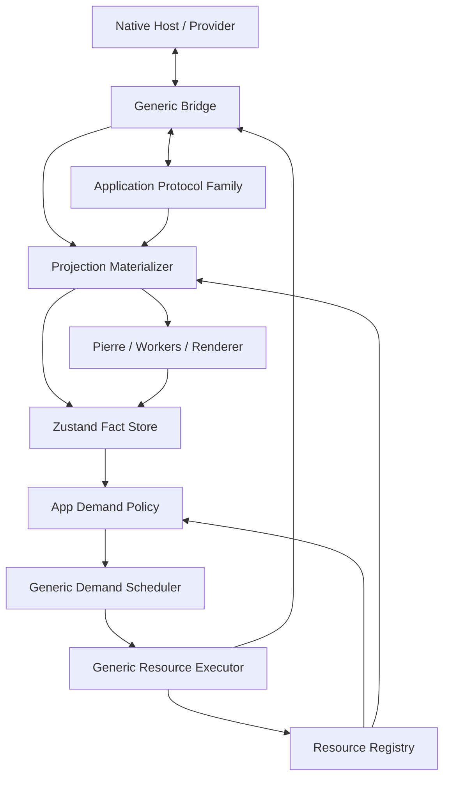

# Bridge Transport And App Protocol Architecture Spec

Date: 2026-06-22
Status: Draft for spec-review
Audience: product/design reviewers, Bridge implementers, Review Viewer maintainers, Worktree/File Surface maintainers, future agents

This is a product and architecture spec. It aligns the design before
implementation. It is not an implementation plan.

This parent file owns the generic Bridge contract and cross-protocol invariants.
Application-owned protocol details live in:

- [review-protocol.md](/Users/shravansunder/Documents/dev/project-dev/agent-studio.bridge-start/tmp/spec-workflows/2026-06-22-bridge-transport-streaming-spec/review-protocol.md:1)
- [worktree-file-surface-protocol.md](/Users/shravansunder/Documents/dev/project-dev/agent-studio.bridge-start/tmp/spec-workflows/2026-06-22-bridge-transport-streaming-spec/worktree-file-surface-protocol.md:1)

## 1. Product Intent

Bridge should be generic transport infrastructure for app-owned web panes in
Agent Studio. Review is the first serious client, but Bridge must not become a
Review-specific IPC layer by accident.

The system must support:

- static DiffsHub-style review packages
- live review comparisons, such as base branch versus live worktree
- provider-owned changeset clusters, such as agent/session/time-window batches
- live worktree exploration with tree, file content, and git status in one
  surface
- future comments and agent communications anchored to the same Worktree/File
  Surface once their schema/permission slice exists
- demand-driven hydration of huge repos, huge diffs, and huge files

The design succeeds when large or live review/worktree/file surfaces can update
without whole-pane resets, eager full-data fetches, or unclear ownership.

## 2. Requirements

R1. Bridge must support multiple application protocol families.

Bridge carries protocol messages and resources. It does not know Review,
Worktree, File, Comment, or Agent Comms semantics.

R2. App protocols must own domain meaning.

Review owns comparison and package semantics. The Worktree/File Surface owns
tree, file content, status, comments, and agent-comms semantics. Bridge owns
transport mechanics only.

R3. Large data must stay out of Zustand.

Zustand stores facts, metadata, and references. File bytes, diff bytes, tree
windows, parsed renderer objects, streams, promises, abort controllers, worker
handles, and Pierre instances live outside Zustand.

R4. Transport pathways must be named and bounded.

Commands, signals, intake frames, and content streams have separate purposes.
Large bodies must move through the content/resource pathway, not through RPC,
events, or store updates.

R5. Source identity must be explicit.

Every live or finite stream must carry enough identity to reject stale frames,
stale resource completions, and cross-source descriptor reuse.

R6. Demand policy, scheduling, and backpressure must be explicit and separate.

Application demand policy decides which work matters now. Generic demand
scheduling orders lane queues. Generic backpressure limits execution pressure.
The lane is the bridge between app policy and generic execution.

R7. Provider authority must remain on the host/server side.

Git diff calculation, worktree watch classification, file source authority,
changeset clustering, and content descriptor issuance are provider concerns,
not browser concerns.

R8. Open file content must preserve reader continuity.

If a file is not open, live tree/status/descriptors may update continuously. If
a file is open and its backing source changes, the surface marks the content
stale and exposes refresh/update affordance instead of silently replacing the
reader's current content by default.

R9. Specs must feed a later implementation plan.

This spec defines boundaries, contracts, invariants, proof expectations, and
open decisions. It does not define task order or exact test commands.

## 3. Non-Goals

This spec does not:

- adopt MCP wholesale
- redesign Agent Studio authentication
- implement source mutation through Bridge resource streams
- make Pierre aware of Bridge URLs or application descriptors
- turn Zustand into a data cache
- make the browser calculate Git diffs
- force worktree exploration through the Review package/diff model
- split Worktree and FileView into separate user-facing apps
- define implementation task order
- choose exact concurrency numbers before implementation profiling

## 4. Architecture Spine

Bridge carries typed application protocols through bounded RPC, compact signal
streams, typed intake streams, and finite content/resource streams.
Application projection materializers turn intake frames into projection facts,
references, and render deltas. Application demand policies decide what is
useful now and map app-specific interest onto generic urgency lanes. A generic
demand scheduler orders lane queues. A generic resource executor runs bounded
work under backpressure. Renderers consume prepared data.

```text
Native Host / Provider
  owns: pane lifetime, provider authority, filesystem/Git authority,
        app assets, resource validation
  exposes: BridgeTransportHost

        │ typed transport envelopes, resource descriptors, streams
        ▼

Generic Bridge
  owns: RPC/event/intake/resource carriers, stream ids, cursor checks,
        cancellation, parser limits, source-scrubbed errors
  exposes: Command RPC Path, Signal Stream Path, Intake Stream Path,
           Content Stream Path
  does not own: review/worktree/file/comment semantics

        │ protocol-scoped frames and commands
        ▼

Application Protocol Family
  examples:
    Review Protocol
    Worktree/File Surface Protocol
  owns: source specs, domain commands, intake frame schemas,
        materialization identity, app-specific invalidation semantics
  exposes: projection materializer, app demand policy, descriptors

        │ facts, references, render deltas, resource intents
        ▼

Browser Runtime
  owns: Zustand facts/refs, registries, demand scheduler,
        resource executor, renderer adapters, Pierre integration
```



## 5. Transport Pathways

`CommandRPCPath`

: Request/response for commands, small facts, and descriptors. It is the path
  for "open stream", "select item", "get descriptor", "refresh content", and
  "cancel". It must not carry large bodies.

`SignalStreamPath`

: Continuous compact stream for facts, invalidations, cursors, heartbeats, gap
  notices, and reset notices. It says something changed; it does not fetch the
  changed body itself.

`IntakeStreamPath`

: Typed application stream into a projection materializer. It carries ordered
  frames such as review snapshots/deltas or worktree tree/status/file
  invalidations. It can be finite or continuous.

`ContentStreamPath`

: Bounded body/window transfer for file text, diff text, markdown source, tree
  windows, review package bodies, and operation lists. It is exposed through an
  opaque `agentstudio://resource/...` URL or equivalent stream descriptor.

`AppSourceSubscription`

: App protocol pattern for a source that can change over time. It is built over
  the signal, intake, and content pathways. Review and Worktree/File Surface
  subscriptions use the same Bridge transport primitives but own different app
  semantics.

## 6. Generic Contracts

The schema examples are architecture contracts. Exact implementation placement
can vary, but the fields and invariants must be represented.

```ts
import { z } from 'zod';

export const BridgeProtocolId = z.enum([
  'bridge.system',
]).or(z.string().regex(/^[a-z][a-zA-Z0-9]*(\.[a-z][a-zA-Z0-9]*)*$/));

export const BridgeResourceKind = z.string().regex(
  /^[a-z][a-zA-Z0-9]*(\.[a-z][a-zA-Z0-9]*)*$/,
);

export const BridgeIntegrityDescriptor = z.discriminatedUnion('kind', [
  z.object({
    kind: z.literal('wholeHash'),
    algorithm: z.enum(['sha256']),
    value: z.string().min(1),
  }).strict(),
  z.object({
    kind: z.literal('chunkManifest'),
    algorithm: z.enum(['sha256']),
    manifestResourceId: z.string().min(1),
  }).strict(),
  z.object({
    kind: z.literal('previewOnly'),
  }).strict(),
]);

export const BridgeTraceContext = z.object({
  traceparent: z.string().optional(),
  spanId: z.string().optional(),
}).strict();

export const BridgeIdentity = z.object({
  paneId: z.string().min(1),
  protocol: BridgeProtocolId,
  sourceId: z.string().min(1).optional(),
  packageId: z.string().min(1).optional(),
  generation: z.number().int().nonnegative().optional(),
  revision: z.number().int().nonnegative().optional(),
  streamId: z.string().min(1).optional(),
  cursor: z.string().min(1).optional(),
}).strict();

export const BridgeRpcRequest = z.object({
  jsonrpc: z.literal('2.0'),
  id: z.string().min(1),
  protocol: BridgeProtocolId,
  method: z.string().min(1),
  params: z.unknown(),
  identity: BridgeIdentity.optional(),
  limits: z.object({
    maxRequestBytes: z.number().int().positive(),
    maxResponseBytes: z.number().int().positive(),
  }).strict(),
  trace: BridgeTraceContext.optional(),
}).strict();

export const BridgeIntakeFrameBase = z.object({
  streamId: z.string().min(1),
  sequence: z.number().int().nonnegative(),
  cursor: z.string().min(1),
  protocol: BridgeProtocolId,
  identity: BridgeIdentity,
  trace: BridgeTraceContext.optional(),
}).strict();

export const BridgeEventFrame = z.object({
  streamId: z.string().min(1),
  sequence: z.number().int().nonnegative(),
  cursor: z.string().min(1),
  protocol: BridgeProtocolId,
  eventType: z.string().min(1),
  identity: BridgeIdentity,
  payload: z.unknown(),
  trace: BridgeTraceContext.optional(),
}).strict();

export const BridgeResourceDescriptor = z.object({
  descriptorId: z.string().min(1),
  protocol: BridgeProtocolId,
  resourceKind: BridgeResourceKind,
  resourceUrl: z.string().min(1),
  identity: BridgeIdentity,
  content: z.object({
    mediaType: z.string().min(1),
    encoding: z.enum(['utf-8', 'binary']).optional(),
    expectedBytes: z.number().int().nonnegative().optional(),
    maxBytes: z.number().int().positive(),
    integrity: BridgeIntegrityDescriptor.optional(),
  }).strict(),
  window: z.object({
    start: z.number().int().nonnegative().optional(),
    count: z.number().int().positive().optional(),
    maxCount: z.number().int().positive(),
  }).strict().optional(),
}).strict();

export const BridgeDescriptorRef = z.object({
  descriptorId: z.string().min(1),
  expectedProtocol: BridgeProtocolId,
  expectedResourceKind: BridgeResourceKind,
  expectedIdentity: BridgeIdentity,
}).strict();

export const BridgeAttachedResourceDescriptor = z.object({
  ref: BridgeDescriptorRef,
  descriptor: BridgeResourceDescriptor,
}).strict();
```

Generic contract invariants:

- Protocol ids and resource kinds are registered by app protocols. Generic
  Bridge validates that a protocol/kind pair is registered and fail-closed; it
  does not hardcode Review or Worktree/File semantics.
- RPC validates protocol and method before execution.
- Protocol registrations provide method, event, intake-frame, and resource-kind
  schemas plus size classes. `params` and event `payload` are unknown only at
  the generic carrier boundary; they must be decoded by the registered protocol
  before dispatch.
- RPC returns descriptors for large data.
- Intake and event streams preserve order with `streamId`, `sequence`, and
  `cursor`.
- Sequence gaps fail closed into gap/reset recovery.
- Resource descriptors include stale-drop identity and hard size/window limits.
- Descriptor refs must bind expected protocol, kind, pane/source/package
  identity, limits, and cursor before fetch or commit.
- A protocol frame that introduces a new schedulable descriptor must carry a
  `BridgeAttachedResourceDescriptor` or reference a descriptor attached earlier
  in the same accepted stream lineage. The Bridge runtime registers attached
  descriptors before materializer or app demand policy runs.
- `BridgeAttachedResourceDescriptor.ref` must match the attached descriptor's
  id, protocol, resource kind, and identity. Mismatches fail closed.
- App protocols must not turn raw descriptor id strings into fetchable demand.
  Demand policy only receives `BridgeDescriptorRef` values that came from the
  accepted descriptor registry.
- Resource URLs are opaque to UI and never expose raw paths as authority.
- Async results commit only if their identity is still current.

### 6.1 Required Identity Matrix

| Domain entity | Required stale-drop identity |
| --- | --- |
| Review package | pane id, protocol id, provider-issued package id, generation, revision or content handle/hash, stream cursor |
| Review item/content | Review package identity plus stable item id and content descriptor id |
| Review delta operations | Review package id, from revision, to revision, operations descriptor id, stream cursor |
| Worktree tree projection | pane id, protocol id, provider-issued source id, subscription generation, source cursor, tree window key |
| Worktree file descriptor | Worktree source identity, provider-issued file id, content handle, optional content hash |
| Worktree open file session | open file session id, file descriptor id, render content key, latest known descriptor id |
| Comment/comms future anchor | source identity, file id/path, range model, content hash policy, thread/message id |

If the required identity cannot be proven at frame or resource completion time,
the result must be dropped or force a protocol reset.

## 7. Resource URL Contract

Canonical URL:

```text
agentstudio://resource/<protocol>/<resourceKind>/<opaqueId>?generation=<n>&revision=<n>&cursor=<opaque>
```

Parser rules:

- unknown protocol fails closed
- unknown resource kind fails closed
- duplicate query key fails closed
- unknown query key fails closed
- invalid generation/revision fails closed
- malformed cursor fails closed
- path traversal fails closed
- read resources allow only `GET` and optional `HEAD`
- Swift and TypeScript share accept/reject fixtures for this grammar

`agentstudio://resource/...` may be backed by WKURLSchemeHandler or another
host/browser stream carrier. The protocol contract is streaming-capable and
bounded; the implementation plan chooses the concrete carrier after proof.

### 7.1 Capability URL Authority

Resource URLs are bearer capabilities. Authority lives in a host-side lease
table, not in URL text.

Required lease binding:

- issued-for `paneId`
- protocol id and resource kind
- source/package identity
- generation/revision/cursor when present
- descriptor id
- max bytes/window limits
- expiry or explicit revocation

Required rejection cases:

- cross-pane replay
- wrong protocol or resource kind
- old generation/revision/cursor
- fetch after source reset
- fetch after descriptor revocation/cancel
- URL appearing in DOM, telemetry, provider errors, markdown, comments, or
  agent communications

### 7.2 RPC Ingress Boundary

Bridge APIs exist only in the isolated Bridge content world. Page-world data,
markdown, comments, and agent communications are untrusted content. They cannot
directly invoke privileged RPC or resource fetches.

RPC dispatch requires:

- content-world ingress
- method allowlist for the registered protocol
- schema decode after byte-limit checks
- pane/provider scope validation
- source-scrubbed error output

### 7.3 Stream Lifecycle

```text
opening
  -> active after first accepted frame or provider ready

active
  -> gapDetected on duplicate/out-of-order/missing sequence
  -> closed on cancel or normal finite completion
  -> replaced on authority/source reset

gapDetected
  -> resetRequired unless bounded recovery descriptor is valid

resetRequired
  -> active only after provider establishes a new baseline/cursor

closed/replaced
  -> no later frame or resource result may commit
```

Rules:

- first accepted frame establishes stream sequence baseline
- duplicate frames are dropped and counted
- out-of-order or missing frames fail closed to gap/reset
- max buffered recovery is bounded by implementation policy
- reset establishes a new cursor and stale-drops prior resources

## 8. State Placement

```text
Fact
  Small state the app can decide from or render directly.
  Example: selectedItemId, activeGeneration, invalidatedItemIds.

Metadata
  Small descriptive fact about a resource or projection.
  Example: mediaType, expectedBytes, changeKind, lineCount, stale flag.

Reference
  Small pointer to data or work outside Zustand.
  Example: descriptorId, resourceKey, streamId, cursor, registry handle.

Body
  The large payload or runtime object.
  Example: file text, diff text, markdown HTML, parsed CodeView items,
  worker buffers, Pierre instances.
```

Allowed in Zustand:

- active protocol/source/package/file identity
- stream id, generation, revision, cursor
- descriptor references
- selected item id and selected file id
- visible item ids and visible tree rows
- invalidated ids
- cache status facts
- request status facts
- small progress/error facts

Forbidden in Zustand:

- file text
- diff text
- huge tree arrays
- parsed CodeView items
- markdown HTML
- stream buffers
- promises
- abort controllers
- worker handles
- Pierre model/controller instances

If losing the Zustand snapshot would lose source bytes, parsed render data, or
an active runtime object, the data was placed in the wrong layer.

## 9. Materialization, Demand Scheduling, And Backpressure

`ProjectionMaterializer`

: App-specific materialization. It consumes typed frames and resource results,
  updates projection state, emits facts/references, and emits renderer-ready
  deltas.

`AppDemandPolicy`

: App-specific demand logic. It decides which descriptors matter now based on
  app state such as selection, viewport, invalidations, cache facts, comments,
  and open content. It maps that app-specific meaning onto generic urgency
  lanes. It does not order queues or own transport pressure.

`DemandScheduler`

: Generic lane ordering. It owns lane queues, ordering within a lane, queued
  dedupe/replacement, and starvation guards. It does not know Review, Worktree,
  trees, files, diffs, viewport semantics, or provider identity semantics.

`ResourceExecutor`

: Generic bounded execution. It owns concurrency, byte/work budgets, in-flight
  coalescing, retry/cooldown, local abort intent, stale completion drops, and
  base backpressure.

`DemandLane`

: Generic urgency class. Lane names must not encode application concepts.
  Application policies may map app concepts onto lanes, but the scheduler only
  sees generic urgency.

```text
foreground
  > active
  > visible
  > nearby
  > speculative
  > idle
```

Lane jobs:

- `foreground`: direct user-blocking work, such as selected item content or an
  explicit refresh.
- `active`: already-open content that should remain reasonably fresh without
  blocking foreground interaction.
- `visible`: content or bounded windows required by the current viewport.
- `nearby`: adjacent work that makes short navigation smooth.
- `speculative`: prediction, hover, or prefetch work that is safe to drop.
- `idle`: low-value background completion, cache warming, and downgraded
  retries.

`DemandIntent`

: The data crossing from app policy to generic scheduling. It has no provenance
  field; Victoria tracing and app-level logs can explain why an intent existed
  without making that explanation part of the scheduling contract.

```ts
export const DemandLaneSchema = z.enum([
  'foreground',
  'active',
  'visible',
  'nearby',
  'speculative',
  'idle',
]);

export const DemandIntentSchema = z.object({
  descriptorRef: BridgeDescriptorRef,
  lane: DemandLaneSchema,
  orderingKey: z.string().min(1),
  dedupeKey: z.string().min(1),
  freshnessKey: z.string().min(1),
  cancellationGroup: z.string().min(1),
}).strict();
```

`DemandStimulus`

: App-specific discriminated union describing the concrete thing that changed.
  It is the input to app demand policy. It must not be represented as loose
  booleans such as `isSelected`, `isVisible`, or `isOpenAndStale`.

Demand stimulus ingress boundary:

- Only trusted Bridge content-world code may emit `DemandStimulus`.
- Allowed emitters are projection materializers, provider/reset handlers, and
  app-owned UI adapters that resolve raw UI selections through the current
  projection registry.
- Page-world events, markdown, comments, and agent communications must never
  provide `BridgeDescriptorRef` directly. They can provide raw selectors only;
  trusted app adapters must re-resolve those selectors against the current
  projection registry before emitting demand.
- A stale, foreign, cross-pane, or unregistered descriptor ref must produce no
  demand and no resource fetch.

Examples:

```ts
export const ExampleDemandStimulusSchema = z.discriminatedUnion('kind', [
  z.object({
    kind: z.literal('selectionChanged'),
    descriptorRef: BridgeDescriptorRef,
  }).strict(),
  z.object({
    kind: z.literal('descriptorInvalidated'),
    descriptorRef: BridgeDescriptorRef,
  }).strict(),
  z.object({
    kind: z.literal('viewportChanged'),
    descriptorRefs: z.array(BridgeDescriptorRef),
  }).strict(),
  z.object({
    kind: z.literal('explicitRefresh'),
    descriptorRef: BridgeDescriptorRef,
  }).strict(),
  z.object({
    kind: z.literal('hoverChanged'),
    descriptorRef: BridgeDescriptorRef.nullable(),
  }).strict(),
  z.object({
    kind: z.literal('sourceReset'),
    sourceIdentity: z.string().min(1),
  }).strict(),
]);
```

`DemandReadContext`

: Small read interface over current facts. The policy asks for descriptor state,
  view interest, and scheduling keys. It does not receive large bodies, parser
  output, transport handles, or renderer objects.

```ts
export const DescriptorDemandStateSchema = z.discriminatedUnion('kind', [
  z.object({ kind: z.literal('missing') }).strict(),
  z.object({
    kind: z.literal('valid'),
    freshnessKey: z.string().min(1),
    needsBodyOrWindow: z.boolean(),
  }).strict(),
  z.object({
    kind: z.literal('stale'),
    freshnessKey: z.string().min(1),
    needsBodyOrWindow: z.boolean(),
  }).strict(),
  z.object({
    kind: z.literal('reset'),
    sourceIdentity: z.string().min(1),
  }).strict(),
]);

export const ViewInterestSchema = z.discriminatedUnion('kind', [
  z.object({ kind: z.literal('none') }).strict(),
  z.object({ kind: z.literal('selected') }).strict(),
  z.object({ kind: z.literal('open') }).strict(),
  z.object({ kind: z.literal('visible') }).strict(),
  z.object({ kind: z.literal('nearby') }).strict(),
  z.object({ kind: z.literal('speculative') }).strict(),
]);

export const DemandKeysSchema = z.object({
  orderingKey: z.string().min(1),
  dedupeKey: z.string().min(1),
  freshnessKey: z.string().min(1),
  cancellationGroup: z.string().min(1),
}).strict();

type DescriptorDemandState = z.infer<typeof DescriptorDemandStateSchema>;
type ViewInterest = z.infer<typeof ViewInterestSchema>;
type DemandKeys = z.infer<typeof DemandKeysSchema>;
type BridgeDescriptorRefValue = z.infer<typeof BridgeDescriptorRef>;

type DemandReadContext = {
  getDescriptorState(ref: BridgeDescriptorRefValue): DescriptorDemandState;
  getViewInterest(ref: BridgeDescriptorRefValue): ViewInterest;
  buildDemandKeys(ref: BridgeDescriptorRefValue): DemandKeys;
};
```

State machine for app policy lane mapping:

```text
                  DemandStimulus
                            │
                            ▼
                   ┌──────────────────┐
                   │ descriptor valid?│
                   └───────┬──────┬───┘
                           │yes   │no/source reset
                           ▼      ▼
                  ┌────────────┐ ┌──────────────────┐
                  │ read current│ │ fail closed,     │
                  │ interest    │ │ clear stale work │
                  └─────┬──────┘ └──────────────────┘
                        ▼
              ┌─────────────────────┐
              │ needs body/window?  │
              └─────┬─────────┬─────┘
                    │no       │yes
                    ▼         ▼
             ┌───────────┐ ┌──────────────────────┐
             │ facts only│ │ choose generic lane  │
             │ no demand │ │ and emit intent      │
             └───────────┘ └──────────────────────┘
```

`ViewInterest` is the dominant current interest for a descriptor. If multiple
interests apply, the read context must collapse them using this precedence:

```text
selected > open > visible > nearby > speculative > none
```

Policy mapping is a table-driven match over `DemandStimulus.kind` plus the
current `DescriptorDemandState` and dominant `ViewInterest`. It must be
testable without transport, worker, renderer, or DOM setup.

Generic policy truth table:

| Descriptor state | Need body/window | Dominant interest | Result |
| --- | --- | --- | --- |
| `missing` | any | any | no demand |
| `reset` | any | any | no demand; invalidate queued/in-flight group |
| `valid` or `stale` | false | any | facts only; no demand |
| `valid` or `stale` | true | `selected` | `foreground` intent |
| `valid` or `stale` | true | `open` | `active` intent unless app policy overrides to manual refresh |
| `valid` or `stale` | true | `visible` | `visible` intent |
| `valid` or `stale` | true | `nearby` | `nearby` intent |
| `valid` or `stale` | true | `speculative` | `speculative` intent |
| `valid` or `stale` | true | `none` | no demand |

The emitted `DemandIntent.freshnessKey`, `orderingKey`, `dedupeKey`, and
`cancellationGroup` must come from `DemandKeysSchema`. They must be derived from
the authoritative descriptor identity and must not collapse across pane,
protocol, source, package, generation, revision, or cursor boundaries.

Example mappings:

| App policy observation | Generic lane |
| --- | --- |
| selected item body or explicit refresh | `foreground` |
| open file/diff became stale | `active` |
| current viewport tree/diff/code window | `visible` |
| next/previous item near selection | `nearby` |
| hover or predicted next item | `speculative` |
| background metadata fill or downgraded retry | `idle` |

Cancellation ownership is layered:

- app demand policy decides demand is obsolete
- demand scheduler drops obsolete queued work
- resource executor owns local abort intent and stale-drop bookkeeping
- Bridge owns transport cancellation propagation
- provider owns filesystem/Git/network I/O cancellation

Foreground work must not be delayed behind debounce, speculative, idle, or
background lanes.

Base backpressure techniques:

- bounded concurrency
- in-flight coalescing
- cancellation/abort
- stale-result drops
- small bounded LRU through registries
- adaptive windows with hard ceilings
- producer-side windows for very large sources when needed

Forbidden pressure escapes:

- hydrate-all after invalidation
- deep queues for selected UX work
- direct UI-triggered bulk fetches
- body payloads in RPC/event/store paths

## 10. Invalidation Semantics

```text
entity invalidated
  stable id remains addressable
  body/render payload is stale
  -> mark stale, schedule only if demanded

entity replaced
  descriptor/version/cache references changed
  projection membership remains safe
  -> replace prepared item without remounting whole renderer

projection reset
  ordering/index/tree mapping is no longer incrementally safe
  -> rebuild projection state and send renderer reset/replace delta

source/package reset
  authority identity changed
  -> fail closed, drop old resources, reject stale completions
```

The materializer decides whether an application frame is same-lineage
incremental materialization or replacement. The resource executor enforces
stale-drop at completion using the identity attached to the intent/result.

Current implementation gap:

Today's Bridge Review path is operationally safe but too reset-heavy:
CodeView identity includes review package revision, selected/visible content
can clear broadly on revision changes, and content hydration/scroll repair must
catch up after remount. The target is same-lineage updates preserving renderer
identity by default.

## 11. Pierre And Renderer Boundary

Pierre receives prepared render inputs through a Bridge-owned adapter. Raw
Pierre instances and DOM structure are implementation details unless Pierre
explicitly promotes them to a public API.

Pierre inputs:

- prepared tree paths
- tree status patches
- placeholder/loading/hydrated CodeView items
- fully materialized CodeView items
- scroll/reveal/selection/collapse commands
- worker/highlighter config

Pierre outputs:

- rendered item ids
- sticky header/render readiness
- tree selection/search events
- imperative handle readiness

Pierre must not fetch Bridge resources, interpret app descriptors, or become
the authority for source state.

## 12. Security And Integrity

Security-sensitive surfaces:

- `agentstudio://resource/...` capability URLs
- WKWebView page/content-world boundary
- RPC method routing
- source descriptors containing repo/worktree identity
- file content, diff content, markdown, comments, and agent communications
- worker asset loading
- telemetry

Threat-model invariants:

- page world is less trusted than Bridge content world
- nonces are not auth
- every RPC method is allowlisted by protocol
- every resource URL is validated in Swift
- resource URLs are opaque capabilities
- raw paths are never authority
- CORS is not authority
- markdown remains inert
- workers load only app-owned assets
- telemetry excludes raw paths, source text, prompts, handles, and capability
  URLs

First implementation integrity rule:

- authoritative file, diff, markdown, comment, and agent-comms resources are
  whole-body verified when an integrity hash is issued
- ranged/chunked reads are preview-only until chunk manifests exist
- preview-only ranges cannot anchor final comments, final review facts, or
  provider authority decisions

Future chunk manifests may promote ranged resources to authoritative after the
manifest contract and tamper fixtures exist.

Markdown rendering contract:

- markdown and rendered comments/comms are untrusted input
- raw HTML policy must be explicit before enabling raw HTML
- sanitizer allowlist blocks script, event handlers, remote loads, and
  `javascript:` URLs
- Bridge capability URLs must never be rendered into markdown/comment/comms DOM
- inert-rendering proof must include XSS, remote-load, and capability-leak
  fixtures

Provider-scope validation:

- repo/worktree ids are resolved by provider authority, not trusted browser
  strings
- refs/tags are resolved and scoped by provider
- path/cwd scopes, path hints, symlinks, traversal, and root tokens are
  canonicalized and containment-checked provider-side
- browser strings are selectors, not filesystem authority

Telemetry allowlist:

- telemetry schemas are allowlists, not denylist scrubbing
- trace fields are host-issued or grammar/length validated
- demand scheduler/executor trace events include only allowlisted audit fields:
  `stimulusKind`, `stimulusOrigin`, `lane`, `dropReason`, and hashed current
  identity
- provider errors are source-scrubbed before crossing Bridge
- canaries include raw paths, prompts, comments, comms, handles, capability
  URLs, and source text

## 13. Proof Expectations

Proof expectations feed a later plan. They are not task order.

| Concern | Layer | Fixture | Assertion | Prohibited substitute |
| --- | --- | --- | --- | --- |
| Generic Bridge | protocol fixture | app command under registered protocol | command routes by app protocol id | generic Bridge IPC method names |
| RPC limits | protocol fixture | oversized body in RPC | rejected and replaced by descriptor flow | accepting body payload |
| Stream safety | protocol fixture | duplicate, missing, out-of-order frames | gap/reset lifecycle activates | silent skip |
| Resource safety | security fixture | cross-pane/old-generation capability URL | fetch rejected | URL text treated as authority |
| Integrity | security fixture | tampered/truncated body and preview range | whole-body mismatch rejects; range is preview-only | authoritative unverified range |
| Zustand boundary | state fixture | store snapshot inspection | bodies/controllers/promises absent | content cache in Zustand |
| Descriptor handoff | protocol fixture | app frame with attached descriptor | registered `BridgeDescriptorRef` available before policy | raw string descriptor lookup |
| Demand stimulus ingress | security fixture | page-world synthetic selection/hover with descriptor-like data | no demand and no fetch | trusting page-world descriptor refs |
| Demand policy table | unit fixture | synthetic stimulus + read-context matrix | exact lane or no-demand result | ad hoc UI conditionals |
| Scheduler pressure | integration fixture | package invalidation under viewport | facts then bounded intents | hydrate-all |
| Priority | scheduler fixture | foreground/active versus visible queue | foreground/active preempts | FIFO-only queue |
| Source reset demand | scheduler/executor fixture | source reset with queued/in-flight work | queued work dropped, stale completion rejected | late commit after reset |
| Renderer boundary | integration fixture | Pierre adapter input | prepared items/paths only | Bridge URL in renderer |
| Telemetry safety | canary fixture | seeded path/content/prompt/URL/comment plus demand audit trace | exported telemetry excludes all seeds and retains safe scheduler audit fields | denylist-only claim |
| Review ownership | protocol fixture | comparison open | provider emits package frames | browser computes repo diff |
| Worktree/File ownership | UX/state fixture | open file invalidated | content marks stale and refresh is explicit | silent content replacement |
| Changeset clustering | schema fixture now; runtime if implemented | cluster metadata fixture | stable id, lifecycle, confidence, limitations | browser-owned clustering authority |

## 14. Design Decisions

D1. Application UX control is protocol-specific.

Generic Bridge carries commands; app protocols define command meaning.

D2. Events are facts, not data transfer.

Events update facts and invalidations. Content/resource streams move bodies.

D3. Reducers do not own effects.

Reducers write facts. App demand policies derive intents. The demand scheduler
orders lanes. The resource executor executes bounded fetches.

D4. Zustand stores references only.

Large data lives in registries/workers/Pierre models, not Zustand.

D5. Pierre is render/runtime.

Pierre consumes prepared tree/code data and exposes viewport observations.

D6. Projection materialization is application-specific.

Bridge provides transport pathways. App protocols provide materializers that
turn frames and resources into facts, references, and render deltas.

D7. App demand policy, scheduling, and execution pressure are separate.

Application demand policy maps app meaning to generic lanes. The demand
scheduler orders lane queues. The resource executor owns concurrency, byte/work
budgets, aborts, retries, and stale completion drops.

D8. Changeset is a product lens, not the base wire noun.

Review's stable wire/materialization vocabulary is snapshot, delta,
invalidation, reset, package identity, generation, and revision. A changeset is
a provider-owned review lens that materializes through those primitives.

D9. Source subscriptions are application-level.

Live Review and Worktree/File Surface sources open app-level source
subscriptions over Bridge. They are not generic event stream payloads.

D10. Review provider computes/materializes comparisons.

The browser never becomes the Git diff authority.

D11. Worktree/File is one app surface with internal subcontracts.

Worktree tree, file content, and status belong to one user-facing
surface/protocol family. Future comments and agent communications also belong
there once their schema slice exists. File content is not a separate app from
worktree browsing; it is a content-session subcontract inside the Worktree/File
Surface.

## 15. Open Decisions

OD1. Continuous stream carrier.

Options:

- existing bridge-world push with stricter stream ids/cursors
- fetch-readable custom scheme stream
- EventSource-like custom scheme stream if WKWebView proof supports it

Planning gate:

Before implementation chooses a carrier, a proof spike must demonstrate
cancellation, chunk ordering, bounded memory, backpressure behavior, error
propagation, stale close behavior, WKWebView support, and Swift/TypeScript
parser fixture parity.

OD2. Partial content integrity.

Decision for first implementation:

- authoritative resources use whole-body validation when integrity is issued
- ranges/chunks are preview-only until chunk manifests exist

OD3. Selected neighborhood order.

Options:

- package order
- projection order
- viewport geometry order

OD4. First implementation concurrency and lane budgets.

Options:

- spec only says bounded concurrency
- implementation chooses explicit per-lane counts and byte/work budgets

OD5. Provider-owned changeset clustering algorithm.

Deferred by design. The contract must allow time-window, session/turn-baseline,
checkpoint, touched-file accumulation, idle/debounce, explicit sha/range, SCM
resource groups, hunk grouping, overflow-recovered recrawls, and future manual
grouping algorithms without making the browser the grouping authority.

OD6. Open file refresh policy.

Default: mark stale and require user refresh for open file content. Future
policy may auto-refresh safe cases, but must preserve reader/comment range
continuity.

OD7. Worktree tree-window delivery.

Recommended default: hybrid. Snapshot carries an initial visible/root window;
expansion and large windows use descriptors fetched by the scheduler.

OD8. Comment and agent-comms schema depth.

This spec reserves the Worktree/File Surface substreams. A later spec slice
should define exact comment thread and agent communication contracts.

Until that slice exists, comment/comms flags and resource kinds are disabled and
must fail closed.

## 16. Current Gaps To Carry Into Planning

These are current-state observations, not design goals:

- CodeView remounts on package revision changes today.
- Selected and visible content hydration clear broadly on revision changes.
- Native deltas compute content invalidation, but browser apply path does not
  yet expose that as a first-class invalidation fact pipeline.
- Identity scope is inconsistent across surfaces: CodeView includes revision,
  trees often ignore revision, projection requests include revision, and
  projection ids do not.
- Native review content URLs are generation-scoped while the web resource
  parser already anticipates optional revision on some resource URLs.
- Current tree/file browsing capability is implemented under Review query and
  provider contracts, even though runtime filesystem events are already
  worktree-native.

## 17. Evidence Anchors

Current local Bridge evidence is recorded in the lane files under `lanes/`.
The most relevant accepted evidence:

- [review-source-subscription-contract.md](/Users/shravansunder/Documents/dev/project-dev/agent-studio.bridge-start/tmp/spec-workflows/2026-06-22-bridge-transport-streaming-spec/lanes/review-source-subscription-contract.md:1)
- [worktree-source-subscription-contract.md](/Users/shravansunder/Documents/dev/project-dev/agent-studio.bridge-start/tmp/spec-workflows/2026-06-22-bridge-transport-streaming-spec/lanes/worktree-source-subscription-contract.md:1)
- [current-materialization-invalidation.md](/Users/shravansunder/Documents/dev/project-dev/agent-studio.bridge-start/tmp/spec-workflows/2026-06-22-bridge-transport-streaming-spec/lanes/current-materialization-invalidation.md:1)
- [pierre-renderer-contract.md](/Users/shravansunder/Documents/dev/project-dev/agent-studio.bridge-start/tmp/spec-workflows/2026-06-22-bridge-transport-streaming-spec/lanes/pierre-renderer-contract.md:1)
- [changeset-intake-model.md](/Users/shravansunder/Documents/dev/project-dev/agent-studio.bridge-start/tmp/spec-workflows/2026-06-22-bridge-transport-streaming-spec/lanes/changeset-intake-model.md:1)

Prior-art evidence used for changeset flexibility:

- Watchman subscriptions/triggers support settle periods, incremental clocks,
  batching, overflow/fresh-instance signaling, and VCS-operation deferral.
- Node/Chokidar prior art supports queue limits, event normalization, atomic
  writes, and write-finish stability tradeoffs.
- Git and VS Code source control prior art supports staging/index/resource
  groups, hunk/line staging, and provider-owned grouping.
- Claude Code and Claude Agent SDK checkpointing docs support prompt/session
  checkpoints, file-edit tracking, checkpoint UUIDs, and explicit limitations
  for shell/external edits.
- Local Claude Code checkout evidence from the research lane found
  session-scoped baseline capture, touched-path grouping, atomic consume/restore
  of unreviewed state, and stable session identity in the security-guidance
  plugin. The checkout is shallow, so March 3 history was not locally provable.

## 18. Next Workflow

This draft should go to `spec-review-swarm` before implementation planning.
Accepted blocker or important findings route back to `spec-creation-swarm`.
If review passes or only minor non-blockers remain, the next workflow is
`plan-creation-swarm`.
