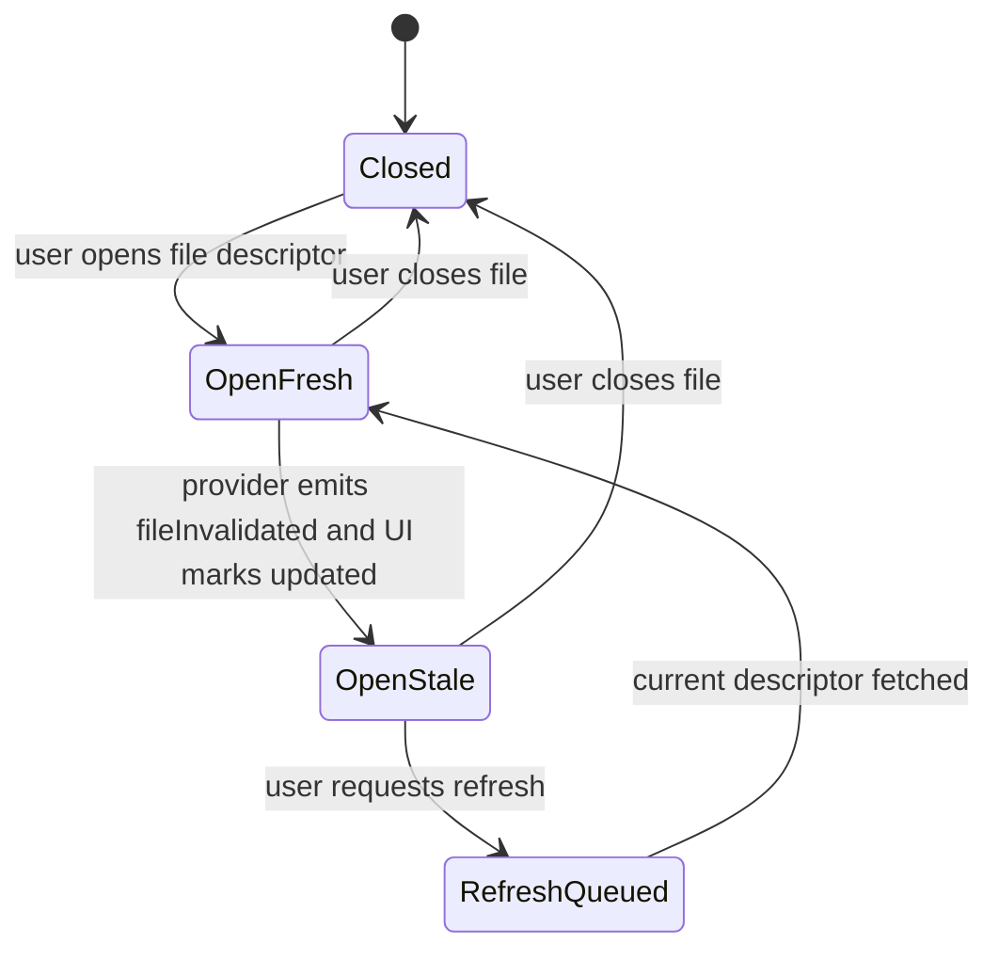
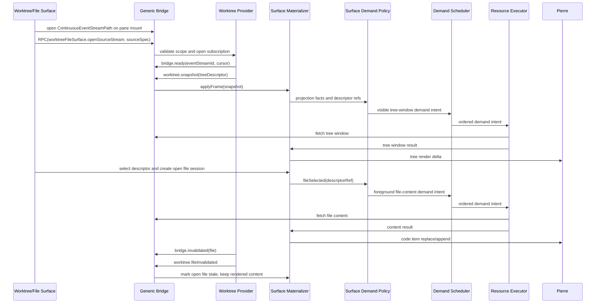

# Worktree/File Surface Protocol Spec

Date: 2026-06-22
Status: Reopened for 2026-06-24 expanded PR-ready epic reconciliation.
This slice owns Gate 0's first product proof: the exact `current-worktree` dev
URL must have a reviewed product-surface proof contract and precursor ticket
before downstream transport, Review, renderer, and PR-ready gates resume.
Parent: [spec.md](/Users/shravansunder/Documents/dev/project-dev/agent-studio.bridge-start/tmp/spec-workflows/2026-06-22-bridge-transport-streaming-spec/spec.md:1)

This file owns the Worktree/File Surface protocol family. The user-facing
surface is one app surface: file tree, file content, and git status belong
together. Future comments and agent communications belong in this surface once
their schema slice exists. File content is not a separate user-facing app from
worktree browsing.

## 1. Product Intent

The Worktree/File Surface lets a user inspect a live checkout:

- browse a huge file tree
- open and read files
- see git/file status
- receive live invalidations as files change
- keep open-file reader continuity
- reserve future review comments and agent communications on files/ranges
- optionally open Review comparison mode from the same surface

The surface should feel live without yanking content under the reader. A file
change must be visible to the user even when the open body is not automatically
replaced.

The development route for this surface is part of the product contract, not a
throwaway fixture. The exact URL
`?fixture=worktree&workers=on&scenario=current-worktree` must render and operate
the intended Worktree/File product surface. A bare file-list plus `<pre>` body
view, even when it has content, is not enough proof.

## 2. Ownership

Provider owns:

- worktree source authority
- filesystem watch classification
- git status classification
- tree/window descriptors
- file content descriptors
- file invalidation facts
- content handles and content hashes
- source reset/gap decisions

Browser surface owns:

- tree projection and expansion state
- file selection and open content session state
- stale/open-file UX
- reserved future comments/comms projection state once enabled
- app demand policy that maps selected, open, visible, and nearby resources onto
  generic Bridge demand lanes
- renderer deltas into Pierre

Generic Bridge owns:

- transport, parser limits, stream identity, resource URL grammar, cancellation,
  and stale-drop mechanics

## 3. Key Boundary Correction

The boundary is not:

```text
Worktree app versus FileView app
```

The boundary is:

```text
Worktree/File Surface
  tree contract
  file content contract
  status contract
  comment/comms contract
  optional Review handoff contract
```

Tree and file content can use separate substreams and descriptors, but they are
part of one app protocol family and one user-facing surface.

## 3.1 Required Product Surface Behavior

The Worktree/File product surface must expose these user-visible regions and
controls before it can be called working:

- source/status header or equivalent provenance surface that identifies the
  active Worktree/File source, not a Review package fixture
- tree/navigation region with selectable file rows and stable selection state
- file content region with open-file identity, loading/ready/stale/unavailable
  states, and reader-stable content
- tree/file search text input
- regex search toggle or mode control
- filter/status controls for narrowing the visible tree/file set
- refresh/update affordance when an open file is stale
- large-tree and large-file scroll surfaces with stable declared extent

These controls may be visually compact, but they must be discoverable in the DOM
with product-specific selectors and must produce observable state changes under
Playwright. Hidden test-only flags, DOM text concatenation, and content-ready
markers do not satisfy the product-surface contract by themselves.

The root Review/mock route is useful reference behavior, but it is not proof for
this surface. A passing Worktree/File proof must fail if the app accidentally
routes through Review package/query lineage, or if it renders a minimal raw
Worktree fixture rather than the intended product surface.

## 4. Live Update Policy

If a file is not open:

- tree/status/file descriptors may update continuously
- hidden subtree changes mark ancestors stale
- descriptor replacement can happen without user interruption

If a file is open:

- backing source changes mark the open content session stale
- the surface shows an update/stale notification or equivalent visible state
- current rendered content remains stable by default
- user can refresh/update to the latest descriptor
- comment/range anchors must not silently retarget without an app decision

This means update notification is required; silent body replacement is not.
Future auto-refresh policy may exist, but only for cases that preserve reader
and comment continuity and only after an explicit app-policy contract says when
`openFileInvalidated` may schedule active content demand.



## 5. Source Spec And Identity

```ts
import { z } from 'zod';

export const WorktreeFileSurfaceSourceSpec = z.object({
  clientRequestId: z.string().min(1),
  repoId: z.string().min(1),
  worktreeId: z.string().min(1),
  rootPathToken: z.string().min(1),
  cwdScope: z.string().min(1).optional(),
  pathScope: z.array(z.string().min(1)).optional(),
  includeStatuses: z.boolean().default(true),
  includeFileDescriptors: z.boolean().default(true),
  includeComments: z.boolean().default(false),
  includeAgentComms: z.boolean().default(false),
  freshness: z.literal('live'),
}).strict();

export const WorktreeFileSurfaceSourceIdentity = z.object({
  sourceId: z.string().min(1),
  repoId: z.string().min(1),
  worktreeId: z.string().min(1),
  subscriptionGeneration: z.number().int().nonnegative(),
  sourceCursor: z.string().min(1),
  rootRevisionToken: z.string().min(1).optional(),
}).strict();

export const WorktreeTreeProjectionIdentity = z.object({
  source: WorktreeFileSurfaceSourceIdentity,
  pathScope: z.array(z.string().min(1)),
  sortKey: z.string().min(1).optional(),
  groupKey: z.string().min(1).optional(),
  filterKey: z.string().min(1).optional(),
  treeWindowKey: z.string().min(1).optional(),
}).strict();

export const WorktreeTreeVirtualizedSizeFacts = z.object({
  pathCount: z.number().int().nonnegative(),
  windowStartIndex: z.number().int().nonnegative().optional(),
  windowRowCount: z.number().int().nonnegative().optional(),
  rowHeightPixels: z.number().positive(),
  estimatedTotalHeightPixels: z.number().nonnegative().optional(),
}).strict();

export const WorktreeFileVirtualizedExtentKind = z.enum([
  'exactLineCount',
  'estimatedHeight',
  'previewBounded',
  'unavailable',
]);

export const WorktreeFileSurfaceResourceKind = z.enum([
  'worktree.treeWindow',
  'worktree.treeDeltaOperations',
  'worktree.status',
  'worktree.fileContent',
  'worktree.fileRange',
  'worktree.commentThreadWindow',
  'worktree.agentCommsWindow',
]);

export const WorktreeFileSurfaceOpenSourceAccepted = z.object({
  kind: z.literal('accepted'),
  source: WorktreeFileSurfaceSourceIdentity,
  eventStreamId: z.string().min(1),
  intakeStreamId: z.string().min(1),
  initialCursor: z.string().min(1),
  treeRootDescriptor: BridgeAttachedResourceDescriptor.optional(),
}).strict();

export const WorktreeFileSurfaceOpenSourceRejected = z.object({
  kind: z.literal('rejected'),
  reason: z.enum([
    'notFound',
    'unauthorized',
    'outsideScope',
    'unsupportedSource',
    'providerUnavailable',
    'invalidRequest',
  ]),
  message: z.string().min(1).optional(),
}).strict();

export const WorktreeFileSurfaceOpenSourceDeferred = z.object({
  kind: z.literal('deferred'),
  reason: z.enum(['providerStarting', 'indexing', 'backpressure']),
  retryAfterMilliseconds: z.number().int().positive().optional(),
}).strict();

export const WorktreeFileSurfaceOpenSourceOutcome = z.discriminatedUnion('kind', [
  WorktreeFileSurfaceOpenSourceAccepted,
  WorktreeFileSurfaceOpenSourceRejected,
  WorktreeFileSurfaceOpenSourceDeferred,
]);
```

Contract:

- `WorktreeFileSurfaceSourceSpec` is a browser request/selector, not provider
  authority.
- Provider mints `WorktreeFileSurfaceSourceIdentity` and all file/content
  descriptors.
- Browser-supplied path/cwd scopes are selectors that must be canonicalized and
  containment-checked provider-side.
- `worktreeFileSurface.openSourceStream` returns
  `WorktreeFileSurfaceOpenSourceOutcome`. Only `accepted` establishes source
  identity, event-stream lineage, intake-stream lineage, and the initial cursor.
  `rejected` and `deferred` do not create descriptor or content authority.

## 6. File Descriptor And Content Session

Path is display/navigation. Authority is a provider-issued descriptor tied to a
source identity and content handle/hash.

```ts
export const WorktreeFileDescriptor = z.object({
  path: z.string().min(1),
  fileId: z.string().min(1),
  contentHandle: z.string().min(1),
  contentDescriptor: BridgeAttachedResourceDescriptor,
  contentHash: z.string().min(1).optional(),
  sourceIdentity: WorktreeFileSurfaceSourceIdentity,
  sizeBytes: z.number().int().nonnegative(),
  virtualizedExtentKind: WorktreeFileVirtualizedExtentKind,
  lineCount: z.number().int().nonnegative().optional(),
  estimatedContentHeightPixels: z.number().nonnegative().optional(),
  isBinary: z.boolean(),
  language: z.string().min(1).optional(),
  fileExtension: z.string().min(1).optional(),
  modifiedAtUnixMilliseconds: z.number().int().nonnegative().optional(),
}).strict();

export const WorktreeOpenFileSession = z.object({
  openFileSessionId: z.string().min(1),
  descriptor: WorktreeFileDescriptor,
  renderContentKey: z.string().min(1),
  status: z.enum(['opening', 'fresh', 'stale', 'refreshing', 'failed', 'closed']),
  staleReason: z.enum(['filesystemEvent', 'gitStatusChanged', 'contentChanged', 'sourceReset', 'unknown']).optional(),
  latestDescriptor: WorktreeFileDescriptor.optional(),
}).strict();
```

Contract:

- Open content sessions are reader-continuity objects.
- `virtualizedExtentKind`, `lineCount`, and `estimatedContentHeightPixels` are
  stable virtualization facts, not proof that the content body has hydrated.
  Unknown extent is explicit: the descriptor must say whether the extent is an
  exact line count, an estimated height, a preview-bounded range, or unavailable.
  For text files, the provider should send either an exact line count or a
  conservative estimated height before file content bytes are fetched. Use
  `unavailable` only for binary, oversized, unreadable, or explicitly
  metadata-only content where neither exact nor estimated extent can be trusted.
- Provider invalidation does not automatically replace open rendered content.
- Refresh creates a new content fetch intent using the latest descriptor.
- Stale completions cannot commit if their descriptor/source identity is no
  longer current for the open session.

## 7. Status And Invalidation

```ts
export const WorktreeStatusPatch = z.object({
  path: z.string().min(1).optional(),
  status: z.string().min(1).optional(),
  staged: z.number().int().nonnegative().optional(),
  unstaged: z.number().int().nonnegative().optional(),
  untracked: z.number().int().nonnegative().optional(),
  branchName: z.string().min(1).optional(),
  ahead: z.number().int().nonnegative().optional(),
  behind: z.number().int().nonnegative().optional(),
}).strict();

export const WorktreeFileInvalidation = z.object({
  path: z.string().min(1),
  fileId: z.string().min(1).optional(),
  reason: z.enum(['filesystemEvent', 'gitStatusChanged', 'contentChanged', 'sourceReset', 'unknown']),
  contentHandleIds: z.array(z.string().min(1)).optional(),
  latestDescriptor: WorktreeFileDescriptor.optional(),
}).strict();
```

Recommended status scope:

- summary metadata for branch/ahead/behind/counts
- per-path patches for tree badges and file rows
- no diff calculation unless Review comparison mode is opened

## 8. Intake Frames

```ts
export const WorktreeSnapshotFrame = BridgeIntakeFrameBase.extend({
  frameKind: z.literal('worktree.snapshot'),
  source: WorktreeFileSurfaceSourceIdentity,
  requestSelector: WorktreeFileSurfaceSourceSpec.optional(),
  treeDescriptor: BridgeAttachedResourceDescriptor,
  treeSizeFacts: WorktreeTreeVirtualizedSizeFacts.optional(),
  statusDescriptor: BridgeAttachedResourceDescriptor.optional(),
}).strict();

export const WorktreeTreeWindowFrame = BridgeIntakeFrameBase.extend({
  frameKind: z.literal('worktree.treeWindow'),
  projectionIdentity: WorktreeTreeProjectionIdentity,
  windowDescriptor: BridgeAttachedResourceDescriptor,
  treeSizeFacts: WorktreeTreeVirtualizedSizeFacts.optional(),
}).strict();

export const WorktreeTreeDeltaFrame = BridgeIntakeFrameBase.extend({
  frameKind: z.literal('worktree.treeDelta'),
  operationsDescriptor: BridgeAttachedResourceDescriptor,
}).strict();

export const WorktreeStatusPatchFrame = BridgeIntakeFrameBase.extend({
  frameKind: z.literal('worktree.statusPatch'),
  patch: WorktreeStatusPatch.or(z.object({
    statusDescriptor: BridgeAttachedResourceDescriptor,
  }).strict()),
}).strict();

export const WorktreeFileDescriptorFrame = BridgeIntakeFrameBase.extend({
  frameKind: z.literal('worktree.fileDescriptor'),
  descriptor: WorktreeFileDescriptor,
}).strict();

export const WorktreeFileInvalidatedFrame = BridgeIntakeFrameBase.extend({
  frameKind: z.literal('worktree.fileInvalidated'),
  invalidation: WorktreeFileInvalidation,
}).strict();

export const WorktreeResetFrame = BridgeIntakeFrameBase.extend({
  frameKind: z.literal('worktree.reset'),
  reason: z.enum(['sourceChanged', 'subscriptionReset', 'providerRestart', 'authorityChanged']),
  source: WorktreeFileSurfaceSourceIdentity.optional(),
  replacementDescriptor: BridgeAttachedResourceDescriptor.optional(),
}).strict();
```

An accepted `worktreeFileSurface.openSourceStream` outcome is the first
authoritative source-identity handoff for the surface. `worktree.snapshot` is
the first authoritative intake/projection frame for that accepted source.
`requestSelector` may echo the browser request for diagnostics, but it is not
authority for stale-drop, demand keys, or resource fetches.

Tree/file virtualization facts should arrive with the earliest authoritative
frame that knows them. Providers should expose tree row/count/window facts and
file `virtualizedExtentKind`, `lineCount`, or `estimatedContentHeightPixels`
early enough for the browser virtualizer to reserve a stable scroll extent
before fetching, streaming, or rendering hydrated file bodies. These facts can
be estimates, but they must be labeled as provider/materializer facts and
reconciled later by anchor-preserving measured updates rather than by
scrollbar-jumping full-body discovery. The stable extent contract is not
satisfied by a later content stream that reveals the total line count after the
browser has already sized the virtualizer.

Worktree/File subscription binding to the parent continuous event stream:

- `worktreeFileSurface.openSourceStream` is a command. It validates the source
  and returns `WorktreeFileSurfaceOpenSourceOutcome`.
- File selection is browser-local open-session state over a provider descriptor.
  It is not a Swift/Bridge `openFile` RPC in this contract. Selecting or
  refreshing a file emits app demand stimuli for descriptor-backed content.
- Compact lifecycle facts for the source ride the continuous event stream:
  ready/heartbeat, source status, descriptor availability, file/tree/status
  invalidation notice, gap, reset, and close.
- Worktree/File intake frames carry projection materialization: source snapshot,
  tree window, tree delta operations, status patches, file descriptors, rich file
  invalidation details, and reset replacement descriptors.
- `worktree.fileInvalidated` and `worktree.reset` frames are app projection
  detail that must agree with the authoritative `bridge.invalidated` or
  `bridge.reset` event for the same source identity, generation, and cursor.
- If the continuous event stream gaps, resets, or closes for a Worktree/File
  identity, matching intake and content work must rebind or fail closed. Polling,
  one-off pushes, or a Worktree-only local push stream do not satisfy live source
  proof.

## 9. Demand Policy Stimuli

Worktree/File demand policy consumes app-specific stimuli and emits generic
`DemandIntent` values. The stimuli are discriminated unions, not loose boolean
bags. The emitted lane names remain generic Bridge lanes.

```ts
export const WorktreeFileSurfaceDemandStimulus = z.discriminatedUnion('kind', [
  z.object({
    kind: z.literal('fileSelected'),
    descriptorRef: BridgeDescriptorRef,
  }).strict(),
  z.object({
    kind: z.literal('openFileInvalidated'),
    descriptorRef: BridgeDescriptorRef,
  }).strict(),
  z.object({
    kind: z.literal('treeViewportChanged'),
    descriptorRefs: z.array(BridgeDescriptorRef),
  }).strict(),
  z.object({
    kind: z.literal('treeExpanded'),
    descriptorRef: BridgeDescriptorRef,
  }).strict(),
  z.object({
    kind: z.literal('explicitRefresh'),
    descriptorRef: BridgeDescriptorRef,
  }).strict(),
  z.object({
    kind: z.literal('hoverChanged'),
    descriptorRef: BridgeDescriptorRef.nullable(),
  }).strict(),
  z.object({
    kind: z.literal('sourceReset'),
    sourceIdentity: z.string().min(1),
  }).strict(),
]);
```

Required mappings:

- `fileSelected` and `explicitRefresh` map to `foreground`.
- `openFileInvalidated` marks stale and emits no content demand in the first
  implementation. Content refresh requires `explicitRefresh`.
- `treeViewportChanged` maps demanded visible window refs to `visible`.
- `treeExpanded` maps visible expansion windows to `visible`; nearby expansion
  windows can map to `nearby`.
- `hoverChanged` maps non-null demanded refs to `speculative`.
- `sourceReset` emits no demand and invalidates queued/in-flight work by source
  identity.

## 10. Tree Windowing

Huge repos cannot require full-tree materialization.

Recommended delivery:

```text
initial snapshot
  includes descriptor for root/visible window

visible expansion
  app demand policy maps tree-window work to the visible lane
  demand scheduler orders it
  resource executor fetches bounded tree window

hidden changes
  provider emits compact stale/invalidation facts
  hidden descendants are not fetched until demanded
```

Tree windows carry stable size metadata separately from row bodies. At minimum,
the first provider snapshot or first demanded window should tell the browser the
current `pathCount`, fixed or declared row height, and any known visible-window
row range so the tree can reserve extent before all descendants or file bodies
are hydrated. If the exact `pathCount` is not yet available, the provider must
send a conservative estimated total extent and later reconcile it through a
measured, attributed update instead of allowing the tree body stream to resize
the scrollbar silently.

## 11. Surface Flow



## 12. Comments And Agent Communications

Comments and agent communications belong in the Worktree/File Surface because
they are anchored to the same files, ranges, selections, and source identities
that the user is already viewing.

This spec reserves the substream/resource kinds:

- `commentThreadWindow`
- `agentCommsWindow`

Until the comment/comms schema slice exists:

- `includeComments` and `includeAgentComms` must fail closed or be ignored with
  an explicit unsupported result
- comment/comms resource kinds must not be fetchable
- no authoring/mutation command is in first-plan scope

Deferred exact schemas must define:

- anchor identity: source identity, file id/path, range, content hash if needed
- lifecycle: open, resolved, stale, superseded
- pagination/windowing
- permission/redaction rules
- telemetry scrub rules
- how anchors behave when open file content is stale

## 13. Review Handoff

The Worktree/File Surface can ask app composition to open Review mode, and any
product surface that exposes "review these changes" behavior must use this
typed handoff. Review remains a separate comparison protocol:

```text
Worktree/File Surface selection
  -> OpenReviewComparisonIntent
  -> Review protocol validates and builds ReviewComparisonSpec
  -> Review provider materializes comparison package
  -> Review frames drive Review projection
```

The Worktree/File Surface does not become a diff engine. It can ask Review to
compare sources.

```ts
export const OpenReviewComparisonIntent = z.object({
  fromSurface: z.literal('worktreeFileSurface'),
  sourceIdentity: WorktreeFileSurfaceSourceIdentity,
  selectedPaths: z.array(z.string().min(1)),
  comparisonHint: z.enum(['baseBranch', 'commit', 'tag', 'timeWindow', 'manual']).optional(),
}).strict();

export const WorktreeOpenReviewComparisonOutcome = z.discriminatedUnion('kind', [
  z.object({
    kind: z.literal('accepted'),
    comparisonId: z.string().min(1),
    reviewPaneId: z.string().min(1).optional(),
  }).strict(),
  z.object({
    kind: z.literal('rejected'),
    reason: z.enum(['invalidSource', 'staleSource', 'unsupportedComparison', 'permissionDenied']),
    userFacingReason: z.string().min(1).optional(),
  }).strict(),
  z.object({
    kind: z.literal('deferred'),
    reason: z.enum(['needsUserInput', 'providerBusy', 'sourceNotReady']),
    requestedInput: z.array(z.string().min(1)).optional(),
  }).strict(),
]);
```

Contract:

- Worktree/File owns the user selection, source identity, and path hints.
- `selectedPaths` are validation hints scoped by `sourceIdentity`; they are not
  comparison authority.
- Review owns validation of the comparison request and construction of
  `ReviewComparisonSpec`.
- The Review provider owns Git diff calculation and package materialization.
- Review or app composition returns a typed accepted/rejected/deferred outcome.
  Rejection/defer UX may be surfaced by app composition, but Worktree/File must
  not recover by minting Review endpoints, package identity, or diff authority.
- The handoff is required for any Worktree/File UX that opens review mode. If a
  plan excludes that UX, the plan must say so explicitly instead of leaving the
  handoff as an invisible optional gap.

## 14. Proof Expectations

- worktree tree/status updates do not instantiate Review package lineage
- file descriptor replacement does not silently replace open rendered content
- open file invalidation marks stale, exposes a visible update notification, and
  exposes refresh
- closed/unopened file descriptors can update live
- selected file content maps to `foreground`; open stale file invalidation emits
  no content demand until explicit refresh
- demand policy inputs are discriminated stimuli, not loose boolean bags
- worktree snapshot carries provider-issued source identity, not only the
  browser selector
- worktree frames attach descriptors instead of exposing raw descriptor strings
- huge tree expansion fetches bounded tree windows
- initial tree/file facts expose row/count/window metadata and file line-count or
  estimated extent metadata before content bytes arrive for virtualization
- tree scroll extent follows the DiffsHub-style model: provider `pathCount`,
  declared row height, and bounded window range, or a conservative estimated
  total extent, are available before hidden descendants or file bodies hydrate
- file/code scroll extent is explicit for every opened descriptor:
  `exactLineCount`, `estimatedHeight`, `previewBounded`, or `unavailable`
- scroll-extent canary records scrollTop before/after, total content height
  before/after, visible range, anchor item/offset, measured item ids, and
  reconciliation reason; it fails if a non-reset reconciliation changes anchor
  item identity, drifts the anchor offset by more than one declared row/line
  height after compensation, changes exact-count `scrollHeight`/virtualizer
  `totalSize` by more than one declared row/line height, or changes estimated
  total height without attributing the delta to measured-versus-estimated items
- hidden subtree changes do not hydrate hidden descendants
- current-scope visible Worktree route proof uses the real browser/dev-server
  `current-worktree` scenario and fails if app root/tree pane/file pane lack
  visible non-zero rects, sampled tree entries do not occupy distinct row boxes,
  selected exact-line fixtures lose visible line structure, packaged styling does
  not affect the mounted surface, proof cannot identify Worktree/File source
  identity plus event/intake lineage, proof is driven by Review package/query
  lineage, or raw frame fields/serialized payload/path corpus dumps appear
  outside intentional tree/content UI
- current-scope product E2E proof uses Playwright against the exact dev-server
  URL and must exercise file click/open, content render, search input, regex
  toggle, filter/status controls, large-tree scroll, large-file scroll, and
  source/protocol provenance assertions
- current-scope product E2E proof emits screenshot artifacts before/after
  interaction plus a JSON artifact that records route identity, protocol/source
  lineage, selected file path, open content state, control state changes, scroll
  extent canaries, and negative assertions against Review/mock lineage and raw
  minimal rendering
- current-scope product E2E proof is a blocker for later transport, scheduler,
  renderer, and telemetry claims; lower-level unit/component/browser tests may
  support it but cannot replace it
- current-scope comments/comms proof is fail-closed: `includeComments`,
  `includeAgentComms`, `commentThreadWindow`, and `agentCommsWindow` are rejected
  or unsupported and are not fetchable
- future comments/comms anchor proof applies only after the schema slice is in
  scope; then anchors must be scoped by source/file/range identity
- stale content completions are dropped if descriptor/source identity changed
- binary or oversized files render metadata-only or unavailable state without
  placing bodies in Zustand

## 15. Open Decisions

OD-W1. First open-file refresh policy.

Decision for first implementation: manual refresh after stale marker.
Auto-refresh can be a later opt-in for safe cases and must add an explicit app
policy fact before `openFileInvalidated` can emit active content demand.

OD-W2. Comment/comms schema depth.

Deferred. The surface owns the concept, but exact schemas need their own spec
slice before implementation.

OD-W3. Binary/large-file preview.

First implementation behavior:

- binary files render metadata-only/unavailable state unless a later preview
  contract exists
- oversized text files may expose bounded preview ranges only as
  non-authoritative preview data
- descriptor/resource descriptor fields expose `isBinary`, size, media type,
  and resource limits

OD-W4. Rename tracking.

Recommended default: path is display/navigation; provider-issued file id and
content handle are authority. Rename heuristics stay provider-owned.
