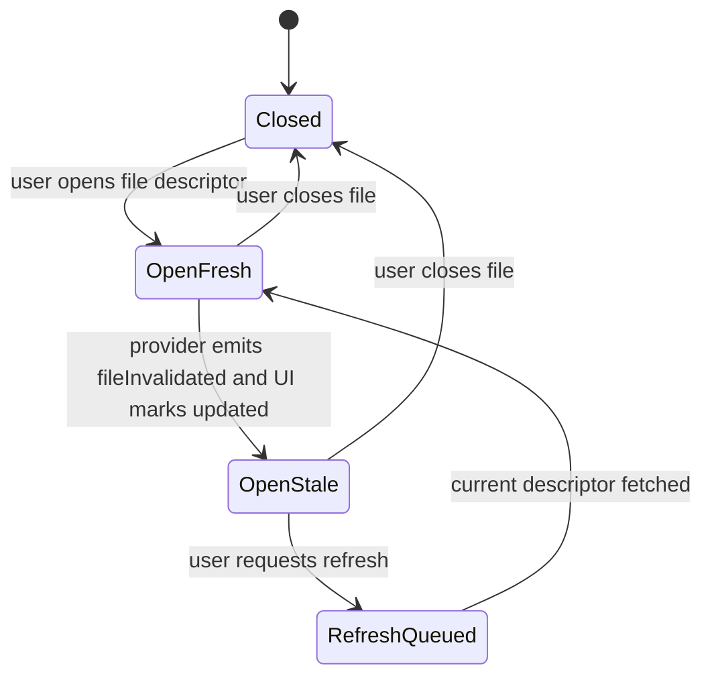
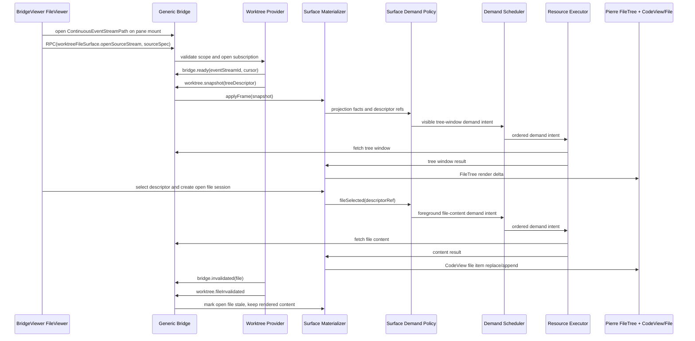

# Worktree/File Surface Protocol Spec

Date: 2026-06-22
Status: Gate 0.a reopened for the shared BridgeViewer/FileViewer correction;
native proof remains required. This slice owns the Files-context portion of the
Gate 0.a shared current-worktree route set. The full gate also requires Review
diff and Review file-target routes before downstream transport, Review, renderer,
and PR-ready gates resume.
Parent: [spec.md](spec.md)

Current Gate 0.a status: active blocker. The prior Vite/dev-server proof
packets remain useful evidence, but they do not close this gate until a fresh
run against the live dev server proves the corrected product surface:
`BridgeViewerApp` with `FileViewer` mode, primary Pierre CodeView/File canvas on
the left, Pierre FileTree/right rail on the right, Shiki/Pierre rendering, and
worker-backed highlighting when `workers=on`. Gate 0.a now also requires an
understandable dev navigation loop for the same shared app: the current
worktree can open either the Files context or the Review context through
dev-only query parameters, and those query parameters mutate the same
BridgeViewer navigation store that Swift production intents will mutate
internally. The first repair is not to make a standalone Worktree/File app more
polished; it is to remove or bypass the second app path for the route set, prove
the Worktree/File source flows through the shared BridgeViewer shell, and prove
current-worktree review/file navigation is not a separate app route. Native
Agent Studio Bridge/WKWebView proof remains required before PR-ready.

This file owns the Worktree/File protocol family for FileViewer data. FileViewer
is a viewer mode inside the shared BridgeViewer app, not a separate app. The
user-facing surface is one BridgeViewer shell: primary Pierre CodeView/File
canvas on the left, Pierre FileTree/right rail on the right, shared search and
selection chrome, and the same Shiki/worker rendering path used by ReviewViewer.
Future comments and agent communications belong in this surface once their
schema slice exists. File content is not a separate user-facing app from
worktree browsing.

## 1. Product Intent

The Worktree/File Surface lets a user inspect a live checkout through
FileViewer:

- browse a huge file tree
- open and read files
- see git/file status
- receive live invalidations as files change
- keep open-file reader continuity
- reserve future review comments and agent communications on files/ranges
- optionally open Review comparison mode from the same surface

The surface should feel live without yanking content under the reader. A file
change must be visible to the user even when the open body is not automatically
replaced.

The development route set for this surface is part of the product contract, not
a throwaway fixture. The Files URL
`?fixture=worktree&viewer=file&workers=on&scenario=current-worktree` must render
and operate FileViewer inside the shared BridgeViewer shell. The legacy URL
`?fixture=worktree&workers=on&scenario=current-worktree` may default to Files for
compatibility, but it is not sufficient proof by itself. The app split is:

```text
Bridge Viewer App
  viewer modes:
    ReviewViewer: diffs, changesets, review packages
    FileViewer: worktree browsing, single-file reading, live file view
  shared UX contract:
    left: primary Pierre CodeView/File canvas
    right: Pierre FileTree/right rail
    renderer: Pierre + Shiki + worker pool when enabled
    chrome: same search/filter/selection style
  navigation contract:
    source of truth: Zustand refs/facts/location state, not query params
    contexts: Review and Files
    targets: diff and file
    remembered per context: source, selected target, rail state, canvas anchor
    dev only: query params initialize/mutate the store for fast iteration
    production: Swift sends internal BridgeViewer intents/commands
  data sources:
    mock fixture, current worktree, live changeset stream,
    static diff/review package, file content stream
```

A bare file-list plus `<pre>` body view, even when it has content, is invalid
proof because it bypasses Pierre CodeView/File, Pierre FileTree, Shiki
highlighting, and worker-backed rendering.

## 2. Ownership

Provider owns:

- worktree source authority
- filesystem watch classification
- git status classification
- tree/window descriptors
- file content descriptors
- file invalidation facts
- content handles and content hashes
- source reset/gap decisions

Production Swift/native providers use the repo's `agentstudio-git` library for
git status, diff, ignore-policy, and candidate preparation. TypeScript git
helpers are allowed only in clearly marked Vite dev-server utilities or test
fixture utilities and must not become production Bridge source-adapter
plumbing.

Browser surface owns:

- tree projection and expansion state
- Files-context adaptation into the shared BridgeViewer navigation store
- file target selection and open content session state
- stale/open-file UX
- reserved future comments/comms projection state once enabled
- app demand policy that maps selected, open, visible, and nearby resources onto
  generic Bridge demand lanes
- adaptation from Worktree/File frames and descriptors into shared FileViewer
  item/tree input
- renderer deltas into Pierre CodeView/File and Pierre FileTree

Generic Bridge owns:

- transport, parser limits, stream identity, resource URL grammar, cancellation,
  and stale-drop mechanics

## 3. Key Boundary Correction

The boundary is not:

```text
Worktree app versus FileView app
WorktreeFileApp versus ReviewViewer app
```

The boundary is:

```text
BridgeViewerApp
  ReviewViewer mode
    review protocol data
    Pierre CodeView diff/file items
    Pierre FileTree/right rail

  FileViewer mode
    Worktree/File protocol data
    Pierre CodeView file items
    Pierre FileTree/right rail

Source adapters
  mock fixture
  current worktree
  live changeset stream
  static review package
  file content stream

Worktree/File protocol
  owns: tree contract, file content contract, status contract,
        comment/comms contract, optional Review handoff contract
  exposes: source identity, descriptors, invalidation facts,
           bounded resource/data streams
```

Tree and file content can use separate substreams and descriptors, but they are
part of one app protocol family and one user-facing surface.

The Worktree/File protocol can have its own source provider, materializer, and
demand policy, but it must not own a parallel application shell, a custom
renderer, a custom tree UI, or a raw `<pre>` content path. A standalone
`WorktreeFileApp` route is a migration scaffold at most; it is not an acceptable
end-state or Gate 0 proof path.

## 3.1 BridgeViewer Navigation And View State

The shared BridgeViewer shell owns navigation as application state. Zustand is
the Browser-side source of truth for navigation and lightweight view facts:

- active source references
- active context: `review` or `files`
- active target: `diff` or `file`
- rail state: search text, search mode, filters, expanded paths, selected path,
  and rail scroll
- canvas state: selected target status, stale/loading/error facts, and scroll
  anchor
- descriptor refs, source identity refs, revision/generation facts, and extent
  facts

Zustand must not store large file bodies, raw diff bodies, worker instances,
Pierre instances, stream handles, resource executors, or fetched content bytes.
Those remain in descriptor-backed content/materialization paths.

The canonical navigation command/source/target schema lives in the parent
BridgeViewer transport spec. This child protocol uses the same vocabulary; it
must not define a path-only Review file target. The local TypeScript shape below
is an illustrative projection of the canonical schema for this surface:

```ts
export type BridgeViewerContext =
  | { readonly kind: 'review'; readonly sourceId: string }
  | { readonly kind: 'files'; readonly sourceId: string };

export type BridgeViewerTarget =
  | {
      readonly kind: 'diff';
      readonly sourceId: string;
      readonly itemId: string;
      readonly comparisonId: string;
    }
  | {
      readonly kind: 'file';
      readonly sourceId: string;
      readonly fileRef: BridgeFileRef;
      readonly version: 'base' | 'head' | 'current';
      readonly reviewItemId?: string;
      readonly comparisonId?: string;
    };
```

When `kind === 'file'` and the active context is Review, `reviewItemId` is the
preferred resolution key before file-ref/path fallback. `comparisonId` must
match the accepted Review comparison authority once that authority exists.
Worktree/File context file targets use `version: 'current'` and do not mint
Review comparison authority.

Context chooses the navigation behavior and source materializer. Target chooses
the left canvas presentation:

```text
Review context + diff target  -> review rail + Pierre diff canvas
Review context + file target  -> review rail + Pierre/Shiki file canvas
Files context  + file target  -> file rail + Pierre/Shiki file canvas
Files context  + diff target  -> future affordance only; it must bind to
                                  Review/comparison identity and must not be
                                  satisfied from Worktree/File protocol data
                                  alone
```

The app has a user-facing context toggle between Review and Files. Switching
contexts saves and restores each context's source, selected target, rail state,
and canvas scroll anchor. A user can inspect a diff in Review, switch to Files,
then switch back and keep the same review item and scroll anchor.

Within Review, opening a file is a target change, not a new app:

```text
Review rail row selected
  default action: activeTarget = diff(itemId)
  View File action: activeTarget = file(item.head/current ref)
```

There is no rich preview target in this scope. Markdown and other text-like
files are rendered as files through Pierre/Shiki. A later preview target must
earn a separate spec slice.

## 3.2 Required Product Surface Behavior

The Worktree/File product surface must expose these user-visible regions and
controls before it can be called working:

- shared BridgeViewer content-header title slot that identifies the active
  Worktree/File source and selected target, not a Review package fixture. Any
  additional source/status badge must live inside that same content header slot
  or the right-rail toolbar; Worktree/File must not add a second Files-only top
  row.
- Pierre FileTree/right rail with selectable file rows and stable selection
  state
- primary Pierre CodeView/File region with open-file identity,
  loading/ready/stale/unavailable states, reader-stable content, Shiki
  highlighting, and worker-backed highlighting when `workers=on`
- tree/file search text input
- regex search toggle or mode control
- filter/status controls for narrowing the visible tree/file set
- refresh/update affordance when an open file is stale
- large-tree and large-file scroll surfaces with stable declared extent

These controls may be visually compact, but they must be discoverable in the DOM
with product-specific selectors and must produce observable state changes under
Playwright. Hidden test-only flags, DOM text concatenation, and content-ready
markers do not satisfy the product-surface contract by themselves.

The root Review/mock route is useful reference behavior, but it is not proof for
this surface. A passing Worktree/File proof must fail if the app accidentally
routes through Review package/query lineage, if it mounts a standalone
Worktree/File mini-app, or if it renders a minimal raw Worktree fixture rather
than FileViewer inside the shared BridgeViewer product shell.

## 3.3 Dev Navigation Versus Swift Production Navigation

Dev-server query parameters are a test harness for fast iteration. They are not
the production navigation API.

Required dev navigation examples:

```text
/?fixture=worktree&viewer=file&workers=on&scenario=current-worktree
  -> BridgeViewer context = files
  -> source = current worktree file source
  -> default target = selected/current file

/?fixture=worktree&viewer=review&workers=on&scenario=current-worktree
  -> BridgeViewer context = review
  -> source = current worktree comparison source
  -> default target = first diff item

/?fixture=worktree&viewer=review&presentation=file&workers=on&scenario=current-worktree&path=<path>&version=<base|head|current>
  -> BridgeViewer context = review
  -> path is a bootstrap hint
  -> target = typed Review file target with comparison id, review item or
     resolved file ref, and version
```

The shorter conceptual form
`/?fixture=worktree&viewer=review&presentation=file&path=<path>` is not accepted
Gate 0.a proof. Required proof uses the worker-backed current-worktree scenario,
records `version`, and records the accepted Review comparison/source lineage.

Production Swift must create equivalent `BridgeViewerNavigationCommand` messages
and send them through Bridge/app composition. Users do not see or edit query
parameters in the Swift app. The browser receives the same typed command shape
that the dev query adapter produces and mutates the same Zustand navigation store.

## 4. Live Update Policy

If a file is not open:

- tree/status/file descriptors may update continuously
- hidden subtree changes mark ancestors stale
- descriptor replacement can happen without user interruption

If a file is open:

- backing source changes mark the open content session stale
- the surface shows an update/stale notification or equivalent visible state
- current rendered content remains stable by default
- user can refresh/update to the latest descriptor
- comment/range anchors must not silently retarget without an app decision

This means update notification is required; silent body replacement is not.
Future auto-refresh policy may exist, but only for cases that preserve reader
and comment continuity and only after an explicit app-policy contract says when
`openFileInvalidated` may schedule active content demand.



## 5. Source Spec And Identity

```ts
import { z } from 'zod';

export const WorktreeFileSurfaceSourceSpec = z.object({
  clientRequestId: z.string().min(1),
  repoId: z.string().min(1),
  worktreeId: z.string().min(1),
  rootPathToken: z.string().min(1),
  cwdScope: z.string().min(1).optional(),
  pathScope: z.array(z.string().min(1)).optional(),
  includeStatuses: z.boolean().default(true),
  includeFileDescriptors: z.boolean().default(true),
  includeComments: z.boolean().default(false),
  includeAgentComms: z.boolean().default(false),
  freshness: z.literal('live'),
}).strict();

export const WorktreeFileSurfaceSourceIdentity = z.object({
  sourceId: z.string().min(1),
  repoId: z.string().min(1),
  worktreeId: z.string().min(1),
  subscriptionGeneration: z.number().int().nonnegative(),
  sourceCursor: z.string().min(1),
  rootRevisionToken: z.string().min(1).optional(),
}).strict();

export const WorktreeTreeProjectionIdentity = z.object({
  source: WorktreeFileSurfaceSourceIdentity,
  pathScope: z.array(z.string().min(1)),
  sortKey: z.string().min(1).optional(),
  groupKey: z.string().min(1).optional(),
  filterKey: z.string().min(1).optional(),
  treeWindowKey: z.string().min(1).optional(),
}).strict();

export const WorktreeTreeVirtualizedSizeFacts = z.object({
  pathCount: z.number().int().nonnegative(),
  windowStartIndex: z.number().int().nonnegative().optional(),
  windowRowCount: z.number().int().nonnegative().optional(),
  rowHeightPixels: z.number().positive(),
  estimatedTotalHeightPixels: z.number().nonnegative().optional(),
}).strict();

export const WorktreeFileVirtualizedExtentKind = z.enum([
  'exactLineCount',
  'estimatedHeight',
  'previewBounded',
  'unavailable',
]);

export const WorktreeFileSurfaceResourceKind = z.enum([
  'worktree.treeWindow',
  'worktree.treeDeltaOperations',
  'worktree.status',
  'worktree.fileContent',
  'worktree.fileRange',
  'worktree.commentThreadWindow',
  'worktree.agentCommsWindow',
]);

export const WorktreeFileSurfaceOpenSourceAccepted = z.object({
  kind: z.literal('accepted'),
  source: WorktreeFileSurfaceSourceIdentity,
  eventStreamId: z.string().min(1),
  intakeStreamId: z.string().min(1),
  initialCursor: z.string().min(1),
  treeRootDescriptor: BridgeAttachedResourceDescriptor.optional(),
}).strict();

export const WorktreeFileSurfaceOpenSourceRejected = z.object({
  kind: z.literal('rejected'),
  reason: z.enum([
    'notFound',
    'unauthorized',
    'outsideScope',
    'unsupportedSource',
    'providerUnavailable',
    'invalidRequest',
  ]),
  message: z.string().min(1).optional(),
}).strict();

export const WorktreeFileSurfaceOpenSourceDeferred = z.object({
  kind: z.literal('deferred'),
  reason: z.enum(['providerStarting', 'indexing', 'backpressure']),
  retryAfterMilliseconds: z.number().int().positive().optional(),
}).strict();

export const WorktreeFileSurfaceOpenSourceOutcome = z.discriminatedUnion('kind', [
  WorktreeFileSurfaceOpenSourceAccepted,
  WorktreeFileSurfaceOpenSourceRejected,
  WorktreeFileSurfaceOpenSourceDeferred,
]);
```

Contract:

- `WorktreeFileSurfaceSourceSpec` is a browser request/selector, not provider
  authority.
- Provider mints `WorktreeFileSurfaceSourceIdentity` and all file/content
  descriptors.
- Browser-supplied path/cwd scopes are selectors that must be canonicalized and
  containment-checked provider-side.
- `worktreeFileSurface.openSourceStream` returns
  `WorktreeFileSurfaceOpenSourceOutcome`. Only `accepted` establishes source
  identity, event-stream lineage, intake-stream lineage, and the initial cursor.
  `rejected` and `deferred` do not create descriptor or content authority.

## 6. File Descriptor And Content Session

Path is display/navigation. Authority is a provider-issued descriptor tied to a
source identity and content handle/hash.

```ts
export const WorktreeFileDescriptor = z.object({
  path: z.string().min(1),
  fileId: z.string().min(1),
  contentHandle: z.string().min(1),
  contentDescriptor: BridgeAttachedResourceDescriptor,
  contentHash: z.string().min(1).optional(),
  sourceIdentity: WorktreeFileSurfaceSourceIdentity,
  sizeBytes: z.number().int().nonnegative(),
  virtualizedExtentKind: WorktreeFileVirtualizedExtentKind,
  lineCount: z.number().int().nonnegative().optional(),
  estimatedContentHeightPixels: z.number().nonnegative().optional(),
  isBinary: z.boolean(),
  language: z.string().min(1).optional(),
  fileExtension: z.string().min(1).optional(),
  modifiedAtUnixMilliseconds: z.number().int().nonnegative().optional(),
}).strict();

export const WorktreeOpenFileSession = z.object({
  openFileSessionId: z.string().min(1),
  descriptor: WorktreeFileDescriptor,
  renderContentKey: z.string().min(1),
  status: z.enum(['opening', 'fresh', 'stale', 'refreshing', 'failed', 'closed']),
  staleReason: z.enum(['filesystemEvent', 'gitStatusChanged', 'contentChanged', 'sourceReset', 'unknown']).optional(),
  latestDescriptor: WorktreeFileDescriptor.optional(),
}).strict();
```

Contract:

- Open content sessions are reader-continuity objects.
- `virtualizedExtentKind`, `lineCount`, and `estimatedContentHeightPixels` are
  stable virtualization facts, not proof that the content body has hydrated.
  Unknown extent is explicit: the descriptor must say whether the extent is an
  exact line count, an estimated height, a preview-bounded range, or unavailable.
  For text files, the provider should send either an exact line count or a
  conservative estimated height before file content bytes are fetched. Use
  `unavailable` only for binary, oversized, unreadable, or explicitly
  metadata-only content where neither exact nor estimated extent can be trusted.
- Provider invalidation does not automatically replace open rendered content.
- Refresh creates a new content fetch intent using the latest descriptor.
- Stale completions cannot commit if their descriptor/source identity is no
  longer current for the open session.
- File content fetch materializes the descriptor version that was already minted
  by the accepted surface/projection cursor. It must not re-scan the whole
  worktree before serving that descriptor body. After a newer surface cursor is
  accepted, older cursor-bound content requests may reject as stale.

## 7. Status And Invalidation

```ts
export const WorktreeStatusPatch = z.object({
  path: z.string().min(1).optional(),
  status: z.string().min(1).optional(),
  staged: z.number().int().nonnegative().optional(),
  unstaged: z.number().int().nonnegative().optional(),
  untracked: z.number().int().nonnegative().optional(),
  branchName: z.string().min(1).optional(),
  ahead: z.number().int().nonnegative().optional(),
  behind: z.number().int().nonnegative().optional(),
}).strict();

export const WorktreeFileInvalidation = z.object({
  path: z.string().min(1),
  fileId: z.string().min(1).optional(),
  reason: z.enum(['filesystemEvent', 'gitStatusChanged', 'contentChanged', 'sourceReset', 'unknown']),
  contentHandleIds: z.array(z.string().min(1)).optional(),
  latestDescriptor: WorktreeFileDescriptor.optional(),
}).strict();
```

Recommended status scope:

- summary metadata for branch/ahead/behind/counts
- per-path patches for tree badges and file rows
- no diff calculation unless Review comparison mode is opened

## 8. Intake Frames

```ts
export const WorktreeSnapshotFrame = BridgeIntakeFrameBase.extend({
  frameKind: z.literal('worktree.snapshot'),
  source: WorktreeFileSurfaceSourceIdentity,
  requestSelector: WorktreeFileSurfaceSourceSpec.optional(),
  treeDescriptor: BridgeAttachedResourceDescriptor,
  treeSizeFacts: WorktreeTreeVirtualizedSizeFacts.optional(),
  statusDescriptor: BridgeAttachedResourceDescriptor.optional(),
}).strict();

export const WorktreeTreeWindowFrame = BridgeIntakeFrameBase.extend({
  frameKind: z.literal('worktree.treeWindow'),
  projectionIdentity: WorktreeTreeProjectionIdentity,
  windowDescriptor: BridgeAttachedResourceDescriptor,
  treeSizeFacts: WorktreeTreeVirtualizedSizeFacts.optional(),
}).strict();

export const WorktreeTreeDeltaFrame = BridgeIntakeFrameBase.extend({
  frameKind: z.literal('worktree.treeDelta'),
  operationsDescriptor: BridgeAttachedResourceDescriptor,
}).strict();

export const WorktreeStatusPatchFrame = BridgeIntakeFrameBase.extend({
  frameKind: z.literal('worktree.statusPatch'),
  patch: WorktreeStatusPatch.or(z.object({
    statusDescriptor: BridgeAttachedResourceDescriptor,
  }).strict()),
}).strict();

export const WorktreeFileDescriptorFrame = BridgeIntakeFrameBase.extend({
  frameKind: z.literal('worktree.fileDescriptor'),
  descriptor: WorktreeFileDescriptor,
}).strict();

export const WorktreeFileInvalidatedFrame = BridgeIntakeFrameBase.extend({
  frameKind: z.literal('worktree.fileInvalidated'),
  invalidation: WorktreeFileInvalidation,
}).strict();

export const WorktreeResetFrame = BridgeIntakeFrameBase.extend({
  frameKind: z.literal('worktree.reset'),
  reason: z.enum(['sourceChanged', 'subscriptionReset', 'providerRestart', 'authorityChanged']),
  source: WorktreeFileSurfaceSourceIdentity.optional(),
  replacementDescriptor: BridgeAttachedResourceDescriptor.optional(),
}).strict();
```

An accepted `worktreeFileSurface.openSourceStream` outcome is the first
authoritative source-identity handoff for the surface. `worktree.snapshot` is
the first authoritative intake/projection frame for that accepted source.
`requestSelector` may echo the browser request for diagnostics, but it is not
authority for stale-drop, demand keys, or resource fetches.

Tree/file virtualization facts should arrive with the earliest authoritative
frame that knows them. Providers should expose tree row/count/window facts and
file `virtualizedExtentKind`, `lineCount`, or `estimatedContentHeightPixels`
early enough for the browser virtualizer to reserve a stable scroll extent
before fetching, streaming, or rendering hydrated file bodies. These facts can
be estimates, but they must be labeled as provider/materializer facts and
reconciled later by anchor-preserving measured updates rather than by
scrollbar-jumping full-body discovery. The stable extent contract is not
satisfied by a later content stream that reveals the total line count after the
browser has already sized the virtualizer.

Worktree/File subscription binding to the parent continuous event stream:

- `worktreeFileSurface.openSourceStream` is a command. It validates the source
  and returns `WorktreeFileSurfaceOpenSourceOutcome`.
- File selection is browser-local open-session state over a provider descriptor.
  It is not a Swift/Bridge `openFile` RPC in this contract. Selecting or
  refreshing a file emits app demand stimuli for descriptor-backed content.
- Compact lifecycle facts for the source ride the continuous event stream:
  ready/heartbeat, source status, descriptor availability, file/tree/status
  invalidation notice, gap, reset, and close.
- Worktree/File intake frames carry projection materialization: source snapshot,
  tree window, tree delta operations, status patches, file descriptors, rich file
  invalidation details, and reset replacement descriptors.
- `worktree.fileInvalidated` and `worktree.reset` frames are app projection
  detail that must agree with the authoritative `bridge.invalidated` or
  `bridge.reset` event for the same source identity, generation, and cursor.
- If the continuous event stream gaps, resets, or closes for a Worktree/File
  identity, matching intake and content work must rebind or fail closed. Polling,
  one-off pushes, or a Worktree-only local push stream do not satisfy live source
  proof.

## 9. Demand Policy Stimuli

Worktree/File demand policy consumes app-specific stimuli and emits generic
`DemandIntent` values. The stimuli are discriminated unions, not loose boolean
bags. The emitted lane names remain generic Bridge lanes.

```ts
export const WorktreeFileSurfaceDemandStimulus = z.discriminatedUnion('kind', [
  z.object({
    kind: z.literal('fileSelected'),
    descriptorRef: BridgeDescriptorRef,
  }).strict(),
  z.object({
    kind: z.literal('openFileInvalidated'),
    descriptorRef: BridgeDescriptorRef,
  }).strict(),
  z.object({
    kind: z.literal('treeViewportChanged'),
    descriptorRefs: z.array(BridgeDescriptorRef),
  }).strict(),
  z.object({
    kind: z.literal('treeExpanded'),
    descriptorRef: BridgeDescriptorRef,
  }).strict(),
  z.object({
    kind: z.literal('explicitRefresh'),
    descriptorRef: BridgeDescriptorRef,
  }).strict(),
  z.object({
    kind: z.literal('hoverChanged'),
    descriptorRef: BridgeDescriptorRef.nullable(),
  }).strict(),
  z.object({
    kind: z.literal('sourceReset'),
    sourceIdentity: z.string().min(1),
  }).strict(),
]);
```

Required mappings:

- `fileSelected` and `explicitRefresh` map to `foreground`.
- `openFileInvalidated` marks stale and emits no content demand in the first
  implementation. Content refresh requires `explicitRefresh`.
- `treeViewportChanged` maps demanded visible window refs to `visible`.
- `treeExpanded` maps visible expansion windows to `visible`; nearby expansion
  windows can map to `nearby`.
- `hoverChanged` maps non-null demanded refs to `speculative`.
- Debounced recently-updated file events from the currently open FileViewer
  source map to `speculative` by default. They may upgrade to `nearby` only when
  the updated descriptor is adjacent to the selected/open/visible region. They
  must not auto-replace an already-open stale file; open content still marks
  stale and waits for `explicitRefresh` unless a later explicit auto-refresh
  policy is accepted.
- `sourceReset` emits no demand and invalidates queued/in-flight work by source
  identity.

## 10. Tree Windowing

Huge repos cannot require full-tree materialization.

Recommended delivery:

```text
initial snapshot
  includes descriptor for root/visible window

visible expansion
  app demand policy maps tree-window work to the visible lane
  demand scheduler orders it
  resource executor fetches bounded tree window

hidden changes
  provider emits compact stale/invalidation facts
  hidden descendants are not fetched until demanded
```

Tree windows carry stable size metadata separately from row bodies. At minimum,
the first provider snapshot or first demanded window should tell the browser the
current `pathCount`, fixed or declared row height, and any known visible-window
row range so the tree can reserve extent before all descendants or file bodies
are hydrated. If the exact `pathCount` is not yet available, the provider must
send a conservative estimated total extent and later reconcile it through a
measured, attributed update instead of allowing the tree body stream to resize
the scrollbar silently.

## 11. Surface Flow



## 12. Comments And Agent Communications

Comments and agent communications belong in the Worktree/File Surface because
they are anchored to the same files, ranges, selections, and source identities
that the user is already viewing.

This spec reserves the substream/resource kinds:

- `commentThreadWindow`
- `agentCommsWindow`

Until the comment/comms schema slice exists:

- `includeComments` and `includeAgentComms` must fail closed or be ignored with
  an explicit unsupported result
- comment/comms resource kinds must not be fetchable
- no authoring/mutation command is in first-plan scope

Deferred exact schemas must define:

- anchor identity: source identity, file id/path, range, content hash if needed
- lifecycle: open, resolved, stale, superseded
- pagination/windowing
- permission/redaction rules
- telemetry scrub rules
- how anchors behave when open file content is stale

## 13. Review Handoff

The shared-app Gate 0.a goal requires the Worktree/File Surface to ask app
composition to activate Review context in the same BridgeViewer app through this
typed handoff. Review remains a separate comparison protocol, but app navigation
remains same-pane shared viewer state:

```text
Worktree/File Surface selection
  -> OpenReviewComparisonIntent
  -> Review protocol validates selector input
  -> Review provider resolves and issues ReviewComparisonSpec
  -> Review provider materializes comparison package
  -> BridgeViewer activates Review context with comparison target
  -> Review frames drive Review projection
```

The Worktree/File Surface does not become a diff engine. It can ask Review to
compare sources.

```ts
export const OpenReviewComparisonIntent = z.object({
  fromSurface: z.literal('worktreeFileSurface'),
  sourceIdentity: WorktreeFileSurfaceSourceIdentity,
  selectedPaths: z.array(z.string().min(1)),
  comparisonHint: z.enum(['baseBranch', 'commit', 'tag', 'timeWindow', 'manual']).optional(),
}).strict();

export const WorktreeOpenReviewComparisonOutcome = z.discriminatedUnion('kind', [
  z.object({
    kind: z.literal('accepted'),
    comparisonId: z.string().min(1),
    activatedContext: z.literal('review'),
    activeTargetKind: z.enum(['diff', 'file']),
  }).strict(),
  z.object({
    kind: z.literal('rejected'),
    reason: z.enum(['invalidSource', 'staleSource', 'unsupportedComparison', 'permissionDenied']),
    userFacingReason: z.string().min(1).optional(),
  }).strict(),
  z.object({
    kind: z.literal('deferred'),
    reason: z.enum(['needsUserInput', 'providerBusy', 'sourceNotReady']),
    requestedInput: z.array(z.string().min(1)).optional(),
  }).strict(),
]);
```

Contract:

- Worktree/File owns the user selection, source identity, and path hints.
- `selectedPaths` are validation hints scoped by `sourceIdentity`; they are not
  comparison authority.
- Review owns validation of the comparison selector, and the Review provider owns
  construction of `ReviewComparisonSpec`.
- The Review provider owns Git diff calculation and package materialization.
- Review or app composition returns a typed accepted/rejected/deferred outcome.
  Rejection/defer UX may be surfaced by app composition, but Worktree/File must
  not recover by minting Review endpoints, package identity, or diff authority.
- Accepted handoff means the shared BridgeViewer store switches active context
  to Review and records the accepted comparison/target while preserving Files
  context source, rail, target, and canvas memory for a later toggle back.
- The outcome must not return or require a new Review pane id. Pane creation is
  an app-shell concern outside this Worktree/File-to-Review handoff.
- The handoff is required in the current Gate 0.a goal. A later product slice may
  add more entrypoints, but this plan cannot satisfy the shared-app contract by
  deep-linking directly into Review while skipping Files-context
  `OpenReviewComparisonIntent` proof.

## 14. Proof Expectations

- worktree tree/status updates do not instantiate Review package lineage
- file descriptor replacement does not silently replace open rendered content
- open file invalidation marks stale, exposes a visible update notification, and
  exposes refresh
- closed/unopened file descriptors can update live
- selected file content maps to `foreground`; open stale file invalidation emits
  no content demand until explicit refresh
- visible tree rows may emit bounded `visible` content/metadata preloads; rows
  adjacent to the selected/open row may emit bounded `nearby` preloads; hover,
  focus, and provider predictions may emit `speculative` preloads. These
  preloads must be lower priority than selected/open content, deduped by
  descriptor freshness, byte-budgeted, abortable, and stale-dropped on source
  reset, viewport/filter change, or selected-file change.
- FileViewer click latency proof must classify every opened file as
  cold-loaded, visible-preloaded, nearby-preloaded, speculative-preloaded, or
  refreshed. The canonical clock starts at the browser actionability-checked
  click or refresh action and ends when the selected file identity is visible and
  Pierre CodeView/File has rendered non-loading file lines for that target.
  Worker-highlight completion is a secondary phase unless the UI still displays
  loading because highlighting is pending. The proof must record the start
  signal, ready signal, click-to-ready latency, worker-highlight latency when
  available, and queue state so a slow cold path cannot be mistaken for an
  optimized warm path.
- demand policy inputs are discriminated stimuli, not loose boolean bags
- worktree snapshot carries provider-issued source identity, not only the
  browser selector
- Worktree/File providers apply gitignore and repository ignore policy before
  publishing descriptors, tree rows, route bootstrap targets, search candidates,
  or preload demand. Ignored paths must not reach FileViewer as canonical
  candidates unless a later explicit "show ignored files" product mode is
  accepted.
- worktree frames attach descriptors instead of exposing raw descriptor strings
- huge tree expansion fetches bounded tree windows
- initial tree/file facts expose row/count/window metadata and file line-count or
  estimated extent metadata before content bytes arrive for virtualization
- tree scroll extent follows the DiffsHub-style model: provider `pathCount`,
  declared row height, and bounded window range, or a conservative estimated
  total extent, are available before hidden descendants or file bodies hydrate
- file/code scroll extent is explicit for every opened descriptor:
  `exactLineCount`, `estimatedHeight`, `previewBounded`, or `unavailable`
- current-scope FileViewer proof must show that opened file content is rendered
  through Pierre CodeView/File with Shiki highlighting and worker-backed
  highlighting when `workers=on`; raw `<pre>` file rendering is a failing
  substitute even if the text is correct
- current-scope FileViewer proof must show that Pierre CodeView/File uses
  wrapped rendering by default through `overflow: 'wrap'`; horizontal-scroll
  rendering is allowed only after an explicit user/app-state override exists
- current-scope FileViewer proof must show the tree/navigation surface is the
  shared Pierre FileTree/right rail, not a custom left-pane list owned by a
  standalone Worktree/File app
- scroll-extent canary records scrollTop before/after, total content height
  before/after, visible range, anchor item/offset, measured item ids, and
  reconciliation reason; it fails if a non-reset reconciliation changes anchor
  item identity, drifts the anchor offset by more than one declared row/line
  height after compensation, changes exact-count `scrollHeight`/virtualizer
  `totalSize` by more than one declared row/line height, or changes estimated
  total height without attributing the delta to measured-versus-estimated items
- hidden subtree changes do not hydrate hidden descendants
- current-scope visible Worktree route proof uses the real browser/dev-server
  `current-worktree` scenario and fails if app root/tree pane/file pane lack
  visible non-zero rects, sampled tree entries do not occupy distinct row boxes,
  selected exact-line fixtures lose visible line structure, packaged styling does
  not affect the mounted surface, proof cannot identify Worktree/File source
  identity plus event/intake lineage, proof is driven by Review package/query
  lineage, or raw frame fields/serialized payload/path corpus dumps appear
  outside intentional tree/content UI
- current-scope product E2E proof uses Playwright against the exact dev-server
  URL and must exercise file click/open, content render, search input, regex
  toggle, filter/status controls, large-tree scroll, large-file scroll, and
  source/protocol provenance assertions
- current-scope product E2E proof must use actionability-checked browser
  interactions for tree row clicks. A synthetic DOM `dispatchEvent` fallback is
  a prohibited substitute because it can pass while the real user click path is
  broken.
- current-scope product E2E proof emits screenshot artifacts before/after
  interaction plus a JSON artifact that records route identity, protocol/source
  lineage, selected file path, open content state, control state changes, scroll
  extent canaries, and negative assertions against Review/mock lineage and raw
  minimal rendering
- current-scope product E2E proof fails if any required URL can reach
  `WorktreeFileApp`, a route-local custom shell, a route-local custom file tree,
  a raw `<pre>` body renderer, or any DOM-only content-ready marker that bypasses
  Pierre/Shiki/workers
- current-scope product E2E proof is a blocker for later transport, scheduler,
  renderer, and telemetry claims; lower-level unit/component/browser tests may
  support it but cannot replace it
- current-scope comments/comms proof is fail-closed: `includeComments`,
  `includeAgentComms`, `commentThreadWindow`, and `agentCommsWindow` are rejected
  or unsupported and are not fetchable
- future comments/comms anchor proof applies only after the schema slice is in
  scope; then anchors must be scoped by source/file/range identity
- stale content completions are dropped if descriptor/source identity changed
- binary or oversized files render metadata-only or unavailable state without
  placing bodies in Zustand

## 15. Open Decisions

OD-W1. First open-file refresh policy.

Decision for first implementation: manual refresh after stale marker.
Auto-refresh can be a later opt-in for safe cases and must add an explicit app
policy fact before `openFileInvalidated` can emit active content demand.

OD-W2. Comment/comms schema depth.

Deferred. The surface owns the concept, but exact schemas need their own spec
slice before implementation.

OD-W3. Binary/large-file preview.

First implementation behavior:

- binary files render metadata-only/unavailable state unless a later preview
  contract exists
- oversized text files may expose bounded preview ranges only as
  non-authoritative preview data
- descriptor/resource descriptor fields expose `isBinary`, size, media type,
  and resource limits

OD-W4. Rename tracking.

Recommended default: path is display/navigation; provider-issued file id and
content handle are authority. Rename heuristics stay provider-owned.
