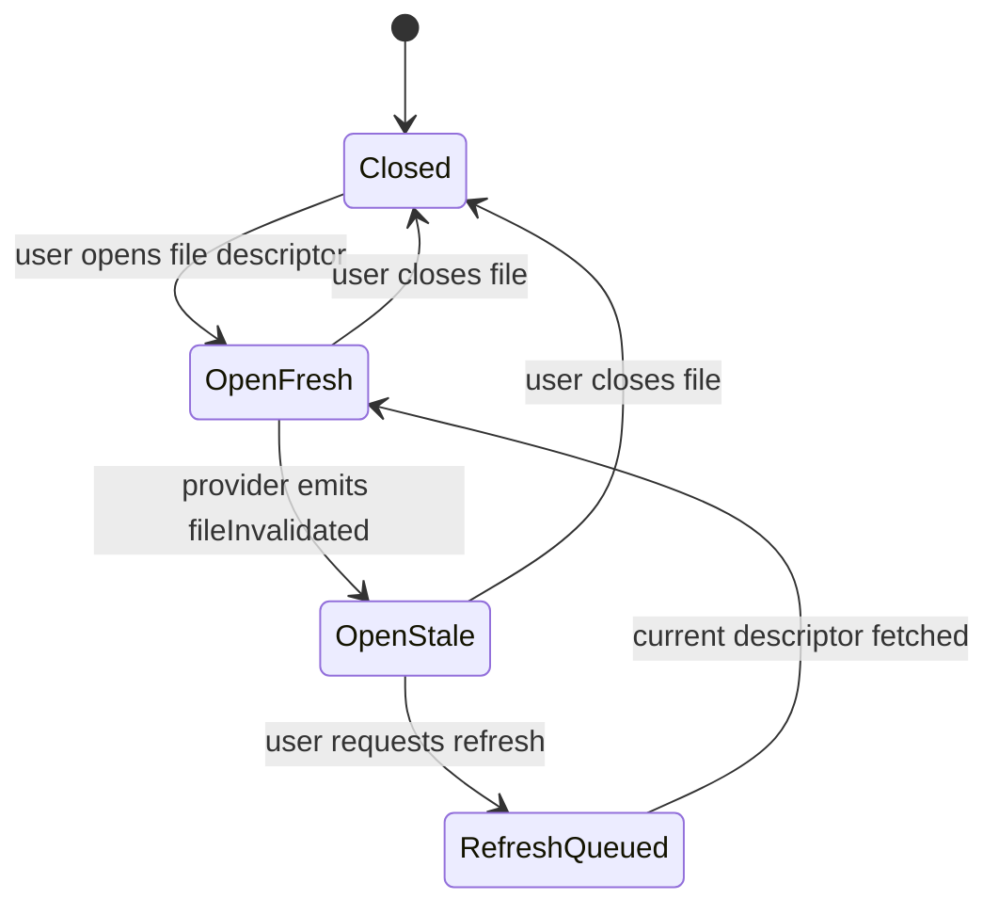
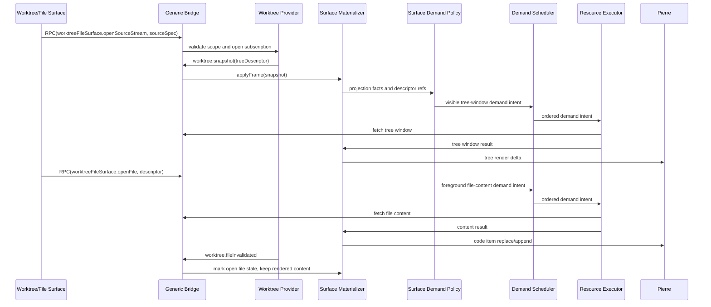

# Worktree/File Surface Protocol Spec

Date: 2026-06-22
Status: Draft for spec-review
Parent: [spec.md](/Users/shravansunder/Documents/dev/project-dev/agent-studio.bridge-start/tmp/spec-workflows/2026-06-22-bridge-transport-streaming-spec/spec.md:1)

This file owns the Worktree/File Surface protocol family. The user-facing
surface is one app surface: file tree, file content, and git status belong
together. Future comments and agent communications belong in this surface once
their schema slice exists. File content is not a separate user-facing app from
worktree browsing.

## 1. Product Intent

The Worktree/File Surface lets a user inspect a live checkout:

- browse a huge file tree
- open and read files
- see git/file status
- receive live invalidations as files change
- keep open-file reader continuity
- reserve future review comments and agent communications on files/ranges
- optionally open Review comparison mode from the same surface

The surface should feel live without yanking content under the reader.

## 2. Ownership

Provider owns:

- worktree source authority
- filesystem watch classification
- git status classification
- tree/window descriptors
- file content descriptors
- file invalidation facts
- content handles and content hashes
- source reset/gap decisions

Browser surface owns:

- tree projection and expansion state
- file selection and open content session state
- stale/open-file UX
- reserved future comments/comms projection state once enabled
- app demand policy that maps selected, open, visible, and nearby resources onto
  generic Bridge demand lanes
- renderer deltas into Pierre

Generic Bridge owns:

- transport, parser limits, stream identity, resource URL grammar, cancellation,
  and stale-drop mechanics

## 3. Key Boundary Correction

The boundary is not:

```text
Worktree app versus FileView app
```

The boundary is:

```text
Worktree/File Surface
  tree contract
  file content contract
  status contract
  comment/comms contract
  optional Review handoff contract
```

Tree and file content can use separate substreams and descriptors, but they are
part of one app protocol family and one user-facing surface.

## 4. Live Update Policy

If a file is not open:

- tree/status/file descriptors may update continuously
- hidden subtree changes mark ancestors stale
- descriptor replacement can happen without user interruption

If a file is open:

- backing source changes mark the open content session stale
- current rendered content remains stable by default
- user can refresh/update to the latest descriptor
- comment/range anchors must not silently retarget without an app decision

Future auto-refresh policy may exist, but only for cases that preserve reader
and comment continuity.



## 5. Source Spec And Identity

```ts
import { z } from 'zod';

export const WorktreeFileSurfaceSourceSpec = z.object({
  clientRequestId: z.string().min(1),
  repoId: z.string().min(1),
  worktreeId: z.string().min(1),
  rootPathToken: z.string().min(1),
  cwdScope: z.string().min(1).optional(),
  pathScope: z.array(z.string().min(1)).optional(),
  includeStatuses: z.boolean().default(true),
  includeFileDescriptors: z.boolean().default(true),
  includeComments: z.boolean().default(false),
  includeAgentComms: z.boolean().default(false),
  freshness: z.literal('live'),
}).strict();

export const WorktreeFileSurfaceSourceIdentity = z.object({
  sourceId: z.string().min(1),
  repoId: z.string().min(1),
  worktreeId: z.string().min(1),
  subscriptionGeneration: z.number().int().nonnegative(),
  sourceCursor: z.string().min(1),
  rootRevisionToken: z.string().min(1).optional(),
}).strict();

export const WorktreeTreeProjectionIdentity = z.object({
  source: WorktreeFileSurfaceSourceIdentity,
  pathScope: z.array(z.string().min(1)),
  sortKey: z.string().min(1).optional(),
  groupKey: z.string().min(1).optional(),
  filterKey: z.string().min(1).optional(),
  treeWindowKey: z.string().min(1).optional(),
}).strict();

export const WorktreeFileSurfaceResourceKind = z.enum([
  'worktree.treeWindow',
  'worktree.treeDeltaOperations',
  'worktree.status',
  'worktree.fileContent',
  'worktree.fileRange',
  'worktree.commentThreadWindow',
  'worktree.agentCommsWindow',
]);
```

Contract:

- `WorktreeFileSurfaceSourceSpec` is a browser request/selector, not provider
  authority.
- Provider mints `WorktreeFileSurfaceSourceIdentity` and all file/content
  descriptors.
- Browser-supplied path/cwd scopes are selectors that must be canonicalized and
  containment-checked provider-side.

## 6. File Descriptor And Content Session

Path is display/navigation. Authority is a provider-issued descriptor tied to a
source identity and content handle/hash.

```ts
export const WorktreeFileDescriptor = z.object({
  path: z.string().min(1),
  fileId: z.string().min(1),
  contentHandle: z.string().min(1),
  contentDescriptor: BridgeAttachedResourceDescriptor,
  contentHash: z.string().min(1).optional(),
  sourceIdentity: WorktreeFileSurfaceSourceIdentity,
  sizeBytes: z.number().int().nonnegative(),
  isBinary: z.boolean(),
  language: z.string().min(1).optional(),
  fileExtension: z.string().min(1).optional(),
  modifiedAtUnixMilliseconds: z.number().int().nonnegative().optional(),
}).strict();

export const WorktreeOpenFileSession = z.object({
  openFileSessionId: z.string().min(1),
  descriptor: WorktreeFileDescriptor,
  renderContentKey: z.string().min(1),
  status: z.enum(['opening', 'fresh', 'stale', 'refreshing', 'failed', 'closed']),
  staleReason: z.enum(['filesystemEvent', 'gitStatusChanged', 'contentChanged', 'sourceReset', 'unknown']).optional(),
  latestDescriptor: WorktreeFileDescriptor.optional(),
}).strict();
```

Contract:

- Open content sessions are reader-continuity objects.
- Provider invalidation does not automatically replace open rendered content.
- Refresh creates a new content fetch intent using the latest descriptor.
- Stale completions cannot commit if their descriptor/source identity is no
  longer current for the open session.

## 7. Status And Invalidation

```ts
export const WorktreeStatusPatch = z.object({
  path: z.string().min(1).optional(),
  status: z.string().min(1).optional(),
  staged: z.number().int().nonnegative().optional(),
  unstaged: z.number().int().nonnegative().optional(),
  untracked: z.number().int().nonnegative().optional(),
  branchName: z.string().min(1).optional(),
  ahead: z.number().int().nonnegative().optional(),
  behind: z.number().int().nonnegative().optional(),
}).strict();

export const WorktreeFileInvalidation = z.object({
  path: z.string().min(1),
  fileId: z.string().min(1).optional(),
  reason: z.enum(['filesystemEvent', 'gitStatusChanged', 'contentChanged', 'sourceReset', 'unknown']),
  contentHandleIds: z.array(z.string().min(1)).optional(),
  latestDescriptor: WorktreeFileDescriptor.optional(),
}).strict();
```

Recommended status scope:

- summary metadata for branch/ahead/behind/counts
- per-path patches for tree badges and file rows
- no diff calculation unless Review comparison mode is opened

## 8. Intake Frames

```ts
export const WorktreeSnapshotFrame = BridgeIntakeFrameBase.extend({
  frameKind: z.literal('worktree.snapshot'),
  source: WorktreeFileSurfaceSourceIdentity,
  requestSelector: WorktreeFileSurfaceSourceSpec.optional(),
  treeDescriptor: BridgeAttachedResourceDescriptor,
  statusDescriptor: BridgeAttachedResourceDescriptor.optional(),
}).strict();

export const WorktreeTreeWindowFrame = BridgeIntakeFrameBase.extend({
  frameKind: z.literal('worktree.treeWindow'),
  projectionIdentity: WorktreeTreeProjectionIdentity,
  windowDescriptor: BridgeAttachedResourceDescriptor,
}).strict();

export const WorktreeTreeDeltaFrame = BridgeIntakeFrameBase.extend({
  frameKind: z.literal('worktree.treeDelta'),
  operationsDescriptor: BridgeAttachedResourceDescriptor,
}).strict();

export const WorktreeStatusPatchFrame = BridgeIntakeFrameBase.extend({
  frameKind: z.literal('worktree.statusPatch'),
  patch: WorktreeStatusPatch.or(z.object({
    statusDescriptor: BridgeAttachedResourceDescriptor,
  }).strict()),
}).strict();

export const WorktreeFileDescriptorFrame = BridgeIntakeFrameBase.extend({
  frameKind: z.literal('worktree.fileDescriptor'),
  descriptor: WorktreeFileDescriptor,
}).strict();

export const WorktreeFileInvalidatedFrame = BridgeIntakeFrameBase.extend({
  frameKind: z.literal('worktree.fileInvalidated'),
  invalidation: WorktreeFileInvalidation,
}).strict();

export const WorktreeResetFrame = BridgeIntakeFrameBase.extend({
  frameKind: z.literal('worktree.reset'),
  reason: z.enum(['sourceChanged', 'subscriptionReset', 'providerRestart', 'authorityChanged']),
  source: WorktreeFileSurfaceSourceIdentity.optional(),
  replacementDescriptor: BridgeAttachedResourceDescriptor.optional(),
}).strict();
```

`worktree.snapshot` is the first authoritative source-identity handoff for the
surface. `requestSelector` may echo the browser request for diagnostics, but it
is not authority for stale-drop, demand keys, or resource fetches.

## 9. Demand Policy Stimuli

Worktree/File demand policy consumes app-specific stimuli and emits generic
`DemandIntent` values. The stimuli are discriminated unions, not loose boolean
bags. The emitted lane names remain generic Bridge lanes.

```ts
export const WorktreeFileSurfaceDemandStimulus = z.discriminatedUnion('kind', [
  z.object({
    kind: z.literal('fileSelected'),
    descriptorRef: BridgeDescriptorRef,
  }).strict(),
  z.object({
    kind: z.literal('openFileInvalidated'),
    descriptorRef: BridgeDescriptorRef,
  }).strict(),
  z.object({
    kind: z.literal('treeViewportChanged'),
    descriptorRefs: z.array(BridgeDescriptorRef),
  }).strict(),
  z.object({
    kind: z.literal('treeExpanded'),
    descriptorRef: BridgeDescriptorRef,
  }).strict(),
  z.object({
    kind: z.literal('explicitRefresh'),
    descriptorRef: BridgeDescriptorRef,
  }).strict(),
  z.object({
    kind: z.literal('hoverChanged'),
    descriptorRef: BridgeDescriptorRef.nullable(),
  }).strict(),
  z.object({
    kind: z.literal('sourceReset'),
    sourceIdentity: z.string().min(1),
  }).strict(),
]);
```

Required mappings:

- `fileSelected` and `explicitRefresh` map to `foreground`.
- `openFileInvalidated` marks stale and emits no content demand in the first
  implementation. Content refresh requires `explicitRefresh`.
- `treeViewportChanged` maps demanded visible window refs to `visible`.
- `treeExpanded` maps visible expansion windows to `visible`; nearby expansion
  windows can map to `nearby`.
- `hoverChanged` maps non-null demanded refs to `speculative`.
- `sourceReset` emits no demand and invalidates queued/in-flight work by source
  identity.

## 10. Tree Windowing

Huge repos cannot require full-tree materialization.

Recommended delivery:

```text
initial snapshot
  includes descriptor for root/visible window

visible expansion
  app demand policy maps tree-window work to the visible lane
  demand scheduler orders it
  resource executor fetches bounded tree window

hidden changes
  provider emits compact stale/invalidation facts
  hidden descendants are not fetched until demanded
```

## 11. Surface Flow



## 12. Comments And Agent Communications

Comments and agent communications belong in the Worktree/File Surface because
they are anchored to the same files, ranges, selections, and source identities
that the user is already viewing.

This spec reserves the substream/resource kinds:

- `commentThreadWindow`
- `agentCommsWindow`

Until the comment/comms schema slice exists:

- `includeComments` and `includeAgentComms` must fail closed or be ignored with
  an explicit unsupported result
- comment/comms resource kinds must not be fetchable
- no authoring/mutation command is in first-plan scope

Deferred exact schemas must define:

- anchor identity: source identity, file id/path, range, content hash if needed
- lifecycle: open, resolved, stale, superseded
- pagination/windowing
- permission/redaction rules
- telemetry scrub rules
- how anchors behave when open file content is stale

## 13. Optional Review Handoff

The Worktree/File Surface can ask app composition to open Review mode, but
Review remains a separate comparison protocol:

```text
Worktree/File Surface selection
  -> OpenReviewComparisonIntent
  -> Review protocol validates and builds ReviewComparisonSpec
  -> Review provider materializes comparison package
  -> Review frames drive Review projection
```

The Worktree/File Surface does not become a diff engine. It can ask Review to
compare sources.

```ts
export const OpenReviewComparisonIntent = z.object({
  fromSurface: z.literal('worktreeFileSurface'),
  sourceIdentity: WorktreeFileSurfaceSourceIdentity,
  selectedPaths: z.array(z.string().min(1)),
  comparisonHint: z.enum(['baseBranch', 'commit', 'tag', 'timeWindow', 'manual']).optional(),
}).strict();
```

## 14. Proof Expectations

- worktree tree/status updates do not instantiate Review package lineage
- file descriptor replacement does not silently replace open rendered content
- open file invalidation marks stale and exposes refresh
- closed/unopened file descriptors can update live
- selected file content maps to `foreground`; open stale file invalidation emits
  no content demand until explicit refresh
- demand policy inputs are discriminated stimuli, not loose boolean bags
- worktree snapshot carries provider-issued source identity, not only the
  browser selector
- worktree frames attach descriptors instead of exposing raw descriptor strings
- huge tree expansion fetches bounded tree windows
- hidden subtree changes do not hydrate hidden descendants
- comments/comms anchors are scoped by source/file/range identity
- stale content completions are dropped if descriptor/source identity changed
- binary or oversized files render metadata-only or unavailable state without
  placing bodies in Zustand

## 15. Open Decisions

OD-W1. First open-file refresh policy.

Decision for first implementation: manual refresh after stale marker.
Auto-refresh can be a later opt-in for safe cases and must add an explicit app
policy fact before `openFileInvalidated` can emit active content demand.

OD-W2. Comment/comms schema depth.

Deferred. The surface owns the concept, but exact schemas need their own spec
slice before implementation.

OD-W3. Binary/large-file preview.

First implementation behavior:

- binary files render metadata-only/unavailable state unless a later preview
  contract exists
- oversized text files may expose bounded preview ranges only as
  non-authoritative preview data
- descriptor/resource descriptor fields expose `isBinary`, size, media type,
  and resource limits

OD-W4. Rename tracking.

Recommended default: path is display/navigation; provider-issued file id and
content handle are authority. Rename heuristics stay provider-owned.
